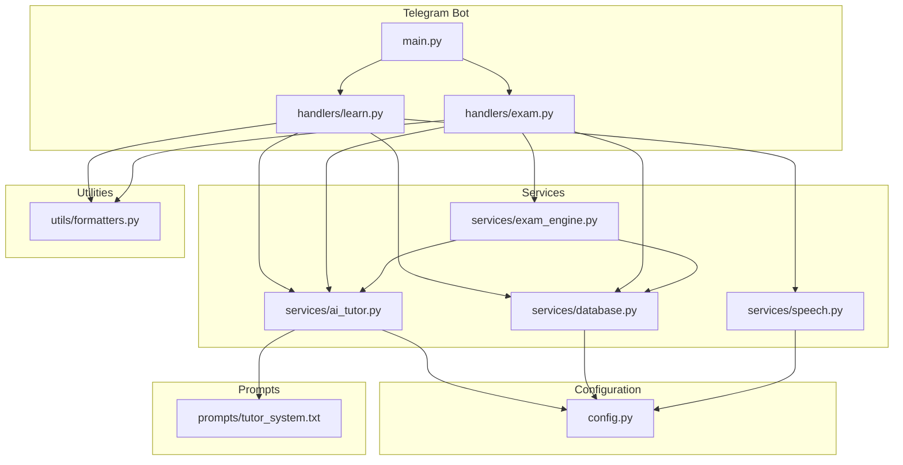
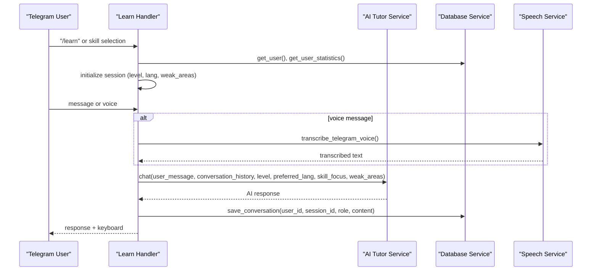
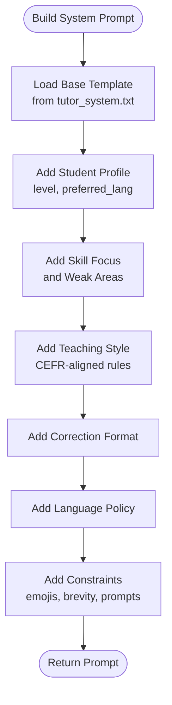
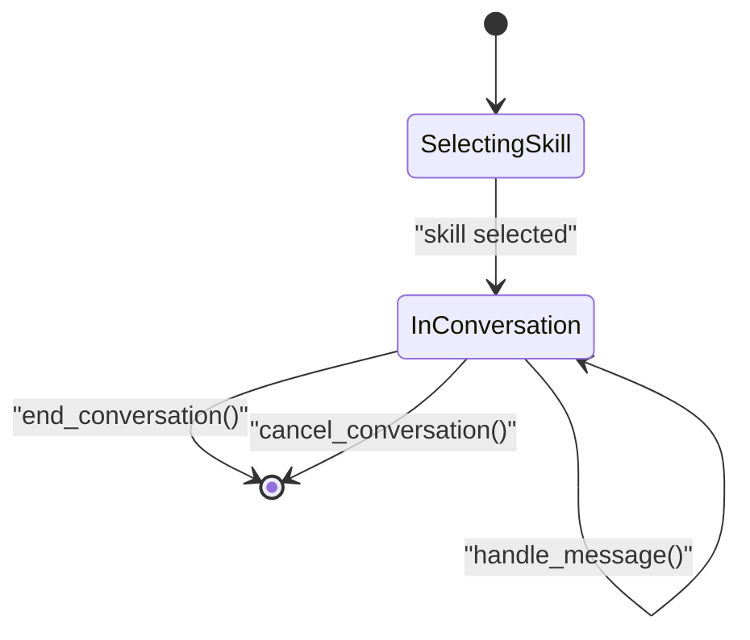
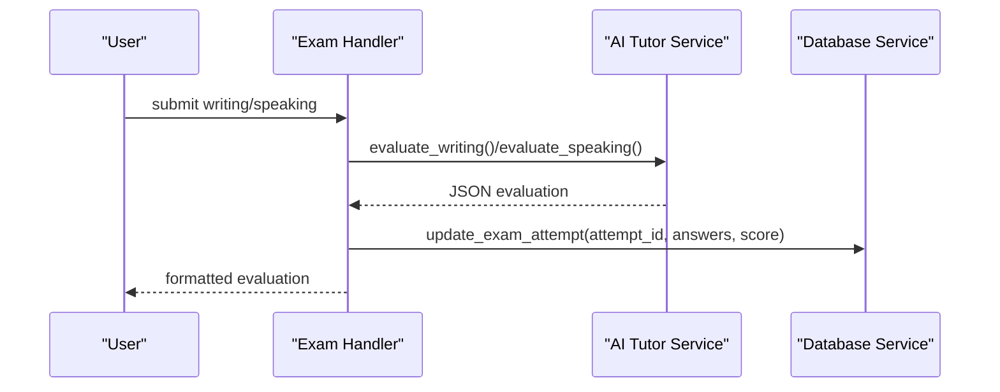
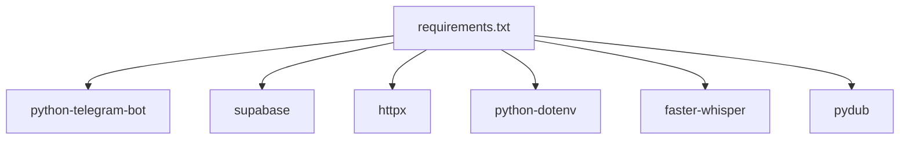

# AI Tutoring System

<cite>
**Referenced Files in This Document**
- [tutor_system.txt](file://prompts/tutor_system.txt)
- [ai_tutor.py](file://bot/services/ai_tutor.py)
- [config.py](file://bot/config.py)
- [main.py](file://bot/main.py)
- [learn.py](file://bot/handlers/learn.py)
- [exam.py](file://bot/handlers/exam.py)
- [database.py](file://bot/services/database.py)
- [exam_engine.py](file://bot/services/exam_engine.py)
- [speech.py](file://bot/services/speech.py)
- [formatters.py](file://bot/utils/formatters.py)
- [requirements.txt](file://requirements.txt)
</cite>

## Table of Contents
1. [Introduction](#introduction)
2. [Project Structure](#project-structure)
3. [Core Components](#core-components)
4. [Architecture Overview](#architecture-overview)
5. [Detailed Component Analysis](#detailed-component-analysis)
6. [Dependency Analysis](#dependency-analysis)
7. [Performance Considerations](#performance-considerations)
8. [Troubleshooting Guide](#troubleshooting-guide)
9. [Conclusion](#conclusion)
10. [Appendices](#appendices)

## Introduction
This document describes the AI-powered tutoring system for German language education. It explains the OpenRouter API integration, the system prompt architecture, conversation management strategies, and the AI tutor's capabilities across grammar correction, vocabulary building, pronunciation coaching, and cultural context provision. It also covers conversation state management, context preservation across sessions, dynamic difficulty adjustment, evaluation systems, feedback generation, and learning objective alignment. Configuration options, integration points, limitations, error handling, and fallback strategies are documented to ensure robust operation and maintainability.

## Project Structure
The system is organized around a Telegram bot with modular services:
- Handlers manage user interactions and conversation flows
- Services encapsulate AI integration, database operations, speech processing, and exam orchestration
- Utilities provide consistent formatting for responses
- Prompts define the AI system behavior
- Configuration centralizes environment variables and constants

**Diagram sources**
- [main.py](file://bot/main.py#L60-L88)
- [learn.py](file://bot/handlers/learn.py#L292-L314)
- [exam.py](file://bot/handlers/exam.py#L489-L522)
- [ai_tutor.py](file://bot/services/ai_tutor.py#L19-L451)
- [database.py](file://bot/services/database.py#L16-L416)
- [exam_engine.py](file://bot/services/exam_engine.py#L15-L211)
- [speech.py](file://bot/services/speech.py#L21-L140)
- [formatters.py](file://bot/utils/formatters.py#L8-L300)
- [config.py](file://bot/config.py#L10-L60)
- [tutor_system.txt](file://prompts/tutor_system.txt#L1-L74)

**Section sources**
- [main.py](file://bot/main.py#L1-L93)
- [learn.py](file://bot/handlers/learn.py#L1-L315)
- [exam.py](file://bot/handlers/exam.py#L1-L523)
- [ai_tutor.py](file://bot/services/ai_tutor.py#L1-L451)
- [database.py](file://bot/services/database.py#L1-L416)
- [exam_engine.py](file://bot/services/exam_engine.py#L1-L211)
- [speech.py](file://bot/services/speech.py#L1-L140)
- [formatters.py](file://bot/utils/formatters.py#L1-L300)
- [config.py](file://bot/config.py#L1-L60)
- [tutor_system.txt](file://prompts/tutor_system.txt#L1-L74)

## Core Components
- AI Tutor Service: Integrates with OpenRouter API to provide tutoring, evaluations, and exam question generation. It builds dynamic system prompts based on user profile and skill focus, manages conversation context, and handles structured JSON responses for evaluations.
- Database Service: Manages user profiles, progress tracking, conversation history, exam attempts, and statistics calculation.
- Exam Engine: Orchestrates exam question selection (database-backed with AI fallback), scoring, and level recommendations.
- Speech Service: Provides voice transcription for speaking practice using faster-whisper with graceful fallback when unavailable.
- Formatters: Ensures consistent, localized, and well-structured responses for Telegram MarkdownV2.
- Configuration: Centralizes environment variables, API endpoints, model identifiers, and limits.

**Section sources**
- [ai_tutor.py](file://bot/services/ai_tutor.py#L19-L451)
- [database.py](file://bot/services/database.py#L16-L416)
- [exam_engine.py](file://bot/services/exam_engine.py#L15-L211)
- [speech.py](file://bot/services/speech.py#L21-L140)
- [formatters.py](file://bot/utils/formatters.py#L8-L300)
- [config.py](file://bot/config.py#L10-L60)

## Architecture Overview
The system follows a layered architecture:
- Presentation Layer: Telegram handlers manage user commands, callbacks, and conversation states.
- Application Layer: Services encapsulate business logic for AI interactions, database operations, and exam orchestration.
- Integration Layer: OpenRouter API for AI completions, Supabase for persistence, and optional speech processing.
- Configuration and Utilities: Environment-driven settings, prompt templates, and response formatting.

**Diagram sources**
- [learn.py](file://bot/handlers/learn.py#L30-L232)
- [ai_tutor.py](file://bot/services/ai_tutor.py#L82-L153)
- [database.py](file://bot/services/database.py#L296-L339)
- [speech.py](file://bot/services/speech.py#L83-L129)

## Detailed Component Analysis

### OpenRouter API Integration and System Prompt Architecture
- API Endpoint and Model: The AI service uses the configured OpenRouter endpoint and model identifier. Headers include authorization, content type, referer, and title for tracking.
- Dynamic System Prompt: The system prompt is constructed from:
  - A base prompt template
  - Student profile (level, preferred explanation language)
  - Skill focus and weak areas
  - Teaching style guidelines aligned with CEFR levels
  - Response format for corrections
  - Language policy and personality constraints
- Conversation Context: The service appends a capped number of recent messages to the system prompt to preserve context across turns.
- Structured Evaluations: Writing and speaking evaluations are performed with explicit JSON schemas and system instructions to ensure reliable parsing.

**Diagram sources**
- [tutor_system.txt](file://prompts/tutor_system.txt#L1-L74)
- [ai_tutor.py](file://bot/services/ai_tutor.py#L33-L81)

**Section sources**
- [ai_tutor.py](file://bot/services/ai_tutor.py#L19-L451)
- [config.py](file://bot/config.py#L20-L24)
- [tutor_system.txt](file://prompts/tutor_system.txt#L1-L74)

### Conversation Management Strategies
- Conversation States: Separate ConversationHandlers manage learning and exam flows with distinct states for selection, answering, and review.
- Session Data: user_data stores session_id, skill, level, preferred language, conversation_history, and weak areas.
- Context Preservation: Conversation history is maintained in-memory and persisted to the database for continuity across sessions.
- Typing Indicators and Feedback: The bot sends typing actions and appends subscription warnings to responses.
- End-of-Session Scoring: A heuristic score is calculated based on message count to reward sustained practice.

**Diagram sources**
- [learn.py](file://bot/handlers/learn.py#L26-L156)

**Section sources**
- [learn.py](file://bot/handlers/learn.py#L1-L315)
- [database.py](file://bot/services/database.py#L296-L339)

### AI Tutor Capabilities
- German Language Instruction: The AI adapts complexity to CEFR levels and encourages German usage with minimal translation.
- Grammar Correction: Structured feedback includes brief explanation, corrected sentence, and native alternatives.
- Vocabulary Building: Vocabulary quizzes and targeted practice are integrated with weak area detection.
- Pronunciation Coaching: Speaking evaluations include pronunciation tips and fluency assessment.
- Cultural Context: Responses are encouraging and supportive, with appropriate emojis and celebratory reinforcement.

**Section sources**
- [tutor_system.txt](file://prompts/tutor_system.txt#L6-L74)
- [ai_tutor.py](file://bot/services/ai_tutor.py#L154-L325)

### Evaluation System and Feedback Generation
- Writing Evaluation: Scores grammar, vocabulary, task completion, and coherence; returns mistakes, strengths, suggestions, and corrected text.
- Speaking Evaluation: Scores grammar, vocabulary, task completion, and fluency; includes pronunciation tips.
- JSON Parsing: Robust extraction from AI responses, including fenced code blocks.
- Default Fallback: On failures, returns neutral scores and guidance to retry.

**Diagram sources**
- [exam.py](file://bot/handlers/exam.py#L358-L416)
- [ai_tutor.py](file://bot/services/ai_tutor.py#L154-L325)
- [database.py](file://bot/services/database.py#L364-L389)

**Section sources**
- [ai_tutor.py](file://bot/services/ai_tutor.py#L154-L325)
- [formatters.py](file://bot/utils/formatters.py#L186-L268)
- [database.py](file://bot/services/database.py#L364-L389)

### Dynamic Difficulty Adjustment and Learning Objective Alignment
- CEFR Levels: A1, A2, B1 are supported with tailored prompts and expectations.
- Weak Areas: Derived from user statistics to personalize practice and adjust focus.
- Skill Focus: Optional skill-specific mode to target specific abilities.
- Question Generation: AI-generated exam questions fall back to database-backed questions when available.

**Section sources**
- [config.py](file://bot/config.py#L25-L32)
- [database.py](file://bot/services/database.py#L233-L292)
- [exam_engine.py](file://bot/services/exam_engine.py#L29-L65)

### Configuration Options
- Environment Variables: Telegram token, Supabase URL/key, OpenRouter API key, model identifier, and API URL.
- Limits: Session timeout, max conversation history.
- CEFR Levels, Skills, and Languages: Centralized lists for validation and UI.

**Section sources**
- [config.py](file://bot/config.py#L10-L60)

### Integration with the Broader Learning System
- Subscription Checks: Handlers enforce subscription status before allowing access to learning and exams.
- Progress Tracking: Saves scores and weak areas to inform future sessions and recommendations.
- Statistics Calculation: Aggregates progress to identify strengths and areas for improvement.

**Section sources**
- [learn.py](file://bot/handlers/learn.py#L30-L50)
- [database.py](file://bot/services/database.py#L188-L211)
- [database.py](file://bot/services/database.py#L233-L292)

### Limitations, Error Handling, and Fallback Strategies
- OpenRouter API Failures: Graceful degradation with user-friendly messages and default evaluation structures.
- Timeout Handling: Dedicated timeout exceptions with retry messaging.
- JSON Parsing Errors: Extraction logic handles fenced code blocks; defaults on failure.
- Speech Service Unavailable: Graceful degradation to text input with informative status messages.
- Database Errors: Logging and safe returns to prevent crashes.

**Section sources**
- [ai_tutor.py](file://bot/services/ai_tutor.py#L147-L152)
- [ai_tutor.py](file://bot/services/ai_tutor.py#L232-L237)
- [speech.py](file://bot/services/speech.py#L13-L18)
- [speech.py](file://bot/services/speech.py#L130-L135)
- [database.py](file://bot/services/database.py#L29-L31)

## Dependency Analysis
External dependencies include Telegram Bot SDK, Supabase client, HTTP client, environment loading, and optional speech processing libraries.

**Diagram sources**
- [requirements.txt](file://requirements.txt#L1-L7)

**Section sources**
- [requirements.txt](file://requirements.txt#L1-L7)

## Performance Considerations
- Conversation History Capping: Limits context size to balance cost and performance.
- Async I/O: HTTP requests and database operations use async clients to minimize latency.
- Speech Model Size: CPU-based model for broad compatibility; can be tuned for performance vs. accuracy.
- JSON Parsing: Efficient extraction with fallback to default evaluation to avoid repeated failures.

[No sources needed since this section provides general guidance]

## Troubleshooting Guide
- Missing Environment Variables: The configuration validates required keys and raises descriptive errors.
- API Errors: Inspect logs for HTTP status codes and error payloads; the AI service returns user-friendly messages.
- JSON Parsing Failures: Verify AI responses conform to expected JSON schemas; the service extracts content from fenced blocks.
- Speech Issues: Confirm faster-whisper installation and model loading; fallback to text input is automatic.

**Section sources**
- [config.py](file://bot/config.py#L40-L55)
- [ai_tutor.py](file://bot/services/ai_tutor.py#L140-L152)
- [speech.py](file://bot/services/speech.py#L13-L18)

## Conclusion
The AI tutoring system integrates OpenRouter-powered AI with a robust Telegram bot, database-backed progress tracking, and optional speech processing. Its dynamic system prompt architecture, structured evaluation workflows, and personalized difficulty adjustment enable effective German language learning aligned with CEFR levels. The design emphasizes resilience through fallback strategies, clear error handling, and maintainable modular services.

## Appendices

### API and Configuration Reference
- OpenRouter API URL and Model: Configured in environment variables and used by the AI service.
- CEFR Levels, Skills, and Languages: Lists used for validation and UI.
- Session Timeout and Conversation History Limits: Tunable constants for session behavior.

**Section sources**
- [config.py](file://bot/config.py#L20-L38)

### Prompt Template Reference
- System Prompt Template: Defines role, responsibilities, level guidelines, response format, language policy, personality, and constraints.

**Section sources**
- [tutor_system.txt](file://prompts/tutor_system.txt#L1-L74)