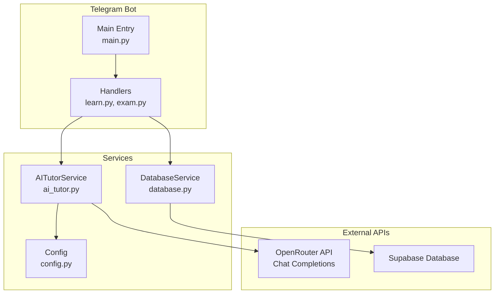
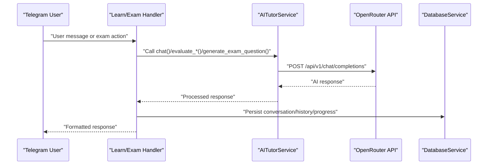
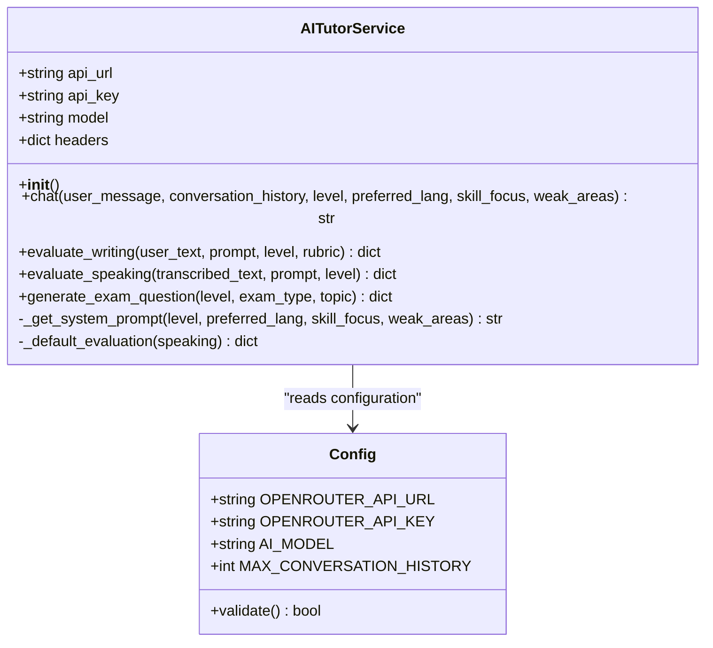
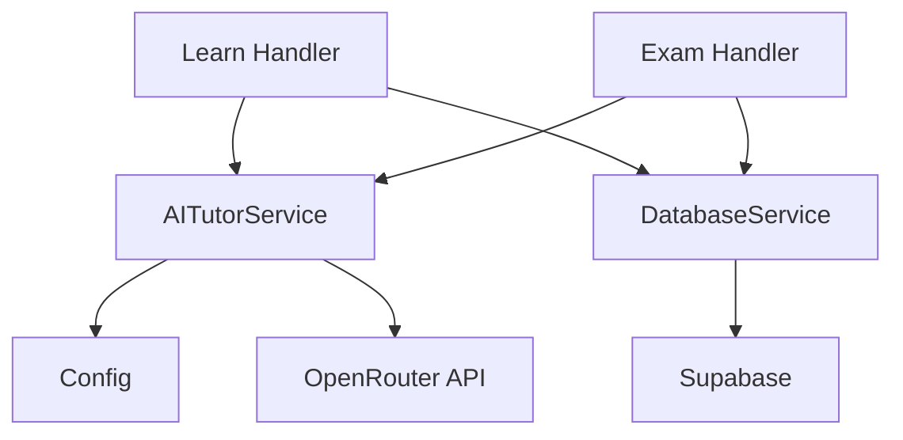

# AI Tutor Service

<cite>
**Referenced Files in This Document**
- [ai_tutor.py](file://bot/services/ai_tutor.py)
- [config.py](file://bot/config.py)
- [learn.py](file://bot/handlers/learn.py)
- [exam.py](file://bot/handlers/exam.py)
- [database.py](file://bot/services/database.py)
- [main.py](file://bot/main.py)
- [tutor_system.txt](file://prompts/tutor_system.txt)
- [requirements.txt](file://requirements.txt)
</cite>

## Table of Contents
1. [Introduction](#introduction)
2. [Project Structure](#project-structure)
3. [Core Components](#core-components)
4. [Architecture Overview](#architecture-overview)
5. [Detailed Component Analysis](#detailed-component-analysis)
6. [Dependency Analysis](#dependency-analysis)
7. [Performance Considerations](#performance-considerations)
8. [Troubleshooting Guide](#troubleshooting-guide)
9. [Conclusion](#conclusion)
10. [Appendices](#appendices)

## Introduction
This document provides comprehensive API documentation for the AI Tutor Service used by the EthioGerman Language School Telegram bot. It focuses on the AITutorService class, detailing all public methods, their parameters, return values, and error handling. It explains how system prompts are generated, how conversation history is managed, and how the service integrates with the OpenRouter API. Configuration requirements, timeouts, and error handling patterns are documented, along with practical usage examples for each method.

## Project Structure
The AI Tutor Service resides in the bot/services directory and is consumed by the learning and exam handlers. Configuration is centralized in bot/config.py, and system prompts are stored in prompts/tutor_system.txt. The service uses httpx for asynchronous HTTP requests and integrates with Supabase for persistence.

**Diagram sources**
- [ai_tutor.py](file://bot/services/ai_tutor.py#L1-L451)
- [config.py](file://bot/config.py#L1-L60)
- [learn.py](file://bot/handlers/learn.py#L1-L315)
- [exam.py](file://bot/handlers/exam.py#L1-L523)
- [database.py](file://bot/services/database.py#L1-L422)
- [main.py](file://bot/main.py#L1-L106)

**Section sources**
- [ai_tutor.py](file://bot/services/ai_tutor.py#L1-L451)
- [config.py](file://bot/config.py#L1-L60)
- [learn.py](file://bot/handlers/learn.py#L1-L315)
- [exam.py](file://bot/handlers/exam.py#L1-L523)
- [database.py](file://bot/services/database.py#L1-L422)
- [main.py](file://bot/main.py#L1-L106)

## Core Components
- AITutorService: Asynchronous service that communicates with OpenRouter API to provide German language tutoring, evaluation, and exam question generation.
- Configuration: Centralized configuration via Config class, including OpenRouter API keys, model, and timeouts.
- Handlers: Learn and exam handlers orchestrate user interactions and delegate AI evaluations.
- Database: DatabaseService persists conversations, progress, and exam attempts.

**Section sources**
- [ai_tutor.py](file://bot/services/ai_tutor.py#L19-L451)
- [config.py](file://bot/config.py#L10-L60)
- [learn.py](file://bot/handlers/learn.py#L1-L315)
- [exam.py](file://bot/handlers/exam.py#L1-L523)
- [database.py](file://bot/services/database.py#L16-L422)

## Architecture Overview
The AI Tutor Service follows a layered architecture:
- Presentation Layer: Telegram handlers manage user interactions and session state.
- Service Layer: AITutorService encapsulates AI model integration and prompt engineering.
- Persistence Layer: DatabaseService manages user data, conversation history, and exam attempts.
- External Integration: OpenRouter API for AI completions; Supabase for data storage.

**Diagram sources**
- [learn.py](file://bot/handlers/learn.py#L159-L232)
- [exam.py](file://bot/handlers/exam.py#L358-L416)
- [ai_tutor.py](file://bot/services/ai_tutor.py#L82-L153)
- [ai_tutor.py](file://bot/services/ai_tutor.py#L154-L325)
- [ai_tutor.py](file://bot/services/ai_tutor.py#L327-L423)
- [database.py](file://bot/services/database.py#L302-L344)

## Detailed Component Analysis

### AITutorService Class
AITutorService is a singleton that exposes four primary asynchronous methods for AI-driven tutoring and assessment.

#### Singleton Pattern and Lifecycle
- Instantiation: A singleton instance named ai_tutor is created at module level.
- Lifecycle: The service is initialized once and reused across the application lifetime.
- Thread Safety: Not designed for concurrent access from multiple threads; rely on Telegram’s single-threaded event loop.

**Diagram sources**
- [ai_tutor.py](file://bot/services/ai_tutor.py#L19-L451)
- [config.py](file://bot/config.py#L10-L60)

**Section sources**
- [ai_tutor.py](file://bot/services/ai_tutor.py#L449-L451)
- [config.py](file://bot/config.py#L20-L38)

#### Method: chat()
Purpose: Sends a user message to the AI tutor and returns a contextualized response.

Signature:
- chat(user_message: str, conversation_history: List[Dict[str, str]], level: str = 'A1', preferred_lang: str = 'english', skill_focus: Optional[str] = None, weak_areas: Optional[List[str]] = None) -> str

Parameters:
- user_message: The user’s latest message.
- conversation_history: Previous messages for context. The service uses the last N messages based on configuration.
- level: CEFR level (A1, A2, B1).
- preferred_lang: Language for explanations (english, amharic, german).
- skill_focus: Current skill being practiced (e.g., 'lesen', 'schreiben').
- weak_areas: List of known weak areas for personalized feedback.

Return Value:
- String containing the AI tutor’s response.

Behavior:
- Generates a system prompt tailored to the user’s profile and skill focus.
- Builds a messages array with system, previous history, and the current user message.
- Calls OpenRouter API with configured headers and model parameters.
- Applies timeouts and handles HTTP errors and exceptions gracefully.

Error Handling:
- HTTP status code != 200: Logs error and returns a localized fallback message.
- TimeoutException: Logs timeout and returns a user-friendly message.
- General exception: Logs error and returns a fallback message.

Timeout:
- 60 seconds for chat requests.

Typical Usage Scenarios:
- Free conversation mode: Pass conversation_history with prior messages and optional skill_focus=None.
- Focused practice: Pass skill_focus to guide the tutor’s emphasis.
- Weak areas: Pass weak_areas to personalize corrections.

Response Processing:
- The handler appends the AI response to conversation_history and persists it to the database.

**Section sources**
- [ai_tutor.py](file://bot/services/ai_tutor.py#L82-L153)
- [config.py](file://bot/config.py#L37-L38)
- [learn.py](file://bot/handlers/learn.py#L159-L232)

#### Method: evaluate_writing()
Purpose: Evaluates a writing submission against predefined criteria and returns structured feedback.

Signature:
- evaluate_writing(user_text: str, prompt: str, level: str, rubric: Optional[Dict[str, Any]] = None) -> Dict[str, Any]

Parameters:
- user_text: The user’s written response.
- prompt: The original writing task prompt.
- level: CEFR level for scoring context.
- rubric: Optional custom rubric (not used in current implementation).

Return Value:
- Dictionary containing scores, strengths, suggestions, mistakes, and corrected_text.

Behavior:
- Constructs an evaluation prompt instructing the model to respond with valid JSON.
- Calls OpenRouter API with temperature tuned for deterministic responses.
- Parses JSON from the model’s response, handling markdown-wrapped JSON blocks.
- On JSON parsing or general errors, returns a default evaluation structure.

Error Handling:
- JSONDecodeError: Logs error and returns default evaluation.
- HTTP status code != 200: Logs error and returns default evaluation.
- General exception: Logs error and returns default evaluation.

Timeout:
- 90 seconds for writing evaluations.

Typical Usage Scenarios:
- After collecting a writing response in the exam flow, call evaluate_writing with the prompt and level.
- Use the returned dictionary to format a user-facing evaluation.

Response Processing:
- The handler formats the evaluation and saves progress to the database.

**Section sources**
- [ai_tutor.py](file://bot/services/ai_tutor.py#L154-L237)
- [exam.py](file://bot/handlers/exam.py#L358-L416)

#### Method: evaluate_speaking()
Purpose: Evaluates a speaking submission (transcribed text) and returns structured feedback.

Signature:
- evaluate_speaking(transcribed_text: str, prompt: str, level: str) -> Dict[str, Any]

Parameters:
- transcribed_text: Transcribed text from a voice message.
- prompt: The speaking task prompt.
- level: CEFR level for scoring context.

Return Value:
- Dictionary containing scores, strengths, suggestions, pronunciation tips, and mistakes.

Behavior:
- Similar to evaluate_writing, constructs an evaluation prompt and calls OpenRouter API.
- Parses JSON from the model’s response, handling markdown-wrapped JSON blocks.
- Adds fluency score and pronunciation tips for speaking-specific feedback.

Error Handling:
- JSONDecodeError: Logs error and returns default evaluation (speaking=True).
- HTTP status code != 200: Logs error and returns default evaluation (speaking=True).
- General exception: Logs error and returns default evaluation (speaking=True).

Timeout:
- 90 seconds for speaking evaluations.

Typical Usage Scenarios:
- After receiving a voice message, transcribe it and pass to evaluate_speaking.
- Use the returned dictionary to format a user-facing evaluation.

Response Processing:
- The handler formats the evaluation and saves progress to the database.

**Section sources**
- [ai_tutor.py](file://bot/services/ai_tutor.py#L239-L325)
- [exam.py](file://bot/handlers/exam.py#L317-L381)

#### Method: generate_exam_question()
Purpose: Dynamically generates exam questions for different skills and levels.

Signature:
- generate_exam_question(level: str, exam_type: str, topic: Optional[str] = None) -> Dict[str, Any]

Parameters:
- level: CEFR level (A1, A2, B1).
- exam_type: Type of exam (vokabular, lesen, schreiben, sprechen).
- topic: Optional topic focus.

Return Value:
- Dictionary containing question data (e.g., passage, options, correct_answer, explanation, word_count, hints).

Behavior:
- Selects a type-specific prompt template based on exam_type.
- Calls OpenRouter API with a system instruction to respond with valid JSON.
- Parses JSON from the model’s response, handling markdown-wrapped JSON blocks.
- Returns empty dict on error.

Error Handling:
- HTTP status code != 200: Logs error and returns empty dict.
- General exception: Logs error and returns empty dict.

Timeout:
- 60 seconds for question generation.

Typical Usage Scenarios:
- Preparing exam content for learners or automated quizzes.
- Using templates to generate vocabulary, reading, writing, or speaking prompts.

Response Processing:
- The exam engine consumes the returned dictionary to build interactive exam experiences.

**Section sources**
- [ai_tutor.py](file://bot/services/ai_tutor.py#L327-L423)
- [exam.py](file://bot/handlers/exam.py#L118-L122)

#### System Prompt Generation Mechanism
- Internal method _get_system_prompt(level, preferred_lang, skill_focus, weak_areas) builds a dynamic system prompt.
- The prompt adapts to the user’s CEFR level, preferred explanation language, current skill focus, and known weak areas.
- The prompt emphasizes correction style, response format, and encouraging feedback.

Integration:
- chat() calls _get_system_prompt() to set the system role message.
- The system prompt is not persisted; it is regenerated per request.

**Section sources**
- [ai_tutor.py](file://bot/services/ai_tutor.py#L33-L81)
- [learn.py](file://bot/handlers/learn.py#L80-L95)

#### Conversation History Management
- chat() accepts conversation_history and appends up to Config.MAX_CONVERSATION_HISTORY recent messages.
- The handler maintains session state in context.user_data['conversation_history'] and persists messages to the database via DatabaseService.
- The database stores messages with roles (user/assistant) and timestamps.

**Section sources**
- [ai_tutor.py](file://bot/services/ai_tutor.py#L116-L124)
- [config.py](file://bot/config.py#L37-L38)
- [learn.py](file://bot/handlers/learn.py#L197-L221)
- [database.py](file://bot/services/database.py#L302-L344)

#### AI Model Integration with OpenRouter API
- API URL and model are configured via Config.
- Headers include Authorization, Content-Type, HTTP-Referer, and X-Title.
- Requests use httpx.AsyncClient with configurable timeouts.
- Responses are parsed from JSON; the service handles markdown-wrapped JSON blocks.

**Section sources**
- [ai_tutor.py](file://bot/services/ai_tutor.py#L22-L31)
- [ai_tutor.py](file://bot/services/ai_tutor.py#L127-L138)
- [ai_tutor.py](file://bot/services/ai_tutor.py#L201-L214)
- [ai_tutor.py](file://bot/services/ai_tutor.py#L290-L303)
- [ai_tutor.py](file://bot/services/ai_tutor.py#L391-L404)
- [config.py](file://bot/config.py#L20-L24)

#### Configuration Requirements
- Environment variables loaded via python-dotenv and .env file.
- Required keys: TELEGRAM_BOT_TOKEN, SUPABASE_URL, SUPABASE_KEY, OPENROUTER_API_KEY.
- Additional settings: OPENROUTER_API_URL, AI_MODEL, CEFR_LEVELS, SKILLS, EXPLANATION_LANGS, SESSION_TIMEOUT, MAX_CONVERSATION_HISTORY.
- Validation occurs on import; missing keys raise ValueError.

**Section sources**
- [config.py](file://bot/config.py#L1-L60)
- [main.py](file://bot/main.py#L10-L10)

#### Error Handling Patterns
- HTTP status != 200: Logs error and returns localized fallback messages.
- httpx.TimeoutException: Logs timeout and returns user-friendly messages.
- JSON parsing errors: Logs and returns default evaluation structures.
- General exceptions: Logs and returns fallback responses.

**Section sources**
- [ai_tutor.py](file://bot/services/ai_tutor.py#L147-L152)
- [ai_tutor.py](file://bot/services/ai_tutor.py#L232-L237)
- [ai_tutor.py](file://bot/services/ai_tutor.py#L320-L325)
- [ai_tutor.py](file://bot/services/ai_tutor.py#L425-L446)

#### Code Examples (Usage Scenarios)
Below are representative usage scenarios for each method. Replace placeholders with actual values from your application context.

- chat():
  - Typical call: ai_tutor.chat(user_message, conversation_history, level='A2', preferred_lang='english', skill_focus='lesen', weak_areas=['verb tenses'])
  - Response: String containing the AI’s response to the user’s message.

- evaluate_writing():
  - Typical call: ai_tutor.evaluate_writing(user_text, prompt='Write about your daily routine', level='A1')
  - Response: Dictionary with scores, strengths, suggestions, mistakes, corrected_text.

- evaluate_speaking():
  - Typical call: ai_tutor.evaluate_speaking(transcribed_text, prompt='Describe your weekend plans', level='B1')
  - Response: Dictionary with scores, strengths, suggestions, pronunciation tips, mistakes.

- generate_exam_question():
  - Typical call: ai_tutor.generate_exam_question(level='A2', exam_type='vokabular', topic='travel')
  - Response: Dictionary with question_text, options, correct_answer, explanation, or writing/speaking attributes depending on type.

**Section sources**
- [ai_tutor.py](file://bot/services/ai_tutor.py#L82-L153)
- [ai_tutor.py](file://bot/services/ai_tutor.py#L154-L237)
- [ai_tutor.py](file://bot/services/ai_tutor.py#L239-L325)
- [ai_tutor.py](file://bot/services/ai_tutor.py#L327-L423)

## Dependency Analysis
- AITutorService depends on Config for API credentials and model settings.
- Handlers depend on AITutorService for AI responses and on DatabaseService for persistence.
- External dependencies include httpx for async HTTP, python-dotenv for environment loading, and Supabase for data operations.

**Diagram sources**
- [ai_tutor.py](file://bot/services/ai_tutor.py#L11-L31)
- [config.py](file://bot/config.py#L20-L24)
- [learn.py](file://bot/handlers/learn.py#L18-L22)
- [exam.py](file://bot/handlers/exam.py#L18-L23)
- [database.py](file://bot/services/database.py#L20-L21)

**Section sources**
- [requirements.txt](file://requirements.txt#L1-L7)
- [ai_tutor.py](file://bot/services/ai_tutor.py#L1-L13)
- [config.py](file://bot/config.py#L1-L11)

## Performance Considerations
- Timeouts: chat() uses 60 seconds; evaluate_writing() and evaluate_speaking() use 90 seconds; generate_exam_question() uses 60 seconds. Tune based on network conditions and payload sizes.
- Token Limits: max_tokens is set per request; adjust based on expected response lengths.
- Temperature: chat() uses 0.7; evaluations use 0.3 for deterministic JSON responses.
- Concurrency: The service is not thread-safe; rely on Telegram’s single-threaded event loop.
- Network Resilience: The service handles timeouts and HTTP errors gracefully with fallback responses.

[No sources needed since this section provides general guidance]

## Troubleshooting Guide
Common Issues and Resolutions:
- Missing Configuration: Ensure all required environment variables are present. Config.validate() raises ValueError if any are missing.
- OpenRouter API Errors: Non-200 status codes trigger logging and fallback responses. Check API key validity and model availability.
- JSON Parsing Failures: When evaluations fail to parse JSON, the service returns a default evaluation structure. Verify that the model responds with valid JSON.
- Timeouts: Increase timeouts if responses are slow. Consider retry logic at the handler level.
- Conversation History Overflow: Ensure conversation_history is trimmed to Config.MAX_CONVERSATION_HISTORY before sending requests.

**Section sources**
- [config.py](file://bot/config.py#L41-L55)
- [ai_tutor.py](file://bot/services/ai_tutor.py#L140-L152)
- [ai_tutor.py](file://bot/services/ai_tutor.py#L232-L237)
- [ai_tutor.py](file://bot/services/ai_tutor.py#L320-L325)
- [ai_tutor.py](file://bot/services/ai_tutor.py#L425-L446)

## Conclusion
The AI Tutor Service provides a robust, asynchronous interface for German language tutoring, evaluation, and exam question generation. Its design emphasizes adaptability to user profiles, resilience against external API failures, and seamless integration with the Telegram bot ecosystem. Proper configuration and error handling ensure reliable operation in production environments.

[No sources needed since this section summarizes without analyzing specific files]

## Appendices

### Configuration Reference
- Required environment variables:
  - TELEGRAM_BOT_TOKEN
  - SUPABASE_URL
  - SUPABASE_KEY
  - OPENROUTER_API_KEY
- Additional settings:
  - OPENROUTER_API_URL: OpenRouter API base URL
  - AI_MODEL: Model identifier for Llama 3.3 70B
  - CEFR_LEVELS: ['A1', 'A2', 'B1']
  - SKILLS: ['lesen', 'horen', 'schreiben', 'sprechen', 'vokabular']
  - EXPLANATION_LANGS: ['english', 'amharic', 'german']
  - SESSION_TIMEOUT: minutes
  - MAX_CONVERSATION_HISTORY: integer

**Section sources**
- [config.py](file://bot/config.py#L13-L38)

### Example Environment Variables (.env)
- TELEGRAM_BOT_TOKEN=your_telegram_token
- SUPABASE_URL=your_supabase_url
- SUPABASE_KEY=your_supabase_key
- OPENROUTER_API_KEY=your_openrouter_api_key

**Section sources**
- [config.py](file://bot/config.py#L5-L7)