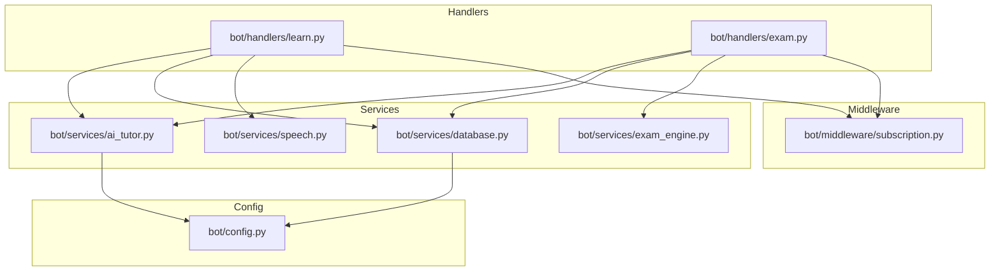
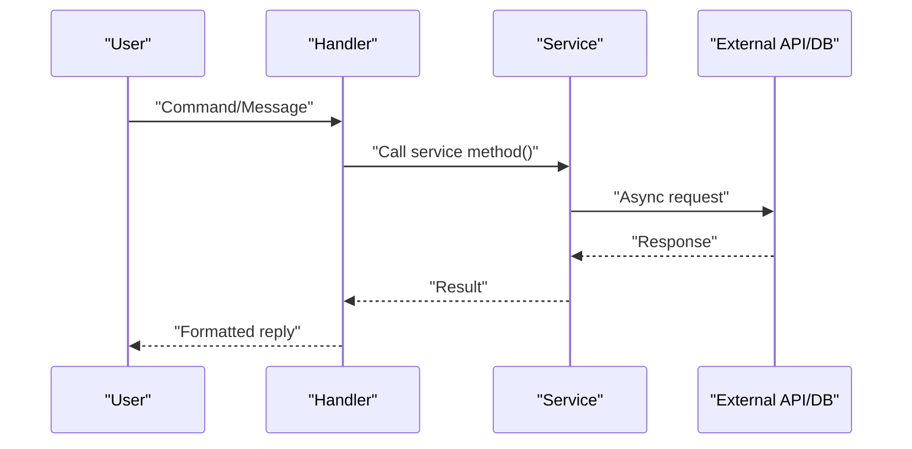
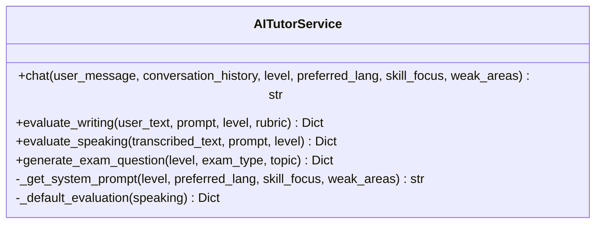
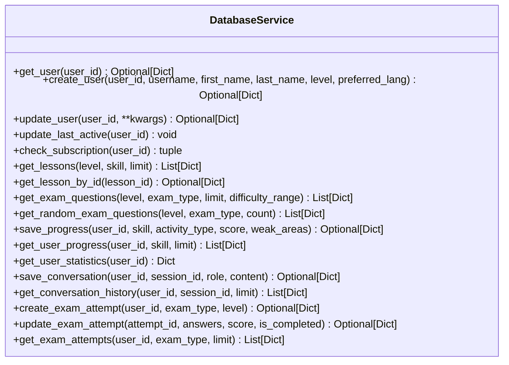
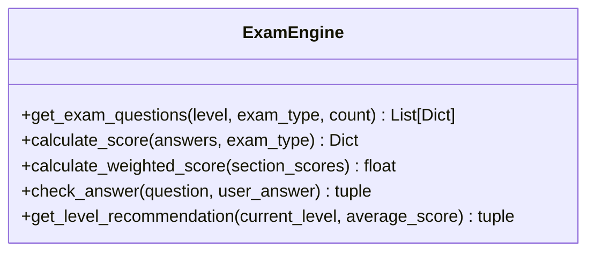
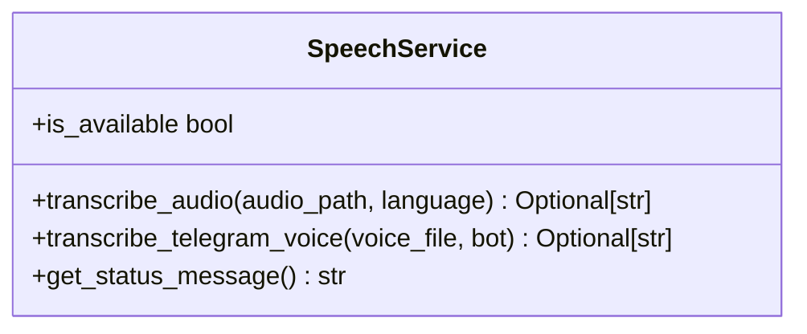
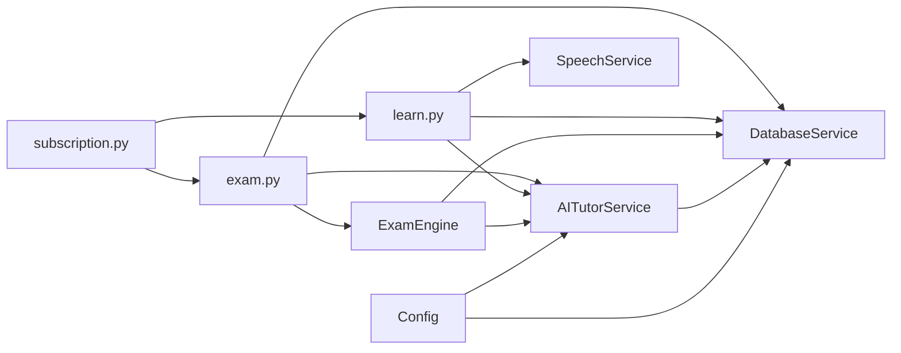

# API Reference

<cite>
**Referenced Files in This Document**
- [ai_tutor.py](file://bot/services/ai_tutor.py)
- [database.py](file://bot/services/database.py)
- [exam_engine.py](file://bot/services/exam_engine.py)
- [speech.py](file://bot/services/speech.py)
- [config.py](file://bot/config.py)
- [learn.py](file://bot/handlers/learn.py)
- [exam.py](file://bot/handlers/exam.py)
- [subscription.py](file://bot/middleware/subscription.py)
- [__init__.py](file://bot/services/__init__.py)
- [requirements.txt](file://requirements.txt)
- [tutor_system.txt](file://prompts/tutor_system.txt)
</cite>

## Table of Contents
1. [Introduction](#introduction)
2. [Project Structure](#project-structure)
3. [Core Components](#core-components)
4. [Architecture Overview](#architecture-overview)
5. [Detailed Component Analysis](#detailed-component-analysis)
6. [Dependency Analysis](#dependency-analysis)
7. [Performance Considerations](#performance-considerations)
8. [Troubleshooting Guide](#troubleshooting-guide)
9. [Conclusion](#conclusion)
10. [Appendices](#appendices)

## Introduction
This document provides a comprehensive API reference for FebEGLS-bot’s internal service interfaces. It documents the public methods exposed by the AI tutor, database, exam engine, and speech services, including method signatures, parameters, return values, exceptions, and integration patterns with handlers. It also explains service initialization, configuration requirements, async/await patterns, timeouts, and practical usage scenarios.

## Project Structure
The bot organizes services under bot/services and integrates them into handlers under bot/handlers. Services are initialized as singletons and accessed globally. Configuration is centralized in bot/config.py and validated at import time.

**Diagram sources**
- [learn.py](file://bot/handlers/learn.py#L1-L315)
- [exam.py](file://bot/handlers/exam.py#L1-L523)
- [ai_tutor.py](file://bot/services/ai_tutor.py#L1-L451)
- [database.py](file://bot/services/database.py#L1-L422)
- [exam_engine.py](file://bot/services/exam_engine.py#L1-L211)
- [speech.py](file://bot/services/speech.py#L1-L140)
- [subscription.py](file://bot/middleware/subscription.py#L1-L156)
- [config.py](file://bot/config.py#L1-L60)

**Section sources**
- [__init__.py](file://bot/services/__init__.py#L1-L7)
- [config.py](file://bot/config.py#L1-L60)

## Core Components
- AITutorService: Async interface to OpenRouter API for tutoring, evaluation, and dynamic question generation.
- DatabaseService: Async Supabase client wrapper for user, lesson, exam, progress, and conversation persistence.
- ExamEngine: Question selection, scoring, and level recommendation logic.
- SpeechService: Optional voice transcription using faster-whisper with graceful degradation.

**Section sources**
- [ai_tutor.py](file://bot/services/ai_tutor.py#L19-L451)
- [database.py](file://bot/services/database.py#L16-L422)
- [exam_engine.py](file://bot/services/exam_engine.py#L15-L211)
- [speech.py](file://bot/services/speech.py#L21-L140)

## Architecture Overview
The handlers orchestrate user interactions and delegate to services. Handlers use middleware to enforce subscription checks. Services encapsulate external integrations and local persistence.

**Diagram sources**
- [learn.py](file://bot/handlers/learn.py#L159-L232)
- [exam.py](file://bot/handlers/exam.py#L358-L416)
- [ai_tutor.py](file://bot/services/ai_tutor.py#L82-L153)
- [database.py](file://bot/services/database.py#L24-L110)
- [speech.py](file://bot/services/speech.py#L45-L129)

## Detailed Component Analysis

### AITutorService
Public methods:
- chat(user_message, conversation_history, level="A1", preferred_lang="english", skill_focus=None, weak_areas=None) -> str
  - Purpose: Send a message to the AI tutor and return a response.
  - Parameters:
    - user_message: str
    - conversation_history: List[Dict[str, str]]
    - level: str (CEFR level)
    - preferred_lang: str (language for explanations)
    - skill_focus: Optional[str]
    - weak_areas: Optional[List[str]]
  - Returns: str (AI response)
  - Exceptions: Returns user-friendly fallback strings on HTTP timeout or API errors.
  - Notes: Uses httpx.AsyncClient with a 60s timeout; limits conversation history to Config.MAX_CONVERSATION_HISTORY.

- evaluate_writing(user_text, prompt, level, rubric=None) -> Dict[str, Any]
  - Purpose: Evaluate writing submissions with structured JSON output.
  - Parameters:
    - user_text: str
    - prompt: str
    - level: str
    - rubric: Optional[Dict[str, Any]]
  - Returns: Dict with scores, strengths, suggestions, mistakes, corrected_text, overall_score.
  - Exceptions: Returns default evaluation on JSON parse or API errors.

- evaluate_speaking(transcribed_text, prompt, level) -> Dict[str, Any]
  - Purpose: Evaluate speaking submissions (transcribed) with structured JSON output.
  - Parameters:
    - transcribed_text: str
    - prompt: str
    - level: str
  - Returns: Dict with scores, strengths, suggestions, pronunciation tips, mistakes, overall_score.
  - Exceptions: Returns default evaluation on JSON parse or API errors.

- generate_exam_question(level, exam_type, topic=None) -> Dict[str, Any]
  - Purpose: Dynamically generate exam questions for supported types.
  - Parameters:
    - level: str
    - exam_type: str (lesen, horen, schreiben, sprechen, vokabular)
    - topic: Optional[str]
  - Returns: Dict with question_text, options, correct_answer, explanation, or question_data depending on type.
  - Exceptions: Returns empty dict on failure.

- Internal helpers:
  - _get_system_prompt(level, preferred_lang, skill_focus, weak_areas) -> str
  - _default_evaluation(speaking=False) -> Dict[str, Any]

Initialization and configuration:
- Reads configuration from Config (OPENROUTER_API_URL, OPENROUTER_API_KEY, AI_MODEL, MAX_CONVERSATION_HISTORY).
- Headers include Authorization, Content-Type, HTTP-Referer, and X-Title.

Async/await and timeouts:
- Uses httpx.AsyncClient with explicit timeouts (60s for chat, 90s for evaluations, 60s for question generation).

Error handling:
- Catches httpx.TimeoutException and general exceptions; logs errors and returns fallback messages.

Integration patterns:
- Used by handlers learn.py and exam.py for tutoring and evaluation workflows.

**Section sources**
- [ai_tutor.py](file://bot/services/ai_tutor.py#L19-L451)
- [config.py](file://bot/config.py#L10-L59)
- [learn.py](file://bot/handlers/learn.py#L205-L232)
- [exam.py](file://bot/handlers/exam.py#L371-L380)

#### Class Diagram

**Diagram sources**
- [ai_tutor.py](file://bot/services/ai_tutor.py#L19-L451)

### DatabaseService
Public methods:
- get_user(user_id) -> Optional[Dict[str, Any]]
- create_user(user_id, username=None, first_name=None, last_name=None, level="A1", preferred_lang="english") -> Optional[Dict[str, Any]]
- update_user(user_id, **kwargs) -> Optional[Dict[str, Any]]
- update_last_active(user_id) -> None
- check_subscription(user_id) -> tuple[bool, Optional[datetime]]

- get_lessons(level=None, skill=None, limit=10) -> List[Dict[str, Any]]
- get_lesson_by_id(lesson_id) -> Optional[Dict[str, Any]]

- get_exam_questions(level, exam_type, limit=10, difficulty_range=None) -> List[Dict[str, Any]]
- get_random_exam_questions(level, exam_type, count=10) -> List[Dict[str, Any]]

- save_progress(user_id, skill, activity_type, score, weak_areas=None) -> Optional[Dict[str, Any]]
- get_user_progress(user_id, skill=None, limit=20) -> List[Dict[str, Any]]
- get_user_statistics(user_id) -> Dict[str, Any]

- save_conversation(user_id, session_id, role, content) -> Optional[Dict[str, Any]]
- get_conversation_history(user_id, session_id=None, limit=10) -> List[Dict[str, Any]]

- create_exam_attempt(user_id, exam_type, level) -> Optional[Dict[str, Any]]
- update_exam_attempt(attempt_id, answers, score=None, is_completed=False) -> Optional[Dict[str, Any]]
- get_exam_attempts(user_id, exam_type=None, limit=10) -> List[Dict[str, Any]]

Initialization and configuration:
- Initializes Supabase client using Config.SUPABASE_URL and Config.SUPABASE_KEY.

Async/await and timeouts:
- All methods are async and rely on Supabase client’s async operations.

Error handling:
- Catches exceptions and logs errors; returns safe defaults (None, [], {}) as appropriate.

Integration patterns:
- Used by handlers learn.py and exam.py for persistence and retrieval of user data, progress, and exam attempts.

**Section sources**
- [database.py](file://bot/services/database.py#L16-L422)
- [config.py](file://bot/config.py#L10-L59)
- [learn.py](file://bot/handlers/learn.py#L219-L221)
- [exam.py](file://bot/handlers/exam.py#L387-L396)

#### Class Diagram

**Diagram sources**
- [database.py](file://bot/services/database.py#L16-L422)

### ExamEngine
Public methods:
- get_exam_questions(level, exam_type, count=None) -> List[Dict[str, Any]]
  - Retrieves questions from database; falls back to AI-generated questions if insufficient.
- calculate_score(answers, exam_type) -> Dict[str, Any]
  - Computes score, correctness, percentage, pass/fail, and weak areas.
- calculate_weighted_score(section_scores) -> float
  - Computes overall score across exam sections with predefined weights.
- check_answer(question, user_answer) -> tuple[bool, str]
  - Validates objective answers and returns explanation.
- get_level_recommendation(current_level, average_score) -> tuple[str, str]
  - Recommends level progression based on performance.

Initialization and configuration:
- Uses constants for EXAM_TYPES and QUESTION_COUNTS.
- Integrates with DatabaseService and AITutorService.

Async/await and timeouts:
- Calls async methods from db and ai_tutor.

Error handling:
- Gracefully handles missing data and returns sensible defaults.

Integration patterns:
- Used by handlers exam.py for exam orchestration.

**Section sources**
- [exam_engine.py](file://bot/services/exam_engine.py#L15-L211)
- [learn.py](file://bot/handlers/learn.py#L10-L10)
- [ai_tutor.py](file://bot/services/ai_tutor.py#L1-L10)

#### Class Diagram

**Diagram sources**
- [exam_engine.py](file://bot/services/exam_engine.py#L15-L211)

### SpeechService
Public methods:
- is_available -> bool
- transcribe_audio(audio_path, language="de") -> Optional[str]
- transcribe_telegram_voice(voice_file, bot) -> Optional[str]
- get_status_message() -> str

Initialization and configuration:
- Attempts to import faster-whisper; logs warnings if unavailable.
- Initializes WhisperModel with model_size, device="cpu", compute_type="int8".

Async/await and timeouts:
- Uses async-compatible operations for Telegram file downloads and transcription.

Error handling:
- Returns None on failures and logs errors; cleans up temporary files in finally blocks.

Integration patterns:
- Used by handlers learn.py and exam.py for voice message processing.

**Section sources**
- [speech.py](file://bot/services/speech.py#L21-L140)
- [learn.py](file://bot/handlers/learn.py#L165-L187)
- [exam.py](file://bot/handlers/exam.py#L322-L347)

#### Class Diagram

**Diagram sources**
- [speech.py](file://bot/services/speech.py#L21-L140)

## Dependency Analysis
- Services are initialized as singletons and exported via bot/services/__init__.py.
- Handlers import services directly and use them for business logic.
- Middleware injects subscription checks around handlers.
- Configuration is centralized and validated at import time.

**Diagram sources**
- [config.py](file://bot/config.py#L10-L59)
- [ai_tutor.py](file://bot/services/ai_tutor.py#L19-L451)
- [database.py](file://bot/services/database.py#L16-L422)
- [exam_engine.py](file://bot/services/exam_engine.py#L15-L211)
- [speech.py](file://bot/services/speech.py#L21-L140)
- [learn.py](file://bot/handlers/learn.py#L17-L24)
- [exam.py](file://bot/handlers/exam.py#L17-L23)
- [subscription.py](file://bot/middleware/subscription.py#L47-L137)

**Section sources**
- [__init__.py](file://bot/services/__init__.py#L1-L7)
- [config.py](file://bot/config.py#L10-L59)

## Performance Considerations
- Async I/O: All service methods are async and use httpx.AsyncClient and Supabase async operations to minimize blocking.
- Timeouts: AI requests use explicit timeouts (60–90s) to prevent hanging operations.
- Conversation history: Limits context window to Config.MAX_CONVERSATION_HISTORY entries to control payload sizes.
- Speech transcription: Uses CPU-based model by default; availability is checked before use to avoid runtime errors.
- Database queries: Use filters and limits to constrain result sets (e.g., limit=10, difficulty ranges).
- Recommendations:
  - Prefer streaming responses where possible.
  - Cache static prompts and metadata locally if reused frequently.
  - Monitor external API latency and consider circuit breaker patterns for production deployments.

[No sources needed since this section provides general guidance]

## Troubleshooting Guide
Common issues and resolutions:
- Missing configuration:
  - Symptom: Application fails to start.
  - Cause: Missing TELEGRAM_BOT_TOKEN, SUPABASE_URL, SUPABASE_KEY, or OPENROUTER_API_KEY.
  - Resolution: Set required environment variables; Config.validate() raises ValueError if missing.
- OpenRouter API errors:
  - Symptom: chat(), evaluate_writing(), evaluate_speaking(), generate_exam_question() return fallback messages.
  - Cause: Non-200 responses or timeouts.
  - Resolution: Retry with exponential backoff; verify API credentials and network connectivity.
- JSON parsing errors:
  - Symptom: Evaluation methods return default evaluation.
  - Cause: AI response not valid JSON.
  - Resolution: Inspect AI prompt formatting and response constraints; log raw content for debugging.
- Speech transcription unavailable:
  - Symptom: speech_service.is_available is False.
  - Cause: faster-whisper not installed or model load failure.
  - Resolution: Install requirements.txt; ensure audio files are supported formats.
- Subscription checks:
  - Symptom: Handlers deny access to paid features.
  - Cause: No active subscription or expired.
  - Resolution: Use middleware decorators to guide users to renew.

**Section sources**
- [config.py](file://bot/config.py#L40-L59)
- [ai_tutor.py](file://bot/services/ai_tutor.py#L147-L152)
- [speech.py](file://bot/services/speech.py#L12-L18)
- [subscription.py](file://bot/middleware/subscription.py#L21-L44)

## Conclusion
The service layer provides a clean, async-oriented API for tutoring, evaluation, exam orchestration, and speech processing. Handlers integrate these services to deliver a cohesive learning experience. Proper configuration, robust error handling, and thoughtful timeouts ensure reliability and performance.

[No sources needed since this section summarizes without analyzing specific files]

## Appendices

### Configuration Requirements
- Environment variables (loaded via python-dotenv):
  - TELEGRAM_BOT_TOKEN
  - SUPABASE_URL
  - SUPABASE_KEY
  - OPENROUTER_API_KEY
- Additional runtime configuration:
  - CEFR_LEVELS, SKILLS, EXPLANATION_LANGS
  - SESSION_TIMEOUT, MAX_CONVERSATION_HISTORY

Validation occurs automatically on import.

**Section sources**
- [config.py](file://bot/config.py#L10-L59)

### Dependencies
- Python packages:
  - python-telegram-bot>=20.0
  - supabase>=2.0.0
  - httpx>=0.25.0
  - python-dotenv>=1.0.0
  - faster-whisper>=0.9.0
  - pydub>=0.25.1

**Section sources**
- [requirements.txt](file://requirements.txt#L1-L7)

### Rate Limiting and Quotas
- No built-in rate limiter in the services.
- Practical constraints:
  - OpenRouter API rate limits apply; implement retries with backoff.
  - Telegram Bot API rate limits apply; use send_chat_action judiciously.
  - Speech transcription is CPU-bound; consider disabling for high concurrency.

[No sources needed since this section provides general guidance]

### Integration Patterns with Handlers
- Learn handler:
  - Uses AITutorService.chat() for tutoring.
  - Persists conversation history via DatabaseService.save_conversation().
  - Updates progress via DatabaseService.save_progress().
  - Optional voice processing via SpeechService.transcribe_telegram_voice().
- Exam handler:
  - Uses ExamEngine.get_exam_questions() and scoring.
  - Evaluates writing/speaking via AITutorService.evaluate_writing()/evaluate_speaking().
  - Persists exam attempts via DatabaseService.create_exam_attempt()/update_exam_attempt().
  - Provides subscription gating via middleware.

**Section sources**
- [learn.py](file://bot/handlers/learn.py#L159-L232)
- [exam.py](file://bot/handlers/exam.py#L358-L416)
- [subscription.py](file://bot/middleware/subscription.py#L47-L137)

### Example Usage Scenarios
- Start a tutoring session:
  - Handler calls AITutorService.chat() with conversation_history and user preferences.
  - Responses are saved to conversation history and progress is recorded.
- Take a vocabulary exam:
  - Handler retrieves questions via ExamEngine.get_exam_questions().
  - Answers are validated with ExamEngine.check_answer().
  - Results are persisted via DatabaseService.update_exam_attempt() and progress via DatabaseService.save_progress().
- Practice speaking:
  - Handler receives voice messages, transcribes via SpeechService.transcribe_telegram_voice().
  - Evaluates responses via AITutorService.evaluate_speaking().

**Section sources**
- [learn.py](file://bot/handlers/learn.py#L159-L232)
- [exam.py](file://bot/handlers/exam.py#L358-L416)
- [speech.py](file://bot/services/speech.py#L83-L129)

### Service Lifecycle and Resource Cleanup
- Initialization:
  - Services are instantiated as singletons upon import.
  - Config.validate() ensures required environment variables are present.
- Resource cleanup:
  - SpeechService removes temporary audio files in finally blocks.
  - httpx.AsyncClient is used per request; timeouts prevent indefinite waits.
- Shutdown:
  - No explicit shutdown hooks; services persist for process lifetime.

**Section sources**
- [config.py](file://bot/config.py#L58-L59)
- [speech.py](file://bot/services/speech.py#L122-L128)
- [ai_tutor.py](file://bot/services/ai_tutor.py#L127-L138)

### Parameter Specifications and Validation Rules
- AITutorService.chat():
  - level ∈ CEFR_LEVELS, preferred_lang ∈ EXPLANATION_LANGS, weak_areas optional list.
  - conversation_history entries must include role/content keys.
- DatabaseService.save_progress():
  - weak_areas optional; defaults to empty list.
- ExamEngine.get_exam_questions():
  - count defaults to QUESTION_COUNTS[exam_type].
- SpeechService.transcribe_audio():
  - language defaults to "de"; supports OGG/WAV/MP3.

**Section sources**
- [config.py](file://bot/config.py#L25-L32)
- [ai_tutor.py](file://bot/services/ai_tutor.py#L82-L153)
- [database.py](file://bot/services/database.py#L194-L216)
- [exam_engine.py](file://bot/services/exam_engine.py#L29-L65)
- [speech.py](file://bot/services/speech.py#L45-L81)

### Error Response Formats
- AITutorService methods return user-facing fallback strings on errors.
- DatabaseService methods return None or empty containers on exceptions.
- SpeechService methods return None on transcription failures.

**Section sources**
- [ai_tutor.py](file://bot/services/ai_tutor.py#L147-L152)
- [database.py](file://bot/services/database.py#L29-L31)
- [speech.py](file://bot/services/speech.py#L79-L81)

### Async/Await Patterns and Timeout Configurations
- All service methods are async.
- httpx.AsyncClient timeouts:
  - chat(): 60s
  - evaluate_writing()/evaluate_speaking(): 90s
  - generate_exam_question(): 60s
- Conversation history truncation controlled by Config.MAX_CONVERSATION_HISTORY.

**Section sources**
- [ai_tutor.py](file://bot/services/ai_tutor.py#L127-L138)
- [config.py](file://bot/config.py#L34-L38)

### Retry Mechanisms
- Not implemented in services; implement at handler level if needed.
- Recommended approach: exponential backoff with jitter for external API calls.

[No sources needed since this section provides general guidance]

### System Prompt Reference
- System prompt construction is handled internally by AITutorService._get_system_prompt() and supplemented by prompts/tutor_system.txt.

**Section sources**
- [ai_tutor.py](file://bot/services/ai_tutor.py#L33-L81)
- [tutor_system.txt](file://prompts/tutor_system.txt#L1-L74)