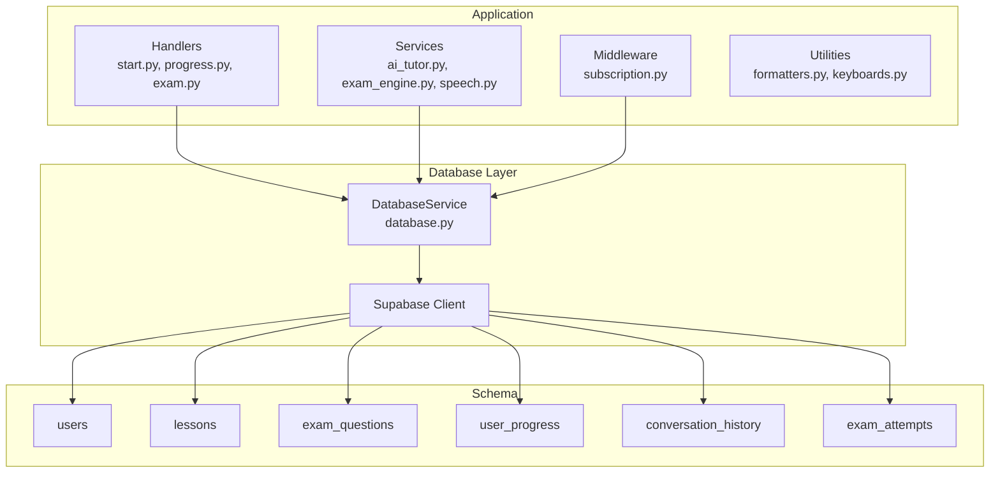
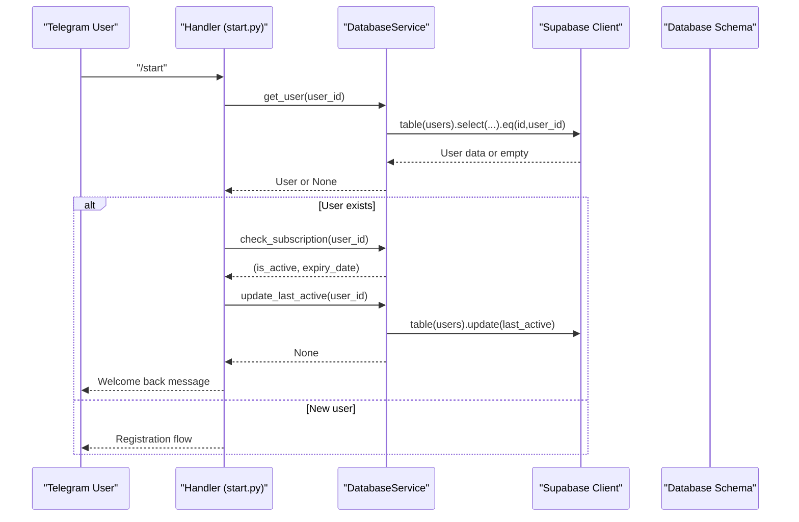
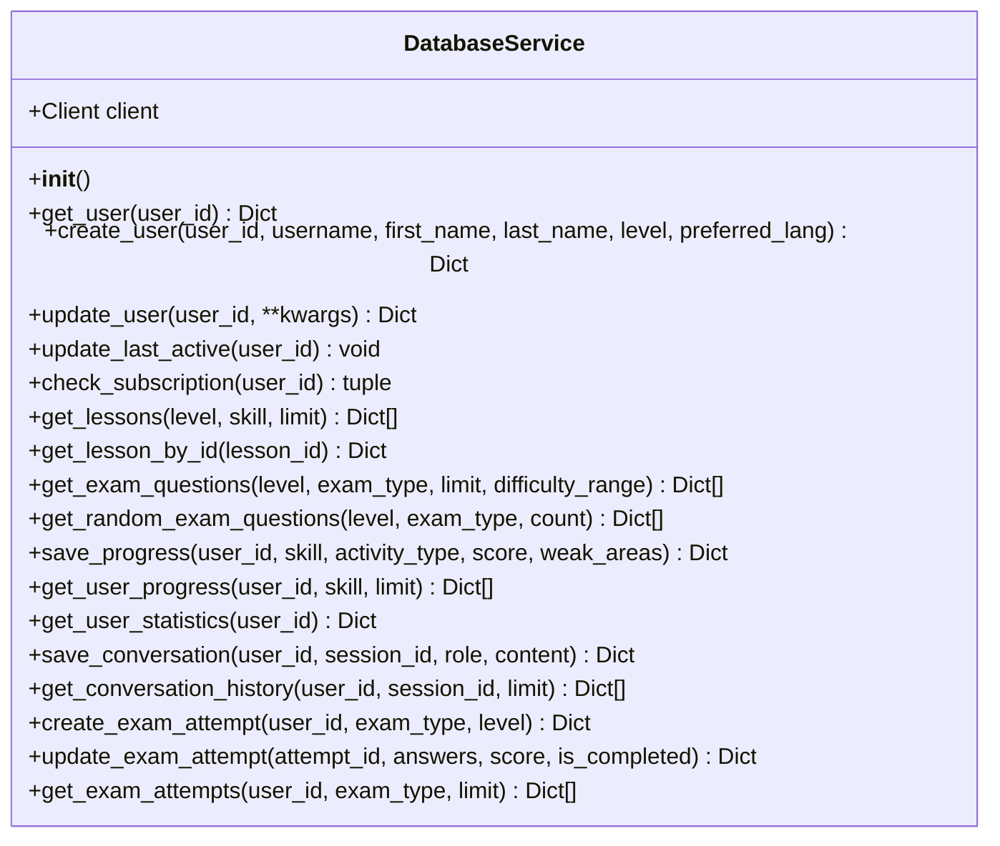
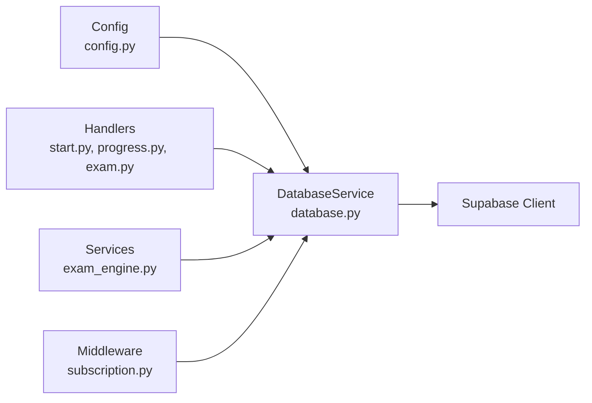
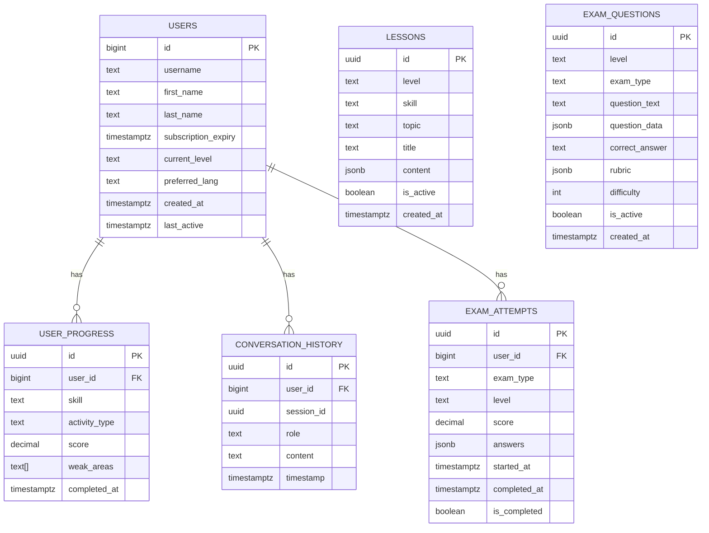

# Database Service

<cite>
**Referenced Files in This Document**
- [database.py](file://bot/services/database.py)
- [database_setup.sql](file://database_setup.sql)
- [setup_database.py](file://setup_database.py)
- [config.py](file://bot/config.py)
- [start.py](file://bot/handlers/start.py)
- [progress.py](file://bot/handlers/progress.py)
- [exam.py](file://bot/handlers/exam.py)
- [subscription.py](file://bot/middleware/subscription.py)
- [exam_engine.py](file://bot/services/exam_engine.py)
- [requirements.txt](file://requirements.txt)
</cite>

## Table of Contents
1. [Introduction](#introduction)
2. [Project Structure](#project-structure)
3. [Core Components](#core-components)
4. [Architecture Overview](#architecture-overview)
5. [Detailed Component Analysis](#detailed-component-analysis)
6. [Dependency Analysis](#dependency-analysis)
7. [Performance Considerations](#performance-considerations)
8. [Troubleshooting Guide](#troubleshooting-guide)
9. [Conclusion](#conclusion)
10. [Appendices](#appendices)

## Introduction
This document provides comprehensive API documentation for the Database Service that powers the EthioGerman Language School Telegram Bot. It covers all database operations including user management, progress tracking, conversation history, and exam data handling. It explains CRUD operations, query methods, data validation patterns, Supabase integration, connection management, transaction handling, method signatures, error handling, retry mechanisms, schema relationships, initialization and migration procedures, and performance considerations.

## Project Structure
The Database Service is implemented as a singleton class that encapsulates all Supabase client interactions. It is used by various handlers and services across the application.

**Diagram sources**
- [database.py](file://bot/services/database.py#L16-L422)
- [database_setup.sql](file://database_setup.sql#L1-L84)

**Section sources**
- [database.py](file://bot/services/database.py#L1-L422)
- [database_setup.sql](file://database_setup.sql#L1-L84)

## Core Components
- DatabaseService: Central class managing all Supabase operations with methods for users, lessons, exam questions, progress, conversation history, and exam attempts.
- Configuration: Loads Supabase credentials from environment variables.
- Initialization Scripts: SQL schema and setup script for database creation and index creation.

Key capabilities:
- Full CRUD operations for users, lessons, exam questions, progress entries, conversation history, and exam attempts.
- Query methods with filtering, ordering, and pagination.
- Data validation patterns and error handling.
- Subscription status checks and user activity tracking.
- Statistics calculation from progress data.

**Section sources**
- [database.py](file://bot/services/database.py#L16-L422)
- [config.py](file://bot/config.py#L10-L60)
- [database_setup.sql](file://database_setup.sql#L1-L84)

## Architecture Overview
The Database Service integrates with the Telegram bot through handler functions and middleware. Handlers call database methods to persist and retrieve data, while middleware enforces subscription-based access control.

**Diagram sources**
- [start.py](file://bot/handlers/start.py#L16-L86)
- [database.py](file://bot/services/database.py#L24-L110)

**Section sources**
- [start.py](file://bot/handlers/start.py#L16-L86)
- [database.py](file://bot/services/database.py#L24-L110)

## Detailed Component Analysis

### DatabaseService Class
The DatabaseService class encapsulates all database operations. It initializes a Supabase client using configuration values and provides methods for:
- User operations: get_user, create_user, update_user, update_last_active, check_subscription
- Lesson operations: get_lessons, get_lesson_by_id
- Exam questions operations: get_exam_questions, get_random_exam_questions
- Progress operations: save_progress, get_user_progress, get_user_statistics
- Conversation history operations: save_conversation, get_conversation_history
- Exam attempts operations: create_exam_attempt, update_exam_attempt, get_exam_attempts

**Diagram sources**
- [database.py](file://bot/services/database.py#L16-L422)

**Section sources**
- [database.py](file://bot/services/database.py#L16-L422)

### User Management Operations
- get_user(user_id): Retrieves a user by Telegram ID.
- create_user(user_id, username, first_name, last_name, level, preferred_lang): Creates a new user with default values and timestamps.
- update_user(user_id, **kwargs): Updates user fields and automatically updates last_active.
- update_last_active(user_id): Updates the last_active timestamp.
- check_subscription(user_id): Checks subscription status and returns (is_active, expiry_date).

Method signatures and parameters:
- get_user(user_id: int) -> Optional[Dict[str, Any]]
- create_user(user_id: int, username: Optional[str], first_name: Optional[str], last_name: Optional[str], level: str, preferred_lang: str) -> Optional[Dict[str, Any]]
- update_user(user_id: int, **kwargs) -> Optional[Dict[str, Any]]
- update_last_active(user_id: int) -> None
- check_subscription(user_id: int) -> tuple[bool, Optional[datetime]]

Validation patterns:
- User ID is validated as integer.
- Username, first_name, last_name are optional strings.
- Level defaults to 'A1'; preferred_lang defaults to 'english'.
- Subscription expiry parsing handles timezone-aware ISO format.

Response formats:
- Methods return dictionary-like data structures representing rows or None on failure.
- check_subscription returns a tuple with boolean and datetime or None.

**Section sources**
- [database.py](file://bot/services/database.py#L24-L110)

### Progress Tracking Operations
- save_progress(user_id: int, skill: str, activity_type: str, score: float, weak_areas: Optional[List[str]]) -> Optional[Dict[str, Any]]
- get_user_progress(user_id: int, skill: Optional[str], limit: int) -> List[Dict[str, Any]]
- get_user_statistics(user_id: int) -> Dict[str, Any]

Statistics calculation:
- Computes total activities, average score, skill scores, weak areas, and strengths.
- Identifies strengths as skills with average score >= 75.
- Uses Counter to find top weak areas.

Response formats:
- save_progress returns the inserted row or None.
- get_user_progress returns a list of progress entries ordered by completion time.
- get_user_statistics returns a dictionary with aggregated metrics.

**Section sources**
- [database.py](file://bot/services/database.py#L194-L298)

### Conversation History Operations
- save_conversation(user_id: int, session_id: str, role: str, content: str) -> Optional[Dict[str, Any]]
- get_conversation_history(user_id: int, session_id: Optional[str], limit: int) -> List[Dict[str, Any]]

Behavior:
- Stores conversation messages with timestamps.
- Orders by timestamp descending and reverses to chronological order.
- Supports filtering by session_id.

**Section sources**
- [database.py](file://bot/services/database.py#L302-L344)

### Exam Data Handling
- create_exam_attempt(user_id: int, exam_type: str, level: str) -> Optional[Dict[str, Any]]
- update_exam_attempt(attempt_id: str, answers: List[Dict[str, Any]], score: Optional[float], is_completed: bool) -> Optional[Dict[str, Any]]
- get_exam_attempts(user_id: int, exam_type: Optional[str], limit: int) -> List[Dict[str, Any]]

Integration with exam engine:
- Handlers call create_exam_attempt to initialize attempts.
- Handlers call update_exam_attempt to finalize attempts with answers and scores.
- Statistics and progress are saved after exam completion.

**Section sources**
- [database.py](file://bot/services/database.py#L348-L417)
- [exam.py](file://bot/handlers/exam.py#L114-L122)
- [exam_engine.py](file://bot/services/exam_engine.py#L29-L65)

### Query Methods and Filtering
- get_lessons(level: Optional[str], skill: Optional[str], limit: int) -> List[Dict[str, Any]]
- get_lesson_by_id(lesson_id: str) -> Optional[Dict[str, Any]]
- get_exam_questions(level: str, exam_type: str, limit: int, difficulty_range: Optional[tuple[int, int]]) -> List[Dict[str, Any]]
- get_random_exam_questions(level: str, exam_type: str, count: int) -> List[Dict[str, Any]]

Filtering patterns:
- Uses equality filters for level, skill, exam_type, and is_active flags.
- Supports range filtering for difficulty using greater-than-or-equal and less-than-or-equal.
- Limits results with pagination.

**Section sources**
- [database.py](file://bot/services/database.py#L113-L190)

### Data Validation Patterns
- Parameter validation occurs primarily at call sites (handlers and services).
- Database methods accept optional parameters with defaults.
- Timestamps are stored as ISO format UTC.
- Subscription expiry parsing handles timezone offsets and 'Z' suffix.

**Section sources**
- [database.py](file://bot/services/database.py#L33-L58)
- [database.py](file://bot/services/database.py#L79-L109)

### Error Handling and Retry Mechanisms
- All database operations are wrapped in try-except blocks.
- Exceptions are logged using the standard logging module.
- Methods return None or empty lists on failure to prevent crashes.
- No built-in retry mechanism is implemented in the service.

Recommendations:
- Implement exponential backoff for transient network errors.
- Consider circuit breaker patterns for degraded service resilience.

**Section sources**
- [database.py](file://bot/services/database.py#L26-L31)
- [database.py](file://bot/services/database.py#L56-L58)
- [database.py](file://bot/services/database.py#L67-L68)
- [database.py](file://bot/services/database.py#L97-L109)

### Transaction Handling
- The service uses the Supabase Python client which executes individual requests.
- There is no explicit transaction management in the service.
- For atomic operations across multiple tables, consider wrapping operations in application-level logic or using database triggers.

**Section sources**
- [database.py](file://bot/services/database.py#L19-L21)

## Dependency Analysis
The Database Service depends on:
- Supabase client for database operations.
- Configuration module for credentials.
- Handlers and services for data persistence and retrieval.

**Diagram sources**
- [config.py](file://bot/config.py#L10-L60)
- [database.py](file://bot/services/database.py#L16-L422)
- [start.py](file://bot/handlers/start.py#L9)
- [progress.py](file://bot/handlers/progress.py#L9)
- [exam.py](file://bot/handlers/exam.py#L17)
- [subscription.py](file://bot/middleware/subscription.py#L13)
- [exam_engine.py](file://bot/services/exam_engine.py#L9)

**Section sources**
- [config.py](file://bot/config.py#L10-L60)
- [database.py](file://bot/services/database.py#L16-L422)
- [start.py](file://bot/handlers/start.py#L9)
- [progress.py](file://bot/handlers/progress.py#L9)
- [exam.py](file://bot/handlers/exam.py#L17)
- [subscription.py](file://bot/middleware/subscription.py#L13)
- [exam_engine.py](file://bot/services/exam_engine.py#L9)

## Performance Considerations
- Indexes are created on frequently queried columns:
  - users(subscription_expiry)
  - lessons(level, skill)
  - exam_questions(level, exam_type)
  - user_progress(user_id)
  - conversation_history(user_id, session_id)
  - exam_attempts(user_id)
- Pagination is supported via limit parameters.
- Sorting is performed on timestamps and completion dates.
- Consider adding composite indexes for complex queries.

**Section sources**
- [database_setup.sql](file://database_setup.sql#L77-L84)

## Troubleshooting Guide
Common issues and resolutions:
- Missing environment variables: Ensure SUPABASE_URL and SUPABASE_KEY are set.
- Connection failures: Verify Supabase project URL and API key.
- Subscription parsing errors: Ensure subscription_expiry is stored as ISO format with timezone.
- Handler errors: Check handler logs for exceptions and verify database responses.

Logging:
- Database operations log errors with detailed context.
- Handlers log user actions and outcomes.

**Section sources**
- [config.py](file://bot/config.py#L41-L55)
- [database.py](file://bot/services/database.py#L29-L31)
- [start.py](file://bot/handlers/start.py#L81-L85)

## Conclusion
The Database Service provides a robust foundation for the EthioGerman Language School Telegram Bot, offering comprehensive CRUD operations, query methods, and integration with handlers and services. While it lacks explicit transaction management and retry mechanisms, it delivers reliable data persistence with clear error handling and performance-conscious indexing. Proper configuration and adherence to validation patterns ensure consistent behavior across user management, progress tracking, conversation history, and exam data handling.

## Appendices

### Database Schema Relationships

**Diagram sources**
- [database_setup.sql](file://database_setup.sql#L4-L84)

### Database Initialization and Migration
- Manual setup: Run the SQL script in the Supabase SQL Editor.
- Automated setup: Use the setup script to print the SQL for manual execution and attempt connection verification.

Initialization steps:
1. Create UUID extension.
2. Create all tables with appropriate constraints and defaults.
3. Create indexes for performance.
4. Verify connection via REST API.

**Section sources**
- [database_setup.sql](file://database_setup.sql#L1-L84)
- [setup_database.py](file://setup_database.py#L102-L153)

### External Dependencies
- python-telegram-bot: Telegram bot framework.
- supabase: Supabase client library.
- httpx: HTTP client for setup script.
- python-dotenv: Environment variable loading.

**Section sources**
- [requirements.txt](file://requirements.txt#L1-L7)