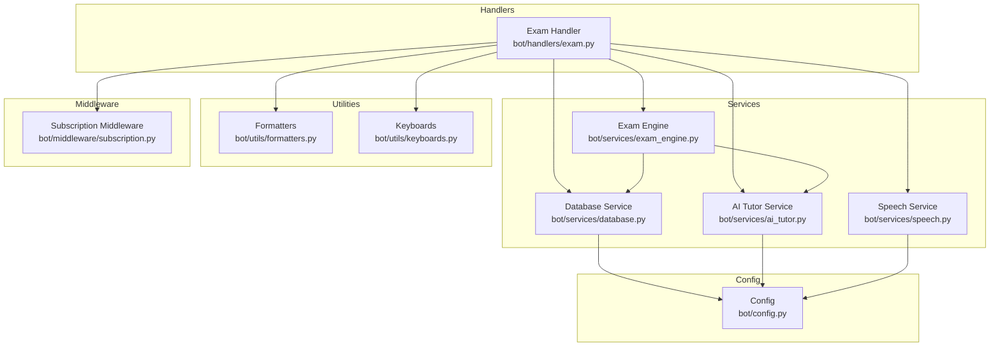
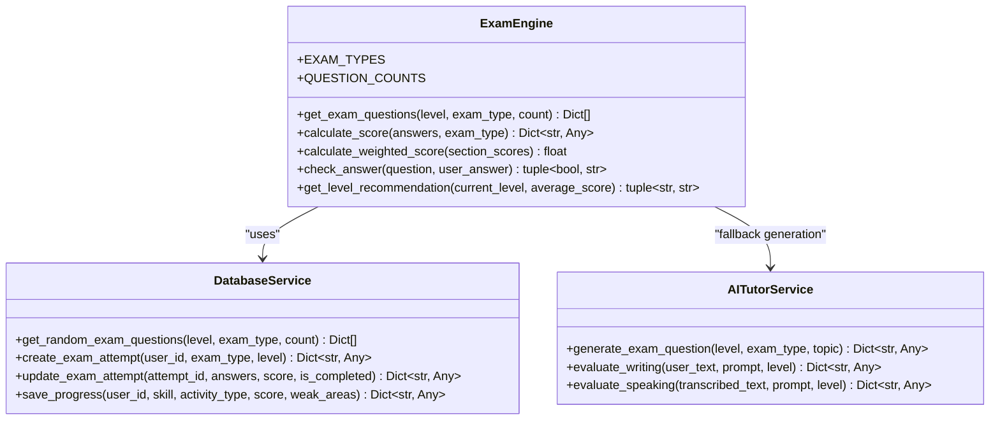
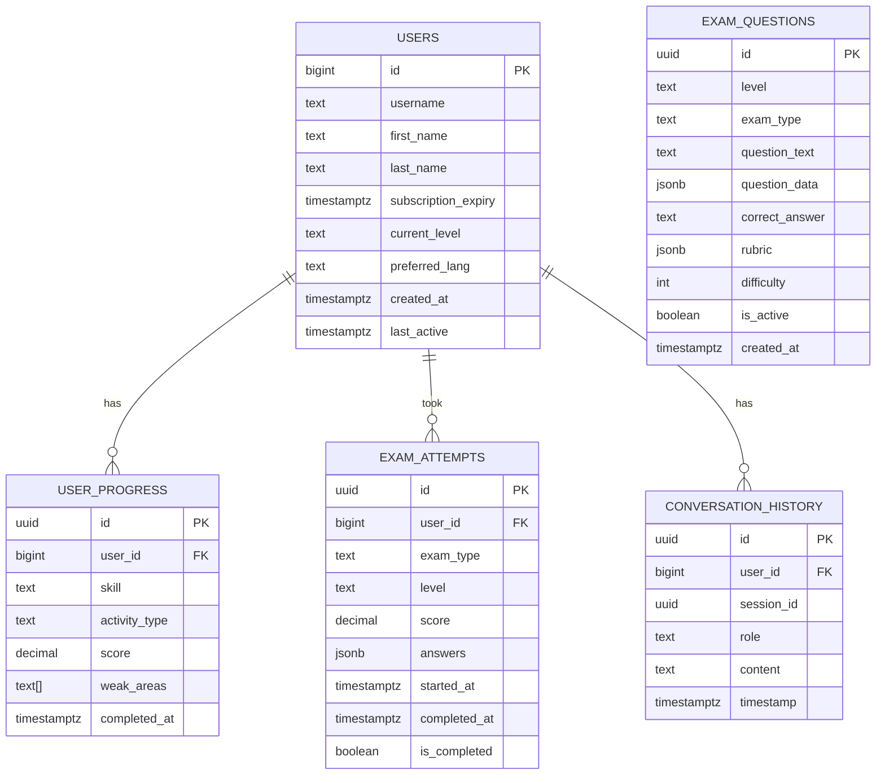
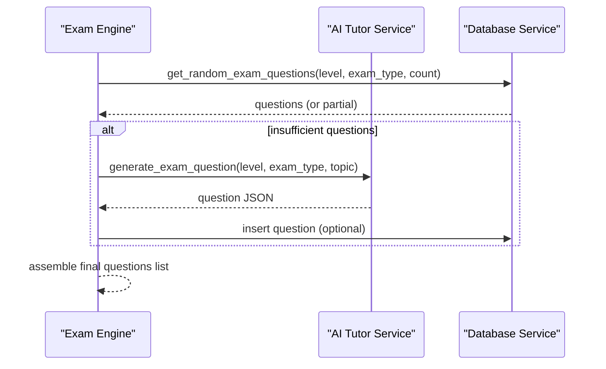
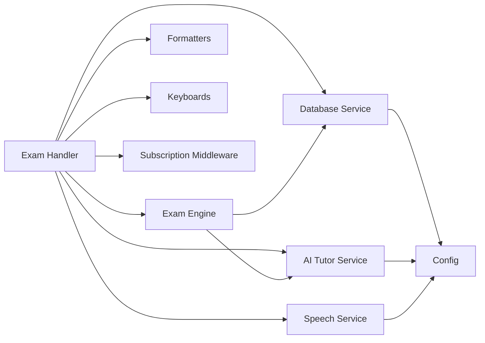
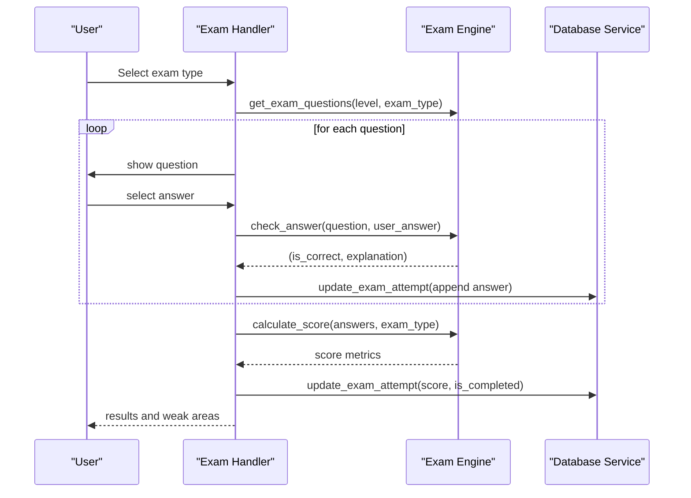
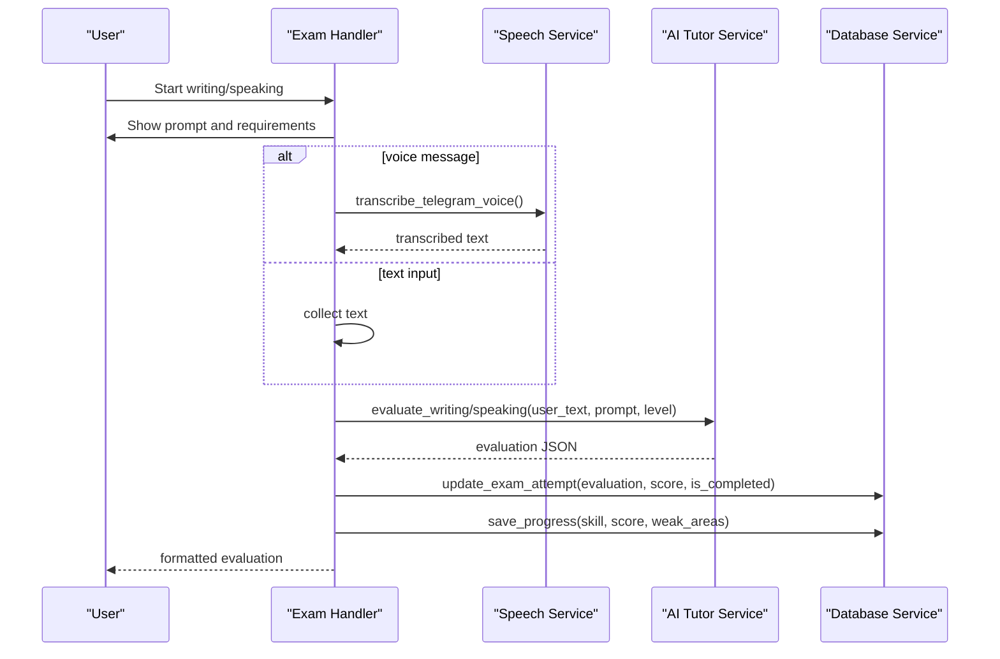

# Exam Engine Service

<cite>
**Referenced Files in This Document**
- [bot/services/exam_engine.py](file://bot/services/exam_engine.py)
- [bot/handlers/exam.py](file://bot/handlers/exam.py)
- [bot/services/database.py](file://bot/services/database.py)
- [bot/services/ai_tutor.py](file://bot/services/ai_tutor.py)
- [bot/utils/formatters.py](file://bot/utils/formatters.py)
- [bot/utils/keyboards.py](file://bot/utils/keyboards.py)
- [bot/services/speech.py](file://bot/services/speech.py)
- [bot/middleware/subscription.py](file://bot/middleware/subscription.py)
- [bot/config.py](file://bot/config.py)
- [bot/main.py](file://bot/main.py)
- [database_setup.sql](file://database_setup.sql)
- [setup_database.py](file://setup_database.py)
- [requirements.txt](file://requirements.txt)
</cite>

## Table of Contents
1. [Introduction](#introduction)
2. [Project Structure](#project-structure)
3. [Core Components](#core-components)
4. [Architecture Overview](#architecture-overview)
5. [Detailed Component Analysis](#detailed-component-analysis)
6. [Dependency Analysis](#dependency-analysis)
7. [Performance Considerations](#performance-considerations)
8. [Troubleshooting Guide](#troubleshooting-guide)
9. [Conclusion](#conclusion)
10. [Appendices](#appendices)

## Introduction
This document provides comprehensive API documentation for the Exam Engine Service powering the EthioGerman Language School Telegram bot. It covers exam generation methods, question formatting, scoring algorithms, evaluation logic, and administration workflows. It explains the dynamic question generation system for CEFR levels (A1, A2, B1) and exam types (vocabulary, reading, writing, speaking), along with timing controls, result processing, templates, difficulty scaling, and adaptive patterns. It also documents method signatures, examples of setup and administration, and security considerations.

## Project Structure
The exam engine integrates tightly with handlers, services, utilities, and middleware to deliver a complete exam experience:
- Handlers orchestrate user interactions and manage conversation states for exam administration.
- Services encapsulate database operations, AI-driven question generation and evaluation, and speech transcription.
- Utilities provide consistent formatting and keyboard layouts.
- Middleware enforces subscription-based access control.
- Configuration centralizes environment variables and constants.



**Diagram sources**
- [bot/handlers/exam.py](file://bot/handlers/exam.py#L1-L523)
- [bot/services/exam_engine.py](file://bot/services/exam_engine.py#L1-L211)
- [bot/services/database.py](file://bot/services/database.py#L1-L416)
- [bot/services/ai_tutor.py](file://bot/services/ai_tutor.py#L1-L451)
- [bot/services/speech.py](file://bot/services/speech.py#L1-L140)
- [bot/utils/formatters.py](file://bot/utils/formatters.py#L1-L300)
- [bot/utils/keyboards.py](file://bot/utils/keyboards.py#L1-L183)
- [bot/middleware/subscription.py](file://bot/middleware/subscription.py#L1-L156)
- [bot/config.py](file://bot/config.py#L1-L60)

**Section sources**
- [bot/handlers/exam.py](file://bot/handlers/exam.py#L1-L523)
- [bot/services/exam_engine.py](file://bot/services/exam_engine.py#L1-L211)
- [bot/services/database.py](file://bot/services/database.py#L1-L416)
- [bot/services/ai_tutor.py](file://bot/services/ai_tutor.py#L1-L451)
- [bot/services/speech.py](file://bot/services/speech.py#L1-L140)
- [bot/utils/formatters.py](file://bot/utils/formatters.py#L1-L300)
- [bot/utils/keyboards.py](file://bot/utils/keyboards.py#L1-L183)
- [bot/middleware/subscription.py](file://bot/middleware/subscription.py#L1-L156)
- [bot/config.py](file://bot/config.py#L1-L60)

## Core Components
- Exam Engine: Central service for question selection, scoring, and level recommendations.
- Database Service: Manages exam questions, user progress, conversation history, and exam attempts.
- AI Tutor Service: Generates exam questions and evaluates writing/speaking submissions.
- Speech Service: Provides voice transcription for speaking tasks.
- Formatters and Keyboards: Provide consistent UI formatting and interactive controls.
- Subscription Middleware: Enforces subscription checks for exam access.
- Configuration: Loads environment variables and validates required settings.

**Section sources**
- [bot/services/exam_engine.py](file://bot/services/exam_engine.py#L15-L211)
- [bot/services/database.py](file://bot/services/database.py#L16-L416)
- [bot/services/ai_tutor.py](file://bot/services/ai_tutor.py#L19-L451)
- [bot/services/speech.py](file://bot/services/speech.py#L21-L140)
- [bot/utils/formatters.py](file://bot/utils/formatters.py#L8-L300)
- [bot/utils/keyboards.py](file://bot/utils/keyboards.py#L10-L183)
- [bot/middleware/subscription.py](file://bot/middleware/subscription.py#L21-L156)
- [bot/config.py](file://bot/config.py#L10-L60)

## Architecture Overview
The exam engine follows a layered architecture:
- Presentation Layer: Telegram handlers manage user interactions and conversation states.
- Business Logic Layer: Exam Engine coordinates question sourcing, scoring, and recommendations.
- Data Access Layer: Database Service abstracts Supabase operations for persistence.
- AI Integration Layer: AI Tutor Service generates and evaluates content.
- Utility Layer: Formatters and Keyboards standardize UI and navigation.
- Security Layer: Subscription middleware ensures access control.

```mermaid
sequenceDiagram
participant User as "Telegram User"
participant Handler as "Exam Handler"
participant Engine as "Exam Engine"
participant DB as "Database Service"
participant AI as "AI Tutor Service"
participant Speech as "Speech Service"
User->>Handler : "/exam" or select exam type
Handler->>DB : check_subscription()
DB-->>Handler : active/expired/no subscription
alt subscription required
Handler-->>User : subscription alert
exit
end
Handler->>DB : get_user(user_id)
DB-->>Handler : user profile (level)
Handler->>Engine : get_exam_questions(level, exam_type)
Engine->>DB : get_random_exam_questions(level, exam_type, count)
DB-->>Engine : questions (randomized with difficulty distribution)
alt not enough questions
Engine->>AI : generate_exam_question(level, exam_type)
AI-->>Engine : generated question JSON
end
Engine-->>Handler : questions list
Handler->>User : render question(s)
User->>Handler : answer(s)
alt objective exam
Handler->>Engine : check_answer(question, user_answer)
Engine-->>Handler : (is_correct, explanation)
Handler->>DB : update_exam_attempt(attempt_id, answers, score)
Handler->>DB : save_progress(user_id, skill, activity_type, score, weak_areas)
else subjective exam (writing/speaking)
Handler->>AI : evaluate_writing/speaking(user_text, prompt, level)
AI-->>Handler : evaluation JSON
Handler->>DB : update_exam_attempt(attempt_id, answers, score, is_completed)
Handler->>DB : save_progress(user_id, skill, activity_type, score, weak_areas)
end
Handler-->>User : results and feedback
```

**Diagram sources**
- [bot/handlers/exam.py](file://bot/handlers/exam.py#L31-L523)
- [bot/services/exam_engine.py](file://bot/services/exam_engine.py#L29-L184)
- [bot/services/database.py](file://bot/services/database.py#L163-L412)
- [bot/services/ai_tutor.py](file://bot/services/ai_tutor.py#L154-L325)
- [bot/services/speech.py](file://bot/services/speech.py#L83-L129)

## Detailed Component Analysis

### Exam Engine Service
The Exam Engine is responsible for:
- Selecting exam questions from the database with difficulty distribution and falling back to AI generation.
- Scoring objective answers and computing overall performance metrics.
- Weighted scoring for full mock exams.
- Answer validation with flexible formats.
- Level recommendation based on performance thresholds.

Key methods and behaviors:
- Question selection: get_exam_questions(level, exam_type, count=None)
  - Uses database-backed random sampling with difficulty ranges and falls back to AI-generated questions when insufficient.
- Scoring: calculate_score(answers, exam_type)
  - Computes total, correct answers, percentage, pass/fail threshold, and weak areas.
- Weighted scoring: calculate_weighted_score(section_scores)
  - Applies weights for each exam type to derive an overall score.
- Answer checking: check_answer(question, user_answer)
  - Normalizes answer formats and returns correctness with explanation.
- Level recommendation: get_level_recommendation(current_level, average_score)
  - Suggests level progression based on performance.



**Diagram sources**
- [bot/services/exam_engine.py](file://bot/services/exam_engine.py#L15-L211)
- [bot/services/database.py](file://bot/services/database.py#L163-L184)
- [bot/services/ai_tutor.py](file://bot/services/ai_tutor.py#L327-L424)

**Section sources**
- [bot/services/exam_engine.py](file://bot/services/exam_engine.py#L29-L207)

### Database Service
The Database Service manages:
- User profiles and subscriptions.
- Exam questions with difficulty and randomized selection.
- User progress tracking and statistics.
- Conversation history for AI context.
- Exam attempts with answers and completion status.

Important operations:
- Random question selection with difficulty distribution: get_random_exam_questions(level, exam_type, count)
- Saving progress: save_progress(user_id, skill, activity_type, score, weak_areas)
- Managing exam attempts: create_exam_attempt, update_exam_attempt, get_exam_attempts



**Diagram sources**
- [database_setup.sql](file://database_setup.sql#L4-L84)
- [bot/services/database.py](file://bot/services/database.py#L16-L416)

**Section sources**
- [bot/services/database.py](file://bot/services/database.py#L139-L412)
- [database_setup.sql](file://database_setup.sql#L29-L75)

### AI Tutor Service
The AI Tutor Service provides:
- Dynamic exam question generation for vocabulary, reading, writing, and speaking.
- Writing and speaking evaluations with structured JSON outputs.
- Chat functionality for general tutoring with configurable conversation history.

Key methods:
- generate_exam_question(level, exam_type, topic)
- evaluate_writing(user_text, prompt, level)
- evaluate_speaking(transcribed_text, prompt, level)



**Diagram sources**
- [bot/services/exam_engine.py](file://bot/services/exam_engine.py#L29-L65)
- [bot/services/ai_tutor.py](file://bot/services/ai_tutor.py#L327-L424)
- [bot/services/database.py](file://bot/services/database.py#L163-L184)

**Section sources**
- [bot/services/ai_tutor.py](file://bot/services/ai_tutor.py#L154-L424)

### Speech Service
The Speech Service enables voice transcription for speaking tasks:
- Transcribes Telegram voice messages to text using faster-whisper.
- Provides fallback messaging when transcription is unavailable.

Key methods:
- transcribe_telegram_voice(voice_file, bot)
- is_available property

**Section sources**
- [bot/services/speech.py](file://bot/services/speech.py#L45-L129)

### Formatters and Keyboards
- Formatters: Consistent message formatting for exam questions, results, writing/speaking evaluations, and progress summaries.
- Keyboards: Interactive inline keyboards for exam menus, MCQ options, navigation, and actions.

**Section sources**
- [bot/utils/formatters.py](file://bot/utils/formatters.py#L130-L300)
- [bot/utils/keyboards.py](file://bot/utils/keyboards.py#L47-L183)

### Subscription Middleware
- Validates subscription status and enforces access control for exam features.
- Provides warnings for expiring subscriptions.

**Section sources**
- [bot/middleware/subscription.py](file://bot/middleware/subscription.py#L21-L156)

## Dependency Analysis
The exam engine depends on:
- Database Service for persistence and question sourcing.
- AI Tutor Service for dynamic question generation and evaluation.
- Speech Service for voice-to-text conversion in speaking tasks.
- Formatters and Keyboards for UI consistency.
- Subscription Middleware for access control.
- Configuration for environment variables and constants.



**Diagram sources**
- [bot/handlers/exam.py](file://bot/handlers/exam.py#L17-L23)
- [bot/services/exam_engine.py](file://bot/services/exam_engine.py#L9-L10)
- [bot/services/database.py](file://bot/services/database.py#L10-L11)
- [bot/services/ai_tutor.py](file://bot/services/ai_tutor.py#L11)
- [bot/services/speech.py](file://bot/services/speech.py#L10)
- [bot/utils/formatters.py](file://bot/utils/formatters.py#L4)
- [bot/utils/keyboards.py](file://bot/utils/keyboards.py#L7)
- [bot/middleware/subscription.py](file://bot/middleware/subscription.py#L13)
- [bot/config.py](file://bot/config.py#L10-L23)

**Section sources**
- [bot/main.py](file://bot/main.py#L22-L81)
- [bot/config.py](file://bot/config.py#L10-L60)

## Performance Considerations
- Database indexing: Indexes on level/type for exam questions and user progress improve query performance.
- Difficulty distribution: Random sampling with difficulty ranges balances question difficulty.
- Asynchronous operations: AI and database calls use async patterns to minimize latency.
- Conversation history limits: Configurable max conversation history reduces payload sizes.
- Speech transcription: CPU-based model for broader compatibility; availability checked before use.

[No sources needed since this section provides general guidance]

## Troubleshooting Guide
Common issues and resolutions:
- Subscription required: Ensure user has active subscription; otherwise, handlers return alerts and block exam access.
- No questions available: The engine falls back to AI-generated questions; verify AI service connectivity and configuration.
- Evaluation failures: Default evaluation structures are returned when API calls fail; check network connectivity and API keys.
- Speech transcription unavailable: The service logs a warning and disables voice input; install faster-whisper or use text input.

**Section sources**
- [bot/middleware/subscription.py](file://bot/middleware/subscription.py#L68-L98)
- [bot/services/ai_tutor.py](file://bot/services/ai_tutor.py#L425-L446)
- [bot/services/speech.py](file://bot/services/speech.py#L13-L18)

## Conclusion
The Exam Engine Service delivers a robust, scalable solution for administering Goethe-style exams in German. It combines curated question sets with AI-generated content, provides comprehensive scoring and analytics, and integrates seamlessly with Telegram interactions. The modular design, strong separation of concerns, and adherence to CEFR-aligned difficulty scaling ensure a high-quality learning experience.

[No sources needed since this section summarizes without analyzing specific files]

## Appendices

### API Method Signatures and Behaviors
- Exam Engine
  - get_exam_questions(level: str, exam_type: str, count: Optional[int] = None) -> List[Dict[str, Any]]
  - calculate_score(answers: List[Dict[str, Any]], exam_type: str) -> Dict[str, Any]
  - calculate_weighted_score(section_scores: Dict[str, float]) -> float
  - check_answer(question: Dict[str, Any], user_answer: str) -> tuple[bool, str]
  - get_level_recommendation(current_level: str, average_score: float) -> tuple[str, str]

- Database Service
  - get_random_exam_questions(level: str, exam_type: str, count: int) -> List[Dict[str, Any]]
  - create_exam_attempt(user_id: int, exam_type: str, level: str) -> Optional[Dict[str, Any]]
  - update_exam_attempt(attempt_id: str, answers: List[Dict[str, Any]], score: Optional[float], is_completed: bool) -> Optional[Dict[str, Any]]
  - save_progress(user_id: int, skill: str, activity_type: str, score: float, weak_areas: Optional[List[str]]) -> Optional[Dict[str, Any]]

- AI Tutor Service
  - generate_exam_question(level: str, exam_type: str, topic: Optional[str]) -> Dict[str, Any]
  - evaluate_writing(user_text: str, prompt: str, level: str) -> Dict[str, Any]
  - evaluate_speaking(transcribed_text: str, prompt: str, level: str) -> Dict[str, Any]

- Speech Service
  - transcribe_telegram_voice(voice_file, bot) -> Optional[str]
  - is_available: bool

- Formatters
  - exam_question(question_num: int, total: int, question_text: str, passage: Optional[str] = None) -> str
  - exam_results(exam_type: str, score: float, correct: int, total: int, passed: bool, weak_areas: List[str]) -> str
  - writing_evaluation(evaluation: Dict[str, Any]) -> str
  - speaking_evaluation(evaluation: Dict[str, Any]) -> str

- Keyboards
  - exam_menu() -> InlineKeyboardMarkup
  - mcq_options(options: List[str]) -> InlineKeyboardMarkup
  - submit_cancel() -> InlineKeyboardMarkup
  - next_question() -> InlineKeyboardMarkup

**Section sources**
- [bot/services/exam_engine.py](file://bot/services/exam_engine.py#L29-L207)
- [bot/services/database.py](file://bot/services/database.py#L163-L412)
- [bot/services/ai_tutor.py](file://bot/services/ai_tutor.py#L327-L424)
- [bot/services/speech.py](file://bot/services/speech.py#L45-L129)
- [bot/utils/formatters.py](file://bot/utils/formatters.py#L130-L268)
- [bot/utils/keyboards.py](file://bot/utils/keyboards.py#L47-L183)

### Example Workflows

#### Objective Exam Administration
- User selects an exam type.
- Handler initializes session, retrieves questions, and routes to objective flow.
- User answers questions; handler validates with Exam Engine and records answers.
- On completion, handler calculates score, updates attempt, saves progress, and displays results.



**Diagram sources**
- [bot/handlers/exam.py](file://bot/handlers/exam.py#L99-L122)
- [bot/handlers/exam.py](file://bot/handlers/exam.py#L159-L201)
- [bot/handlers/exam.py](file://bot/handlers/exam.py#L419-L466)
- [bot/services/exam_engine.py](file://bot/services/exam_engine.py#L67-L114)
- [bot/services/database.py](file://bot/services/database.py#L364-L389)

#### Subjective Exam Administration (Writing/Speaking)
- Handler starts subjective flow, displays prompt and requirements.
- User submits text or voice; handler transcribes if needed.
- Handler requests AI evaluation and formats results.
- Handler updates attempt, saves progress, and clears session data.



**Diagram sources**
- [bot/handlers/exam.py](file://bot/handlers/exam.py#L218-L293)
- [bot/handlers/exam.py](file://bot/handlers/exam.py#L358-L417)
- [bot/services/speech.py](file://bot/services/speech.py#L83-L129)
- [bot/services/ai_tutor.py](file://bot/services/ai_tutor.py#L154-L325)
- [bot/services/database.py](file://bot/services/database.py#L364-L408)

### Security and Data Integrity Measures
- Subscription enforcement prevents unauthorized access to exam features.
- Database constraints and indexes ensure data integrity and performance.
- Environment-based configuration centralizes secrets and settings.
- Logging captures errors and operational events for monitoring.

**Section sources**
- [bot/middleware/subscription.py](file://bot/middleware/subscription.py#L21-L101)
- [bot/services/database.py](file://bot/services/database.py#L16-L416)
- [bot/config.py](file://bot/config.py#L40-L56)

### Setup and Deployment Notes
- Install dependencies: python-telegram-bot, supabase, httpx, python-dotenv, faster-whisper, pydub.
- Configure environment variables for Telegram, Supabase, and OpenRouter.
- Run database setup script to create tables and indexes in Supabase.

**Section sources**
- [requirements.txt](file://requirements.txt#L1-L7)
- [setup_database.py](file://setup_database.py#L102-L152)
- [database_setup.sql](file://database_setup.sql#L1-L84)
- [bot/config.py](file://bot/config.py#L10-L60)