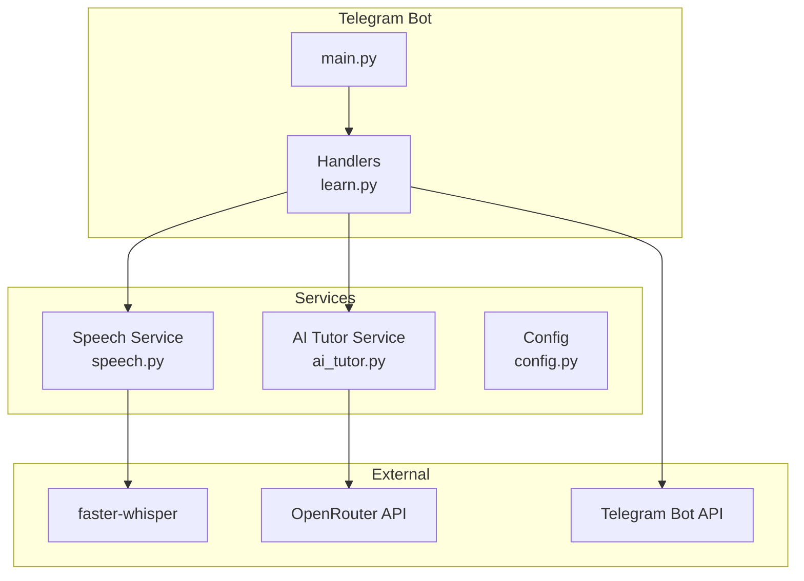
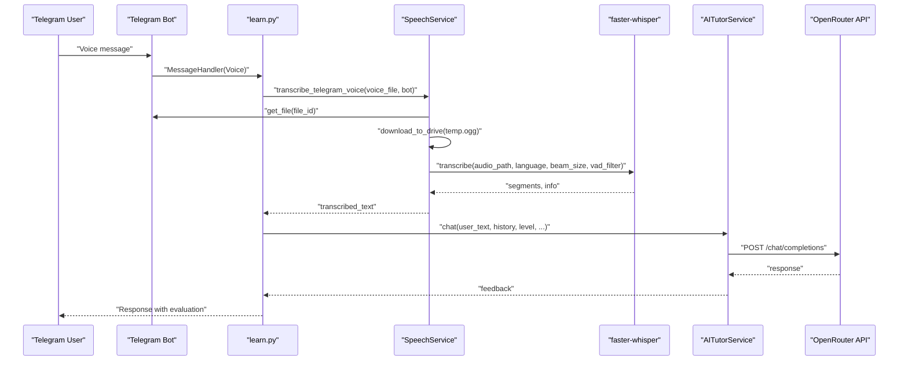
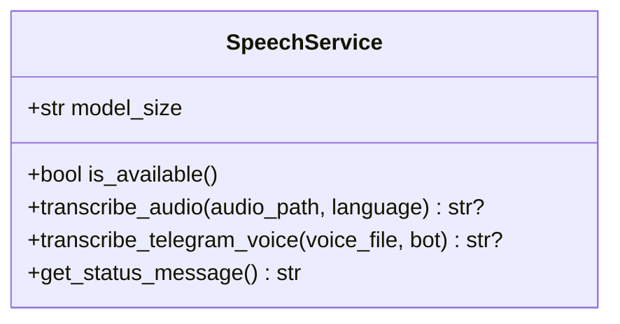
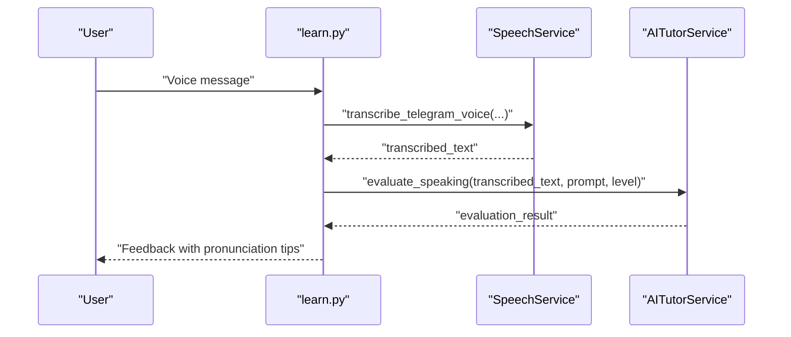
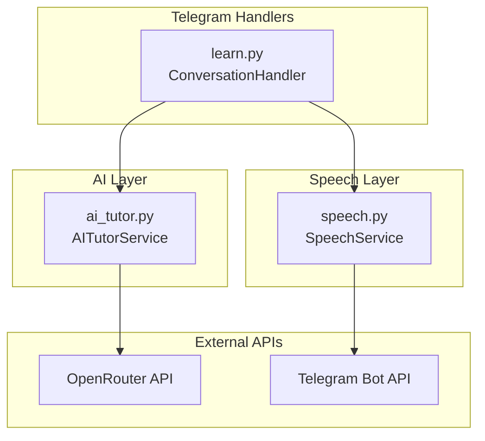
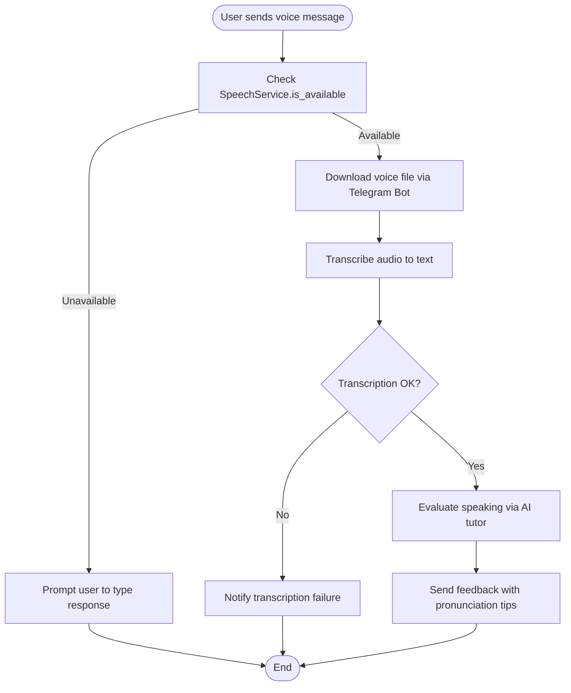
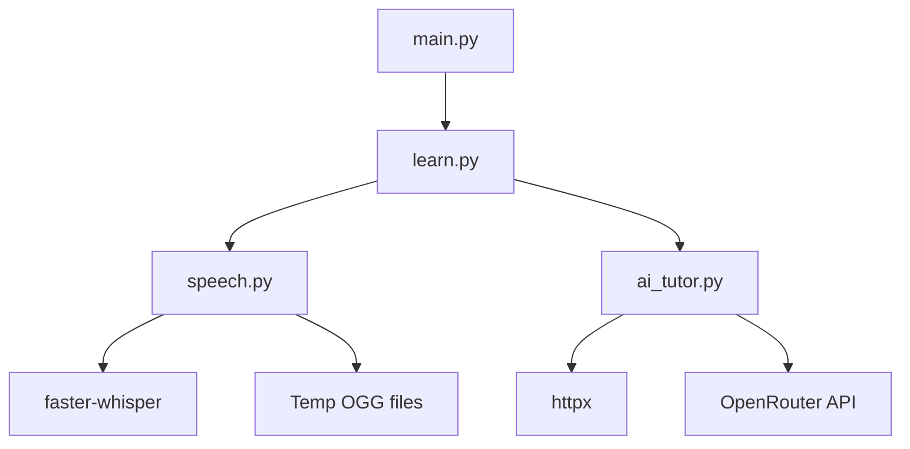

# Speech Service

<cite>
**Referenced Files in This Document**
- [speech.py](file://bot/services/speech.py)
- [ai_tutor.py](file://bot/services/ai_tutor.py)
- [learn.py](file://bot/handlers/learn.py)
- [config.py](file://bot/config.py)
- [main.py](file://bot/main.py)
- [requirements.txt](file://requirements.txt)
- [.gitignore](file://.gitignore)
</cite>

## Table of Contents
1. [Introduction](#introduction)
2. [Project Structure](#project-structure)
3. [Core Components](#core-components)
4. [Architecture Overview](#architecture-overview)
5. [Detailed Component Analysis](#detailed-component-analysis)
6. [Dependency Analysis](#dependency-analysis)
7. [Performance Considerations](#performance-considerations)
8. [Troubleshooting Guide](#troubleshooting-guide)
9. [Conclusion](#conclusion)
10. [Appendices](#appendices)

## Introduction
This document provides comprehensive API documentation for the Speech Service within the EthioGerman Language School Telegram bot. It covers voice message processing, speech-to-text conversion using faster-whisper, audio analysis capabilities, integration with the AI tutor service, and end-to-end workflows for pronunciation evaluation and speaking practice. It also documents configuration options, error handling, and performance optimization strategies.

## Project Structure
The Speech Service is part of the bot’s modular architecture:
- Services: Speech processing and AI tutoring
- Handlers: Telegram bot command and conversation handlers
- Configuration: Environment-driven settings
- Dependencies: External libraries for Telegram, AI APIs, and audio processing

**Diagram sources**
- [main.py](file://bot/main.py#L60-L88)
- [learn.py](file://bot/handlers/learn.py#L19-L23)
- [speech.py](file://bot/services/speech.py#L21-L43)
- [ai_tutor.py](file://bot/services/ai_tutor.py#L19-L31)
- [config.py](file://bot/config.py#L10-L23)

**Section sources**
- [main.py](file://bot/main.py#L60-L88)
- [learn.py](file://bot/handlers/learn.py#L19-L23)
- [speech.py](file://bot/services/speech.py#L21-L43)
- [ai_tutor.py](file://bot/services/ai_tutor.py#L19-L31)
- [config.py](file://bot/config.py#L10-L23)

## Core Components
- SpeechService: Provides asynchronous speech-to-text transcription for local audio files and Telegram voice messages. Uses faster-whisper with configurable model size and device settings.
- AITutorService: Integrates with OpenRouter API to evaluate written and spoken submissions, including pronunciation tips and fluency scoring.
- Telegram Handlers: Route voice messages to the SpeechService, then feed transcriptions into the AI tutor for evaluation and feedback.
- Configuration: Loads environment variables for API keys, model selection, and conversation history limits.

Key responsibilities:
- Audio ingestion and temporary storage for voice messages
- Transcription with language hints and VAD filtering
- Integration with AI tutor for pronunciation and fluency evaluation
- Graceful degradation when transcription is unavailable

**Section sources**
- [speech.py](file://bot/services/speech.py#L21-L43)
- [ai_tutor.py](file://bot/services/ai_tutor.py#L19-L31)
- [learn.py](file://bot/handlers/learn.py#L159-L232)
- [config.py](file://bot/config.py#L10-L23)

## Architecture Overview
The Speech Service participates in a two-stage pipeline:
1. Voice message ingestion and transcription
2. Pronunciation and fluency evaluation via the AI tutor

**Diagram sources**
- [learn.py](file://bot/handlers/learn.py#L159-L232)
- [speech.py](file://bot/services/speech.py#L83-L128)
- [ai_tutor.py](file://bot/services/ai_tutor.py#L82-L153)

## Detailed Component Analysis

### SpeechService API
The SpeechService exposes the following public interface for voice message processing and transcription:

- Method: transcribe_audio
  - Purpose: Transcribe an audio file to text
  - Parameters:
    - audio_path: str (path to OGG/WAV/MP3)
    - language: str (default "de")
  - Returns: Optional[str] (transcribed text or None)
  - Notes: Uses faster-whisper with beam_size and VAD filtering enabled

- Method: transcribe_telegram_voice
  - Purpose: Download a Telegram voice message and transcribe it
  - Parameters:
    - voice_file: Telegram Voice/Audio object
    - bot: Telegram Bot instance
  - Returns: Optional[str] (transcribed text or None)
  - Notes: Downloads to a temporary OGG file, cleans up after transcription

- Property: is_available
  - Purpose: Check if faster-whisper is available and model loaded
  - Returns: bool

- Method: get_status_message
  - Purpose: Human-readable status for voice support
  - Returns: str

Implementation highlights:
- Model loading with device="cpu" and compute_type="int8"
- Temporary file handling for Telegram voice downloads
- Logging for warnings and errors
- Graceful failure returning None when transcription is unavailable

**Section sources**
- [speech.py](file://bot/services/speech.py#L21-L43)
- [speech.py](file://bot/services/speech.py#L45-L81)
- [speech.py](file://bot/services/speech.py#L83-L128)
- [speech.py](file://bot/services/speech.py#L130-L136)

#### Class Diagram

**Diagram sources**
- [speech.py](file://bot/services/speech.py#L21-L43)
- [speech.py](file://bot/services/speech.py#L45-L81)
- [speech.py](file://bot/services/speech.py#L83-L128)
- [speech.py](file://bot/services/speech.py#L130-L136)

### AI Tutor Integration for Pronunciation Evaluation
The AI tutor evaluates speaking submissions by generating structured feedback and pronunciation tips. The relevant method is evaluate_speaking:

- Method: evaluate_speaking
  - Purpose: Evaluate a speaking submission (transcribed text)
  - Parameters:
    - transcribed_text: str
    - prompt: str (speaking task prompt)
    - level: str (CEFR level)
  - Returns: Dict[str, Any] (scores, feedback, pronunciation tips)
  - Notes: Calls OpenRouter API with a structured prompt and parses JSON response

Integration flow:
- The Telegram handler invokes evaluate_speaking after successful transcription
- The AI tutor returns scores for grammar, vocabulary, task completion, and fluency
- Additional fields include strengths, suggestions, and pronunciation tips

**Section sources**
- [ai_tutor.py](file://bot/services/ai_tutor.py#L239-L325)
- [learn.py](file://bot/handlers/learn.py#L159-L232)

#### Sequence Diagram: Voice-to-Evaluation

**Diagram sources**
- [learn.py](file://bot/handlers/learn.py#L159-L232)
- [speech.py](file://bot/services/speech.py#L83-L128)
- [ai_tutor.py](file://bot/services/ai_tutor.py#L239-L325)

### Audio Analysis Capabilities
- Transcription accuracy settings:
  - beam_size: tuned for balanced speed and accuracy
  - vad_filter: removes non-speech segments to improve focus
  - language hint: improves accuracy for target language
- Audio format handling:
  - Telegram voice messages are downloaded as OGG
  - The service expects OGG/WAV/MP3 for direct file transcription
- Preprocessing:
  - No explicit noise reduction or audio normalization is implemented
  - VAD filtering helps reduce background noise impact

**Section sources**
- [speech.py](file://bot/services/speech.py#L64-L71)
- [speech.py](file://bot/services/speech.py#L103-L111)

### Configuration Options
Environment variables and configuration:
- OPENROUTER_API_KEY and OPENROUTER_API_URL for AI tutor
- AI_MODEL for OpenRouter model selection
- MAX_CONVERSATION_HISTORY for context window
- TELEGRAM_BOT_TOKEN for bot authentication
- SUPABASE_URL and SUPABASE_KEY for database operations

Runtime configuration:
- SpeechService model_size defaults to "base"; device="cpu" and compute_type="int8"
- Conversation history length controlled by MAX_CONVERSATION_HISTORY

**Section sources**
- [config.py](file://bot/config.py#L10-L23)
- [config.py](file://bot/config.py#L38-L38)
- [speech.py](file://bot/services/speech.py#L24-L35)

## Architecture Overview
The Speech Service integrates with the Telegram bot and AI tutor as follows:

**Diagram sources**
- [learn.py](file://bot/handlers/learn.py#L292-L314)
- [speech.py](file://bot/services/speech.py#L21-L43)
- [ai_tutor.py](file://bot/services/ai_tutor.py#L19-L31)

## Detailed Component Analysis

### Voice Message Processing Workflow
End-to-end flow for voice messages:
1. User sends a voice message
2. Telegram MessageHandler routes to the conversation handler
3. If transcription is available, the handler downloads the voice file and transcribes it
4. The transcribed text is passed to the AI tutor for evaluation
5. The handler responds with feedback and pronunciation tips

**Diagram sources**
- [learn.py](file://bot/handlers/learn.py#L159-L232)
- [speech.py](file://bot/services/speech.py#L83-L128)
- [ai_tutor.py](file://bot/services/ai_tutor.py#L239-L325)

**Section sources**
- [learn.py](file://bot/handlers/learn.py#L159-L232)
- [speech.py](file://bot/services/speech.py#L83-L128)
- [ai_tutor.py](file://bot/services/ai_tutor.py#L239-L325)

### Transcription Extraction API
Method signature:
- transcribe_audio(audio_path: str, language: str = "de") -> Optional[str]

Behavior:
- Validates availability of the SpeechService
- Invokes faster-whisper with language hint, beam size, and VAD filtering
- Concatenates transcription segments into a single text
- Returns None on failure and logs errors

**Section sources**
- [speech.py](file://bot/services/speech.py#L45-L81)

### Pronunciation Evaluation API
Method signature:
- evaluate_speaking(transcribed_text: str, prompt: str, level: str) -> Dict[str, Any]

Behavior:
- Builds a structured prompt for pronunciation and fluency evaluation
- Calls OpenRouter API with temperature and token limits
- Parses JSON response and returns standardized evaluation fields
- Returns default evaluation on API or parsing errors

**Section sources**
- [ai_tutor.py](file://bot/services/ai_tutor.py#L239-L325)

### Audio Format Handling
- Telegram voice messages are downloaded as OGG
- Temporary OGG files are created and cleaned up after transcription
- The service expects OGG/WAV/MP3 for direct file transcription

**Section sources**
- [speech.py](file://bot/services/speech.py#L107-L111)
- [.gitignore](file://.gitignore#L45-L49)

## Dependency Analysis
External dependencies and their roles:
- python-telegram-bot: Telegram bot framework
- faster-whisper: On-device speech-to-text engine
- pydub: Audio processing library (present in requirements)
- httpx: Async HTTP client for OpenRouter API
- python-dotenv: Environment variable loading

**Diagram sources**
- [speech.py](file://bot/services/speech.py#L12-L18)
- [requirements.txt](file://requirements.txt#L1-L7)
- [ai_tutor.py](file://bot/services/ai_tutor.py#L5-L6)
- [main.py](file://bot/main.py#L22-L26)
- [learn.py](file://bot/handlers/learn.py#L18-L22)

**Section sources**
- [requirements.txt](file://requirements.txt#L1-L7)
- [speech.py](file://bot/services/speech.py#L12-L18)
- [ai_tutor.py](file://bot/services/ai_tutor.py#L5-L6)
- [main.py](file://bot/main.py#L22-L26)
- [learn.py](file://bot/handlers/learn.py#L18-L22)

## Performance Considerations
- Model size and device:
  - SpeechService uses a CPU-based model with int8 compute type for broad compatibility
  - Larger model sizes increase accuracy but may slow processing
- Beam size and VAD:
  - beam_size=5 balances speed and accuracy
  - vad_filter=True reduces non-speech segments and improves focus
- Memory and cleanup:
  - Temporary OGG files are created and removed after transcription
  - Ensure sufficient disk space for temporary files
- Network timeouts:
  - AI tutor requests use timeouts to prevent hanging
- Recommendations:
  - Consider GPU acceleration if available (device="cuda")
  - Monitor disk usage for temporary audio files
  - Batch processing voice messages if throughput increases

[No sources needed since this section provides general guidance]

## Troubleshooting Guide
Common issues and resolutions:
- faster-whisper not installed:
  - Symptom: Warning logged and transcription disabled
  - Resolution: Install faster-whisper and restart the bot
- Transcription failures:
  - Symptom: Error logged and None returned
  - Resolution: Verify audio format and language setting; retry with clearer audio
- Telegram voice download errors:
  - Symptom: Exception during file download
  - Resolution: Check network connectivity and Telegram API access
- AI tutor API errors:
  - Symptom: HTTP errors or timeouts
  - Resolution: Verify OpenRouter API key and URL; retry later
- Unsupported audio formats:
  - Symptom: Transcription returns None for certain formats
  - Resolution: Convert to OGG/WAV/MP3 before direct file transcription

**Section sources**
- [speech.py](file://bot/services/speech.py#L12-L18)
- [speech.py](file://bot/services/speech.py#L79-L81)
- [speech.py](file://bot/services/speech.py#L118-L120)
- [ai_tutor.py](file://bot/services/ai_tutor.py#L140-L152)

## Conclusion
The Speech Service provides robust voice message processing powered by faster-whisper, seamlessly integrated with the AI tutor for pronunciation and fluency evaluation. Its design emphasizes reliability, graceful degradation, and clear error handling. By tuning model size, device, and VAD settings, developers can balance accuracy and performance. The modular architecture allows for future enhancements such as audio preprocessing and GPU acceleration.

[No sources needed since this section summarizes without analyzing specific files]

## Appendices

### API Reference Summary
- SpeechService
  - transcribe_audio(audio_path: str, language: str = "de") -> Optional[str]
  - transcribe_telegram_voice(voice_file, bot) -> Optional[str]
  - is_available: bool property
  - get_status_message() -> str
- AITutorService
  - evaluate_speaking(transcribed_text: str, prompt: str, level: str) -> Dict[str, Any]

**Section sources**
- [speech.py](file://bot/services/speech.py#L45-L136)
- [ai_tutor.py](file://bot/services/ai_tutor.py#L239-L325)