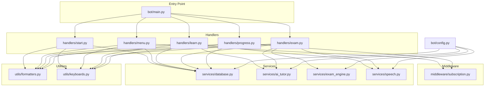
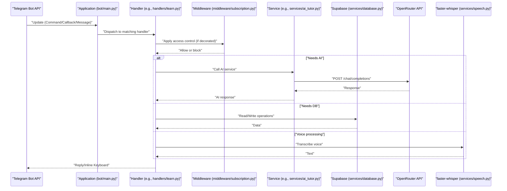
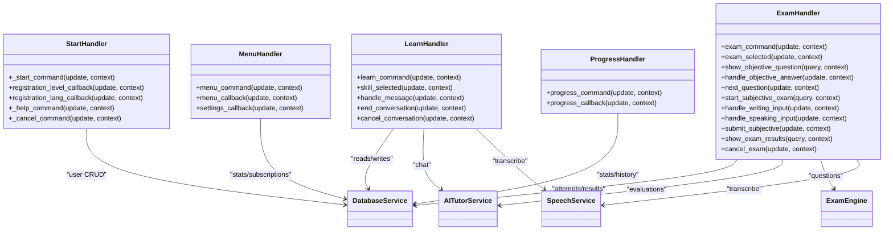
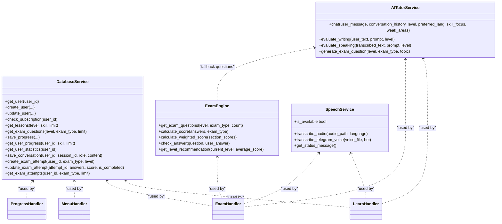
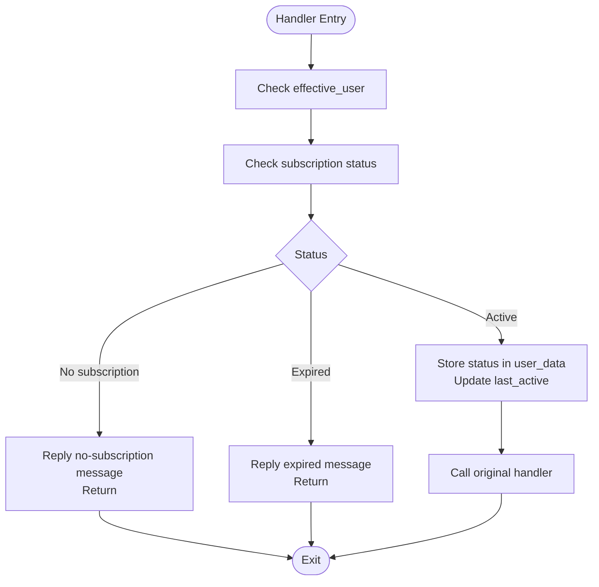
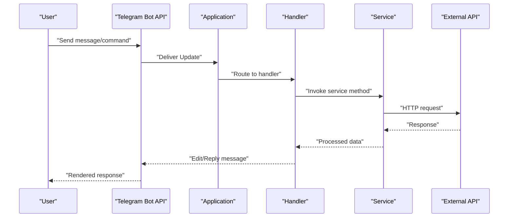
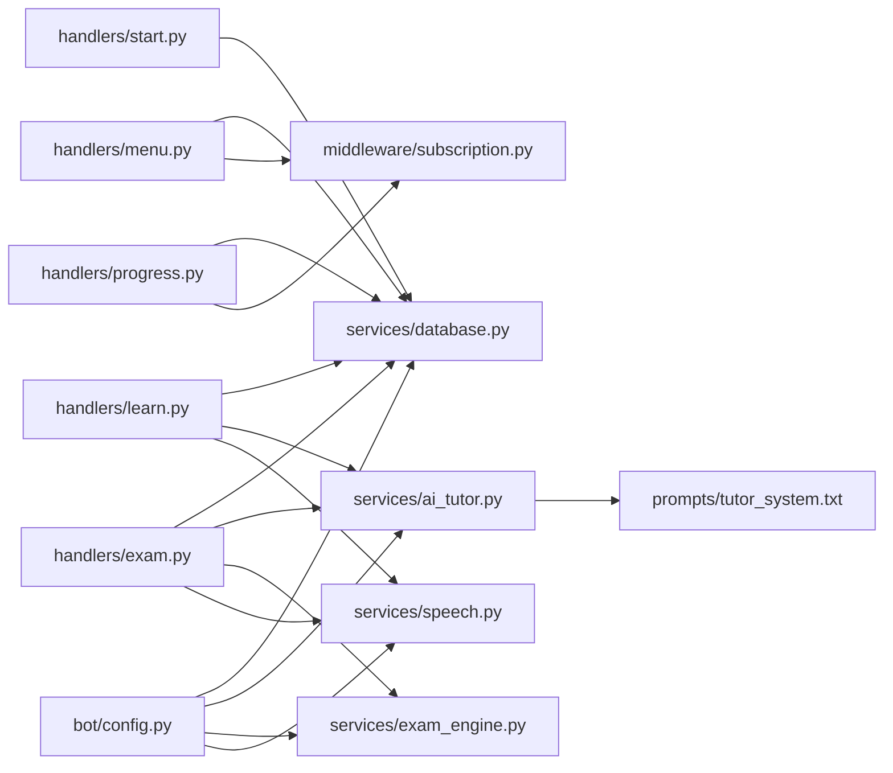

# Architecture & Design

<cite>
**Referenced Files in This Document**
- [bot/main.py](file://bot/main.py)
- [bot/config.py](file://bot/config.py)
- [bot/handlers/__init__.py](file://bot/handlers/__init__.py)
- [bot/handlers/start.py](file://bot/handlers/start.py)
- [bot/handlers/menu.py](file://bot/handlers/menu.py)
- [bot/handlers/learn.py](file://bot/handlers/learn.py)
- [bot/handlers/exam.py](file://bot/handlers/exam.py)
- [bot/handlers/progress.py](file://bot/handlers/progress.py)
- [bot/middleware/__init__.py](file://bot/middleware/__init__.py)
- [bot/middleware/subscription.py](file://bot/middleware/subscription.py)
- [bot/services/__init__.py](file://bot/services/__init__.py)
- [bot/services/database.py](file://bot/services/database.py)
- [bot/services/ai_tutor.py](file://bot/services/ai_tutor.py)
- [bot/services/exam_engine.py](file://bot/services/exam_engine.py)
- [bot/services/speech.py](file://bot/services/speech.py)
- [bot/utils/formatters.py](file://bot/utils/formatters.py)
- [bot/utils/keyboards.py](file://bot/utils/keyboards.py)
- [prompts/tutor_system.txt](file://prompts/tutor_system.txt)
</cite>

## Table of Contents
1. [Introduction](#introduction)
2. [Project Structure](#project-structure)
3. [Core Components](#core-components)
4. [Architecture Overview](#architecture-overview)
5. [Detailed Component Analysis](#detailed-component-analysis)
6. [Dependency Analysis](#dependency-analysis)
7. [Performance Considerations](#performance-considerations)
8. [Troubleshooting Guide](#troubleshooting-guide)
9. [Conclusion](#conclusion)
10. [Appendices](#appendices)

## Introduction
This document describes the system architecture of the FebEGLS-bot, an event-driven Telegram bot implementing a Handler pattern for command processing, a Service layer for external integrations, and a Middleware pattern for access control. The bot integrates with the Telegram Bot API, OpenRouter, Supabase, and faster-whisper. It emphasizes modularity, separation of concerns, and clear component boundaries to enable scalability, maintainability, and robust error handling.

## Project Structure
The project is organized into distinct layers:
- Entry point initializes the Telegram Application, registers handlers, and sets up logging.
- Handlers encapsulate Telegram command and callback logic, delegating business logic to Services and Utilities.
- Middleware enforces cross-cutting access control policies.
- Services abstract external integrations (database, AI, speech, exam generation).
- Utilities provide shared formatting and keyboard builders.
- Configuration centralizes environment variables and constants.

**Diagram sources**
- [bot/main.py](file://bot/main.py#L60-L88)
- [bot/handlers/start.py](file://bot/handlers/start.py#L16-L168)
- [bot/handlers/menu.py](file://bot/handlers/menu.py#L17-L183)
- [bot/handlers/learn.py](file://bot/handlers/learn.py#L30-L314)
- [bot/handlers/exam.py](file://bot/handlers/exam.py#L31-L522)
- [bot/handlers/progress.py](file://bot/handlers/progress.py#L17-L98)
- [bot/middleware/subscription.py](file://bot/middleware/subscription.py#L47-L137)
- [bot/services/database.py](file://bot/services/database.py#L16-L415)
- [bot/services/ai_tutor.py](file://bot/services/ai_tutor.py#L19-L450)
- [bot/services/exam_engine.py](file://bot/services/exam_engine.py#L15-L210)
- [bot/services/speech.py](file://bot/services/speech.py#L21-L139)
- [bot/utils/formatters.py](file://bot/utils/formatters.py)
- [bot/utils/keyboards.py](file://bot/utils/keyboards.py)
- [bot/config.py](file://bot/config.py#L10-L59)

**Section sources**
- [bot/main.py](file://bot/main.py#L60-L88)
- [bot/config.py](file://bot/config.py#L10-L59)
- [bot/handlers/__init__.py](file://bot/handlers/__init__.py#L1-L19)
- [bot/middleware/__init__.py](file://bot/middleware/__init__.py#L1-L4)
- [bot/services/__init__.py](file://bot/services/__init__.py#L1-L7)

## Core Components
- Handler pattern: Telegram commands and callbacks are implemented as discrete handlers that orchestrate user sessions and delegate to Services and Utilities.
- Service layer: Encapsulates external integrations behind typed services with clear responsibilities:
  - DatabaseService: Supabase operations for users, lessons, progress, conversations, and exam attempts.
  - AITutorService: OpenRouter integration for tutoring, evaluations, and dynamic question generation.
  - ExamEngine: Question selection, scoring, and level recommendations.
  - SpeechService: faster-whisper integration for voice transcription.
- Middleware pattern: Access control enforced centrally via decorators that validate subscriptions and inject warnings into user contexts.
- Utilities: Shared formatting and keyboard builders used across handlers.

**Section sources**
- [bot/handlers/start.py](file://bot/handlers/start.py#L16-L168)
- [bot/handlers/menu.py](file://bot/handlers/menu.py#L17-L183)
- [bot/handlers/learn.py](file://bot/handlers/learn.py#L30-L314)
- [bot/handlers/exam.py](file://bot/handlers/exam.py#L31-L522)
- [bot/handlers/progress.py](file://bot/handlers/progress.py#L17-L98)
- [bot/middleware/subscription.py](file://bot/middleware/subscription.py#L47-L156)
- [bot/services/database.py](file://bot/services/database.py#L16-L415)
- [bot/services/ai_tutor.py](file://bot/services/ai_tutor.py#L19-L450)
- [bot/services/exam_engine.py](file://bot/services/exam_engine.py#L15-L210)
- [bot/services/speech.py](file://bot/services/speech.py#L21-L139)
- [bot/utils/formatters.py](file://bot/utils/formatters.py)
- [bot/utils/keyboards.py](file://bot/utils/keyboards.py)

## Architecture Overview
The system follows an event-driven architecture powered by python-telegram-bot. The Application polls for updates and routes them to registered handlers. Handlers coordinate user sessions, maintain conversational state in user_data, and delegate to Services for external operations. Middleware intercepts requests to enforce access control. Logging is configured globally, and configuration is centralized.

**Diagram sources**
- [bot/main.py](file://bot/main.py#L60-L88)
- [bot/handlers/learn.py](file://bot/handlers/learn.py#L159-L232)
- [bot/middleware/subscription.py](file://bot/middleware/subscription.py#L47-L101)
- [bot/services/ai_tutor.py](file://bot/services/ai_tutor.py#L82-L153)
- [bot/services/database.py](file://bot/services/database.py#L24-L103)
- [bot/services/speech.py](file://bot/services/speech.py#L83-L129)

## Detailed Component Analysis

### Handler Pattern: Telegram Command Processing
Handlers register Telegram CommandHandler and CallbackQueryHandler entries and manage conversational flows. They:
- Validate user state and subscription status.
- Interact with Services for data and AI operations.
- Use Utilities for consistent formatting and keyboard layouts.
- Manage session state in user_data for multi-step flows.

**Diagram sources**
- [bot/handlers/learn.py](file://bot/handlers/learn.py#L30-L314)
- [bot/handlers/exam.py](file://bot/handlers/exam.py#L31-L522)
- [bot/handlers/start.py](file://bot/handlers/start.py#L16-L168)
- [bot/handlers/menu.py](file://bot/handlers/menu.py#L17-L183)
- [bot/handlers/progress.py](file://bot/handlers/progress.py#L17-L98)
- [bot/services/database.py](file://bot/services/database.py#L16-L415)
- [bot/services/ai_tutor.py](file://bot/services/ai_tutor.py#L19-L450)
- [bot/services/exam_engine.py](file://bot/services/exam_engine.py#L15-L210)
- [bot/services/speech.py](file://bot/services/speech.py#L21-L139)

**Section sources**
- [bot/handlers/learn.py](file://bot/handlers/learn.py#L26-L314)
- [bot/handlers/exam.py](file://bot/handlers/exam.py#L28-L522)
- [bot/handlers/start.py](file://bot/handlers/start.py#L16-L168)
- [bot/handlers/menu.py](file://bot/handlers/menu.py#L17-L183)
- [bot/handlers/progress.py](file://bot/handlers/progress.py#L17-L98)

### Service Layer: External Integrations
Services encapsulate external dependencies and provide a stable interface for Handlers.

- DatabaseService (Supabase):
  - User lifecycle, subscriptions, lessons, progress, conversations, and exam attempts.
  - Centralized error logging and safe defaults.
- AITutorService (OpenRouter):
  - Chat tutoring with configurable system prompts and conversation history.
  - Writing and speaking evaluations returning structured JSON.
  - Dynamic question generation for exams.
- ExamEngine:
  - Question retrieval with fallback to AI generation.
  - Scoring and weak-area analysis.
- SpeechService (faster-whisper):
  - Voice transcription with graceful degradation when unavailable.

**Diagram sources**
- [bot/services/database.py](file://bot/services/database.py#L16-L415)
- [bot/services/ai_tutor.py](file://bot/services/ai_tutor.py#L19-L450)
- [bot/services/exam_engine.py](file://bot/services/exam_engine.py#L15-L210)
- [bot/services/speech.py](file://bot/services/speech.py#L21-L139)
- [bot/handlers/learn.py](file://bot/handlers/learn.py#L159-L232)
- [bot/handlers/exam.py](file://bot/handlers/exam.py#L358-L416)

**Section sources**
- [bot/services/database.py](file://bot/services/database.py#L16-L415)
- [bot/services/ai_tutor.py](file://bot/services/ai_tutor.py#L19-L450)
- [bot/services/exam_engine.py](file://bot/services/exam_engine.py#L15-L210)
- [bot/services/speech.py](file://bot/services/speech.py#L21-L139)

### Middleware Pattern: Access Control
The subscription middleware enforces access control for paid features:
- Decorators wrap handlers to check subscription status before execution.
- Subscription status and expiry are injected into user_data for downstream use.
- Special exemptions apply to specific commands.

**Diagram sources**
- [bot/middleware/subscription.py](file://bot/middleware/subscription.py#L47-L101)

**Section sources**
- [bot/middleware/subscription.py](file://bot/middleware/subscription.py#L17-L156)
- [bot/handlers/menu.py](file://bot/handlers/menu.py#L17-L183)
- [bot/handlers/progress.py](file://bot/handlers/progress.py#L17-L98)
- [bot/handlers/learn.py](file://bot/handlers/learn.py#L30-L50)

### Event-Driven Data Flow
The bot’s runtime is driven by Telegram updates. Handlers receive updates, manage state, and call Services. Responses are sent back to users with inline keyboards and formatted text.

**Diagram sources**
- [bot/main.py](file://bot/main.py#L60-L88)
- [bot/handlers/learn.py](file://bot/handlers/learn.py#L205-L232)
- [bot/services/ai_tutor.py](file://bot/services/ai_tutor.py#L127-L145)

## Dependency Analysis
- Handlers depend on Services and Utilities; Services depend on configuration and external APIs.
- Middleware depends on Services for subscription checks.
- Configuration is consumed by Services and Handlers to configure clients and constants.
- There is no circular dependency among modules; dependencies are unidirectional from Handlers → Services → External APIs.

**Diagram sources**
- [bot/handlers/start.py](file://bot/handlers/start.py#L9-L11)
- [bot/handlers/menu.py](file://bot/handlers/menu.py#L9-L12)
- [bot/handlers/learn.py](file://bot/handlers/learn.py#L17-L22)
- [bot/handlers/exam.py](file://bot/handlers/exam.py#L17-L23)
- [bot/handlers/progress.py](file://bot/handlers/progress.py#L9-L12)
- [bot/middleware/subscription.py](file://bot/middleware/subscription.py#L13)
- [bot/services/database.py](file://bot/services/database.py#L10-L11)
- [bot/services/ai_tutor.py](file://bot/services/ai_tutor.py#L11)
- [bot/services/exam_engine.py](file://bot/services/exam_engine.py#L9-L10)
- [bot/services/speech.py](file://bot/services/speech.py#L14-L18)
- [bot/config.py](file://bot/config.py#L17-L23)
- [prompts/tutor_system.txt](file://prompts/tutor_system.txt)

**Section sources**
- [bot/handlers/__init__.py](file://bot/handlers/__init__.py#L1-L19)
- [bot/middleware/__init__.py](file://bot/middleware/__init__.py#L1-L4)
- [bot/services/__init__.py](file://bot/services/__init__.py#L1-L7)

## Performance Considerations
- Asynchronous design: Handlers and Services use async/await to minimize blocking and improve concurrency under Telegram’s polling model.
- External API timeouts: AI and database operations specify timeouts to prevent stalls; failures are handled gracefully with user-friendly messages.
- Conversation history limits: AI requests truncate conversation history to reduce latency and cost.
- Speech transcription availability: Graceful degradation when faster-whisper is unavailable; handlers adapt messaging accordingly.
- Logging: Global logging reduces overhead and improves observability; noisy third-party loggers are suppressed.

[No sources needed since this section provides general guidance]

## Troubleshooting Guide
- Error handling:
  - Global error handler logs exceptions and attempts to notify users.
  - Service methods catch and log exceptions, returning safe default responses.
- Subscription issues:
  - Middleware blocks unauthorized access and informs users; handlers also check subscription before proceeding.
- Database connectivity:
  - Service methods return None or empty lists on failure; Handlers fall back to safe states.
- AI API failures:
  - Service methods return pre-defined fallback messages and log errors.
- Speech transcription:
  - Service logs warnings when unavailable; Handlers provide alternative input methods.

**Section sources**
- [bot/main.py](file://bot/main.py#L45-L58)
- [bot/services/database.py](file://bot/services/database.py#L29-L31)
- [bot/services/ai_tutor.py](file://bot/services/ai_tutor.py#L147-L152)
- [bot/middleware/subscription.py](file://bot/middleware/subscription.py#L68-L98)
- [bot/services/speech.py](file://bot/services/speech.py#L17-L18)

## Conclusion
FebEGLS-bot employs a clean, modular architecture leveraging the Handler, Service, and Middleware patterns. The event-driven design, centralized configuration, and robust error handling enable scalable development and reliable operation across Telegram, OpenRouter, Supabase, and speech processing integrations. The separation of concerns ensures maintainability and facilitates future enhancements.

## Appendices
- Configuration keys and defaults are validated at import time and consumed by Services and Handlers.
- Utilities provide reusable UI components and formatting helpers to keep Handlers concise and consistent.

**Section sources**
- [bot/config.py](file://bot/config.py#L40-L59)
- [bot/utils/formatters.py](file://bot/utils/formatters.py)
- [bot/utils/keyboards.py](file://bot/utils/keyboards.py)