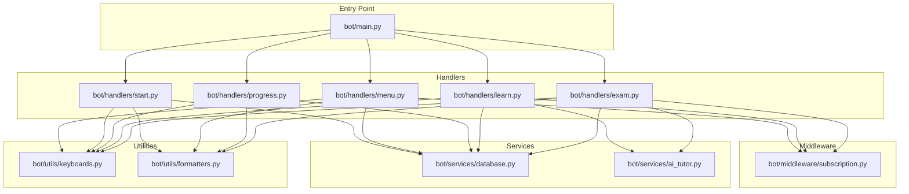
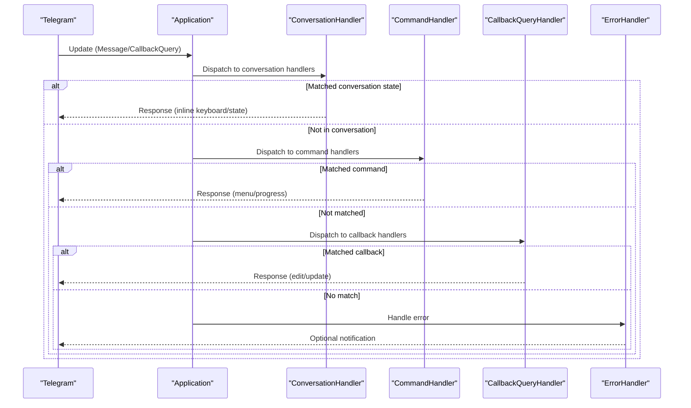
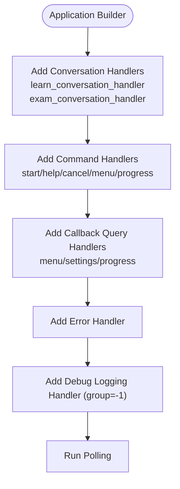
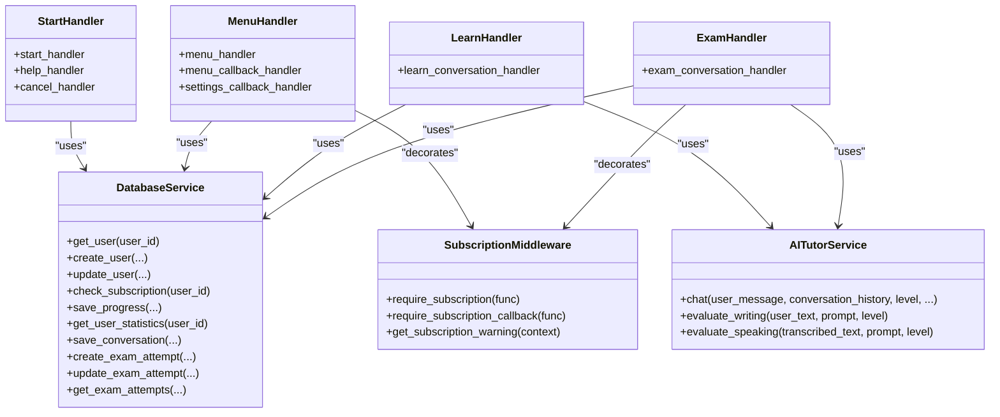
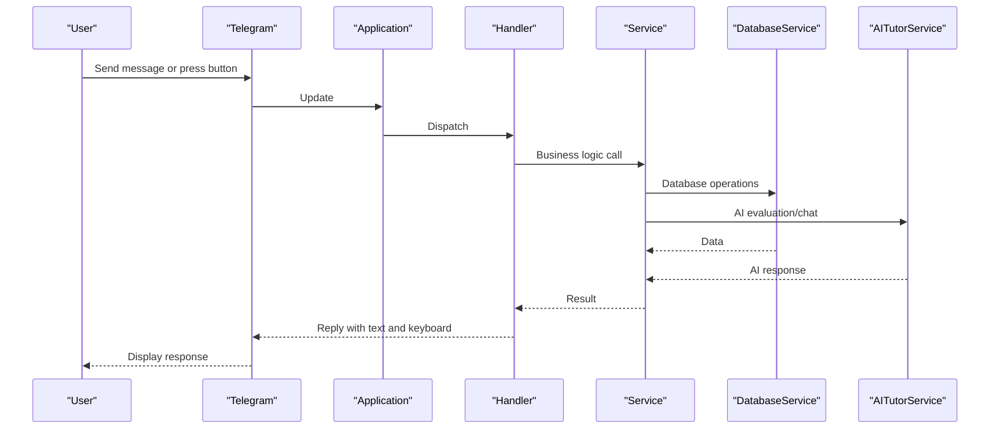
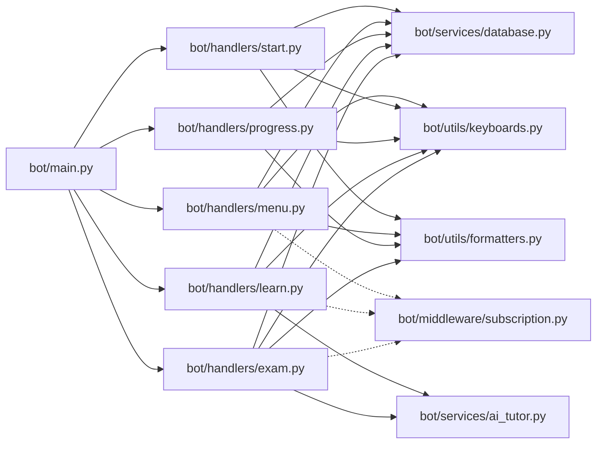

# Handler Pattern Implementation

<cite>
**Referenced Files in This Document**
- [bot/main.py](file://bot/main.py)
- [bot/handlers/__init__.py](file://bot/handlers/__init__.py)
- [bot/handlers/start.py](file://bot/handlers/start.py)
- [bot/handlers/menu.py](file://bot/handlers/menu.py)
- [bot/handlers/learn.py](file://bot/handlers/learn.py)
- [bot/handlers/exam.py](file://bot/handlers/exam.py)
- [bot/handlers/progress.py](file://bot/handlers/progress.py)
- [bot/middleware/subscription.py](file://bot/middleware/subscription.py)
- [bot/utils/keyboards.py](file://bot/utils/keyboards.py)
- [bot/utils/formatters.py](file://bot/utils/formatters.py)
- [bot/services/database.py](file://bot/services/database.py)
- [bot/services/ai_tutor.py](file://bot/services/ai_tutor.py)
- [bot/config.py](file://bot/config.py)
</cite>

## Table of Contents
1. [Introduction](#introduction)
2. [Project Structure](#project-structure)
3. [Core Components](#core-components)
4. [Architecture Overview](#architecture-overview)
5. [Detailed Component Analysis](#detailed-component-analysis)
6. [Dependency Analysis](#dependency-analysis)
7. [Performance Considerations](#performance-considerations)
8. [Troubleshooting Guide](#troubleshooting-guide)
9. [Conclusion](#conclusion)

## Introduction
This document explains the Handler pattern implementation in the FebEGLS-bot Telegram bot. It covers how Telegram command handlers, callback query handlers, and conversation handlers are structured and integrated. It documents the handler registration process in the main entry point, the separation of concerns among command handlers, conversation handlers, and callback handlers, and the relationship between handlers and services. It also details error handling, parameter handling, response generation, and the flow from Telegram updates to business logic execution.

## Project Structure
The bot follows a modular structure organized by feature areas:
- bot/main.py: Entry point and handler registration
- bot/handlers/: Feature-specific handlers (start, menu, learn, exam, progress)
- bot/middleware/: Cross-cutting concerns (subscription checks)
- bot/services/: Business logic and external integrations (database, AI tutor, speech)
- bot/utils/: Utilities for keyboards and message formatting
- bot/config.py: Centralized configuration

**Diagram sources**
- [bot/main.py](file://bot/main.py#L60-L101)
- [bot/handlers/start.py](file://bot/handlers/start.py#L1-L182)
- [bot/handlers/menu.py](file://bot/handlers/menu.py#L1-L184)
- [bot/handlers/learn.py](file://bot/handlers/learn.py#L1-L315)
- [bot/handlers/exam.py](file://bot/handlers/exam.py#L1-L523)
- [bot/handlers/progress.py](file://bot/handlers/progress.py#L1-L99)
- [bot/middleware/subscription.py](file://bot/middleware/subscription.py#L1-L156)
- [bot/services/database.py](file://bot/services/database.py#L1-L416)
- [bot/services/ai_tutor.py](file://bot/services/ai_tutor.py#L1-L451)
- [bot/utils/keyboards.py](file://bot/utils/keyboards.py#L1-L183)
- [bot/utils/formatters.py](file://bot/utils/formatters.py#L1-L300)

**Section sources**
- [bot/main.py](file://bot/main.py#L1-L106)
- [bot/handlers/__init__.py](file://bot/handlers/__init__.py#L1-L19)

## Core Components
- CommandHandler: Handles commands like /start, /help, /cancel, /menu, /progress, and entry points for conversations (/learn, /exam).
- CallbackQueryHandler: Handles inline keyboard interactions for navigation, settings, progress actions, and conversation steps.
- ConversationHandler: Manages multi-step workflows for learning and exam sessions with distinct states and transitions.

Key handler exports and patterns:
- Command handlers export CommandHandler instances for commands.
- Callback handlers export CallbackQueryHandler instances with pattern filters.
- Conversation handlers export ConversationHandler instances with entry_points, states, and fallbacks.

**Section sources**
- [bot/handlers/start.py](file://bot/handlers/start.py#L177-L182)
- [bot/handlers/menu.py](file://bot/handlers/menu.py#L181-L184)
- [bot/handlers/learn.py](file://bot/handlers/learn.py#L292-L315)
- [bot/handlers/exam.py](file://bot/handlers/exam.py#L489-L523)
- [bot/handlers/progress.py](file://bot/handlers/progress.py#L97-L99)

## Architecture Overview
The bot registers handlers in a specific order to ensure proper precedence:
1. Conversation handlers are registered first because they must intercept updates before other handlers.
2. Command handlers are registered next.
3. Callback query handlers are registered last.
4. An error handler is registered globally.
5. A debug logging handler is added with a negative group to receive all updates before other handlers.

**Diagram sources**
- [bot/main.py](file://bot/main.py#L67-L84)
- [bot/handlers/learn.py](file://bot/handlers/learn.py#L292-L315)
- [bot/handlers/exam.py](file://bot/handlers/exam.py#L489-L523)

**Section sources**
- [bot/main.py](file://bot/main.py#L60-L101)

## Detailed Component Analysis

### Handler Registration Order and Priority
- Conversation handlers are added first to ensure they can intercept updates intended for conversation states.
- Command handlers are added next to handle standalone commands.
- Callback query handlers are added last to handle navigation and settings interactions.
- An error handler is registered to centralize error reporting and user notifications.
- A debug logging handler is added with a negative group to receive all updates for debugging.

**Diagram sources**
- [bot/main.py](file://bot/main.py#L67-L94)

**Section sources**
- [bot/main.py](file://bot/main.py#L60-L101)

### Command Handlers: start, menu, help, progress
- start_handler: Processes /start, handles user registration flow, and manages subscription checks.
- help_handler: Sends help text using formatted messages.
- cancel_handler: Clears user state and returns to main menu.
- menu_handler: Displays main menu.
- progress_handler: Shows user progress and links to progress actions.

Parameter handling and response generation:
- All handlers accept Update and ContextTypes.DEFAULT_TYPE.
- Responses use reply_markup keyboards and formatted messages.
- Registration flow stores state in context.user_data.

**Section sources**
- [bot/handlers/start.py](file://bot/handlers/start.py#L16-L182)
- [bot/handlers/menu.py](file://bot/handlers/menu.py#L17-L25)
- [bot/handlers/progress.py](file://bot/handlers/progress.py#L17-L37)

### Conversation Handlers: learn, exam
- learn_conversation_handler: Manages AI tutoring sessions with states for skill selection and conversation.
- exam_conversation_handler: Manages exam simulations with states for objective and subjective exams.

States and transitions:
- learn: SELECTING_SKILL -> IN_CONVERSATION; fallbacks include /cancel and end conversation.
- exam: SELECTING_EXAM -> ANSWERING_OBJECTIVE -> WRITING_RESPONSE/SPEAKING_RESPONSE -> REVIEWING_RESULTS; fallbacks include /cancel and cancel callback.

Message and voice handling:
- Learn: Handles text and voice messages; integrates speech transcription and AI tutor evaluation.
- Exam: Handles text and voice for subjective exams; evaluates writing and speaking submissions.

**Section sources**
- [bot/handlers/learn.py](file://bot/handlers/learn.py#L26-L315)
- [bot/handlers/exam.py](file://bot/handlers/exam.py#L27-L523)

### Callback Query Handlers: navigation, settings, progress actions
- menu_callback_handler: Routes menu selections and handles subscription-required actions.
- settings_callback_handler: Updates user settings (level, language).
- progress_callback_handler: Provides progress insights and history.

Pattern-based routing:
- Uses callback_data patterns to route to specific handlers.
- Integrates with subscription middleware for access control.

**Section sources**
- [bot/handlers/menu.py](file://bot/handlers/menu.py#L27-L116)
- [bot/handlers/menu.py](file://bot/handlers/menu.py#L118-L178)
- [bot/handlers/progress.py](file://bot/handlers/progress.py#L39-L94)

### Relationship Between Handlers and Services
- Database service (db): Used across handlers for user data, progress, exam attempts, and subscription checks.
- AI tutor service (ai_tutor): Used in conversation handlers for chat responses and evaluation of writing/speaking.
- Middleware (require_subscription): Decorators enforce subscription checks for paid features.

**Diagram sources**
- [bot/services/database.py](file://bot/services/database.py#L16-L416)
- [bot/services/ai_tutor.py](file://bot/services/ai_tutor.py#L19-L451)
- [bot/middleware/subscription.py](file://bot/middleware/subscription.py#L47-L156)
- [bot/handlers/start.py](file://bot/handlers/start.py#L1-L182)
- [bot/handlers/menu.py](file://bot/handlers/menu.py#L1-L184)
- [bot/handlers/learn.py](file://bot/handlers/learn.py#L1-L315)
- [bot/handlers/exam.py](file://bot/handlers/exam.py#L1-L523)

**Section sources**
- [bot/services/database.py](file://bot/services/database.py#L1-L416)
- [bot/services/ai_tutor.py](file://bot/services/ai_tutor.py#L1-L451)
- [bot/middleware/subscription.py](file://bot/middleware/subscription.py#L1-L156)

### Error Handling Within Handlers
- Global error handler logs exceptions and attempts to notify users.
- Handlers include try/catch blocks around database and service calls.
- Subscription middleware provides user-friendly messages for subscription issues.

**Section sources**
- [bot/main.py](file://bot/main.py#L45-L58)
- [bot/handlers/start.py](file://bot/handlers/start.py#L81-L86)
- [bot/middleware/subscription.py](file://bot/middleware/subscription.py#L68-L99)

### Flow From Telegram Updates to Business Logic
- Telegram sends an Update (message or callback query).
- Application dispatches to handlers based on registration order and patterns.
- Handlers use context.user_data for state and context.bot for sending responses.
- Handlers delegate business logic to services (database, AI tutor).
- Responses include formatted text and inline keyboards.

**Diagram sources**
- [bot/main.py](file://bot/main.py#L60-L101)
- [bot/handlers/learn.py](file://bot/handlers/learn.py#L159-L233)
- [bot/handlers/exam.py](file://bot/handlers/exam.py#L295-L356)
- [bot/services/database.py](file://bot/services/database.py#L16-L416)
- [bot/services/ai_tutor.py](file://bot/services/ai_tutor.py#L82-L153)

## Dependency Analysis
- Handlers depend on:
  - Services for data persistence and AI evaluations.
  - Middleware for access control.
  - Utilities for consistent keyboards and formatting.
- Handlers are decoupled from each other via imports and exports in the handlers package.
- The main entry point orchestrates handler registration and global error handling.

**Diagram sources**
- [bot/main.py](file://bot/main.py#L21-L26)
- [bot/handlers/__init__.py](file://bot/handlers/__init__.py#L1-L5)

**Section sources**
- [bot/main.py](file://bot/main.py#L21-L26)
- [bot/handlers/__init__.py](file://bot/handlers/__init__.py#L1-L19)

## Performance Considerations
- Conversation handlers keep minimal state in context.user_data to reduce memory overhead.
- AI tutor requests use timeouts to prevent blocking; failures fall back to user-friendly messages.
- Database operations are asynchronous to avoid blocking the event loop.
- Keyboard generation is centralized to minimize repeated construction.

## Troubleshooting Guide
Common issues and resolutions:
- Subscription access denied: Handlers decorated with require_subscription return informative messages; verify subscription status via database service.
- Conversation state not progressing: Ensure callback_data patterns match handler patterns and that fallbacks are configured.
- AI tutor timeouts or errors: Check API keys and network connectivity; handlers return fallback messages.
- Database errors: Handlers catch exceptions and log errors; verify credentials and connection in configuration.

**Section sources**
- [bot/middleware/subscription.py](file://bot/middleware/subscription.py#L68-L99)
- [bot/services/ai_tutor.py](file://bot/services/ai_tutor.py#L147-L152)
- [bot/services/database.py](file://bot/services/database.py#L29-L31)
- [bot/main.py](file://bot/main.py#L45-L58)

## Conclusion
The FebEGLS-bot implements a clean Handler pattern with clear separation of concerns:
- Command handlers manage standalone commands.
- Conversation handlers orchestrate multi-step workflows.
- Callback handlers handle inline interactions and navigation.
- Middleware enforces access control.
- Services encapsulate business logic and external integrations.
- The main entry point registers handlers in priority order and centralizes error handling.

This structure enables maintainable, extensible bot functionality with robust error handling and consistent user experiences.