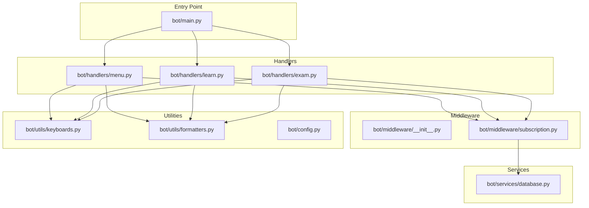
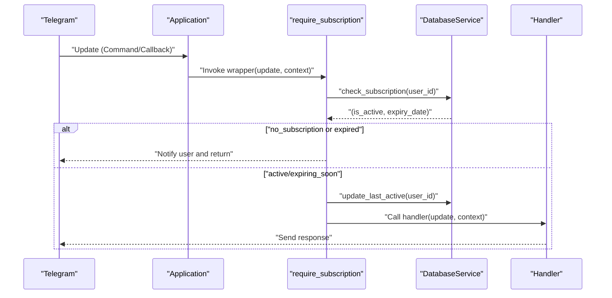
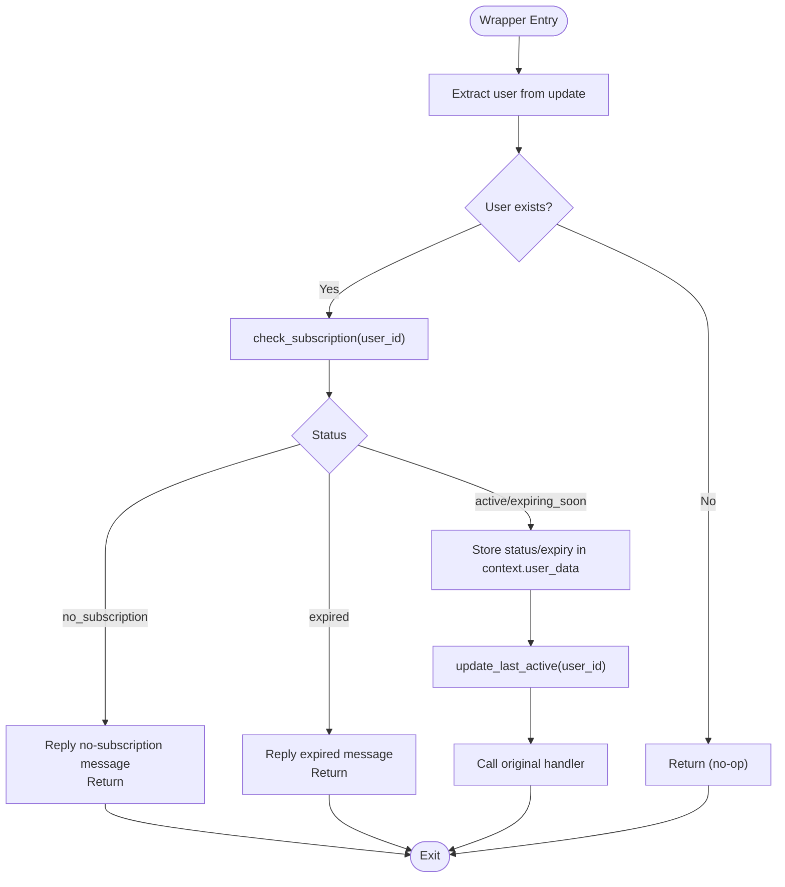
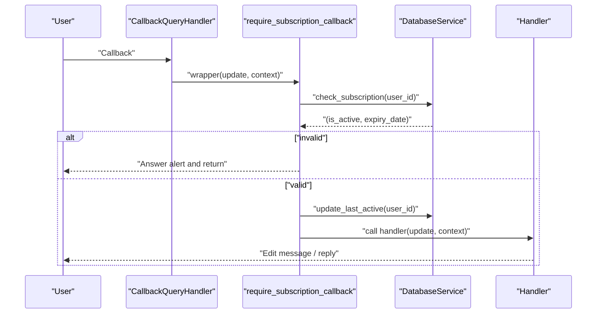
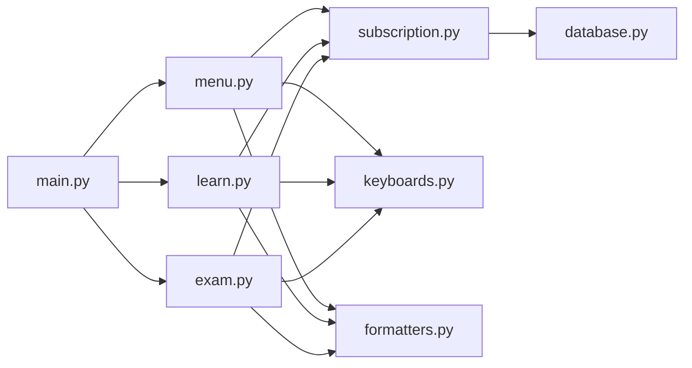

# Middleware & Cross-Cutting Concerns

<cite>
**Referenced Files in This Document**
- [main.py](file://bot/main.py)
- [subscription.py](file://bot/middleware/subscription.py)
- [__init__.py](file://bot/middleware/__init__.py)
- [menu.py](file://bot/handlers/menu.py)
- [learn.py](file://bot/handlers/learn.py)
- [exam.py](file://bot/handlers/exam.py)
- [database.py](file://bot/services/database.py)
- [keyboards.py](file://bot/utils/keyboards.py)
- [formatters.py](file://bot/utils/formatters.py)
- [config.py](file://bot/config.py)
</cite>

## Table of Contents
1. [Introduction](#introduction)
2. [Project Structure](#project-structure)
3. [Core Components](#core-components)
4. [Architecture Overview](#architecture-overview)
5. [Detailed Component Analysis](#detailed-component-analysis)
6. [Dependency Analysis](#dependency-analysis)
7. [Performance Considerations](#performance-considerations)
8. [Troubleshooting Guide](#troubleshooting-guide)
9. [Conclusion](#conclusion)

## Introduction
This document explains the middleware system and cross-cutting concerns in FebEGLS-bot, focusing on the subscription middleware that enforces access control before handler execution. It covers middleware registration and execution order, parameter handling, integration with the handler pipeline, and logging within middleware components. Concrete examples illustrate middleware function signatures, validation logic, and error responses.

## Project Structure
The middleware system resides under bot/middleware and integrates with handlers under bot/handlers. The main entry point registers handlers and error handling. Services under bot/services encapsulate data access and business logic. Utilities under bot/utils provide shared formatting and keyboard builders.

**Diagram sources**
- [main.py](file://bot/main.py#L60-L89)
- [subscription.py](file://bot/middleware/subscription.py#L47-L101)
- [menu.py](file://bot/handlers/menu.py#L17-L24)
- [learn.py](file://bot/handlers/learn.py#L20-L23)
- [exam.py](file://bot/handlers/exam.py#L21-L23)
- [database.py](file://bot/services/database.py#L79-L103)
- [keyboards.py](file://bot/utils/keyboards.py#L10-L183)
- [formatters.py](file://bot/utils/formatters.py#L8-L300)
- [config.py](file://bot/config.py#L10-L60)

**Section sources**
- [main.py](file://bot/main.py#L60-L89)
- [subscription.py](file://bot/middleware/subscription.py#L47-L101)
- [menu.py](file://bot/handlers/menu.py#L17-L24)
- [learn.py](file://bot/handlers/learn.py#L20-L23)
- [exam.py](file://bot/handlers/exam.py#L21-L23)

## Core Components
- Subscription middleware: Provides decorators to enforce subscription checks before handler execution and to surface subscription warnings to handlers.
- Handler integration: Handlers apply middleware decorators to protect paid features and to use subscription warnings for contextual messaging.
- Database service: Supplies subscription status and last-active updates used by middleware.
- Logging: Centralized logging in the main entry point and service methods.

Key responsibilities:
- Access control: Block unauthorized access to paid features.
- Parameter handling: Extract user identity from Telegram updates and pass context to handlers.
- Error propagation: Return early on invalid or expired subscriptions, preventing handler execution.
- Cross-cutting concerns: Store subscription metadata in user context for downstream handlers.

**Section sources**
- [subscription.py](file://bot/middleware/subscription.py#L21-L101)
- [database.py](file://bot/services/database.py#L79-L103)
- [main.py](file://bot/main.py#L28-L58)

## Architecture Overview
The middleware sits between Telegram’s handler pipeline and business logic. It validates subscription status, stores context, and either proceeds to the handler or halts execution with an appropriate response.

**Diagram sources**
- [subscription.py](file://bot/middleware/subscription.py#L47-L101)
- [database.py](file://bot/services/database.py#L79-L103)

## Detailed Component Analysis

### Subscription Middleware
The middleware module exports two primary decorators and a helper:
- require_subscription: Guards command handlers.
- require_subscription_callback: Guards callback query handlers.
- check_subscription: Performs subscription validation and returns status metadata.
- get_subscription_warning: Builds a contextual reminder for expiring subscriptions.

Execution model:
- Extract user identity from the update.
- Validate subscription via database service.
- On failure, send a user-facing message/alert and return.
- On success, store subscription status and expiry in context.user_data, update last active, then call the handler.

**Diagram sources**
- [subscription.py](file://bot/middleware/subscription.py#L47-L101)
- [database.py](file://bot/services/database.py#L79-L103)

**Section sources**
- [subscription.py](file://bot/middleware/subscription.py#L21-L101)
- [subscription.py](file://bot/middleware/subscription.py#L104-L137)
- [subscription.py](file://bot/middleware/subscription.py#L140-L156)

### Handler Integration Patterns
- Command handlers decorated with require_subscription:
  - Example: menu command decorator usage.
  - Behavior: If subscription fails, the wrapper replies and handler is not executed.

- Callback query handlers using require_subscription_callback:
  - Example: Learn and Exam handlers demonstrate subscription checks for interactive flows.

- Context usage:
  - Handlers read context.user_data for subscription status and expiry to tailor responses.

**Diagram sources**
- [subscription.py](file://bot/middleware/subscription.py#L104-L137)
- [database.py](file://bot/services/database.py#L79-L103)
- [learn.py](file://bot/handlers/learn.py#L20-L23)
- [exam.py](file://bot/handlers/exam.py#L21-L23)

**Section sources**
- [menu.py](file://bot/handlers/menu.py#L17-L24)
- [learn.py](file://bot/handlers/learn.py#L20-L23)
- [exam.py](file://bot/handlers/exam.py#L21-L23)

### Parameter Handling and Execution Order
- Parameters:
  - Wrapper signature accepts update and context, forwarding additional args/kwargs.
  - User identity extracted from update.effective_user; user_id used for DB calls.
- Execution order:
  - Middleware runs before handler.
  - If middleware returns early, handler is not invoked.
  - On success, middleware updates last active and calls handler.

**Section sources**
- [subscription.py](file://bot/middleware/subscription.py#L56-L101)
- [subscription.py](file://bot/middleware/subscription.py#L108-L137)

### Error Propagation and Logging
- Early return on invalid subscription prevents handler execution.
- User notifications:
  - Command handlers reply with text messages.
  - Callback handlers answer alerts.
- Logging:
  - Centralized logging in main entry point.
  - Database service logs exceptions during subscription checks.

**Section sources**
- [subscription.py](file://bot/middleware/subscription.py#L68-L98)
- [subscription.py](file://bot/middleware/subscription.py#L121-L126)
- [main.py](file://bot/main.py#L28-L58)
- [database.py](file://bot/services/database.py#L99-L103)

### Integration with Handler Pipeline
- Registration order:
  - Conversation handlers are registered before other handlers to ensure proper routing.
  - Command and callback handlers are registered afterward.
- Middleware decorators are applied at handler definition time, so they wrap the handler functions in the pipeline.

**Section sources**
- [main.py](file://bot/main.py#L67-L84)

## Dependency Analysis
The middleware depends on the database service for subscription checks and last-active updates. Handlers depend on middleware for access control and on utilities for consistent UI and messaging.

**Diagram sources**
- [subscription.py](file://bot/middleware/subscription.py#L13-L13)
- [database.py](file://bot/services/database.py#L79-L103)
- [menu.py](file://bot/handlers/menu.py#L10-L10)
- [learn.py](file://bot/handlers/learn.py#L20-L20)
- [exam.py](file://bot/handlers/exam.py#L21-L21)
- [keyboards.py](file://bot/utils/keyboards.py#L10-L183)
- [formatters.py](file://bot/utils/formatters.py#L8-L300)
- [main.py](file://bot/main.py#L67-L84)

**Section sources**
- [subscription.py](file://bot/middleware/subscription.py#L13-L13)
- [database.py](file://bot/services/database.py#L79-L103)
- [menu.py](file://bot/handlers/menu.py#L10-L10)
- [learn.py](file://bot/handlers/learn.py#L20-L20)
- [exam.py](file://bot/handlers/exam.py#L21-L21)

## Performance Considerations
- Subscription checks are lightweight database calls; caching is not implemented in the current code.
- Middleware executes per update; keep checks minimal and avoid repeated network calls.
- Consider batching last-active updates if throughput increases significantly.

## Troubleshooting Guide
Common issues and resolutions:
- Missing user identity:
  - If update.effective_user is None, middleware returns early. Ensure clients send valid updates.
- Subscription failures:
  - no_subscription: Notify user to contact support.
  - expired: Prompt renewal and prevent handler execution.
- Database errors:
  - Exceptions are logged; verify credentials and connectivity in configuration.
- Logging:
  - Enable INFO level logging to capture middleware decisions and errors.

**Section sources**
- [subscription.py](file://bot/middleware/subscription.py#L60-L61)
- [subscription.py](file://bot/middleware/subscription.py#L30-L34)
- [database.py](file://bot/services/database.py#L99-L103)
- [main.py](file://bot/main.py#L28-L58)

## Conclusion
The middleware system enforces access control consistently across handlers, centralizing subscription validation and context management. Its design cleanly separates cross-cutting concerns from business logic, improves maintainability, and ensures consistent user feedback. Future enhancements could include caching for subscription checks and centralized error responses.