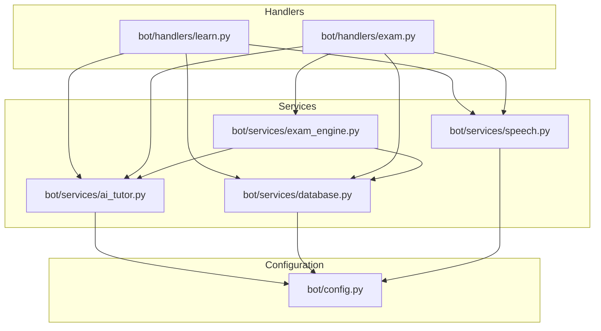
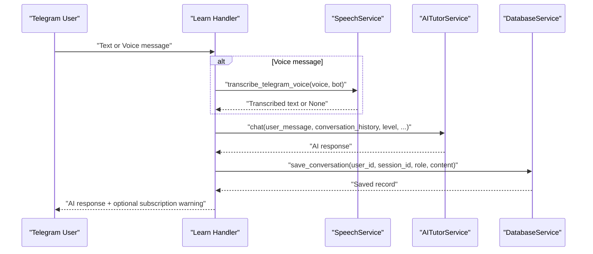
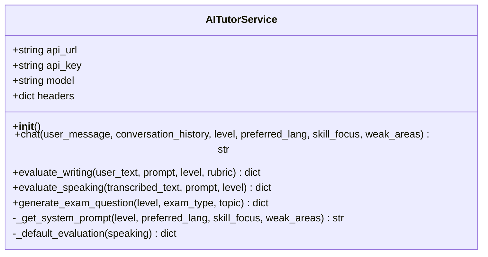
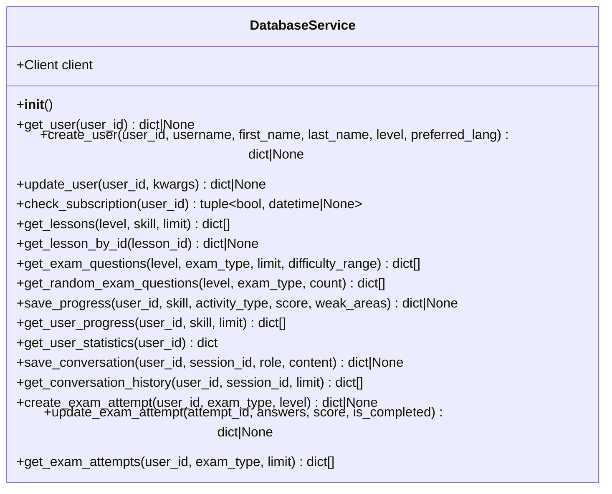
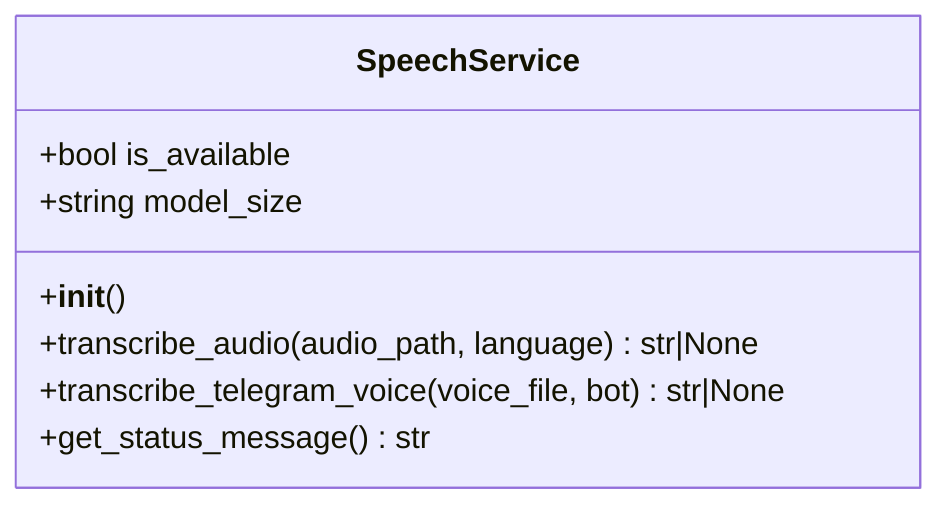
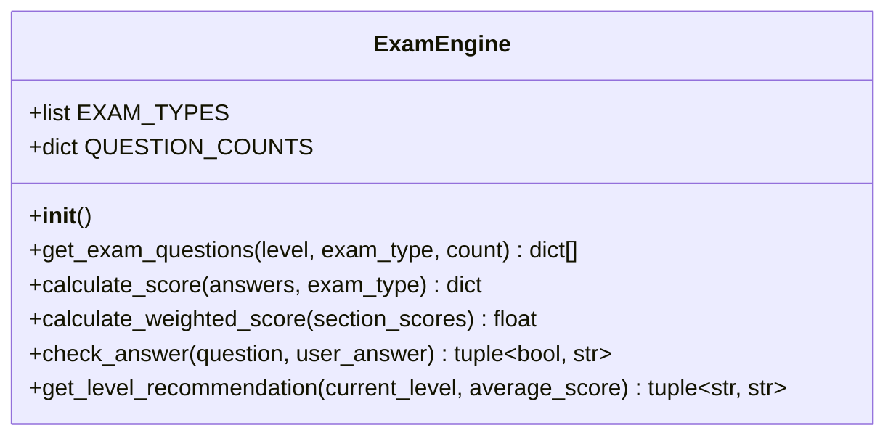
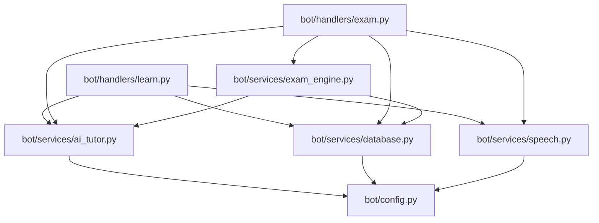

# Service Layer Architecture

<cite>
**Referenced Files in This Document**
- [bot/services/__init__.py](file://bot/services/__init__.py)
- [bot/services/ai_tutor.py](file://bot/services/ai_tutor.py)
- [bot/services/database.py](file://bot/services/database.py)
- [bot/services/exam_engine.py](file://bot/services/exam_engine.py)
- [bot/services/speech.py](file://bot/services/speech.py)
- [bot/config.py](file://bot/config.py)
- [bot/main.py](file://bot/main.py)
- [bot/handlers/learn.py](file://bot/handlers/learn.py)
- [bot/handlers/exam.py](file://bot/handlers/exam.py)
- [prompts/tutor_system.txt](file://prompts/tutor_system.txt)
</cite>

## Table of Contents
1. [Introduction](#introduction)
2. [Project Structure](#project-structure)
3. [Core Components](#core-components)
4. [Architecture Overview](#architecture-overview)
5. [Detailed Component Analysis](#detailed-component-analysis)
6. [Dependency Analysis](#dependency-analysis)
7. [Performance Considerations](#performance-considerations)
8. [Troubleshooting Guide](#troubleshooting-guide)
9. [Conclusion](#conclusion)

## Introduction
This document describes the service layer architecture of FebEGLS-bot, focusing on how the Service layer pattern encapsulates business logic and external API integrations. The system consists of four primary services:
- AI Tutor Service for OpenRouter integration
- Database Service for Supabase operations
- Speech Service for voice processing
- Exam Engine Service for question generation and scoring

The services are designed as singletons and are consumed by Telegram handlers to deliver a cohesive learning and assessment experience. This document explains service instantiation, dependency injection patterns, method interfaces, error handling strategies, integration patterns with external APIs, asynchronous operation patterns, retry mechanisms, and performance considerations.

## Project Structure
The service layer resides under bot/services and is organized by responsibility. Each service exposes a singleton instance for global access and is imported by handlers.

**Diagram sources**
- [bot/services/__init__.py](file://bot/services/__init__.py#L1-L7)
- [bot/services/ai_tutor.py](file://bot/services/ai_tutor.py#L1-L451)
- [bot/services/database.py](file://bot/services/database.py#L1-L416)
- [bot/services/exam_engine.py](file://bot/services/exam_engine.py#L1-L211)
- [bot/services/speech.py](file://bot/services/speech.py#L1-L140)
- [bot/config.py](file://bot/config.py#L1-L60)
- [bot/handlers/learn.py](file://bot/handlers/learn.py#L1-L315)
- [bot/handlers/exam.py](file://bot/handlers/exam.py#L1-L523)

**Section sources**
- [bot/services/__init__.py](file://bot/services/__init__.py#L1-L7)
- [bot/services/ai_tutor.py](file://bot/services/ai_tutor.py#L1-L451)
- [bot/services/database.py](file://bot/services/database.py#L1-L416)
- [bot/services/exam_engine.py](file://bot/services/exam_engine.py#L1-L211)
- [bot/services/speech.py](file://bot/services/speech.py#L1-L140)
- [bot/config.py](file://bot/config.py#L1-L60)

## Core Components
- AI Tutor Service: Integrates with OpenRouter to provide German language tutoring, evaluation, and exam question generation. It manages conversation context, system prompts, and response parsing.
- Database Service: Wraps Supabase operations for user management, lessons, exam questions, progress tracking, conversation history, and exam attempts.
- Speech Service: Provides voice transcription using faster-whisper when available, with graceful degradation when the model is not installed.
- Exam Engine Service: Orchestrates question selection (database-backed with AI fallback), scoring, and level recommendations.

**Section sources**
- [bot/services/ai_tutor.py](file://bot/services/ai_tutor.py#L19-L451)
- [bot/services/database.py](file://bot/services/database.py#L16-L416)
- [bot/services/speech.py](file://bot/services/speech.py#L21-L140)
- [bot/services/exam_engine.py](file://bot/services/exam_engine.py#L15-L211)

## Architecture Overview
The service layer follows a singleton pattern with explicit imports in handlers. Configuration is centralized in Config, which loads environment variables and validates required keys. Handlers coordinate user interactions and delegate business logic to services.

**Diagram sources**
- [bot/handlers/learn.py](file://bot/handlers/learn.py#L159-L232)
- [bot/services/speech.py](file://bot/services/speech.py#L83-L129)
- [bot/services/ai_tutor.py](file://bot/services/ai_tutor.py#L82-L153)
- [bot/services/database.py](file://bot/services/database.py#L296-L316)

**Section sources**
- [bot/handlers/learn.py](file://bot/handlers/learn.py#L159-L232)
- [bot/services/speech.py](file://bot/services/speech.py#L83-L129)
- [bot/services/ai_tutor.py](file://bot/services/ai_tutor.py#L82-L153)
- [bot/services/database.py](file://bot/services/database.py#L296-L316)

## Detailed Component Analysis

### AI Tutor Service
The AI Tutor Service integrates with OpenRouter to provide:
- Chat conversations with dynamic system prompts
- Writing evaluations with structured JSON responses
- Speaking evaluations with pronunciation tips
- Dynamic exam question generation across skill types

Key implementation patterns:
- Asynchronous HTTP requests using httpx.AsyncClient
- System prompt construction tailored to CEFR level and user preferences
- Robust error handling with fallback responses
- JSON parsing with markdown-safe extraction

Service method interfaces:
- chat(user_message, conversation_history, level, preferred_lang, skill_focus, weak_areas) -> str
- evaluate_writing(user_text, prompt, level, rubric=None) -> dict
- evaluate_speaking(transcribed_text, prompt, level) -> dict
- generate_exam_question(level, exam_type, topic=None) -> dict

Error handling strategies:
- HTTP timeouts mapped to user-friendly messages
- JSON parsing failures fall back to default evaluation structures
- Non-200 API responses logged and handled gracefully

Integration patterns:
- Uses Config for API URL, API key, and model identifier
- Adds referer and title headers for OpenRouter compliance
- Limits conversation history to Config.MAX_CONVERSATION_HISTORY

Asynchronous operation patterns:
- All methods are async to avoid blocking the Telegram event loop
- Uses context-managed AsyncClient for request lifecycle

Retry mechanisms:
- No built-in retries; relies on exponential backoff at the API layer

Performance considerations:
- Configurable timeouts (60–90 seconds) balance responsiveness and completion
- Temperature and token limits tuned for quality vs. cost
- Conversation history capped to reduce payload sizes

**Section sources**
- [bot/services/ai_tutor.py](file://bot/services/ai_tutor.py#L19-L451)
- [bot/config.py](file://bot/config.py#L20-L38)

#### AI Tutor Class Diagram

**Diagram sources**
- [bot/services/ai_tutor.py](file://bot/services/ai_tutor.py#L19-L451)

### Database Service
The Database Service wraps Supabase operations for:
- User lifecycle (get/create/update/check subscription)
- Lesson catalog (filtered retrieval)
- Exam questions (database-backed with AI fallback)
- Progress tracking and statistics
- Conversation history persistence
- Exam attempts (creation, updates, retrieval)

Service method interfaces:
- get_user(user_id) -> dict or None
- create_user(user_id, username, first_name, last_name, level, preferred_lang) -> dict or None
- update_user(user_id, **kwargs) -> dict or None
- check_subscription(user_id) -> tuple[bool, datetime or None]
- get_lessons(level, skill, limit) -> list[dict]
- get_lesson_by_id(lesson_id) -> dict or None
- get_exam_questions(level, exam_type, limit, difficulty_range) -> list[dict]
- get_random_exam_questions(level, exam_type, count) -> list[dict]
- save_progress(user_id, skill, activity_type, score, weak_areas) -> dict or None
- get_user_progress(user_id, skill, limit) -> list[dict]
- get_user_statistics(user_id) -> dict
- save_conversation(user_id, session_id, role, content) -> dict or None
- get_conversation_history(user_id, session_id, limit) -> list[dict]
- create_exam_attempt(user_id, exam_type, level) -> dict or None
- update_exam_attempt(attempt_id, answers, score, is_completed) -> dict or None
- get_exam_attempts(user_id, exam_type, limit) -> list[dict]

Error handling strategies:
- All operations catch exceptions and log errors
- Methods return safe defaults (None, empty lists, empty dicts) on failure
- Subscription checks handle missing/expired subscriptions gracefully

Integration patterns:
- Uses Config for Supabase URL and key
- Timestamps stored in UTC for consistency
- Statistics computed client-side from progress data

Asynchronous operation patterns:
- All methods are async to integrate with Telegram’s async event loop

Retry mechanisms:
- No built-in retries; rely on underlying Supabase client behavior

Performance considerations:
- Query limits and ordering to control result sizes
- Randomized question selection with difficulty distribution
- Efficient progress aggregation and statistics computation

**Section sources**
- [bot/services/database.py](file://bot/services/database.py#L16-L416)
- [bot/config.py](file://bot/config.py#L16-L18)

#### Database Service Class Diagram

**Diagram sources**
- [bot/services/database.py](file://bot/services/database.py#L16-L416)

### Speech Service
The Speech Service provides voice transcription using faster-whisper when available, with graceful degradation when the model is not installed.

Service method interfaces:
- is_available -> bool
- transcribe_audio(audio_path, language="de") -> str or None
- transcribe_telegram_voice(voice_file, bot) -> str or None
- get_status_message() -> str

Error handling strategies:
- Import-time detection of faster-whisper availability
- Runtime exceptions caught and logged; returns None for transcription failures
- Temporary file cleanup in finally blocks

Integration patterns:
- Uses Config for model size and device settings
- Downloads Telegram voice files to temporary storage
- Applies VAD filtering and beam search for robust transcription

Asynchronous operation patterns:
- Methods are async to integrate with Telegram’s async event loop
- Uses bot.get_file and download_to_drive for file handling

Retry mechanisms:
- No built-in retries; caller should reattempt based on status message

Performance considerations:
- Model size configurable ("base" by default for CPU compatibility)
- VAD filtering reduces noise and improves accuracy
- Temporary files are cleaned up after transcription

**Section sources**
- [bot/services/speech.py](file://bot/services/speech.py#L21-L140)

#### Speech Service Class Diagram

**Diagram sources**
- [bot/services/speech.py](file://bot/services/speech.py#L21-L140)

### Exam Engine Service
The Exam Engine Service orchestrates:
- Question selection (database-backed with AI fallback)
- Objective answer checking and scoring
- Weighted scoring for full mock exams
- Weak area identification and level recommendations

Service method interfaces:
- get_exam_questions(level, exam_type, count) -> list[dict]
- calculate_score(answers, exam_type) -> dict
- calculate_weighted_score(section_scores) -> float
- check_answer(question, user_answer) -> tuple[bool, str]
- get_level_recommendation(current_level, average_score) -> tuple[str, str]

Error handling strategies:
- Logs missing questions and falls back to AI generation
- Returns safe defaults for scoring and recommendations
- Cleans up user session data after exam completion

Integration patterns:
- Depends on DatabaseService for question retrieval
- Depends on AITutorService for AI-generated questions
- Uses UUIDs for generated question identifiers

Asynchronous operation patterns:
- All methods are async to integrate with Telegram’s async event loop

Retry mechanisms:
- No built-in retries; relies on upstream services’ reliability

Performance considerations:
- Difficulty distribution ensures balanced question sets
- Weighted scoring aligns with Goethe exam structure
- Weak area analysis helps personalize future learning

**Section sources**
- [bot/services/exam_engine.py](file://bot/services/exam_engine.py#L15-L211)
- [bot/services/database.py](file://bot/services/database.py#L163-L184)
- [bot/services/ai_tutor.py](file://bot/services/ai_tutor.py#L327-L423)

#### Exam Engine Class Diagram

**Diagram sources**
- [bot/services/exam_engine.py](file://bot/services/exam_engine.py#L15-L211)

## Dependency Analysis
The service layer exhibits clear separation of concerns with explicit imports in handlers. The ExamEngine depends on both DatabaseService and AITutorService, while handlers depend on multiple services for end-to-end flows.

**Diagram sources**
- [bot/handlers/learn.py](file://bot/handlers/learn.py#L17-L22)
- [bot/handlers/exam.py](file://bot/handlers/exam.py#L17-L23)
- [bot/services/exam_engine.py](file://bot/services/exam_engine.py#L9-L10)
- [bot/services/ai_tutor.py](file://bot/services/ai_tutor.py#L11)
- [bot/services/database.py](file://bot/services/database.py#L10-L11)
- [bot/services/speech.py](file://bot/services/speech.py#L12-L18)
- [bot/config.py](file://bot/config.py#L10-L59)

**Section sources**
- [bot/handlers/learn.py](file://bot/handlers/learn.py#L17-L22)
- [bot/handlers/exam.py](file://bot/handlers/exam.py#L17-L23)
- [bot/services/exam_engine.py](file://bot/services/exam_engine.py#L9-L10)
- [bot/services/ai_tutor.py](file://bot/services/ai_tutor.py#L11)
- [bot/services/database.py](file://bot/services/database.py#L10-L11)
- [bot/services/speech.py](file://bot/services/speech.py#L12-L18)
- [bot/config.py](file://bot/config.py#L10-L59)

## Performance Considerations
- AI Tutor Service: Configurable timeouts and token limits balance quality and latency; conversation history is capped to reduce payload sizes.
- Database Service: Queries use limits and ordering to control result sizes; statistics computed client-side to minimize server load.
- Speech Service: Model size and device settings impact inference speed; VAD filtering improves accuracy and reduces processing time.
- Exam Engine Service: Difficulty distribution and weighted scoring optimize exam experience and fairness.

[No sources needed since this section provides general guidance]

## Troubleshooting Guide
Common issues and resolutions:
- Missing configuration: Config.validate raises errors if required environment variables are absent.
- OpenRouter API failures: AI Tutor Service logs non-200 responses and returns fallback messages; verify API key and model configuration.
- Supabase connectivity: Database Service logs exceptions and returns safe defaults; verify URL and key.
- Speech transcription unavailable: Speech Service logs missing faster-whisper and returns None; install faster-whisper or use text input.
- Handler errors: Global error handler notifies users and logs exceptions.

**Section sources**
- [bot/config.py](file://bot/config.py#L40-L59)
- [bot/services/ai_tutor.py](file://bot/services/ai_tutor.py#L140-L152)
- [bot/services/database.py](file://bot/services/database.py#L29-L58)
- [bot/services/speech.py](file://bot/services/speech.py#L17-L18)
- [bot/main.py](file://bot/main.py#L45-L57)

## Conclusion
The service layer architecture cleanly separates business logic from external integrations, enabling maintainable and testable code. Singletons provide convenient access across handlers, while configuration centralization ensures consistent behavior. The design supports asynchronous operations, robust error handling, and performance-conscious defaults, delivering a reliable learning and assessment experience.