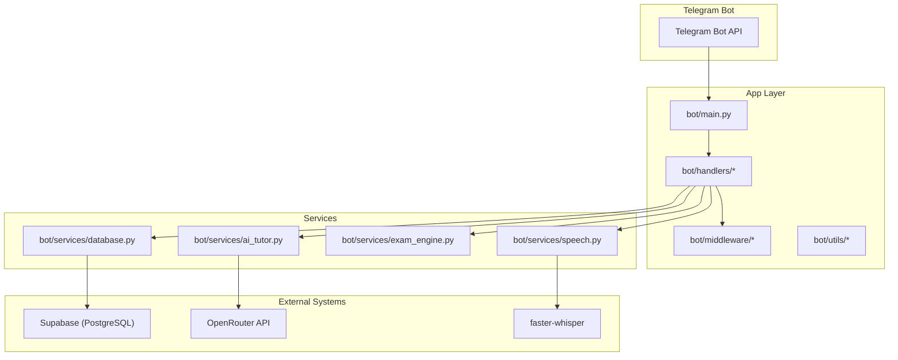
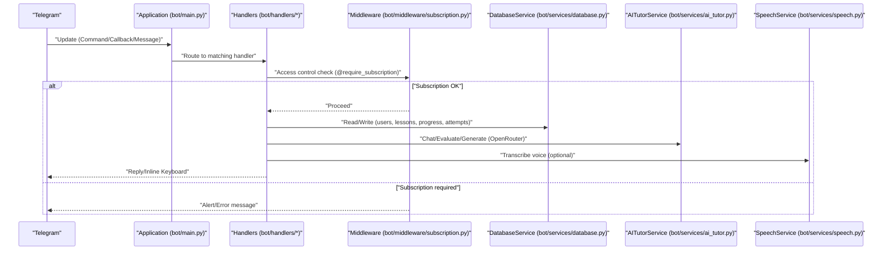
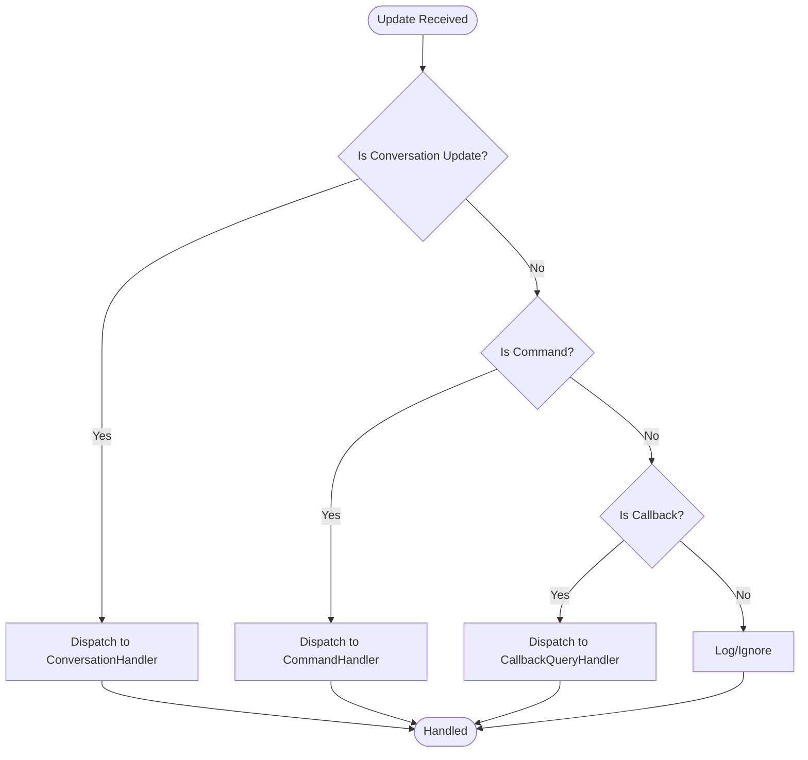
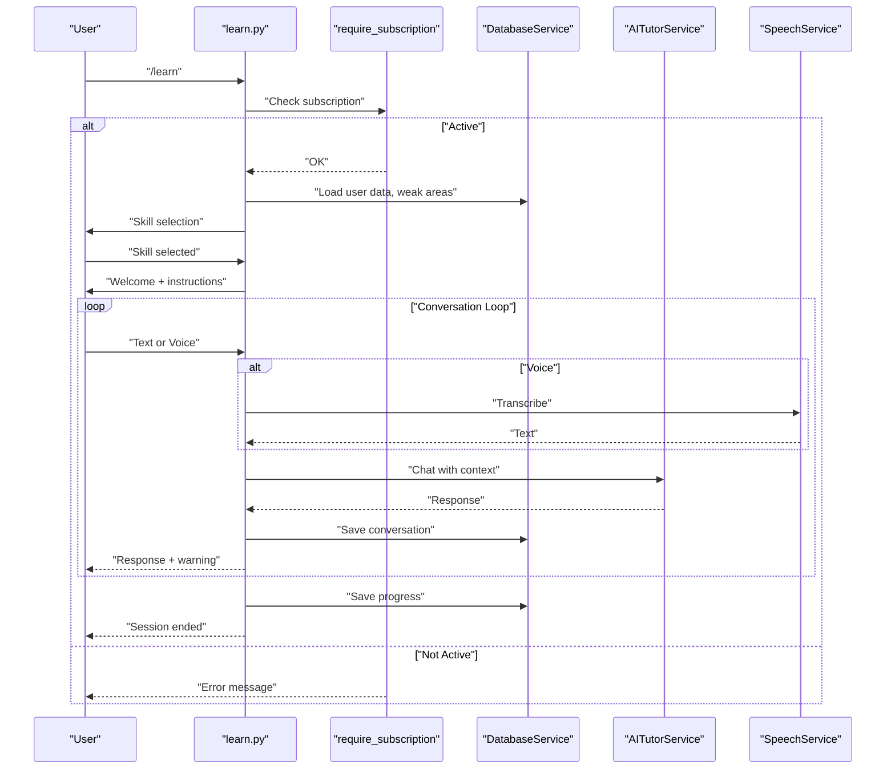
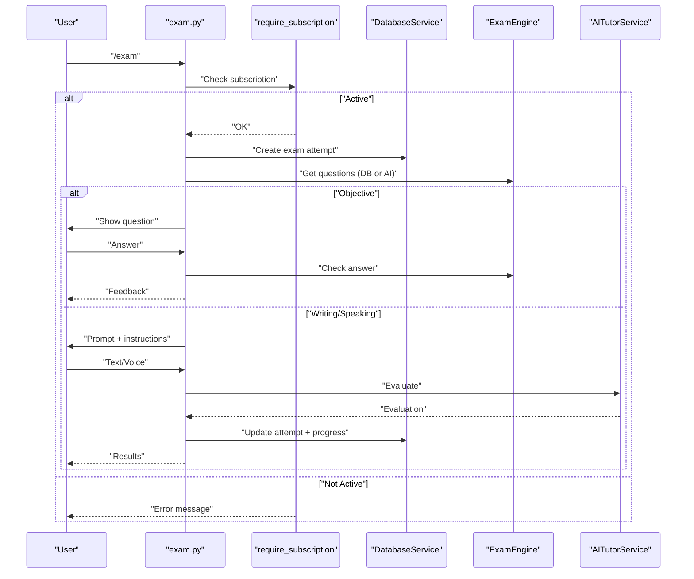
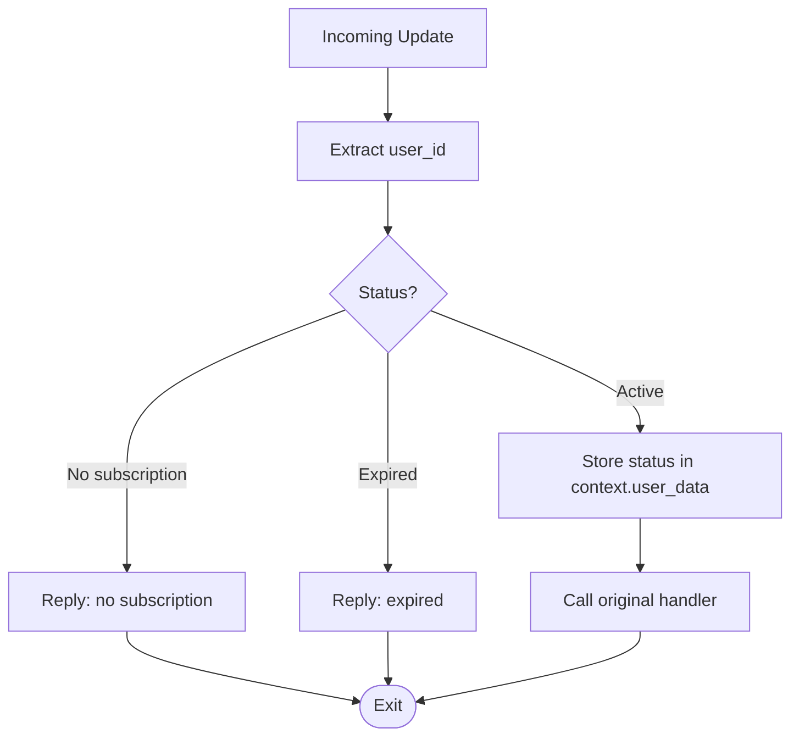
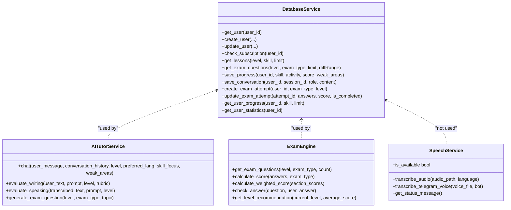
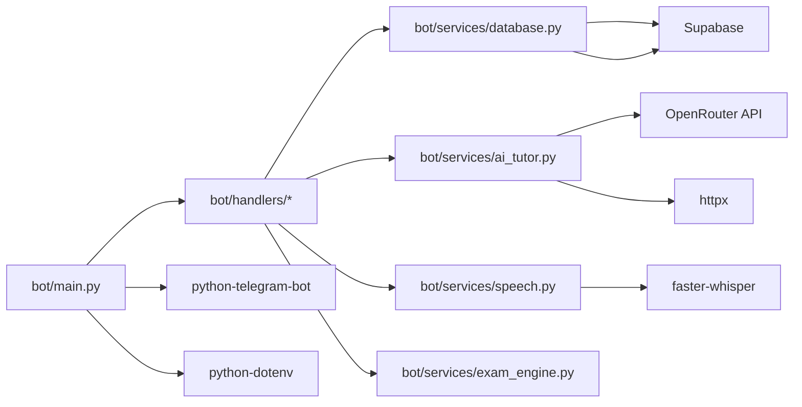

# System Overview

<cite>
**Referenced Files in This Document**
- [bot/main.py](file://bot/main.py)
- [bot/config.py](file://bot/config.py)
- [bot/handlers/start.py](file://bot/handlers/start.py)
- [bot/handlers/menu.py](file://bot/handlers/menu.py)
- [bot/handlers/learn.py](file://bot/handlers/learn.py)
- [bot/handlers/exam.py](file://bot/handlers/exam.py)
- [bot/handlers/progress.py](file://bot/handlers/progress.py)
- [bot/middleware/subscription.py](file://bot/middleware/subscription.py)
- [bot/services/database.py](file://bot/services/database.py)
- [bot/services/ai_tutor.py](file://bot/services/ai_tutor.py)
- [bot/services/exam_engine.py](file://bot/services/exam_engine.py)
- [bot/services/speech.py](file://bot/services/speech.py)
- [requirements.txt](file://requirements.txt)
- [database_setup.sql](file://database_setup.sql)
</cite>

## Table of Contents
1. [Introduction](#introduction)
2. [Project Structure](#project-structure)
3. [Core Components](#core-components)
4. [Architecture Overview](#architecture-overview)
5. [Detailed Component Analysis](#detailed-component-analysis)
6. [Dependency Analysis](#dependency-analysis)
7. [Performance Considerations](#performance-considerations)
8. [Troubleshooting Guide](#troubleshooting-guide)
9. [Conclusion](#conclusion)

## Introduction
This document presents a comprehensive system overview of the FebEGLS-bot, an event-driven Telegram bot implementing a modular architecture for German language education. The system integrates Telegram’s Bot API, an AI tutoring service, a speech transcription engine, and a Supabase-backed persistence layer. It follows clear separation of concerns:
- Event-driven updates flow from Telegram through handlers to services.
- Handlers implement the Handler pattern for command and callback processing.
- Services encapsulate external integrations (AI, database, speech).
- Middleware enforces access control for paid features.
- Configuration centralizes environment-specific settings.

## Project Structure
The project is organized by functional layers:
- bot/: Core application code
  - handlers/: Command and callback handlers implementing the Handler pattern
  - middleware/: Access control middleware
  - services/: External integrations and domain services
  - utils/: Shared UI helpers and formatters
  - config.py: Centralized configuration and validation
  - main.py: Application bootstrap and update routing
- prompts/: System prompts for the AI tutor
- database_setup.sql: Supabase schema and indexes
- requirements.txt: External dependencies

**Diagram sources**
- [bot/main.py](file://bot/main.py#L60-L101)
- [bot/handlers/start.py](file://bot/handlers/start.py#L177-L181)
- [bot/handlers/menu.py](file://bot/handlers/menu.py#L180-L183)
- [bot/handlers/learn.py](file://bot/handlers/learn.py#L291-L314)
- [bot/handlers/exam.py](file://bot/handlers/exam.py#L488-L522)
- [bot/services/database.py](file://bot/services/database.py#L16-L21)
- [bot/services/ai_tutor.py](file://bot/services/ai_tutor.py#L19-L32)
- [bot/services/speech.py](file://bot/services/speech.py#L21-L44)

**Section sources**
- [bot/main.py](file://bot/main.py#L1-L106)
- [bot/config.py](file://bot/config.py#L10-L60)

## Core Components
- Configuration and Environment
  - Centralized via Config class with validation and environment loading.
  - Defines Telegram token, Supabase credentials, OpenRouter API endpoint and model, CEFR levels, skills, languages, timeouts, and conversation history limits.
- Event Pipeline
  - Application builder constructs the bot, registers handlers, error handler, and logging.
  - Updates are routed to handlers based on filter patterns and conversation states.
- Handler Pattern
  - CommandHandler and CallbackQueryHandler instances export handler objects.
  - ConversationHandler manages multi-step flows for learning and exams.
- Service Layer
  - DatabaseService: Supabase client wrapper for CRUD operations.
  - AITutorService: OpenRouter API integration for tutoring, evaluation, and dynamic question generation.
  - ExamEngine: Question selection, scoring, and level recommendation.
  - SpeechService: faster-whisper integration for voice transcription.
- Middleware
  - require_subscription and require_subscription_callback enforce subscription checks and provide warnings.
- Utilities
  - Keyboards and Formatters provide consistent UI and messaging.

**Section sources**
- [bot/config.py](file://bot/config.py#L10-L60)
- [bot/main.py](file://bot/main.py#L60-L101)
- [bot/handlers/start.py](file://bot/handlers/start.py#L177-L181)
- [bot/handlers/learn.py](file://bot/handlers/learn.py#L291-L314)
- [bot/handlers/exam.py](file://bot/handlers/exam.py#L488-L522)
- [bot/services/database.py](file://bot/services/database.py#L16-L21)
- [bot/services/ai_tutor.py](file://bot/services/ai_tutor.py#L19-L32)
- [bot/services/exam_engine.py](file://bot/services/exam_engine.py#L15-L27)
- [bot/services/speech.py](file://bot/services/speech.py#L21-L44)
- [bot/middleware/subscription.py](file://bot/middleware/subscription.py#L47-L101)

## Architecture Overview
The system follows an event-driven architecture:
- Telegram sends Update events (commands, messages, callbacks).
- The Application routes updates to registered handlers.
- Handlers delegate to services for external integrations and persistence.
- Middleware validates access before invoking handlers.
- Responses are sent back to Telegram via the bot API.

**Diagram sources**
- [bot/main.py](file://bot/main.py#L60-L101)
- [bot/handlers/learn.py](file://bot/handlers/learn.py#L159-L232)
- [bot/handlers/exam.py](file://bot/handlers/exam.py#L317-L355)
- [bot/middleware/subscription.py](file://bot/middleware/subscription.py#L47-L101)
- [bot/services/database.py](file://bot/services/database.py#L16-L21)
- [bot/services/ai_tutor.py](file://bot/services/ai_tutor.py#L82-L153)
- [bot/services/speech.py](file://bot/services/speech.py#L83-L129)

## Detailed Component Analysis

### Event Pipeline and Handler Pattern
- Registration
  - Conversation handlers are registered first, followed by command and callback handlers.
  - Error handler logs exceptions and attempts to notify users.
  - A debug MessageHandler logs all incoming updates.
- Handler Types
  - Command handlers for /start, /help, /cancel, /menu, /progress.
  - Callback handlers for menu navigation, settings, and progress actions.
  - Conversation handlers for /learn and /exam manage multi-step flows with states and fallbacks.

**Diagram sources**
- [bot/main.py](file://bot/main.py#L60-L101)
- [bot/handlers/learn.py](file://bot/handlers/learn.py#L291-L314)
- [bot/handlers/exam.py](file://bot/handlers/exam.py#L488-L522)

**Section sources**
- [bot/main.py](file://bot/main.py#L60-L101)
- [bot/handlers/start.py](file://bot/handlers/start.py#L177-L181)
- [bot/handlers/menu.py](file://bot/handlers/menu.py#L180-L183)
- [bot/handlers/progress.py](file://bot/handlers/progress.py#L96-L99)

### Learning/Tutoring Flow (ConversationHandler)
- Entry points: /learn command and skill selection callbacks.
- States:
  - SELECTING_SKILL: choose a skill (conversation, grammar, lesen, horen, schreiben, sprechen, vokabular).
  - IN_CONVERSATION: exchange messages with optional voice transcription.
- Behavior:
  - Validates subscription before proceeding.
  - Builds conversation context and forwards to AI tutor.
  - Saves conversation history and progress.
  - Ends session and persists results.

**Diagram sources**
- [bot/handlers/learn.py](file://bot/handlers/learn.py#L30-L156)
- [bot/handlers/learn.py](file://bot/handlers/learn.py#L159-L232)
- [bot/middleware/subscription.py](file://bot/middleware/subscription.py#L47-L101)
- [bot/services/database.py](file://bot/services/database.py#L300-L344)
- [bot/services/ai_tutor.py](file://bot/services/ai_tutor.py#L82-L153)
- [bot/services/speech.py](file://bot/services/speech.py#L83-L129)

**Section sources**
- [bot/handlers/learn.py](file://bot/handlers/learn.py#L291-L314)

### Exam Flow (ConversationHandler)
- Entry points: /exam command and exam type selection.
- States:
  - SELECTING_EXAM: choose exam type (lesen, horen, schreiben, sprechen, vokabular).
  - ANSWERING_OBJECTIVE: MCQ flow with next/submit.
  - WRITING_RESPONSE: collect writing input until submit.
  - SPEAKING_RESPONSE: collect voice or text input until submit.
- Behavior:
  - Validates subscription.
  - Loads questions from DB or generates via AI.
  - Evaluates writing/speaking submissions with AI.
  - Persists exam attempts and progress.

**Diagram sources**
- [bot/handlers/exam.py](file://bot/handlers/exam.py#L31-L123)
- [bot/handlers/exam.py](file://bot/handlers/exam.py#L125-L215)
- [bot/handlers/exam.py](file://bot/handlers/exam.py#L218-L292)
- [bot/handlers/exam.py](file://bot/handlers/exam.py#L358-L416)
- [bot/middleware/subscription.py](file://bot/middleware/subscription.py#L47-L101)
- [bot/services/database.py](file://bot/services/database.py#L348-L417)
- [bot/services/exam_engine.py](file://bot/services/exam_engine.py#L29-L65)
- [bot/services/ai_tutor.py](file://bot/services/ai_tutor.py#L154-L325)

**Section sources**
- [bot/handlers/exam.py](file://bot/handlers/exam.py#L488-L522)

### Middleware Pattern: Access Control
- Decorators:
  - require_subscription: Enforces subscription for commands and messages.
  - require_subscription_callback: Enforces subscription for inline keyboard actions.
- Subscription Checks:
  - Validates presence, expiration, and near-expiration status.
  - Stores status in user_data for downstream handlers.
  - Provides warning messages for expiring subscriptions.

**Diagram sources**
- [bot/middleware/subscription.py](file://bot/middleware/subscription.py#L21-L44)
- [bot/middleware/subscription.py](file://bot/middleware/subscription.py#L47-L101)
- [bot/middleware/subscription.py](file://bot/middleware/subscription.py#L104-L137)

**Section sources**
- [bot/middleware/subscription.py](file://bot/middleware/subscription.py#L47-L101)

### Service Layer Patterns
- DatabaseService
  - Encapsulates Supabase client initialization and operations.
  - Provides user, lesson, exam question, progress, conversation history, and exam attempt management.
- AITutorService
  - Integrates OpenRouter API for tutoring, evaluations, and dynamic question generation.
  - Manages system prompts and message history limits.
- ExamEngine
  - Orchestrates question retrieval (DB or AI-generated) and scoring logic.
  - Computes weighted scores and level recommendations.
- SpeechService
  - Optional voice transcription using faster-whisper with Telegram voice files.

**Diagram sources**
- [bot/services/database.py](file://bot/services/database.py#L16-L422)
- [bot/services/ai_tutor.py](file://bot/services/ai_tutor.py#L19-L451)
- [bot/services/exam_engine.py](file://bot/services/exam_engine.py#L15-L211)
- [bot/services/speech.py](file://bot/services/speech.py#L21-L140)

**Section sources**
- [bot/services/database.py](file://bot/services/database.py#L16-L422)
- [bot/services/ai_tutor.py](file://bot/services/ai_tutor.py#L19-L451)
- [bot/services/exam_engine.py](file://bot/services/exam_engine.py#L15-L211)
- [bot/services/speech.py](file://bot/services/speech.py#L21-L140)

## Dependency Analysis
- Internal Dependencies
  - Handlers depend on DatabaseService, AITutorService, SpeechService, and middleware.
  - Learn and exam handlers depend on ExamEngine for question management.
- External Dependencies
  - python-telegram-bot: Event pipeline and update handling.
  - supabase: PostgreSQL persistence.
  - httpx: Async HTTP client for OpenRouter API.
  - python-dotenv: Environment variable loading.
  - faster-whisper/pydub: Optional voice transcription.

**Diagram sources**
- [bot/main.py](file://bot/main.py#L12-L19)
- [requirements.txt](file://requirements.txt#L1-L7)
- [bot/services/database.py](file://bot/services/database.py#L10-L21)
- [bot/services/ai_tutor.py](file://bot/services/ai_tutor.py#L5-L31)
- [bot/services/speech.py](file://bot/services/speech.py#L12-L44)

**Section sources**
- [requirements.txt](file://requirements.txt#L1-L7)
- [bot/main.py](file://bot/main.py#L12-L19)

## Performance Considerations
- Asynchronous Operations
  - All external calls use async HTTP clients and database operations to avoid blocking the event loop.
- Conversation Context Limits
  - AI chat uses a capped conversation history to control token usage and latency.
- Speech Transcription
  - Optional and offloaded to CPU; gracefully degrades when unavailable.
- Database Indexes
  - Schema includes indexes on frequently queried columns to optimize reads.

[No sources needed since this section provides general guidance]

## Troubleshooting Guide
- Configuration Validation
  - Missing environment variables cause immediate startup failure with a descriptive error.
- Error Handler
  - Logs exceptions and attempts to notify users on message updates.
- Subscription Issues
  - Handlers decorated with require_subscription reply with actionable messages for missing/expired subscriptions.
- Logging
  - Debug handler logs update IDs and message/callback payloads for diagnostics.

**Section sources**
- [bot/config.py](file://bot/config.py#L40-L56)
- [bot/main.py](file://bot/main.py#L45-L58)
- [bot/main.py](file://bot/main.py#L86-L94)
- [bot/middleware/subscription.py](file://bot/middleware/subscription.py#L68-L89)

## Conclusion
FebEGLS-bot demonstrates a clean, modular, and extensible architecture:
- Event-driven updates are routed through clearly defined handlers.
- The service layer isolates external dependencies behind cohesive interfaces.
- Middleware ensures access control without cluttering handler logic.
- The system is designed for maintainability, testability, and scalability, with explicit boundaries between Telegram, handlers, services, and external systems.