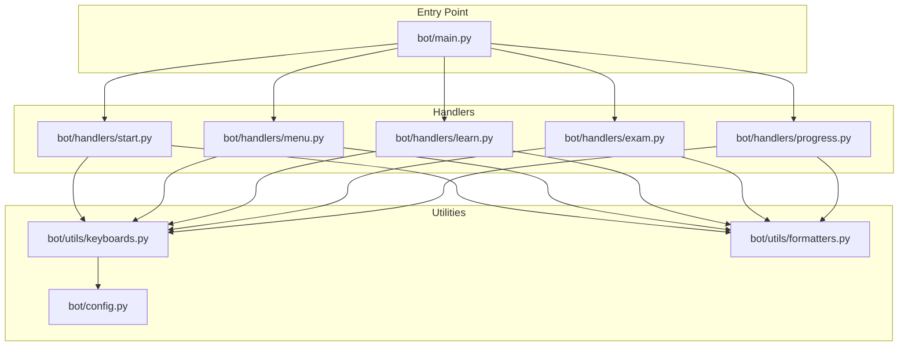
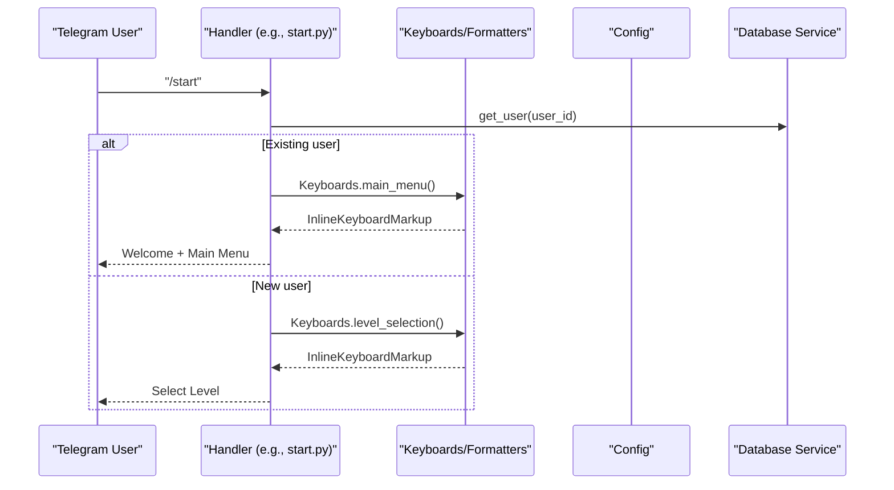
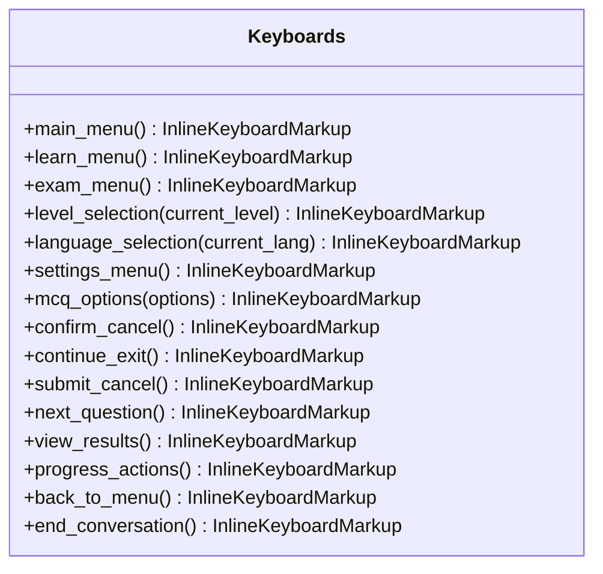
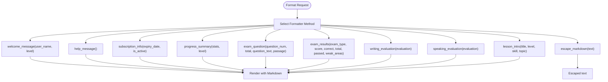
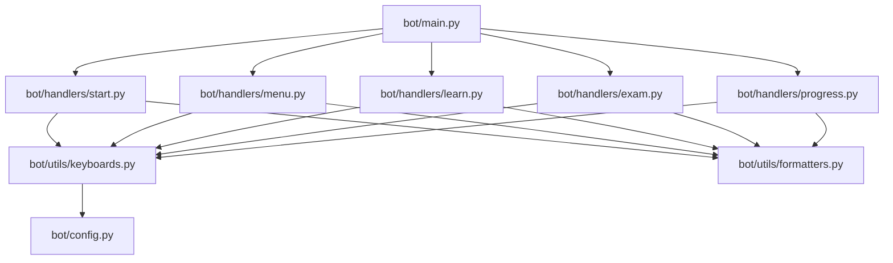

# Utility Modules & Shared Functionality

<cite>
**Referenced Files in This Document**
- [bot/utils/__init__.py](file://bot/utils/__init__.py)
- [bot/utils/keyboards.py](file://bot/utils/keyboards.py)
- [bot/utils/formatters.py](file://bot/utils/formatters.py)
- [bot/config.py](file://bot/config.py)
- [bot/main.py](file://bot/main.py)
- [bot/handlers/start.py](file://bot/handlers/start.py)
- [bot/handlers/menu.py](file://bot/handlers/menu.py)
- [bot/handlers/learn.py](file://bot/handlers/learn.py)
- [bot/handlers/exam.py](file://bot/handlers/exam.py)
- [bot/handlers/progress.py](file://bot/handlers/progress.py)
</cite>

## Table of Contents
1. [Introduction](#introduction)
2. [Project Structure](#project-structure)
3. [Core Components](#core-components)
4. [Architecture Overview](#architecture-overview)
5. [Detailed Component Analysis](#detailed-component-analysis)
6. [Dependency Analysis](#dependency-analysis)
7. [Performance Considerations](#performance-considerations)
8. [Troubleshooting Guide](#troubleshooting-guide)
9. [Conclusion](#conclusion)

## Introduction
This document explains the utility modules and shared functionality in FebEGLS-bot, focusing on:
- The keyboard builder factory pattern used to construct consistent inline keyboards across handlers
- Message formatting utilities with multi-language support and formatting templates
- Concrete examples of keyboard creation and message formatting across the codebase
- How utilities reduce code duplication, maintain UI consistency, and enable reusable components

## Project Structure
Utilities are centralized under bot/utils and consumed by handlers and middleware. The main entry point registers conversation and callback handlers that rely on these utilities.

**Diagram sources**
- [bot/main.py](file://bot/main.py#L60-L89)
- [bot/utils/keyboards.py](file://bot/utils/keyboards.py#L10-L183)
- [bot/utils/formatters.py](file://bot/utils/formatters.py#L8-L300)
- [bot/config.py](file://bot/config.py#L10-L60)

**Section sources**
- [bot/main.py](file://bot/main.py#L60-L89)
- [bot/utils/__init__.py](file://bot/utils/__init__.py#L1-L5)

## Core Components
- Keyboards factory: A static factory class that builds consistent inline keyboards for menus, selections, and actions.
- Formatters utility: A static utility class that formats messages for different contexts (welcome, help, progress, exam results, evaluations).
- Configuration: Centralized constants for CEFR levels, skills, and supported explanation languages.

These utilities are imported and used across handlers to ensure consistent UI and messaging.

**Section sources**
- [bot/utils/keyboards.py](file://bot/utils/keyboards.py#L10-L183)
- [bot/utils/formatters.py](file://bot/utils/formatters.py#L8-L300)
- [bot/config.py](file://bot/config.py#L25-L32)

## Architecture Overview
The bot uses a factory pattern for keyboard construction and a formatter pattern for message composition. Handlers call utility methods to render consistent UI and messages.

**Diagram sources**
- [bot/handlers/start.py](file://bot/handlers/start.py#L16-L74)
- [bot/utils/keyboards.py](file://bot/utils/keyboards.py#L14-L23)
- [bot/config.py](file://bot/config.py#L25-L32)

## Detailed Component Analysis

### Keyboard Builder Factory Pattern
The Keyboards class centralizes inline keyboard construction. It exposes static methods for each UI pattern, returning InlineKeyboardMarkup instances. This ensures consistent button labels, callback data, and layout across handlers.

Key capabilities:
- Main navigation menus (main, learn, exam, settings)
- Selection menus (CEFR level, explanation language)
- Action buttons (confirm/cancel, continue/exit, submit/cancel)
- Specialized layouts (MCQ options, next question, view results, progress actions)
- Back navigation and end-session controls

Example usage patterns:
- Registration flow uses level and language selection keyboards to guide onboarding.
- Menu navigation uses main and settings keyboards to route users.
- Exam flow uses MCQ options and next-question buttons for objective exams, and submit/cancel for writing/speaking tasks.
- Learning flow uses end-conversation and back-to-menu buttons.

**Diagram sources**
- [bot/utils/keyboards.py](file://bot/utils/keyboards.py#L10-L183)

**Section sources**
- [bot/utils/keyboards.py](file://bot/utils/keyboards.py#L14-L182)
- [bot/handlers/start.py](file://bot/handlers/start.py#L44-L94)
- [bot/handlers/menu.py](file://bot/handlers/menu.py#L68-L107)
- [bot/handlers/exam.py](file://bot/handlers/exam.py#L149-L154)
- [bot/handlers/learn.py](file://bot/handlers/learn.py#L152-L154)

### Message Formatting Utilities
The Formatters class provides consistent message templates for different bot contexts. It supports multi-language content and Markdown formatting.

Capabilities:
- Welcome and help messages
- Subscription status display
- Progress summary with skill breakdown and weak areas
- Exam question display (with passages)
- Exam results with score visualization and weak areas
- Writing and speaking evaluations with breakdowns, strengths, corrections, and suggestions
- Lesson intros with icons and metadata
- Markdown escaping for safe rendering

**Diagram sources**
- [bot/utils/formatters.py](file://bot/utils/formatters.py#L11-L299)

**Section sources**
- [bot/utils/formatters.py](file://bot/utils/formatters.py#L12-L299)
- [bot/handlers/start.py](file://bot/handlers/start.py#L146-L150)
- [bot/handlers/menu.py](file://bot/handlers/menu.py#L89-L93)
- [bot/handlers/exam.py](file://bot/handlers/exam.py#L448-L461)
- [bot/handlers/progress.py](file://bot/handlers/progress.py#L29-L36)

### Configuration and Localization
Configuration defines supported CEFR levels, skills, and explanation languages. These lists are used by keyboard builders to dynamically generate selection menus, ensuring consistency and localization of labels.

- CEFR levels: A1, A2, B1
- Skills: lesen, horen, schreiben, sprechen, vokabular
- Explanation languages: english, amharic, german

Selection keyboards derive labels from configuration and current selection state, appending "(current)" to indicate the active setting.

**Section sources**
- [bot/config.py](file://bot/config.py#L25-L32)
- [bot/utils/keyboards.py](file://bot/utils/keyboards.py#L65-L89)

### Concrete Usage Examples Across Handlers

- Start and help commands:
  - Use Keyboards.main_menu() and Keyboards.back_to_menu() for navigation.
  - Use Formatters.help_message() for help content.
  - Reference: [bot/handlers/start.py](file://bot/handlers/start.py#L39-L54), [bot/handlers/start.py](file://bot/handlers/start.py#L146-L150)

- Menu navigation:
  - Use Keyboards.main_menu(), Keyboards.learn_menu(), Keyboards.exam_menu(), Keyboards.settings_menu().
  - Use Formatters.progress_summary() and Formatters.subscription_info() for dynamic content.
  - Reference: [bot/handlers/menu.py](file://bot/handlers/menu.py#L68-L107), [bot/handlers/menu.py](file://bot/handlers/menu.py#L126-L177)

- Learning/tutoring:
  - Use Keyboards.learn_menu(), Keyboards.end_conversation(), and Keyboards.back_to_menu().
  - Reference: [bot/handlers/learn.py](file://bot/handlers/learn.py#L44-L50), [bot/handlers/learn.py](file://bot/handlers/learn.py#L151-L154)

- Exam simulation:
  - Use Keyboards.exam_menu(), Keyboards.mcq_options(), Keyboards.next_question(), Keyboards.submit_cancel(), Keyboards.view_results().
  - Use Formatters.exam_question(), Formatters.exam_results(), Formatters.writing_evaluation(), Formatters.speaking_evaluation().
  - Reference: [bot/handlers/exam.py](file://bot/handlers/exam.py#L149-L154), [bot/handlers/exam.py](file://bot/handlers/exam.py#L448-L461)

- Progress:
  - Use Keyboards.progress_actions() and Keyboards.learn_menu().
  - Use Formatters.progress_summary().
  - Reference: [bot/handlers/progress.py](file://bot/handlers/progress.py#L29-L36), [bot/handlers/progress.py](file://bot/handlers/progress.py#L61-L87)

## Dependency Analysis
Utilities are consumed by handlers and middleware. The main entry point registers conversation handlers that rely on these utilities for consistent UI and messaging.

**Diagram sources**
- [bot/main.py](file://bot/main.py#L60-L89)
- [bot/utils/keyboards.py](file://bot/utils/keyboards.py#L7-L7)
- [bot/utils/formatters.py](file://bot/utils/formatters.py#L1-L1)
- [bot/config.py](file://bot/config.py#L10-L60)

**Section sources**
- [bot/main.py](file://bot/main.py#L60-L89)
- [bot/utils/keyboards.py](file://bot/utils/keyboards.py#L7-L7)
- [bot/utils/formatters.py](file://bot/utils/formatters.py#L1-L1)
- [bot/config.py](file://bot/config.py#L10-L60)

## Performance Considerations
- Keyboard construction is lightweight and static; repeated calls are inexpensive.
- Message formatting uses string concatenation and simple loops; performance is adequate for typical bot traffic.
- Consider caching frequently accessed configuration lists if needed, though current usage is minimal.

## Troubleshooting Guide
Common issues and resolutions:
- Missing configuration: Ensure environment variables are set; Config.validate() raises errors if required keys are missing.
- Keyboard mismatch: Verify callback_data values match handler patterns (e.g., menu_main, level_A1, lang_english).
- Markdown rendering: Use Formatters.escape_markdown() when displaying user-generated text to prevent parsing errors.
- Navigation flow: Confirm that menu callbacks route to the correct keyboards and that back navigation uses back_to_menu() consistently.

**Section sources**
- [bot/config.py](file://bot/config.py#L40-L55)
- [bot/utils/formatters.py](file://bot/utils/formatters.py#L294-L299)
- [bot/utils/keyboards.py](file://bot/utils/keyboards.py#L173-L176)

## Conclusion
The utility modules in FebEGLS-bot provide a robust foundation for consistent UI and messaging:
- The Keyboards factory ensures uniform keyboard layouts and callback semantics across handlers.
- The Formatters utility standardizes message templates and supports multi-language content.
- Configuration-driven selection menus keep localization and customization consistent.
- Handlers consume these utilities to minimize duplication, simplify maintenance, and deliver a cohesive user experience.