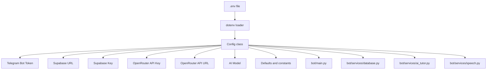
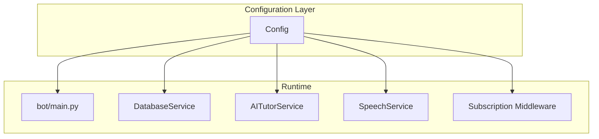

# Configuration & Environment

<cite>
**Referenced Files in This Document**
- [bot/config.py](file://bot/config.py)
- [bot/main.py](file://bot/main.py)
- [bot/services/database.py](file://bot/services/database.py)
- [bot/services/ai_tutor.py](file://bot/services/ai_tutor.py)
- [bot/services/speech.py](file://bot/services/speech.py)
- [bot/middleware/subscription.py](file://bot/middleware/subscription.py)
- [setup_database.py](file://setup_database.py)
- [database_setup.sql](file://database_setup.sql)
- [requirements.txt](file://requirements.txt)
</cite>

## Table of Contents
1. [Introduction](#introduction)
2. [Project Structure](#project-structure)
3. [Core Components](#core-components)
4. [Architecture Overview](#architecture-overview)
5. [Detailed Component Analysis](#detailed-component-analysis)
6. [Dependency Analysis](#dependency-analysis)
7. [Performance Considerations](#performance-considerations)
8. [Troubleshooting Guide](#troubleshooting-guide)
9. [Conclusion](#conclusion)
10. [Appendices](#appendices)

## Introduction
This document provides comprehensive configuration and environment documentation for FebEGLS-bot. It covers environment variables, configuration validation, defaults, logging, operational settings, security considerations, deployment profiles, and troubleshooting. The bot integrates Telegram, Supabase, and OpenRouter APIs and includes optional voice transcription capabilities.

## Project Structure
The configuration system centers around a single configuration class that loads environment variables from a .env file and validates required settings at import time. Services consume configuration values for external integrations. Logging is configured in the main entry point.

**Diagram sources**
- [bot/config.py](file://bot/config.py#L1-L60)
- [bot/main.py](file://bot/main.py#L28-L42)
- [bot/services/database.py](file://bot/services/database.py#L19-L21)
- [bot/services/ai_tutor.py](file://bot/services/ai_tutor.py#L22-L26)
- [bot/services/speech.py](file://bot/services/speech.py#L12-L19)

**Section sources**
- [bot/config.py](file://bot/config.py#L1-L60)
- [bot/main.py](file://bot/main.py#L28-L42)

## Core Components
- Configuration loading and validation
  - Loads .env from the project root and exposes typed attributes.
  - Validates presence of required keys at import time.
- Telegram integration
  - Uses the Telegram bot token to initialize the application.
- Supabase integration
  - Uses Supabase URL and key to create a client for database operations.
- OpenRouter integration
  - Uses the OpenRouter API key and fixed API URL/model for AI tutoring.
- Logging configuration
  - Configures console and file logging with INFO level and reduced noise for HTTP clients.
- Voice transcription (optional)
  - Conditional availability based on faster-whisper installation.

**Section sources**
- [bot/config.py](file://bot/config.py#L10-L59)
- [bot/main.py](file://bot/main.py#L28-L42)
- [bot/services/database.py](file://bot/services/database.py#L19-L21)
- [bot/services/ai_tutor.py](file://bot/services/ai_tutor.py#L22-L26)
- [bot/services/speech.py](file://bot/services/speech.py#L12-L19)

## Architecture Overview
The configuration is consumed by multiple subsystems. The following diagram shows how configuration values flow into services and handlers.

**Diagram sources**
- [bot/config.py](file://bot/config.py#L10-L59)
- [bot/main.py](file://bot/main.py#L60-L89)
- [bot/services/database.py](file://bot/services/database.py#L19-L21)
- [bot/services/ai_tutor.py](file://bot/services/ai_tutor.py#L22-L26)
- [bot/services/speech.py](file://bot/services/speech.py#L24-L44)
- [bot/middleware/subscription.py](file://bot/middleware/subscription.py#L21-L44)

## Detailed Component Analysis

### Environment Variables and Validation
- Required environment variables:
  - TELEGRAM_BOT_TOKEN
  - SUPABASE_URL
  - SUPABASE_KEY
  - OPENROUTER_API_KEY
- Behavior:
  - Values are loaded from .env using python-dotenv.
  - On import, the Config class validates that all required variables are non-empty and raises an error if any are missing.
- Defaults and constants:
  - OPENROUTER_API_URL and AI_MODEL are hardcoded defaults.
  - CEFR_LEVELS, SKILLS, EXPLANATION_LANGS are static lists.
  - SESSION_TIMEOUT and MAX_CONVERSATION_HISTORY are numeric defaults.

Operational notes:
- The application exits immediately on startup if any required environment variable is missing.
- No per-environment overrides are implemented in code; environment-specific values are expected via .env.

**Section sources**
- [bot/config.py](file://bot/config.py#L10-L59)

### Logging Configuration
- Logging targets:
  - Console stream handler
  - File handler writing to a bot log file with UTF-8 encoding
- Log levels:
  - Root logger set to INFO
  - Specific reduction for HTTP client libraries to WARNING
- Error handling:
  - Centralized error handler logs exceptions and attempts to notify users.

**Section sources**
- [bot/main.py](file://bot/main.py#L28-L58)

### Database Connection Settings
- Supabase client initialization:
  - Created using SUPABASE_URL and SUPABASE_KEY from configuration.
- Database setup:
  - A dedicated script reads SUPABASE_URL and SUPABASE_KEY from environment to assist with table creation.
  - A SQL script defines the schema and indexes used by the application.

Operational notes:
- Ensure the Supabase project is provisioned and credentials are correct before starting the bot.
- The setup script prints instructions to run the SQL in the Supabase SQL Editor.

**Section sources**
- [bot/services/database.py](file://bot/services/database.py#L19-L21)
- [setup_database.py](file://setup_database.py#L11-L12)
- [setup_database.py](file://setup_database.py#L102-L153)
- [database_setup.sql](file://database_setup.sql#L1-L84)

### AI Tutor Integration (OpenRouter)
- API endpoint and model:
  - Fixed API URL and model are used; the API key is taken from configuration.
- Headers:
  - Authorization bearer token, content type, referer, and app title are set.
- Conversation context:
  - Limits conversation history length based on a configurable constant.

**Section sources**
- [bot/services/ai_tutor.py](file://bot/services/ai_tutor.py#L22-L31)
- [bot/services/ai_tutor.py](file://bot/services/ai_tutor.py#L117-L124)
- [bot/config.py](file://bot/config.py#L38-L38)

### Voice Transcription (Optional)
- Availability:
  - Conditional import of faster-whisper determines whether voice transcription is enabled.
- Model configuration:
  - CPU-based model with quantization settings; model size is configurable.
- Usage:
  - Provides transcription for Telegram voice messages with cleanup of temporary files.

**Section sources**
- [bot/services/speech.py](file://bot/services/speech.py#L12-L19)
- [bot/services/speech.py](file://bot/services/speech.py#L24-L44)
- [bot/services/speech.py](file://bot/services/speech.py#L83-L129)

### Subscription Middleware
- Subscription checks:
  - Validates user subscription status and provides contextual warnings for expiring subscriptions.
- Integration:
  - Used to gate access to paid features in handlers.

**Section sources**
- [bot/middleware/subscription.py](file://bot/middleware/subscription.py#L21-L44)
- [bot/middleware/subscription.py](file://bot/middleware/subscription.py#L47-L101)

## Dependency Analysis
External dependencies relevant to configuration:
- python-telegram-bot: Telegram integration
- supabase: Supabase client for database operations
- httpx: Async HTTP client for OpenRouter API
- python-dotenv: Loading .env variables
- faster-whisper: Optional voice transcription
- pydub: Optional audio processing

**Section sources**
- [requirements.txt](file://requirements.txt#L1-L7)

## Performance Considerations
- Logging:
  - File logging is synchronous; consider asynchronous handlers for high-throughput deployments.
- HTTP timeouts:
  - AI tutor service sets explicit timeouts for OpenRouter requests.
- Conversation history:
  - Limiting recent messages reduces payload sizes and latency.

[No sources needed since this section provides general guidance]

## Troubleshooting Guide
Common misconfiguration issues and resolutions:
- Missing required environment variables:
  - Symptom: Application fails to start with a configuration validation error.
  - Resolution: Populate TELEGRAM_BOT_TOKEN, SUPABASE_URL, SUPABASE_KEY, and OPENROUTER_API_KEY in .env.
- Incorrect Supabase credentials:
  - Symptom: Database operations fail or setup script reports connection issues.
  - Resolution: Verify Supabase project URL and service key; ensure the SQL schema is created.
- OpenRouter API failures:
  - Symptom: AI responses indicate technical errors or timeouts.
  - Resolution: Confirm API key validity and network connectivity; check rate limits.
- Voice transcription disabled:
  - Symptom: Voice message processing is not available.
  - Resolution: Install faster-whisper and ensure dependencies are satisfied.

Validation procedures:
- Start the bot and observe startup logs for configuration errors.
- Run the database setup script to confirm Supabase connectivity and schema readiness.
- Test AI tutor chat and database operations after credentials are confirmed.

**Section sources**
- [bot/config.py](file://bot/config.py#L40-L55)
- [bot/main.py](file://bot/main.py#L28-L42)
- [setup_database.py](file://setup_database.py#L102-L153)
- [bot/services/ai_tutor.py](file://bot/services/ai_tutor.py#L147-L152)

## Conclusion
FebEGLS-bot relies on a centralized configuration class to manage environment variables and defaults. Configuration validation occurs at import time, ensuring early failure if critical values are missing. Logging is configured in the main entry point, and services consume configuration values for external integrations. Security and deployment best practices are covered in the next section.

[No sources needed since this section summarizes without analyzing specific files]

## Appendices

### Environment Variables Reference
- TELEGRAM_BOT_TOKEN
  - Purpose: Telegram bot authentication token.
  - Required: Yes.
  - Default: Empty string; validated at startup.
- SUPABASE_URL
  - Purpose: Supabase project URL.
  - Required: Yes.
  - Default: Empty string; validated at startup.
- SUPABASE_KEY
  - Purpose: Supabase service key.
  - Required: Yes.
  - Default: Empty string; validated at startup.
- OPENROUTER_API_KEY
  - Purpose: OpenRouter API key for AI tutoring.
  - Required: Yes.
  - Default: Empty string; validated at startup.
- OPENROUTER_API_URL
  - Purpose: OpenRouter API endpoint.
  - Required: No; defaults to a fixed URL.
  - Default: Hardcoded.
- AI_MODEL
  - Purpose: AI model identifier used by OpenRouter.
  - Required: No; defaults to a specific model.
  - Default: Hardcoded.
- Additional operational settings
  - SESSION_TIMEOUT: Integer minutes for session timeout.
  - MAX_CONVERSATION_HISTORY: Integer limiting AI context window.

**Section sources**
- [bot/config.py](file://bot/config.py#L14-L26)
- [bot/config.py](file://bot/config.py#L35-L38)
- [bot/config.py](file://bot/config.py#L40-L55)

### Logging and Debug Modes
- Logging configuration:
  - Console and file handlers with INFO level.
  - Reduced verbosity for HTTP client libraries.
- Debug mode:
  - No explicit debug flag is defined in code; adjust logging level or environment variables as needed.

**Section sources**
- [bot/main.py](file://bot/main.py#L28-L42)

### Security Considerations
- API key management:
  - Store tokens in .env and restrict file permissions.
  - Avoid committing secrets to version control.
- Credential rotation:
  - Rotate keys in hosting environment and redeploy.
  - Update .env and restart the application.
- Network exposure:
  - Ensure outbound access to Telegram, Supabase, and OpenRouter endpoints.
  - Use HTTPS endpoints and verify TLS certificates.

[No sources needed since this section provides general guidance]

### Deployment Profiles
- Development
  - Use local .env with development tokens and a sandbox Supabase project.
  - Keep logging at INFO; enable verbose output if needed.
- Staging
  - Mirror production environment variables with staging credentials.
  - Validate database schema and API connectivity before promotion.
- Production
  - Use secure secret management for tokens.
  - Monitor logs and configure alerts for configuration errors.
  - Ensure database schema is initialized via the provided SQL script.

[No sources needed since this section provides general guidance]

### Example .env Setup Scenarios
- Minimal development
  - TELEGRAM_BOT_TOKEN=your_telegram_token
  - SUPABASE_URL=https://your-project.supabase.co
  - SUPABASE_KEY=your_supabase_service_key
  - OPENROUTER_API_KEY=your_openrouter_api_key
- With explicit OpenRouter override (if applicable)
  - OPENROUTER_API_URL=https://custom.openrouter.endpoint
  - AI_MODEL=provider/model-name

Notes:
- Replace placeholder values with real credentials.
- Ensure the .env file resides at the project root and is readable by the runtime.

[No sources needed since this section provides general guidance]