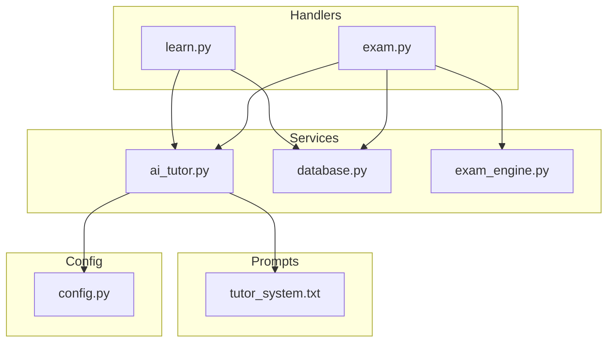
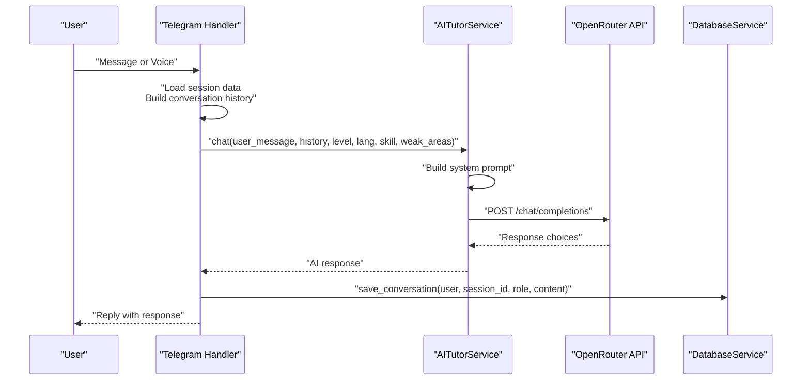
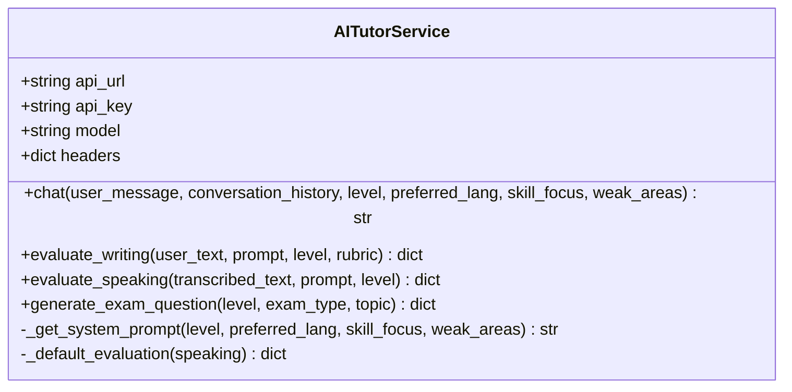
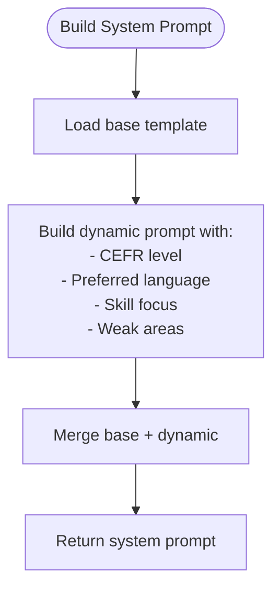
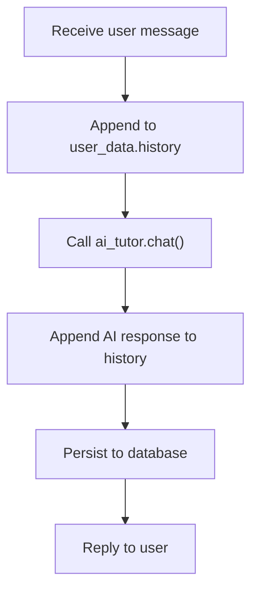
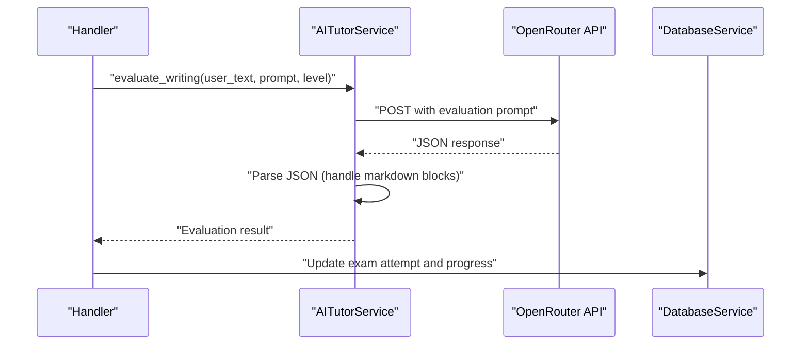
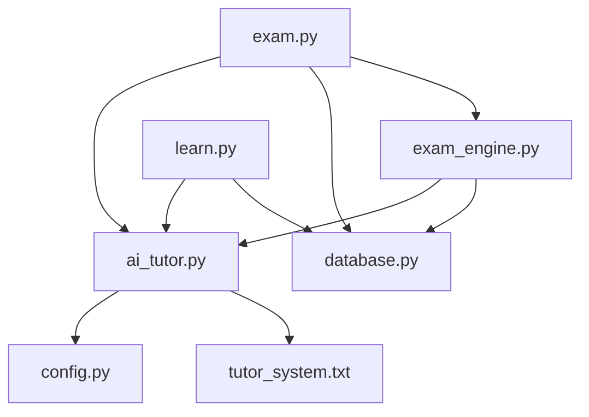

# AI Tutor Integration

<cite>
**Referenced Files in This Document**
- [ai_tutor.py](file://bot/services/ai_tutor.py)
- [tutor_system.txt](file://prompts/tutor_system.txt)
- [config.py](file://bot/config.py)
- [learn.py](file://bot/handlers/learn.py)
- [exam.py](file://bot/handlers/exam.py)
- [database.py](file://bot/services/database.py)
- [exam_engine.py](file://bot/services/exam_engine.py)
- [main.py](file://bot/main.py)
</cite>

## Table of Contents
1. [Introduction](#introduction)
2. [Project Structure](#project-structure)
3. [Core Components](#core-components)
4. [Architecture Overview](#architecture-overview)
5. [Detailed Component Analysis](#detailed-component-analysis)
6. [Dependency Analysis](#dependency-analysis)
7. [Performance Considerations](#performance-considerations)
8. [Troubleshooting Guide](#troubleshooting-guide)
9. [Conclusion](#conclusion)

## Introduction
This document describes the AI tutoring integration system that powers the EthioGerman Language School Telegram bot. It focuses on the OpenRouter API integration, system prompt architecture, and conversation context management. The system enables German language instruction aligned with CEFR levels, supports grammar correction, vocabulary expansion, and conversation practice, and provides robust error handling and fallback strategies for AI service unavailability.

## Project Structure
The AI tutor integration spans several modules:
- Services: AI tutor service, database service, exam engine, and speech service
- Handlers: Learning and exam conversation flows
- Prompts: System prompt templates
- Configuration: Environment-driven settings and constants

**Diagram sources**
- [learn.py](file://bot/handlers/learn.py#L1-L315)
- [exam.py](file://bot/handlers/exam.py#L1-L523)
- [ai_tutor.py](file://bot/services/ai_tutor.py#L1-L451)
- [database.py](file://bot/services/database.py#L1-L416)
- [exam_engine.py](file://bot/services/exam_engine.py#L1-L211)
- [tutor_system.txt](file://prompts/tutor_system.txt#L1-L74)
- [config.py](file://bot/config.py#L1-L60)

**Section sources**
- [learn.py](file://bot/handlers/learn.py#L1-L315)
- [exam.py](file://bot/handlers/exam.py#L1-L523)
- [ai_tutor.py](file://bot/services/ai_tutor.py#L1-L451)
- [database.py](file://bot/services/database.py#L1-L416)
- [exam_engine.py](file://bot/services/exam_engine.py#L1-L211)
- [tutor_system.txt](file://prompts/tutor_system.txt#L1-L74)
- [config.py](file://bot/config.py#L1-L60)

## Core Components
- AI Tutor Service: Orchestrates OpenRouter API requests, builds system prompts, manages conversation context, and evaluates writing and speaking submissions.
- System Prompt Architecture: Two-layer prompt system: a base template and dynamic skill/level-specific adaptations.
- Conversation Context Management: Maintains recent conversation history and passes it to the AI model for contextual responses.
- Handler Integration: Learn and exam handlers coordinate user sessions, manage state, and integrate AI tutor evaluations.
- Database Integration: Stores conversation history, progress, and exam attempts for persistence and analytics.
- Configuration: Centralized settings for API endpoints, models, CEFR levels, skills, and conversation history limits.

**Section sources**
- [ai_tutor.py](file://bot/services/ai_tutor.py#L19-L153)
- [tutor_system.txt](file://prompts/tutor_system.txt#L1-L74)
- [learn.py](file://bot/handlers/learn.py#L159-L232)
- [database.py](file://bot/services/database.py#L296-L338)
- [config.py](file://bot/config.py#L10-L39)

## Architecture Overview
The system follows a layered architecture:
- Telegram handlers initiate and manage user sessions
- Handlers delegate AI interactions to the AI tutor service
- The AI tutor service constructs system prompts and sends requests to OpenRouter
- Responses are parsed and returned to handlers for display
- Database operations persist conversation history, progress, and exam attempts

**Diagram sources**
- [learn.py](file://bot/handlers/learn.py#L159-L232)
- [ai_tutor.py](file://bot/services/ai_tutor.py#L82-L153)
- [database.py](file://bot/services/database.py#L296-L316)

## Detailed Component Analysis

### AI Tutor Service
The AI tutor service encapsulates OpenRouter integration and prompt construction. It:
- Loads configuration for API URL, model, and headers
- Generates a dynamic system prompt based on CEFR level, preferred language, skill focus, and weak areas
- Builds a messages array including the system prompt, recent conversation history, and the current user message
- Sends asynchronous HTTP requests with timeouts and handles errors gracefully
- Provides evaluation methods for writing and speaking tasks with structured JSON parsing
- Generates exam questions for various Goethe-style skills

**Diagram sources**
- [ai_tutor.py](file://bot/services/ai_tutor.py#L19-L451)

**Section sources**
- [ai_tutor.py](file://bot/services/ai_tutor.py#L19-L153)
- [ai_tutor.py](file://bot/services/ai_tutor.py#L154-L325)
- [ai_tutor.py](file://bot/services/ai_tutor.py#L327-L424)

### System Prompt Architecture
Two prompt sources define the AI tutor’s behavior:
- Base system prompt template: Defines roles, responsibilities, CEFR guidelines, response format, language policy, personality, and constraints
- Dynamic system prompt builder: Adapts the base prompt with user-specific attributes (CEFR level, preferred language, skill focus, weak areas)

**Diagram sources**
- [tutor_system.txt](file://prompts/tutor_system.txt#L1-L74)
- [ai_tutor.py](file://bot/services/ai_tutor.py#L33-L80)

**Section sources**
- [tutor_system.txt](file://prompts/tutor_system.txt#L1-L74)
- [ai_tutor.py](file://bot/services/ai_tutor.py#L33-L80)

### Conversation Context Management
The system maintains conversation context in two ways:
- In-memory user_data: Stores recent messages for immediate context within a session
- Database persistence: Saves conversation entries for long-term memory and potential future retrieval

**Diagram sources**
- [learn.py](file://bot/handlers/learn.py#L199-L221)
- [ai_tutor.py](file://bot/services/ai_tutor.py#L113-L124)
- [database.py](file://bot/services/database.py#L296-L316)

**Section sources**
- [learn.py](file://bot/handlers/learn.py#L191-L221)
- [ai_tutor.py](file://bot/services/ai_tutor.py#L113-L124)
- [database.py](file://bot/services/database.py#L296-L316)

### AI Response Processing and Evaluation
The AI tutor supports:
- Free conversation mode with grammar correction and encouragement
- Writing evaluation with grammar, vocabulary, task completion, and coherence scores
- Speaking evaluation with grammar, vocabulary, task completion, and fluency scores
- JSON-based evaluation responses parsed with markdown-safe extraction

**Diagram sources**
- [learn.py](file://bot/handlers/learn.py#L371-L380)
- [ai_tutor.py](file://bot/services/ai_tutor.py#L154-L237)
- [database.py](file://bot/services/database.py#L342-L390)

**Section sources**
- [learn.py](file://bot/handlers/learn.py#L371-L380)
- [ai_tutor.py](file://bot/services/ai_tutor.py#L154-L237)
- [database.py](file://bot/services/database.py#L342-L390)

### CEFR Level Alignment and Skill-Specific Adaptations
- CEFR levels: A1, A2, B1 are supported and enforced in system prompts and evaluations
- Skill-specific adaptations: Conversation mode emphasizes fluency and encouragement; writing and speaking focus on structured evaluation criteria; vocabulary and reading align with comprehension and multiple-choice formats
- Weak areas: Integrated into system prompts to tailor feedback and practice

**Section sources**
- [config.py](file://bot/config.py#L25-L29)
- [ai_tutor.py](file://bot/services/ai_tutor.py#L33-L80)
- [learn.py](file://bot/handlers/learn.py#L92-L94)

### Error Handling Strategies
- HTTP client timeouts and non-200 responses are caught and handled with user-friendly fallback messages
- JSON parsing errors in evaluations are handled with default evaluation structures
- General exceptions log errors and return safe fallback responses
- Logging is configured to reduce noise from external libraries

**Section sources**
- [ai_tutor.py](file://bot/services/ai_tutor.py#L147-L152)
- [ai_tutor.py](file://bot/services/ai_tutor.py#L232-L237)
- [ai_tutor.py](file://bot/services/ai_tutor.py#L320-L325)
- [main.py](file://bot/main.py#L38-L41)

### Conversation Flow Control
- Learn handler: Manages free conversation, grammar, reading, listening, writing, speaking, and vocabulary modes
- Exam handler: Manages objective and subjective exam flows with question presentation, answer collection, and evaluation
- State machines: Conversation handlers define states and transitions for each flow
- Session data: Tracks session ID, skill, level, preferred language, weak areas, and conversation history

**Section sources**
- [learn.py](file://bot/handlers/learn.py#L26-L314)
- [exam.py](file://bot/handlers/exam.py#L27-L522)

## Dependency Analysis
The AI tutor service depends on configuration and prompt resources. Handlers depend on the AI tutor service and database service. The exam engine coordinates database and AI tutor services for question generation and evaluation.

**Diagram sources**
- [config.py](file://bot/config.py#L10-L39)
- [tutor_system.txt](file://prompts/tutor_system.txt#L1-L74)
- [ai_tutor.py](file://bot/services/ai_tutor.py#L11-L31)
- [learn.py](file://bot/handlers/learn.py#L17-L22)
- [exam.py](file://bot/handlers/exam.py#L17-L23)
- [database.py](file://bot/services/database.py#L10-L21)
- [exam_engine.py](file://bot/services/exam_engine.py#L9-L10)

**Section sources**
- [config.py](file://bot/config.py#L10-L39)
- [ai_tutor.py](file://bot/services/ai_tutor.py#L11-L31)
- [learn.py](file://bot/handlers/learn.py#L17-L22)
- [exam.py](file://bot/handlers/exam.py#L17-L23)
- [database.py](file://bot/services/database.py#L10-L21)
- [exam_engine.py](file://bot/services/exam_engine.py#L9-L10)

## Performance Considerations
- Asynchronous HTTP client: Uses httpx.AsyncClient to minimize latency and improve throughput
- Timeout configuration: Requests include explicit timeouts to prevent hanging
- Conversation history limits: Configured maximum history prevents excessive token usage and keeps responses concise
- JSON parsing safety: Handles markdown-wrapped JSON blocks to reduce parsing failures
- Logging configuration: Reduces noise from external libraries to keep logs readable

**Section sources**
- [ai_tutor.py](file://bot/services/ai_tutor.py#L127-L138)
- [ai_tutor.py](file://bot/services/ai_tutor.py#L201-L213)
- [ai_tutor.py](file://bot/services/ai_tutor.py#L290-L302)
- [ai_tutor.py](file://bot/services/ai_tutor.py#L391-L403)
- [config.py](file://bot/config.py#L37-L38)
- [main.py](file://bot/main.py#L38-L41)

## Troubleshooting Guide
Common issues and resolutions:
- OpenRouter API errors: Non-200 responses trigger fallback messages; check API key and endpoint configuration
- Timeout errors: Increase timeouts cautiously; verify network connectivity
- JSON parsing failures: Ensure AI responses are valid JSON; the system extracts JSON from markdown blocks
- Missing configuration: Validate environment variables for Telegram, Supabase, and OpenRouter
- Subscription checks: Handlers enforce subscription requirements before allowing access to learning and exam features

**Section sources**
- [ai_tutor.py](file://bot/services/ai_tutor.py#L140-L152)
- [ai_tutor.py](file://bot/services/ai_tutor.py#L232-L237)
- [ai_tutor.py](file://bot/services/ai_tutor.py#L320-L325)
- [config.py](file://bot/config.py#L41-L55)
- [learn.py](file://bot/handlers/learn.py#L34-L42)
- [exam.py](file://bot/handlers/exam.py#L35-L43)

## Conclusion
The AI tutor integration provides a robust, CEFR-aligned German language learning experience. It combines dynamic system prompts, careful conversation context management, and structured evaluations to support grammar correction, vocabulary expansion, and conversation practice. The system’s error handling and fallback mechanisms ensure resilience against AI service unavailability, while configuration-driven settings enable flexible deployment and scaling.