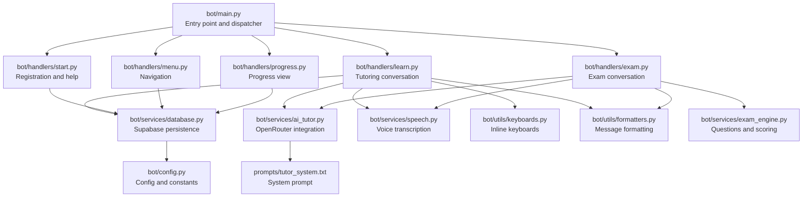
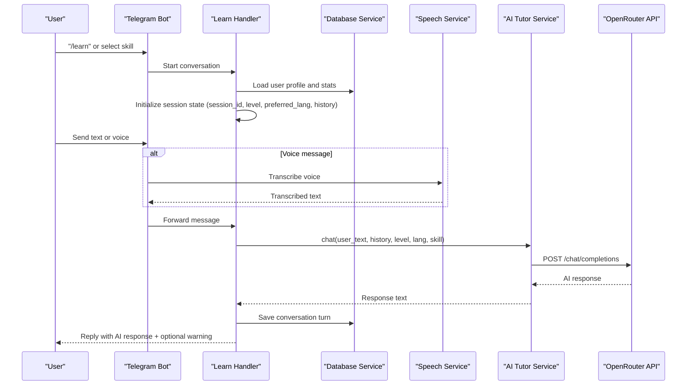
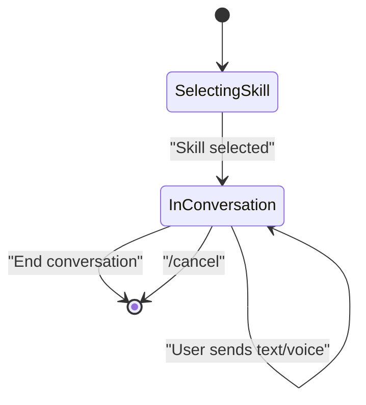
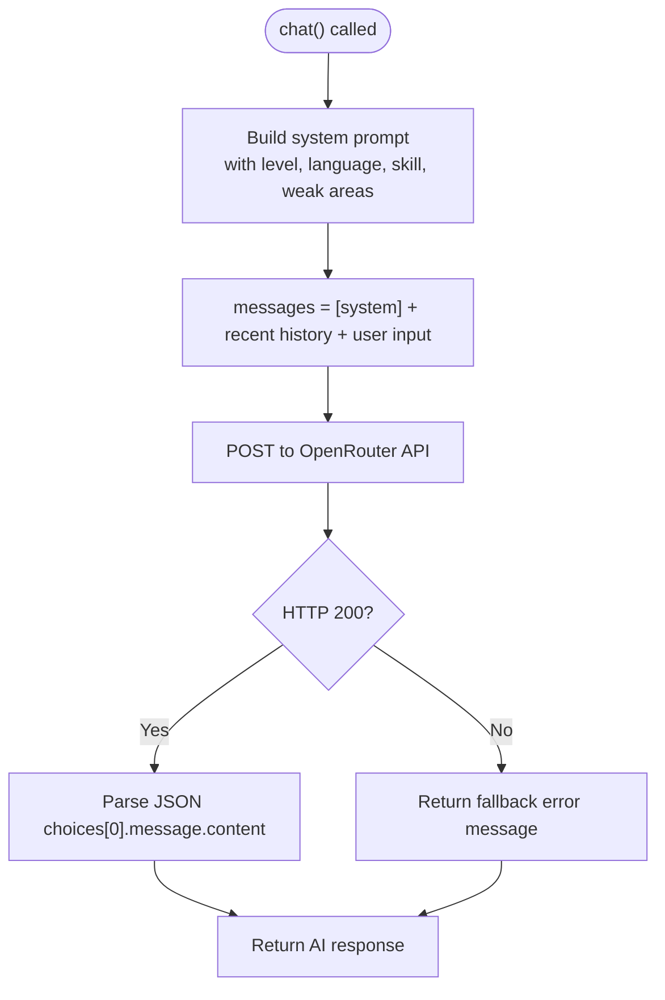
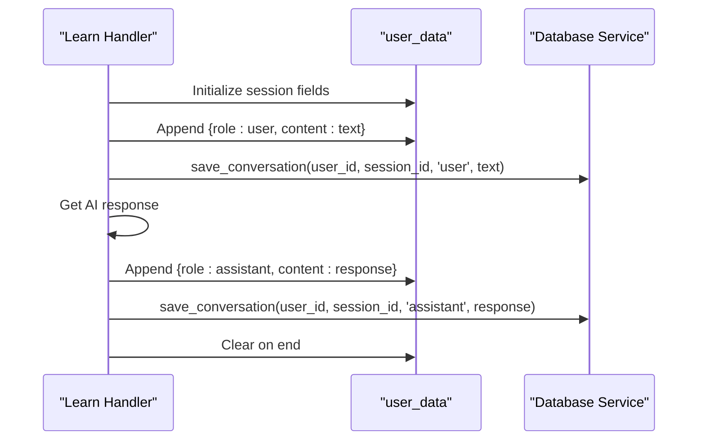
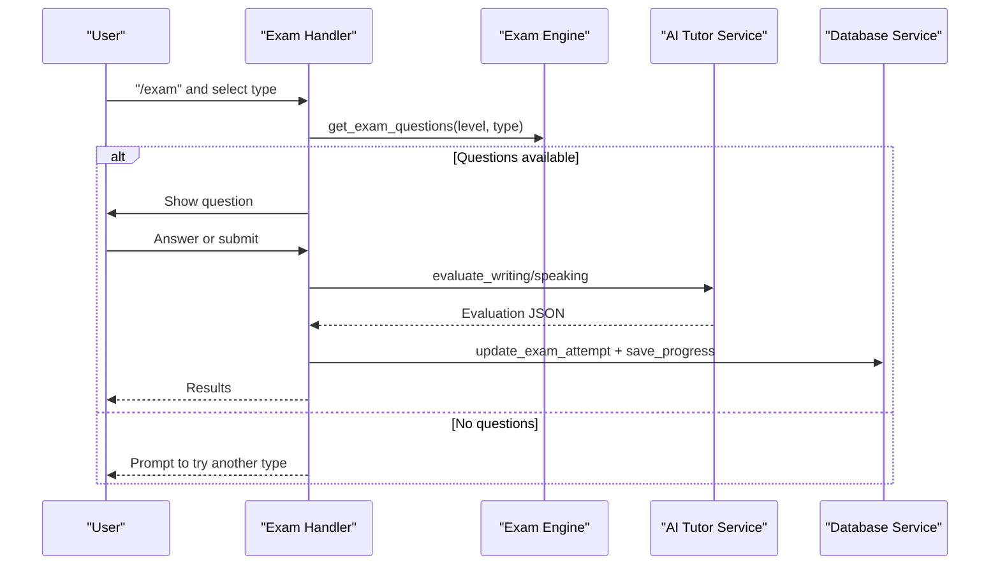
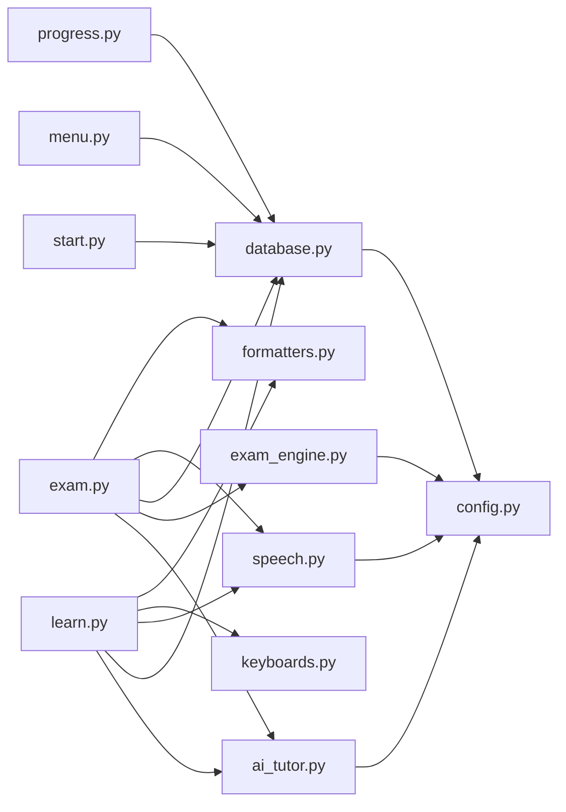

# Conversation Learning

<cite>
**Referenced Files in This Document**
- [bot/main.py](file://bot/main.py)
- [bot/config.py](file://bot/config.py)
- [bot/services/ai_tutor.py](file://bot/services/ai_tutor.py)
- [prompts/tutor_system.txt](file://prompts/tutor_system.txt)
- [bot/handlers/learn.py](file://bot/handlers/learn.py)
- [bot/services/database.py](file://bot/services/database.py)
- [bot/services/speech.py](file://bot/services/speech.py)
- [bot/utils/keyboards.py](file://bot/utils/keyboards.py)
- [bot/utils/formatters.py](file://bot/utils/formatters.py)
- [bot/middleware/subscription.py](file://bot/middleware/subscription.py)
- [bot/handlers/start.py](file://bot/handlers/start.py)
- [bot/handlers/menu.py](file://bot/handlers/menu.py)
- [bot/handlers/progress.py](file://bot/handlers/progress.py)
- [bot/handlers/exam.py](file://bot/handlers/exam.py)
- [bot/services/exam_engine.py](file://bot/services/exam_engine.py)
</cite>

## Table of Contents
1. [Introduction](#introduction)
2. [Project Structure](#project-structure)
3. [Core Components](#core-components)
4. [Architecture Overview](#architecture-overview)
5. [Detailed Component Analysis](#detailed-component-analysis)
6. [Dependency Analysis](#dependency-analysis)
7. [Performance Considerations](#performance-considerations)
8. [Troubleshooting Guide](#troubleshooting-guide)
9. [Conclusion](#conclusion)
10. [Appendices](#appendices)

## Introduction
This document describes the conversation-based learning system that powers interactive AI tutoring in German. It covers how conversation sessions are initiated and managed, how context is preserved across turns, and how multi-turn dialogues are handled. It also documents CEFR-aligned conversation patterns, skill-based practice modes (grammar, vocabulary, reading, listening, writing, speaking), and adaptive difficulty progression. The system integrates with the OpenRouter API for AI responses, manages conversation history, and maintains session state. Examples of conversation flows, AI response processing, and user interaction patterns are included to aid understanding.

## Project Structure
The system is organized around a Telegram bot entry point, handler modules for commands and conversations, service modules for AI, database, speech, and exam logic, and utility modules for formatting and keyboard layouts. Configuration centralizes environment variables and constants.

**Diagram sources**
- [bot/main.py](file://bot/main.py#L60-L101)
- [bot/handlers/learn.py](file://bot/handlers/learn.py#L292-L314)
- [bot/handlers/exam.py](file://bot/handlers/exam.py#L489-L522)
- [bot/services/ai_tutor.py](file://bot/services/ai_tutor.py#L19-L451)
- [bot/services/database.py](file://bot/services/database.py#L16-L422)
- [bot/services/speech.py](file://bot/services/speech.py#L21-L140)
- [bot/utils/keyboards.py](file://bot/utils/keyboards.py#L10-L183)
- [bot/utils/formatters.py](file://bot/utils/formatters.py#L8-L300)
- [bot/middleware/subscription.py](file://bot/middleware/subscription.py#L21-L156)
- [bot/handlers/start.py](file://bot/handlers/start.py#L16-L182)
- [bot/handlers/menu.py](file://bot/handlers/menu.py#L17-L184)
- [bot/handlers/progress.py](file://bot/handlers/progress.py#L17-L99)
- [bot/services/exam_engine.py](file://bot/services/exam_engine.py#L15-L211)
- [bot/config.py](file://bot/config.py#L10-L60)
- [prompts/tutor_system.txt](file://prompts/tutor_system.txt#L1-L74)

**Section sources**
- [bot/main.py](file://bot/main.py#L60-L101)
- [bot/config.py](file://bot/config.py#L10-L60)

## Core Components
- Conversation engine: Manages multi-turn dialogues, session state, and user-data storage.
- AI tutor service: Integrates with OpenRouter API to generate contextualized responses and evaluations.
- Database service: Persists user profiles, progress, conversation history, and exam attempts.
- Speech service: Provides optional voice-to-text transcription for speaking practice.
- Keyboard and formatter utilities: Provide consistent UI and message formatting.
- Middleware: Enforces subscription checks for paid features.
- Handlers: Implement command and conversation flows for learning, exams, menus, progress, and registration.

**Section sources**
- [bot/handlers/learn.py](file://bot/handlers/learn.py#L26-L315)
- [bot/services/ai_tutor.py](file://bot/services/ai_tutor.py#L19-L451)
- [bot/services/database.py](file://bot/services/database.py#L16-L422)
- [bot/services/speech.py](file://bot/services/speech.py#L21-L140)
- [bot/utils/keyboards.py](file://bot/utils/keyboards.py#L10-L183)
- [bot/utils/formatters.py](file://bot/utils/formatters.py#L8-L300)
- [bot/middleware/subscription.py](file://bot/middleware/subscription.py#L21-L156)

## Architecture Overview
The system uses a Telegram Bot framework with ConversationHandler for stateful sessions. Handlers orchestrate user interactions, middleware enforces access control, services encapsulate external integrations and persistence, and utilities standardize UI and messaging.

**Diagram sources**
- [bot/handlers/learn.py](file://bot/handlers/learn.py#L159-L232)
- [bot/services/ai_tutor.py](file://bot/services/ai_tutor.py#L82-L153)
- [bot/services/database.py](file://bot/services/database.py#L302-L344)
- [bot/services/speech.py](file://bot/services/speech.py#L83-L129)

## Detailed Component Analysis

### Conversation Engine (Learn Handler)
The Learn Handler defines a two-state conversation: selecting a skill and engaging in tutoring. It initializes session metadata, manages conversation history, integrates speech transcription, calls the AI tutor, persists conversation turns, and computes progress upon session end.

- Session initialization stores session_id, skill, level, preferred language, conversation_history, and weak areas.
- Message handling appends user input to history, triggers AI response, appends assistant response, saves to DB, and replies to the user.
- End of session saves minimal progress and clears state.

**Diagram sources**
- [bot/handlers/learn.py](file://bot/handlers/learn.py#L26-L275)

**Section sources**
- [bot/handlers/learn.py](file://bot/handlers/learn.py#L30-L156)
- [bot/handlers/learn.py](file://bot/handlers/learn.py#L159-L232)
- [bot/handlers/learn.py](file://bot/handlers/learn.py#L235-L288)

### AI Tutor Service (OpenRouter Integration)
The AI Tutor Service builds a system prompt tailored to CEFR level, preferred language, skill focus, and weak areas. It formats the conversation history into a messages array, limits context to a configured maximum, and posts to OpenRouter. It also provides evaluation and exam question generation capabilities.

- Context window: Uses a configurable maximum number of prior messages.
- Response processing: Extracts assistant reply from API payload.
- Error handling: Catches timeouts and general exceptions, returning user-friendly messages.

**Diagram sources**
- [bot/services/ai_tutor.py](file://bot/services/ai_tutor.py#L33-L153)

**Section sources**
- [bot/services/ai_tutor.py](file://bot/services/ai_tutor.py#L19-L81)
- [bot/services/ai_tutor.py](file://bot/services/ai_tutor.py#L82-L153)
- [prompts/tutor_system.txt](file://prompts/tutor_system.txt#L1-L74)

### Conversation History Management and Session State
- In-memory user_data: Stores session_id, skill, level, preferred_lang, conversation_history, and weak_areas.
- Database persistence: Saves each turn with role and content, enabling retrieval for context and analytics.
- Session termination: Computes a simple progress score and clears state.

**Diagram sources**
- [bot/handlers/learn.py](file://bot/handlers/learn.py#L85-L221)
- [bot/services/database.py](file://bot/services/database.py#L302-L344)

**Section sources**
- [bot/handlers/learn.py](file://bot/handlers/learn.py#L85-L221)
- [bot/services/database.py](file://bot/services/database.py#L300-L344)

### CEFR-Aligned Conversation Patterns and Skill-Based Practice
- CEFR levels: A1, A2, B1 are supported in configuration and used to tailor system prompts and difficulty.
- Skill focus: Grammar, vocabulary, reading, listening, writing, speaking modes are selectable and influence system behavior and evaluations.
- Weak areas: Derived from user progress statistics and injected into the system prompt to personalize correction and reinforcement.

**Section sources**
- [bot/config.py](file://bot/config.py#L25-L32)
- [bot/services/ai_tutor.py](file://bot/services/ai_tutor.py#L33-L80)
- [bot/services/database.py](file://bot/services/database.py#L239-L298)
- [bot/handlers/learn.py](file://bot/handlers/learn.py#L82-L94)

### Adaptive Difficulty and Progression
- Adaptive difficulty: The system prompt adapts complexity to the user’s CEFR level and highlights weak areas.
- Progress tracking: Saves scores and weak areas after sessions and exams; calculates statistics for insights.
- Level recommendation: The exam engine can recommend level changes based on average scores.

**Section sources**
- [bot/services/ai_tutor.py](file://bot/services/ai_tutor.py#L33-L80)
- [bot/services/database.py](file://bot/services/database.py#L194-L298)
- [bot/services/exam_engine.py](file://bot/services/exam_engine.py#L185-L207)

### Real-Time Dialogue Management and User Interaction Patterns
- Typing indicators: Sent before AI processing to improve perceived responsiveness.
- Voice transcription: Optional; falls back gracefully when unavailable.
- Interactive UI: Inline keyboards guide users through menus, exam steps, and actions.

**Section sources**
- [bot/handlers/learn.py](file://bot/handlers/learn.py#L202-L232)
- [bot/services/speech.py](file://bot/services/speech.py#L83-L129)
- [bot/utils/keyboards.py](file://bot/utils/keyboards.py#L10-L183)

### Example Conversation Flows
- Free conversation mode: User selects “Free Conversation,” the system initializes session context, and each message is sent to the AI tutor with preserved history.
- Grammar practice mode: Similar flow, with skill focus guiding corrections.
- Writing exam: The system presents a prompt, collects text, evaluates with AI, and returns a structured report.
- Speaking exam: Presents a prompt, accepts voice or text, evaluates fluency and pronunciation, and returns a structured report.

**Diagram sources**
- [bot/handlers/exam.py](file://bot/handlers/exam.py#L31-L123)
- [bot/services/exam_engine.py](file://bot/services/exam_engine.py#L29-L65)
- [bot/services/ai_tutor.py](file://bot/services/ai_tutor.py#L154-L325)
- [bot/services/database.py](file://bot/services/database.py#L348-L418)

**Section sources**
- [bot/handlers/learn.py](file://bot/handlers/learn.py#L97-L156)
- [bot/handlers/exam.py](file://bot/handlers/exam.py#L218-L416)

## Dependency Analysis
The system exhibits clear separation of concerns:
- Handlers depend on services for AI, persistence, and speech.
- Services depend on configuration for API endpoints and limits.
- Utilities provide shared UI and formatting logic.
- Middleware enforces access control across handlers.

**Diagram sources**
- [bot/handlers/learn.py](file://bot/handlers/learn.py#L17-L22)
- [bot/handlers/exam.py](file://bot/handlers/exam.py#L17-L23)
- [bot/services/ai_tutor.py](file://bot/services/ai_tutor.py#L11-L25)
- [bot/services/database.py](file://bot/services/database.py#L10-L21)
- [bot/services/speech.py](file://bot/services/speech.py#L12-L35)
- [bot/services/exam_engine.py](file://bot/services/exam_engine.py#L9-L11)
- [bot/config.py](file://bot/config.py#L10-L60)

**Section sources**
- [bot/handlers/learn.py](file://bot/handlers/learn.py#L17-L22)
- [bot/handlers/exam.py](file://bot/handlers/exam.py#L17-L23)
- [bot/services/ai_tutor.py](file://bot/services/ai_tutor.py#L11-L25)
- [bot/services/database.py](file://bot/services/database.py#L10-L21)
- [bot/services/speech.py](file://bot/services/speech.py#L12-L35)
- [bot/services/exam_engine.py](file://bot/services/exam_engine.py#L9-L11)
- [bot/config.py](file://bot/config.py#L10-L60)

## Performance Considerations
- Context window: Limiting conversation history reduces latency and cost; tune the maximum history setting according to desired context depth.
- Asynchronous I/O: HTTP client and speech transcription are asynchronous to avoid blocking the event loop.
- Caching and retries: Consider caching frequently used prompts or user preferences to reduce repeated API calls.
- Timeout tuning: Adjust API timeouts to balance responsiveness and reliability.

[No sources needed since this section provides general guidance]

## Troubleshooting Guide
- OpenRouter API errors: The AI tutor service logs HTTP errors and returns fallback messages; verify API credentials and endpoint configuration.
- Speech transcription failures: If the faster-whisper model fails to load, voice features are disabled; check environment and dependencies.
- Subscription gating: Middleware prevents access to paid features; ensure user subscription status is valid.
- Logging: Centralized logging captures errors and update events for debugging.

**Section sources**
- [bot/services/ai_tutor.py](file://bot/services/ai_tutor.py#L140-L152)
- [bot/services/speech.py](file://bot/services/speech.py#L12-L39)
- [bot/middleware/subscription.py](file://bot/middleware/subscription.py#L21-L101)
- [bot/main.py](file://bot/main.py#L45-L58)

## Conclusion
The conversation learning system integrates Telegram-based interactions with an AI tutor powered by OpenRouter, delivering CEFR-aligned, skill-focused German practice. It preserves context across multi-turn dialogues, supports optional voice input, and tracks progress to inform adaptive difficulty. The modular architecture enables clear maintenance and extension, while middleware and utilities enforce access control and provide consistent user experiences.

## Appendices

### Configuration Reference
- Telegram bot token, Supabase URL and key, OpenRouter API key and endpoint, AI model identifier, CEFR levels, skills, explanation languages, session timeout, and max conversation history are defined in configuration.

**Section sources**
- [bot/config.py](file://bot/config.py#L10-L60)

### Keyboard Layouts
- Main menu, learn menu, exam menu, settings, and action buttons are built programmatically for consistent navigation.

**Section sources**
- [bot/utils/keyboards.py](file://bot/utils/keyboards.py#L14-L183)

### Message Formatting
- Consistent formatting for help, progress summaries, exam results, writing and speaking evaluations, and lesson intros ensures readability and UX coherence.

**Section sources**
- [bot/utils/formatters.py](file://bot/utils/formatters.py#L11-L300)