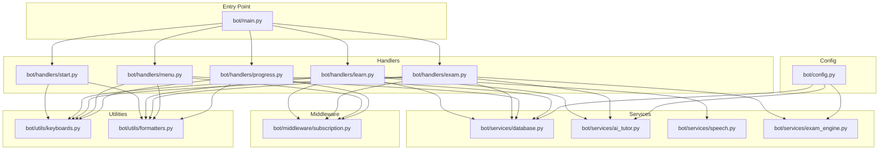
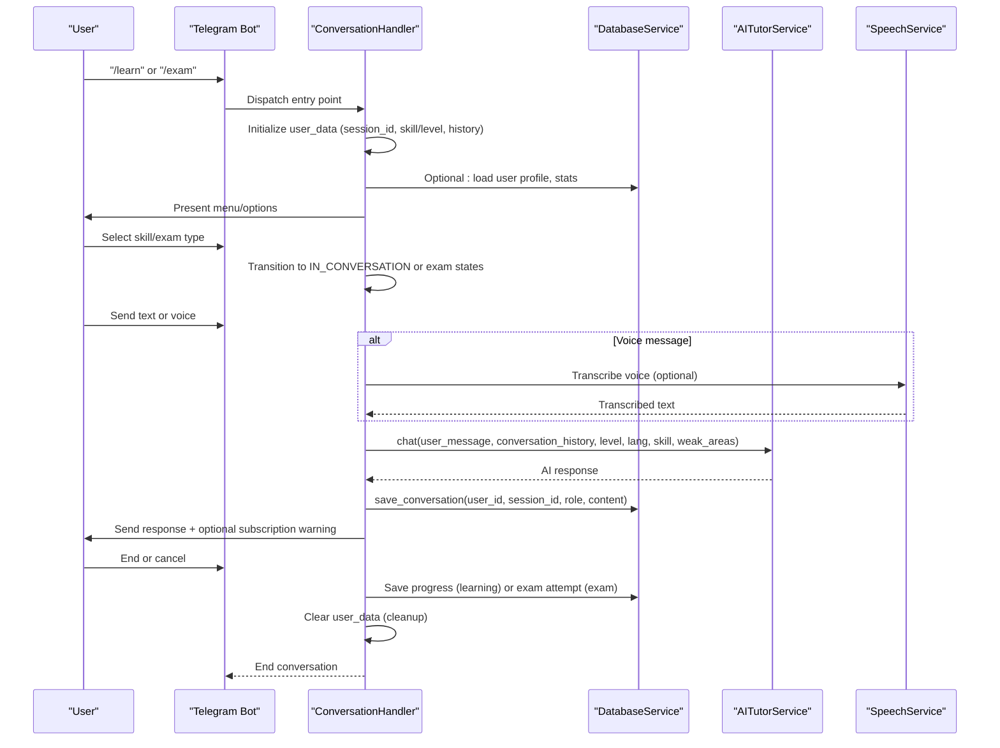
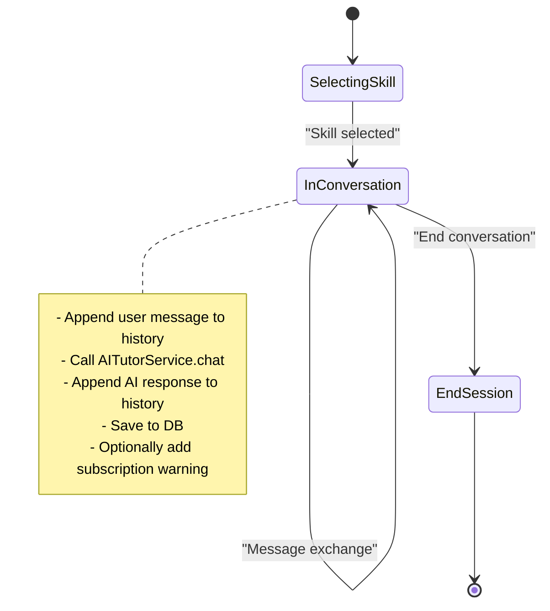
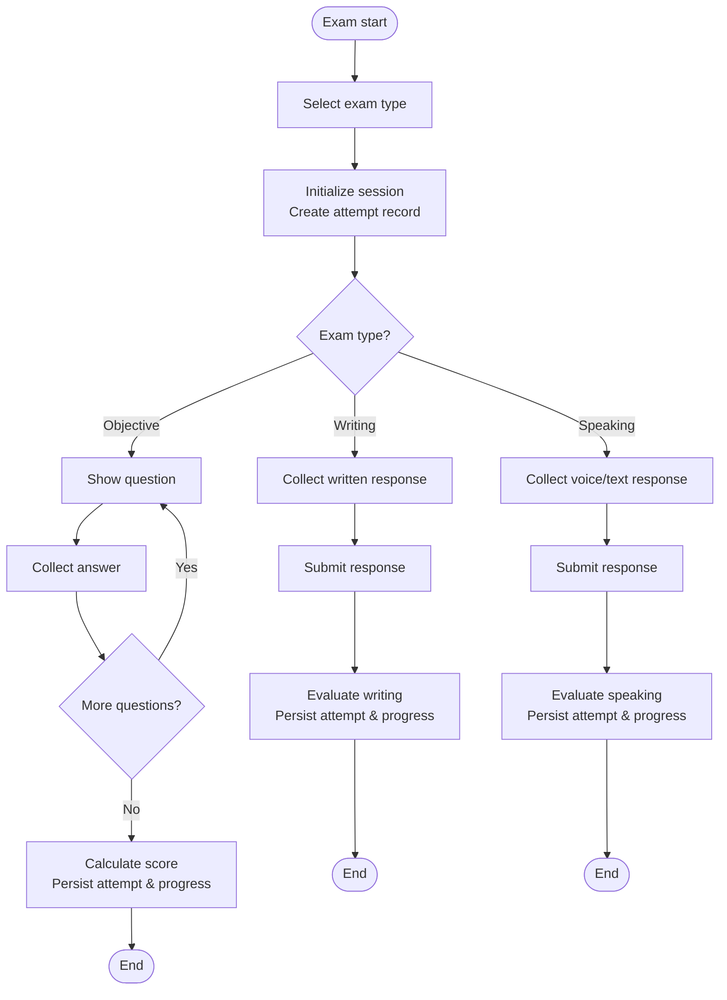
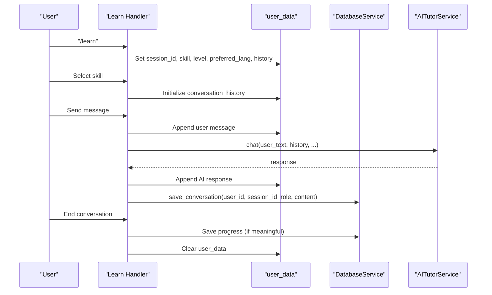
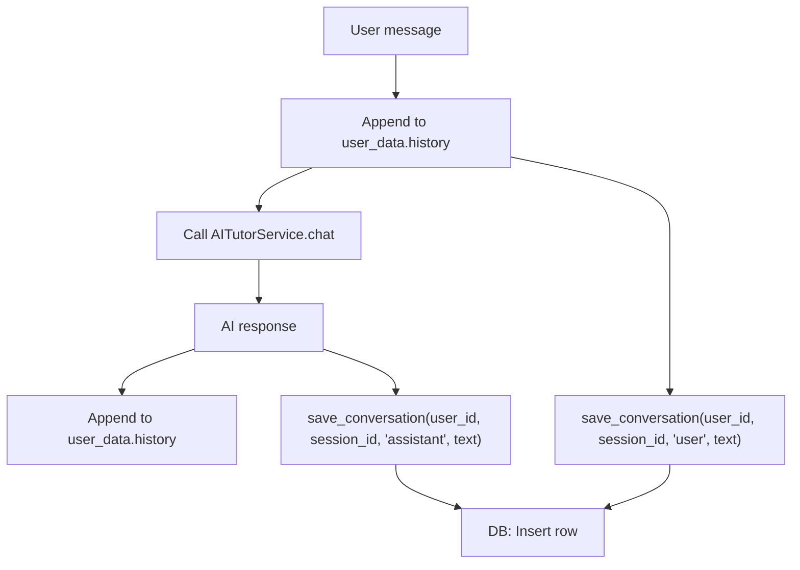
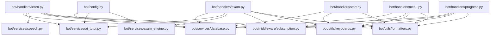

# Conversation Management

<cite>
**Referenced Files in This Document**
- [bot/main.py](file://bot/main.py)
- [bot/config.py](file://bot/config.py)
- [bot/services/database.py](file://bot/services/database.py)
- [bot/services/ai_tutor.py](file://bot/services/ai_tutor.py)
- [bot/services/exam_engine.py](file://bot/services/exam_engine.py)
- [bot/services/speech.py](file://bot/services/speech.py)
- [bot/handlers/start.py](file://bot/handlers/start.py)
- [bot/handlers/learn.py](file://bot/handlers/learn.py)
- [bot/handlers/exam.py](file://bot/handlers/exam.py)
- [bot/handlers/menu.py](file://bot/handlers/menu.py)
- [bot/handlers/progress.py](file://bot/handlers/progress.py)
- [bot/middleware/subscription.py](file://bot/middleware/subscription.py)
- [bot/utils/keyboards.py](file://bot/utils/keyboards.py)
- [bot/utils/formatters.py](file://bot/utils/formatters.py)
- [prompts/tutor_system.txt](file://prompts/tutor_system.txt)
</cite>

## Table of Contents
1. [Introduction](#introduction)
2. [Project Structure](#project-structure)
3. [Core Components](#core-components)
4. [Architecture Overview](#architecture-overview)
5. [Detailed Component Analysis](#detailed-component-analysis)
6. [Dependency Analysis](#dependency-analysis)
7. [Performance Considerations](#performance-considerations)
8. [Troubleshooting Guide](#troubleshooting-guide)
9. [Conclusion](#conclusion)

## Introduction
This document explains the conversation management system of the EthioGerman Telegram AI Tutor Bot. It focuses on the state machine architecture using ConversationHandler, session lifecycle management, and user data persistence. It also covers conversation state transitions, session ID generation, context preservation across messages, conversation history storage, message formatting, real-time dialogue coordination, session timeout handling, user data cleanup, and conversation persistence strategies. Examples of conversation flow patterns, state management callbacks, and error recovery mechanisms are included, along with guidance on concurrent session handling, session isolation, and data consistency guarantees.

## Project Structure
The bot is organized around a central entry point that registers handlers and middleware, with dedicated modules for services (database, AI tutor, speech, exam engine), utilities (keyboards, formatters), and feature-specific handlers (start, learn, exam, menu, progress). Configuration is centralized in a configuration module.

**Diagram sources**
- [bot/main.py](file://bot/main.py#L60-L88)
- [bot/handlers/learn.py](file://bot/handlers/learn.py#L292-L314)
- [bot/handlers/exam.py](file://bot/handlers/exam.py#L489-L522)
- [bot/services/database.py](file://bot/services/database.py#L16-L416)
- [bot/services/ai_tutor.py](file://bot/services/ai_tutor.py#L19-L451)
- [bot/services/exam_engine.py](file://bot/services/exam_engine.py#L15-L211)
- [bot/services/speech.py](file://bot/services/speech.py#L21-L140)
- [bot/middleware/subscription.py](file://bot/middleware/subscription.py#L21-L156)
- [bot/utils/keyboards.py](file://bot/utils/keyboards.py#L10-L183)
- [bot/utils/formatters.py](file://bot/utils/formatters.py#L8-L300)
- [bot/config.py](file://bot/config.py#L10-L60)

**Section sources**
- [bot/main.py](file://bot/main.py#L60-L88)
- [bot/config.py](file://bot/config.py#L10-L60)

## Core Components
- ConversationHandler-based state machines for learning and exam flows
- Session-scoped user_data for state and context
- DatabaseService for persistence of users, progress, conversation history, and exam attempts
- AITutorService for AI-driven dialogue and evaluations
- SpeechService for optional voice-to-text transcription
- Middleware for subscription checks and warnings
- Utilities for consistent UI and messaging

Key responsibilities:
- Learn flow: skill selection → session initialization → message exchange → session end and progress save
- Exam flow: exam type selection → question presentation → answer collection → evaluation and results
- Persistence: per-session conversation history saved to database; user progress recorded; exam attempts tracked
- Context: conversation_history stored in user_data; AI receives recent messages; system prompt adapts to user profile

**Section sources**
- [bot/handlers/learn.py](file://bot/handlers/learn.py#L26-L314)
- [bot/handlers/exam.py](file://bot/handlers/exam.py#L27-L522)
- [bot/services/database.py](file://bot/services/database.py#L294-L339)
- [bot/services/ai_tutor.py](file://bot/services/ai_tutor.py#L82-L153)
- [bot/services/speech.py](file://bot/services/speech.py#L21-L140)
- [bot/middleware/subscription.py](file://bot/middleware/subscription.py#L21-L156)
- [bot/utils/keyboards.py](file://bot/utils/keyboards.py#L10-L183)
- [bot/utils/formatters.py](file://bot/utils/formatters.py#L8-L300)

## Architecture Overview
The conversation management architecture centers on two primary ConversationHandlers:
- Learning conversation handler orchestrates free conversation, grammar, reading, listening, writing, speaking, and vocabulary modes
- Exam conversation handler manages objective, writing, and speaking exam simulations

Both handlers rely on:
- user_data for session state and context
- DatabaseService for persistence
- AITutorService for AI responses and evaluations
- SpeechService for voice input processing
- Middleware for subscription gating
- Utilities for UI and formatting

**Diagram sources**
- [bot/handlers/learn.py](file://bot/handlers/learn.py#L30-L314)
- [bot/handlers/exam.py](file://bot/handlers/exam.py#L31-L522)
- [bot/services/database.py](file://bot/services/database.py#L296-L339)
- [bot/services/ai_tutor.py](file://bot/services/ai_tutor.py#L82-L153)
- [bot/services/speech.py](file://bot/services/speech.py#L83-L129)

## Detailed Component Analysis

### Learning Conversation Handler
The learning flow uses a ConversationHandler with two states:
- SELECTING_SKILL: skill selection and session initialization
- IN_CONVERSATION: message exchange loop with AI

Session lifecycle:
- Session ID generation: A UUID is generated and stored in user_data at skill selection
- Context preservation: conversation_history is maintained in user_data and appended to for each turn
- AI integration: AITutorService.chat receives recent messages (bounded by configuration) and user profile data
- Persistence: Each turn saves both user and assistant messages to conversation_history table
- End behavior: Saves progress if meaningful, clears user_data, and returns to main menu

**Diagram sources**
- [bot/handlers/learn.py](file://bot/handlers/learn.py#L26-L314)
- [bot/services/ai_tutor.py](file://bot/services/ai_tutor.py#L82-L153)
- [bot/services/database.py](file://bot/services/database.py#L296-L339)

Key implementation references:
- Entry points and states: [bot/handlers/learn.py](file://bot/handlers/learn.py#L292-L314)
- Skill selection and session init: [bot/handlers/learn.py](file://bot/handlers/learn.py#L53-L156)
- Message handling and AI call: [bot/handlers/learn.py](file://bot/handlers/learn.py#L159-L232)
- Persistence and progress save: [bot/handlers/learn.py](file://bot/handlers/learn.py#L219-L275)

**Section sources**
- [bot/handlers/learn.py](file://bot/handlers/learn.py#L26-L314)
- [bot/services/ai_tutor.py](file://bot/services/ai_tutor.py#L82-L153)
- [bot/services/database.py](file://bot/services/database.py#L296-L339)

### Exam Conversation Handler
The exam flow supports objective, writing, and speaking modes with distinct states:
- SELECTING_EXAM: exam type selection
- ANSWERING_OBJECTIVE: MCQ handling
- WRITING_RESPONSE: multi-message composition
- SPEAKING_RESPONSE: voice or text input
- REVIEWING_RESULTS: final score and feedback

Session lifecycle:
- Session initialization stores exam metadata and creates an exam attempt record
- Objective mode: presents questions, collects answers, computes score, persists attempt and progress
- Subjective mode: collects written/spoken responses, evaluates via AI, persists attempt and progress
- Cleanup: clears user_data on completion

**Diagram sources**
- [bot/handlers/exam.py](file://bot/handlers/exam.py#L31-L522)
- [bot/services/exam_engine.py](file://bot/services/exam_engine.py#L29-L114)
- [bot/services/ai_tutor.py](file://bot/services/ai_tutor.py#L154-L325)
- [bot/services/database.py](file://bot/services/database.py#L342-L411)

Key implementation references:
- Entry points and states: [bot/handlers/exam.py](file://bot/handlers/exam.py#L489-L522)
- Exam selection and init: [bot/handlers/exam.py](file://bot/handlers/exam.py#L31-L123)
- Objective handling: [bot/handlers/exam.py](file://bot/handlers/exam.py#L125-L216)
- Writing handling: [bot/handlers/exam.py](file://bot/handlers/exam.py#L218-L314)
- Speaking handling: [bot/handlers/exam.py](file://bot/handlers/exam.py#L317-L355)
- Submission and evaluation: [bot/handlers/exam.py](file://bot/handlers/exam.py#L358-L466)

**Section sources**
- [bot/handlers/exam.py](file://bot/handlers/exam.py#L27-L522)
- [bot/services/exam_engine.py](file://bot/services/exam_engine.py#L15-L211)
- [bot/services/ai_tutor.py](file://bot/services/ai_tutor.py#L154-L325)
- [bot/services/database.py](file://bot/services/database.py#L342-L411)

### Session Lifecycle and State Machine Architecture
- Session ID generation: A UUID is generated upon skill selection in the learning flow and stored in user_data
- State transitions: ConversationHandler manages transitions between states based on user input and callback patterns
- Context preservation: conversation_history is kept in user_data and appended to on each turn; AI receives recent messages bounded by configuration
- Real-time coordination: Typing indicators and immediate responses are coordinated via bot actions and AI service calls
- Cleanup: user_data is cleared on end or cancel, ensuring session isolation

**Diagram sources**
- [bot/handlers/learn.py](file://bot/handlers/learn.py#L85-L232)
- [bot/services/database.py](file://bot/services/database.py#L296-L339)
- [bot/services/ai_tutor.py](file://bot/services/ai_tutor.py#L82-L153)

**Section sources**
- [bot/handlers/learn.py](file://bot/handlers/learn.py#L85-L232)
- [bot/services/database.py](file://bot/services/database.py#L296-L339)
- [bot/services/ai_tutor.py](file://bot/services/ai_tutor.py#L82-L153)

### Conversation History Storage and Message Formatting
- History storage: Each turn appends user and assistant messages to conversation_history table with timestamps
- Retrieval: get_conversation_history fetches recent messages for context, ordered by timestamp
- Message formatting: Formatters provides consistent Markdown-formatted responses for exams, progress, and evaluations
- System prompt: AITutorService constructs a system prompt tailored to user level, preferred language, and skill focus

**Diagram sources**
- [bot/handlers/learn.py](file://bot/handlers/learn.py#L199-L221)
- [bot/services/database.py](file://bot/services/database.py#L296-L316)
- [bot/services/ai_tutor.py](file://bot/services/ai_tutor.py#L82-L153)
- [bot/utils/formatters.py](file://bot/utils/formatters.py#L130-L183)

**Section sources**
- [bot/services/database.py](file://bot/services/database.py#L296-L339)
- [bot/utils/formatters.py](file://bot/utils/formatters.py#L130-L183)
- [bot/services/ai_tutor.py](file://bot/services/ai_tutor.py#L33-L81)

### Session Timeout Handling and User Data Cleanup
- Session timeout: Config defines SESSION_TIMEOUT minutes; however, the current implementation does not enforce explicit timeouts in handlers
- Cleanup: user_data is cleared on end or cancel; conversation_history is persisted to DB before clearing
- Subscription cleanup: Middleware updates last_active on successful subscription checks; no explicit cleanup on timeout

Recommendations:
- Implement idle timeout detection using context.job_queue or external timers
- Persist and archive long-lived sessions periodically
- Add graceful timeout notifications before cleanup

**Section sources**
- [bot/config.py](file://bot/config.py#L34-L35)
- [bot/handlers/learn.py](file://bot/handlers/learn.py#L259-L275)
- [bot/handlers/exam.py](file://bot/handlers/exam.py#L413-L416)
- [bot/middleware/subscription.py](file://bot/middleware/subscription.py#L95-L96)

### Concurrent Session Handling and Isolation
- Per-user session isolation: user_data is scoped per user and cleared on session end
- No cross-session sharing: conversation_history is keyed by user_id and session_id
- Concurrency model: Telegram’s ConversationHandler processes updates sequentially per user; no explicit concurrency primitives are used

Guidelines:
- Avoid global shared state in handlers
- Use user_data for per-session state only
- Ensure database writes are atomic per turn

**Section sources**
- [bot/handlers/learn.py](file://bot/handlers/learn.py#L86-L90)
- [bot/services/database.py](file://bot/services/database.py#L296-L339)

### Data Consistency Guarantees
- Atomic writes: Each message is saved individually to conversation_history
- Eventual consistency: AI receives recent messages from user_data; DB retrieval ensures historical context
- Idempotency: No deduplication logic is implemented; repeated submissions would create duplicates

Recommendations:
- Add message_id deduplication at the DB layer
- Use transactions for multi-write sequences (e.g., save_conversation + save_progress)
- Implement optimistic locking for progress updates

**Section sources**
- [bot/services/database.py](file://bot/services/database.py#L296-L339)
- [bot/handlers/learn.py](file://bot/handlers/learn.py#L252-L257)

### Examples of Conversation Flow Patterns
- Free conversation mode: User selects “Free Conversation,” bot initializes session and continues until end
- Grammar practice: User selects “Grammar,” bot tailors system prompt to grammar focus and responds accordingly
- Reading comprehension: User triggers reading mode and receives prompts or passages
- Writing exam: Multi-message composition followed by AI evaluation and progress recording
- Speaking exam: Voice or text input processed, evaluated, and results shown

References:
- [bot/handlers/learn.py](file://bot/handlers/learn.py#L97-L156)
- [bot/handlers/exam.py](file://bot/handlers/exam.py#L218-L292)
- [bot/services/ai_tutor.py](file://bot/services/ai_tutor.py#L33-L81)

**Section sources**
- [bot/handlers/learn.py](file://bot/handlers/learn.py#L97-L156)
- [bot/handlers/exam.py](file://bot/handlers/exam.py#L218-L292)
- [bot/services/ai_tutor.py](file://bot/services/ai_tutor.py#L33-L81)

### State Management Callbacks and Error Recovery
- Callback patterns: Handlers use callback_query handlers for menu navigation and state transitions
- Error handling: Centralized error_handler logs exceptions and attempts to notify users
- Recovery: On AI failures, default responses are returned; on DB errors, operations log and continue gracefully

References:
- [bot/main.py](file://bot/main.py#L45-L58)
- [bot/services/ai_tutor.py](file://bot/services/ai_tutor.py#L147-L152)
- [bot/services/database.py](file://bot/services/database.py#L29-L31)

**Section sources**
- [bot/main.py](file://bot/main.py#L45-L58)
- [bot/services/ai_tutor.py](file://bot/services/ai_tutor.py#L147-L152)
- [bot/services/database.py](file://bot/services/database.py#L29-L31)

## Dependency Analysis
The conversation management system exhibits clear separation of concerns:
- Handlers depend on services for persistence, AI, and speech
- Middleware enforces access control
- Utilities provide UI and formatting
- Configuration drives behavior (timeouts, history limits)

**Diagram sources**
- [bot/handlers/learn.py](file://bot/handlers/learn.py#L17-L22)
- [bot/handlers/exam.py](file://bot/handlers/exam.py#L17-L23)
- [bot/handlers/start.py](file://bot/handlers/start.py#L9-L11)
- [bot/handlers/menu.py](file://bot/handlers/menu.py#L9-L12)
- [bot/handlers/progress.py](file://bot/handlers/progress.py#L9-L12)
- [bot/services/database.py](file://bot/services/database.py#L16-L416)
- [bot/services/ai_tutor.py](file://bot/services/ai_tutor.py#L19-L451)
- [bot/services/exam_engine.py](file://bot/services/exam_engine.py#L15-L211)
- [bot/middleware/subscription.py](file://bot/middleware/subscription.py#L13-L15)
- [bot/utils/keyboards.py](file://bot/utils/keyboards.py#L10-L183)
- [bot/utils/formatters.py](file://bot/utils/formatters.py#L8-L300)
- [bot/config.py](file://bot/config.py#L10-L60)

**Section sources**
- [bot/handlers/learn.py](file://bot/handlers/learn.py#L17-L22)
- [bot/handlers/exam.py](file://bot/handlers/exam.py#L17-L23)
- [bot/services/database.py](file://bot/services/database.py#L16-L416)
- [bot/services/ai_tutor.py](file://bot/services/ai_tutor.py#L19-L451)
- [bot/services/exam_engine.py](file://bot/services/exam_engine.py#L15-L211)
- [bot/middleware/subscription.py](file://bot/middleware/subscription.py#L13-L15)
- [bot/utils/keyboards.py](file://bot/utils/keyboards.py#L10-L183)
- [bot/utils/formatters.py](file://bot/utils/formatters.py#L8-L300)
- [bot/config.py](file://bot/config.py#L10-L60)

## Performance Considerations
- Conversation history length: Config.MAX_CONVERSATION_HISTORY bounds the number of previous messages sent to the AI, controlling latency and cost
- Asynchronous operations: Database and AI calls are asynchronous; ensure proper error handling and timeouts
- Speech transcription: Optional; enable only when faster-whisper is available to avoid degraded UX
- Logging: Centralized logging helps monitor performance and detect bottlenecks

[No sources needed since this section provides general guidance]

## Troubleshooting Guide
Common issues and resolutions:
- AI API errors: Default fallback responses are returned; check logs for HTTP status codes and timeouts
- Database errors: Operations log exceptions; verify credentials and network connectivity
- Speech transcription unavailable: Gracefully fall back to text input; check faster-whisper installation
- Subscription gating: Middleware prevents access to paid features; ensure user subscription status is valid
- Session cleanup: user_data is cleared on end/cancel; verify that progress and attempts are saved before clearing

**Section sources**
- [bot/services/ai_tutor.py](file://bot/services/ai_tutor.py#L147-L152)
- [bot/services/database.py](file://bot/services/database.py#L29-L31)
- [bot/services/speech.py](file://bot/services/speech.py#L14-L18)
- [bot/middleware/subscription.py](file://bot/middleware/subscription.py#L68-L89)
- [bot/handlers/learn.py](file://bot/handlers/learn.py#L259-L275)

## Conclusion
The conversation management system leverages Telegram’s ConversationHandler to deliver structured, stateful interactions for learning and exam simulations. Session-scoped user_data maintains context, while DatabaseService persists user profiles, progress, conversation history, and exam attempts. AITutorService integrates AI-driven dialogue and evaluations, and SpeechService optionally enables voice input. While the system provides robust state transitions and persistence, adding explicit session timeout handling, transactional writes, and deduplication would further strengthen reliability and consistency.