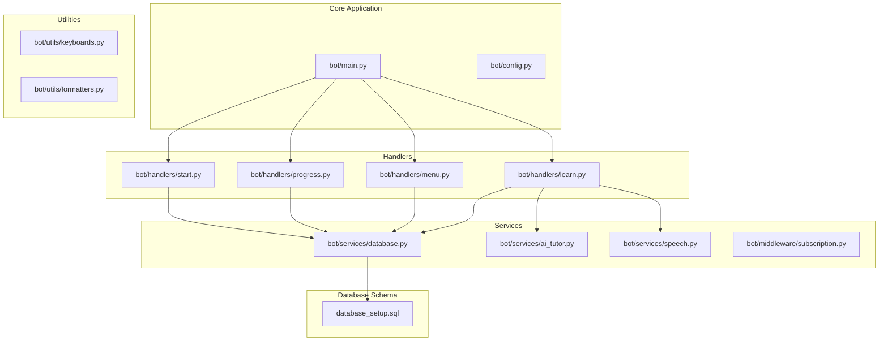
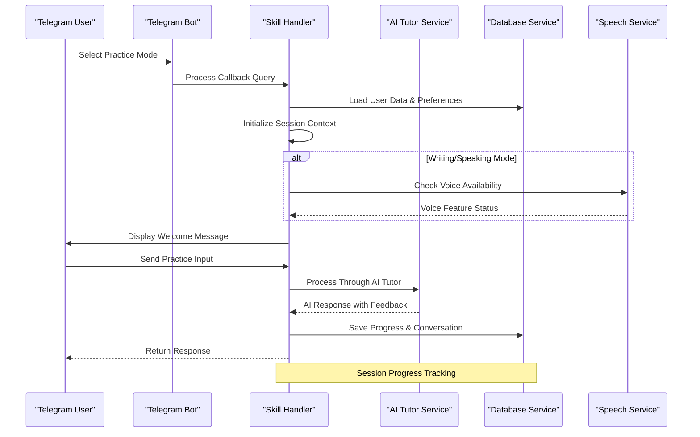
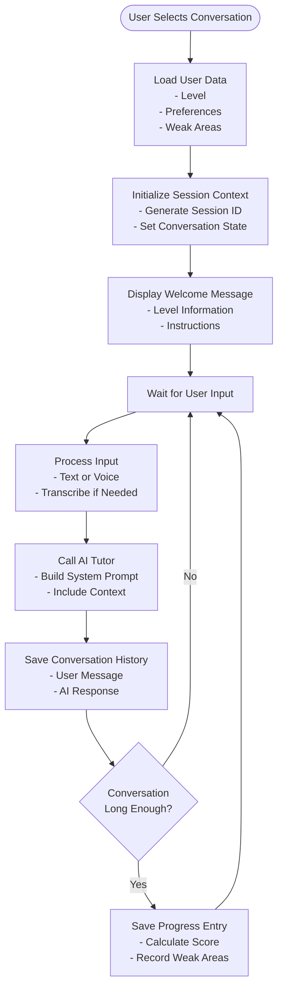
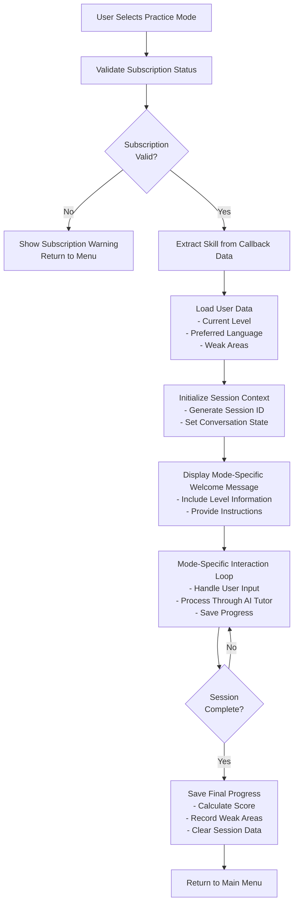
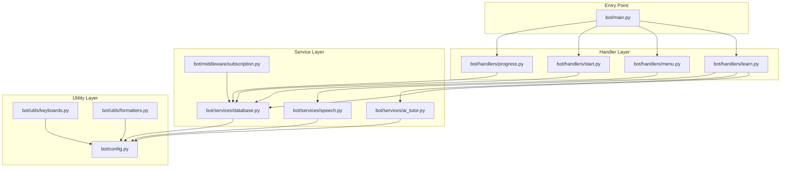

# Skill Practice Modes

<cite>
**Referenced Files in This Document**
- [main.py](file://bot/main.py)
- [config.py](file://bot/config.py)
- [keyboard.py](file://bot/utils/keyboards.py)
- [learn.py](file://bot/handlers/learn.py)
- [start.py](file://bot/handlers/start.py)
- [menu.py](file://bot/handlers/menu.py)
- [progress.py](file://bot/handlers/progress.py)
- [database.py](file://bot/services/database.py)
- [ai_tutor.py](file://bot/services/ai_tutor.py)
- [speech.py](file://bot/services/speech.py)
- [subscription.py](file://bot/middleware/subscription.py)
- [formatters.py](file://bot/utils/formatters.py)
- [database_setup.sql](file://database_setup.sql)
</cite>

## Table of Contents
1. [Introduction](#introduction)
2. [Project Structure](#project-structure)
3. [Core Components](#core-components)
4. [Architecture Overview](#architecture-overview)
5. [Detailed Component Analysis](#detailed-component-analysis)
6. [Dependency Analysis](#dependency-analysis)
7. [Performance Considerations](#performance-considerations)
8. [Troubleshooting Guide](#troubleshooting-guide)
9. [Conclusion](#conclusion)

## Introduction

The Skill Practice Modes system is a comprehensive German language learning platform built as a Telegram bot. It provides an adaptive, AI-powered learning experience with five distinct practice modes: conversation, grammar, reading, listening, writing, speaking, and vocabulary practice. The system integrates advanced features including subscription-based access control, user preference handling, weak area identification, and progress tracking.

The platform serves as an intelligent tutor that adapts to each learner's CEFR level (A1, A2, B1) and provides personalized feedback through an OpenRouter-powered AI system. Users can practice German language skills through interactive conversations, structured exercises, and comprehensive assessments.

## Project Structure

The skill practice modes system follows a modular architecture with clear separation of concerns:

**Diagram sources**
- [main.py](file://bot/main.py#L60-L88)
- [learn.py](file://bot/handlers/learn.py#L292-L314)
- [database.py](file://bot/services/database.py#L16-L415)

**Section sources**
- [main.py](file://bot/main.py#L1-L93)
- [config.py](file://bot/config.py#L1-L60)

## Core Components

### Configuration Management

The system uses a centralized configuration class that defines core constants and settings:

- **CEFR Levels**: A1, A2, B1 language proficiency levels
- **Skills**: Five primary language skills (lesen, horen, schreiben, sprechen, vokabular)
- **Languages**: English, Amharic, German explanation languages
- **API Settings**: OpenRouter integration with Llama 3.3 70B model
- **Session Management**: Conversation history limits and timeout settings

### Keyboard Layout System

The keyboard system provides consistent navigation across all practice modes:

- **Main Menu**: Access to learning center, exam center, progress tracking, settings, and help
- **Learn Menu**: Six practice modes with German interface support
- **Settings Menu**: Level adjustment, language preferences, and subscription management
- **Action Buttons**: Continue/Exit, Submit/Cancel, Next Question, and specialized mode buttons

### Database Schema

The system maintains comprehensive user data through a well-designed schema:

- **Users Table**: Profile information, subscription status, and preferences
- **Lessons Table**: Structured learning content organized by level and skill
- **Exam Questions**: Comprehensive question bank with difficulty ratings
- **User Progress**: Activity tracking and performance metrics
- **Conversation History**: Context preservation for AI interactions

**Section sources**
- [config.py](file://bot/config.py#L25-L39)
- [keyboard.py](file://bot/utils/keyboards.py#L10-L183)
- [database_setup.sql](file://database_setup.sql#L4-L84)

## Architecture Overview

The skill practice modes system implements a sophisticated multi-layered architecture:

**Diagram sources**
- [learn.py](file://bot/handlers/learn.py#L53-L156)
- [ai_tutor.py](file://bot/services/ai_tutor.py#L82-L153)
- [database.py](file://bot/services/database.py#L188-L211)

The architecture ensures scalability, maintainability, and user experience optimization through clear separation of concerns and robust error handling.

## Detailed Component Analysis

### Conversation Practice Mode

The conversation mode serves as the foundation for all practice modes, providing a flexible AI-powered tutoring environment.

#### Mode Configuration
- **Welcome Message**: Personalized greeting with level indication
- **Adaptive Difficulty**: AI adjusts complexity based on CEFR level
- **Context Preservation**: Maintains conversation history for coherent interactions
- **Multi-modal Support**: Text and voice message processing

#### Interaction Flow

**Diagram sources**
- [learn.py](file://bot/handlers/learn.py#L96-L156)
- [ai_tutor.py](file://bot/services/ai_tutor.py#L82-L153)

#### Adaptive Difficulty Implementation
The AI tutor adapts complexity based on CEFR level:
- **A1 Level**: Basic vocabulary, simple present tense, short sentences
- **A2 Level**: Past tense, modal verbs, compound sentences
- **B1 Level**: Complex grammar, subjunctive, varied vocabulary

**Section sources**
- [learn.py](file://bot/handlers/learn.py#L96-L156)
- [ai_tutor.py](file://bot/services/ai_tutor.py#L40-L80)

### Grammar Practice Mode

Focused grammar instruction with targeted exercises and immediate feedback.

#### Mode Features
- **Structured Lessons**: Organized grammar topics by CEFR level
- **Interactive Exercises**: Fill-in-the-blank and sentence correction
- **Explanatory Language**: Multiple language support for concept clarity
- **Progress Tracking**: Grammar skill development monitoring

#### Practice Instructions
Users receive guided grammar instruction with:
- Topic introduction and explanation
- Example sentences with translations
- Interactive practice questions
- Immediate correction with detailed explanations

**Section sources**
- [learn.py](file://bot/handlers/learn.py#L105-L111)
- [keyboard.py](file://bot/utils/keyboards.py#L26-L44)

### Reading Practice Mode

Comprehensive reading comprehension development through authentic German texts.

#### Content Delivery
- **Authentic Materials**: Real-world German texts appropriate for each level
- **Progressive Difficulty**: Text complexity increases with proficiency
- **Vocabulary Integration**: Targeted vocabulary building within context
- **Comprehension Questions**: Structured questions testing understanding

#### Reading Prompts
Users can trigger reading materials through:
- "ready" command for immediate text delivery
- Contextual reading assignments based on weak areas
- Adaptive text selection matching current proficiency

**Section sources**
- [learn.py](file://bot/handlers/learn.py#L112-L118)
- [ai_tutor.py](file://bot/services/ai_tutor.py#L327-L424)

### Listening Practice Mode

Developing auditory comprehension through contextual scenarios and authentic audio.

#### Listening Features
- **Scenario-Based Learning**: Real-life situations for practical listening
- **Audio Integration**: Device-dependent audio processing capabilities
- **Comprehension Focus**: Understanding spoken German in context
- **Cultural Context**: Authentic German expressions and colloquialisms

#### Practice Instructions
Users engage through:
- Descriptive scenario presentations
- Comprehension questions after audio playback
- Follow-up discussions to reinforce understanding
- Progressive difficulty in audio complexity

**Section sources**
- [learn.py](file://bot/handlers/learn.py#L119-L125)
- [speech.py](file://bot/services/speech.py#L13-L44)

### Writing Practice Mode

Structured writing development with comprehensive evaluation and improvement suggestions.

#### Writing Components
- **Prompt Generation**: AI-generated writing tasks appropriate for level
- **Evaluation System**: Multi-criteria assessment (grammar, vocabulary, coherence)
- **Correction Mechanism**: Detailed error identification and correction
- **Progressive Tasks**: Increasing complexity with skill advancement

#### Evaluation Criteria
The writing evaluation system assesses:
- **Grammar**: 30% weight for appropriate language use
- **Vocabulary**: 30% weight for range and appropriateness
- **Task Completion**: 20% weight for addressing prompt requirements
- **Coherence**: 20% weight for logical flow and organization

#### Writing Instructions
Users receive structured writing tasks through:
- AI-generated prompts with specific requirements
- Word count guidelines appropriate for CEFR level
- Example points to ensure comprehensive coverage
- Submission process with review and feedback

**Section sources**
- [learn.py](file://bot/handlers/learn.py#L126-L132)
- [ai_tutor.py](file://bot/services/ai_tutor.py#L154-L238)

### Speaking Practice Mode

Advanced pronunciation and fluency development through voice message interaction.

#### Speaking Features
- **Voice Message Support**: Direct audio input processing
- **Transcription Integration**: Automatic speech-to-text conversion
- **Pronunciation Analysis**: Fluency and accuracy assessment
- **Feedback System**: Detailed correction and improvement suggestions

#### Voice Processing
The system handles voice messages through:
- **Automatic Transcription**: Faster-Whisper integration for accuracy
- **Quality Assessment**: Fluency, grammar, vocabulary, and task completion
- **Pronunciation Tips**: Specific guidance for sound production
- **Progressive Challenges**: Increasing complexity with skill development

#### Speaking Instructions
Users engage through:
- Task descriptions with preparation time guidance
- Response time limits appropriate for proficiency level
- Useful phrase suggestions for natural expression
- Audio recording and submission process

**Section sources**
- [learn.py](file://bot/handlers/learn.py#L133-L139)
- [speech.py](file://bot/services/speech.py#L83-L139)
- [ai_tutor.py](file://bot/services/ai_tutor.py#L239-L326)

### Vocabulary Practice Mode

Systematic vocabulary building with spaced repetition and contextual learning.

#### Vocabulary Components
- **Word Lists**: Structured vocabulary by theme and difficulty
- **Flashcard System**: Interactive word recognition and recall
- **Contextual Usage**: Words in authentic sentence examples
- **Quiz Integration**: Spaced repetition and reinforcement

#### Practice Methods
Users develop vocabulary through:
- Word definitions with example sentences
- Multiple-choice quizzes for recognition
- Spelling and translation exercises
- Progressive difficulty in word complexity

**Section sources**
- [learn.py](file://bot/handlers/learn.py#L140-L146)
- [keyboard.py](file://bot/utils/keyboards.py#L103-L112)

### Mode Selection Logic

The system implements intelligent mode selection with user preference integration:

**Diagram sources**
- [learn.py](file://bot/handlers/learn.py#L53-L156)
- [menu.py](file://bot/handlers/menu.py#L68-L81)

**Section sources**
- [learn.py](file://bot/handlers/learn.py#L53-L156)
- [menu.py](file://bot/handlers/menu.py#L68-L116)

### User Preference Handling

The system maintains comprehensive user preferences for personalized learning:

#### Preference Categories
- **CEFR Level**: Current German proficiency level (A1, A2, B1)
- **Preferred Language**: Explanation language (English, Amharic, German)
- **Weak Areas**: Identified skill weaknesses for targeted practice
- **Subscription Status**: Active, expired, or pending status

#### Preference Integration
Preferences influence:
- AI tutor system prompts and teaching style
- Content difficulty and complexity
- Practice mode recommendations
- Progress tracking and assessment criteria

**Section sources**
- [start.py](file://bot/handlers/start.py#L76-L141)
- [menu.py](file://bot/handlers/menu.py#L118-L177)
- [database.py](file://bot/services/database.py#L233-L292)

### Weak Area Integration

The system implements sophisticated weak area identification and targeted practice:

#### Weak Area Detection
- **Progress Analysis**: Automatic calculation from user activities
- **Performance Metrics**: Average scores and trend analysis
- **Skill Comparison**: Strengths vs. weaknesses identification
- **Pattern Recognition**: Common error patterns and recurring difficulties

#### Targeted Practice Implementation
Weak areas influence:
- Mode recommendations for improvement
- Content difficulty adjustments
- Practice frequency prioritization
- Feedback emphasis on specific skills

#### Progress Tracking
The system tracks:
- Individual skill scores over time
- Weak area improvement trends
- Overall proficiency development
- Mastery indicators for each skill

**Section sources**
- [database.py](file://bot/services/database.py#L233-L292)
- [progress.py](file://bot/handlers/progress.py#L39-L93)
- [formatters.py](file://bot/utils/formatters.py#L81-L128)

### Feedback Mechanisms

The system provides comprehensive feedback across all practice modes:

#### Immediate Feedback
- **Response Validation**: Real-time correctness assessment
- **Error Correction**: Detailed mistake identification and correction
- **Guided Improvement**: Specific suggestions for enhancement
- **Encouragement System**: Positive reinforcement for effort and progress

#### Detailed Evaluation
Each mode provides structured evaluation:
- **Writing**: Grammar, vocabulary, task completion, coherence breakdown
- **Speaking**: Grammar, vocabulary, task completion, fluency assessment
- **Grammar/Vocabulary**: Concept mastery and retention tracking
- **Reading/Listening**: Comprehension and understanding assessment

#### Progress Communication
Feedback includes:
- Performance summaries and trends
- Weak area identification and recommendations
- Achievement recognition and milestones
- Personalized learning path suggestions

**Section sources**
- [ai_tutor.py](file://bot/services/ai_tutor.py#L154-L326)
- [formatters.py](file://bot/utils/formatters.py#L186-L268)

### Mode Customization

The system supports extensive customization for individual learning needs:

#### Content Adaptation
- **Level-Based Difficulty**: Automatic content complexity adjustment
- **Skill-Focused Practice**: Targeted exercises for specific abilities
- **Personalized Content**: User-specific examples and contexts
- **Dynamic Assessment**: Adaptive questioning based on performance

#### Interface Customization
- **Language Preferences**: Dual-language support for instruction
- **Accessibility Features**: Voice message support for diverse needs
- **Visual Elements**: Progress indicators and achievement displays
- **Navigation Simplification**: Streamlined menu structures

#### Learning Path Personalization
Customization includes:
- Recommended practice sequences
- Content pacing based on proficiency
- Focus areas for improvement
- Challenge progression systems

**Section sources**
- [config.py](file://bot/config.py#L25-L32)
- [keyboard.py](file://bot/utils/keyboards.py#L75-L89)
- [ai_tutor.py](file://bot/services/ai_tutor.py#L33-L80)

## Dependency Analysis

The skill practice modes system demonstrates excellent architectural separation with minimal coupling:

**Diagram sources**
- [main.py](file://bot/main.py#L21-L81)
- [learn.py](file://bot/handlers/learn.py#L17-L22)

### Coupling and Cohesion Analysis

**High Cohesion**: Each module focuses on a specific responsibility:
- Handlers manage user interactions and navigation
- Services encapsulate business logic and external integrations
- Utilities provide reusable formatting and UI components
- Middleware handles cross-cutting concerns

**Low Coupling**: Modules communicate through well-defined interfaces:
- Services expose clean APIs for handlers
- Configuration provides centralized settings
- Utilities offer consistent formatting and UI patterns
- Middleware enables policy enforcement without handler modification

**Potential Circular Dependencies**: None identified in the current architecture, ensuring maintainable code structure.

**External Dependencies**: 
- OpenRouter API for AI tutoring capabilities
- Supabase for database operations
- Telegram Bot API for messaging platform
- faster-whisper for speech processing (optional)

**Section sources**
- [main.py](file://bot/main.py#L21-L81)
- [database.py](file://bot/services/database.py#L16-L415)

## Performance Considerations

### API Response Optimization
- **Async Operations**: Non-blocking database and API calls
- **Connection Pooling**: Efficient resource utilization for external services
- **Timeout Management**: Balanced response times with user experience
- **Error Handling**: Graceful degradation when external services fail

### Memory Management
- **Conversation History Limits**: Configurable context window for AI interactions
- **Session Cleanup**: Automatic clearing of temporary user data
- **Resource Deallocation**: Proper cleanup of speech processing resources
- **Database Connection Management**: Efficient query execution patterns

### Scalability Factors
- **Modular Design**: Independent scaling of different service components
- **Asynchronous Processing**: Concurrent user session handling
- **Caching Opportunities**: Potential for static content caching
- **Database Indexing**: Optimized queries for user data and progress tracking

### User Experience Optimization
- **Loading Indicators**: Chat action feedback during AI processing
- **Graceful Degradation**: Alternative modes when features are unavailable
- **Progressive Loading**: Step-by-step content delivery
- **Error Recovery**: User-friendly error messages and recovery options

## Troubleshooting Guide

### Common Issues and Solutions

#### Subscription Access Problems
**Symptoms**: Users unable to access learning features
**Causes**: Expired or inactive subscription status
**Solutions**:
- Verify subscription status through database service
- Implement subscription renewal reminders
- Provide clear error messages with resolution steps

#### AI Service Failures
**Symptoms**: Error responses from AI tutor
**Causes**: API timeouts, network issues, or service unavailability
**Solutions**:
- Implement retry mechanisms with exponential backoff
- Provide fallback responses for critical failures
- Monitor service health and alert on downtime

#### Speech Processing Issues
**Symptoms**: Voice message processing failures
**Causes**: Missing faster-whisper installation or model loading errors
**Solutions**:
- Graceful degradation to text-based alternatives
- Clear error messages indicating feature unavailability
- Logging for debugging and maintenance

#### Database Connection Problems
**Symptoms**: User data not persisting or loading failures
**Causes**: Network connectivity or authentication issues
**Solutions**:
- Implement connection pooling and retry logic
- Provide offline mode indicators
- Log detailed error information for debugging

### Debugging Strategies

#### Logging Implementation
- **Error Logging**: Comprehensive error capture with context
- **Performance Monitoring**: Response time tracking and bottleneck identification
- **User Activity Tracking**: Session monitoring and usage patterns
- **External Service Monitoring**: API call tracking and failure analysis

#### Testing Approaches
- **Unit Testing**: Individual component functionality verification
- **Integration Testing**: Cross-service communication validation
- **User Acceptance Testing**: Real-world usage scenario validation
- **Performance Testing**: Load testing and scalability validation

**Section sources**
- [subscription.py](file://bot/middleware/subscription.py#L47-L101)
- [speech.py](file://bot/services/speech.py#L13-L19)
- [ai_tutor.py](file://bot/services/ai_tutor.py#L147-L152)

## Conclusion

The Skill Practice Modes system represents a comprehensive, scalable solution for German language learning through AI-powered interaction. The system successfully integrates multiple practice modes with adaptive difficulty, user preference handling, and sophisticated progress tracking.

Key achievements include:
- **Comprehensive Coverage**: Seven distinct practice modes addressing all language skills
- **Adaptive Learning**: AI-powered personalization based on CEFR levels and individual progress
- **Robust Architecture**: Modular design enabling easy maintenance and future enhancements
- **User-Centric Design**: Intuitive navigation and comprehensive feedback systems
- **Professional Standards**: Production-ready code with error handling and performance optimization

The system provides an excellent foundation for continued development, including potential enhancements for gamification, social learning features, and expanded content libraries. The clear separation of concerns and well-documented architecture facilitate future improvements while maintaining system stability and user experience quality.