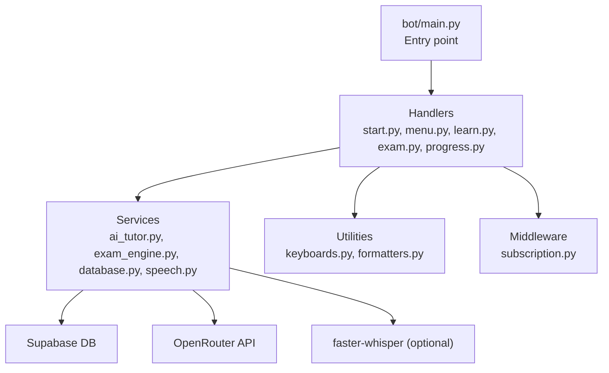
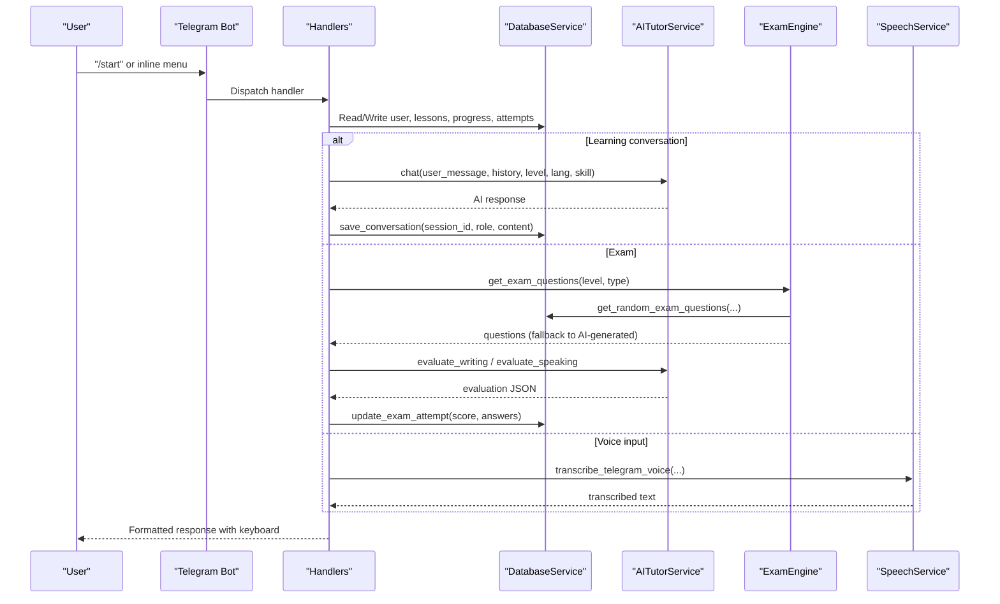
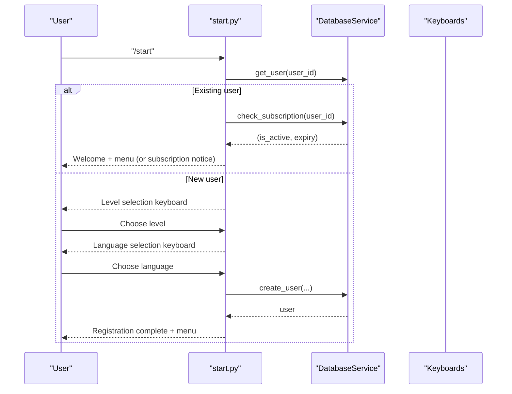
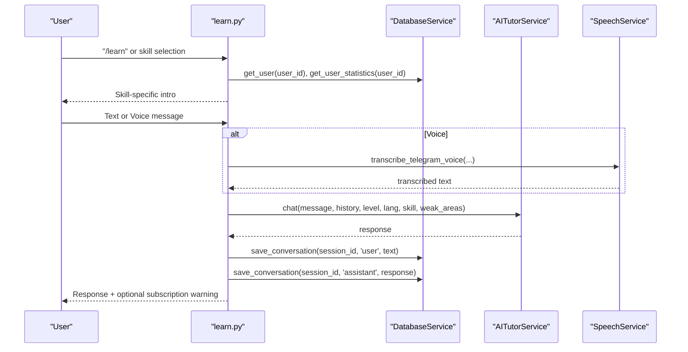
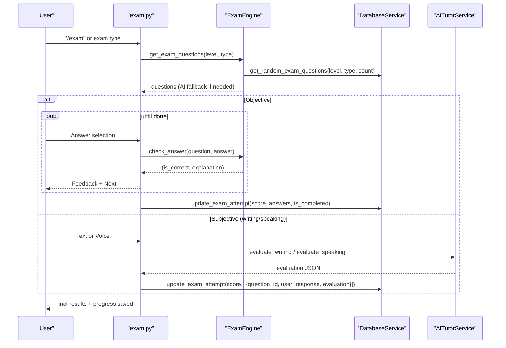
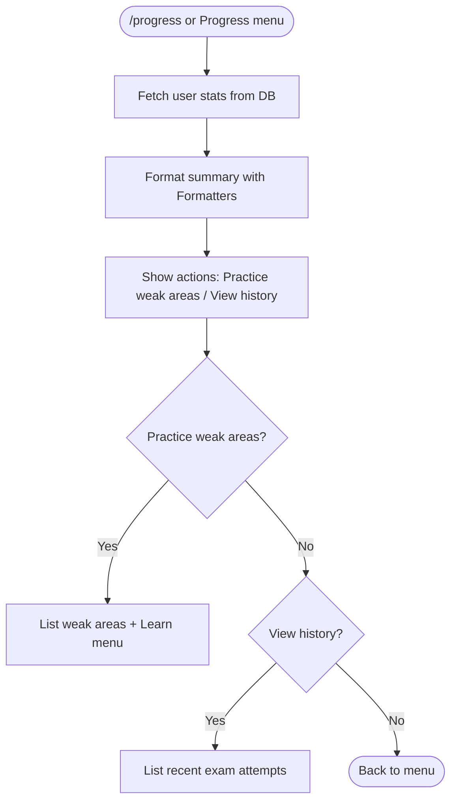
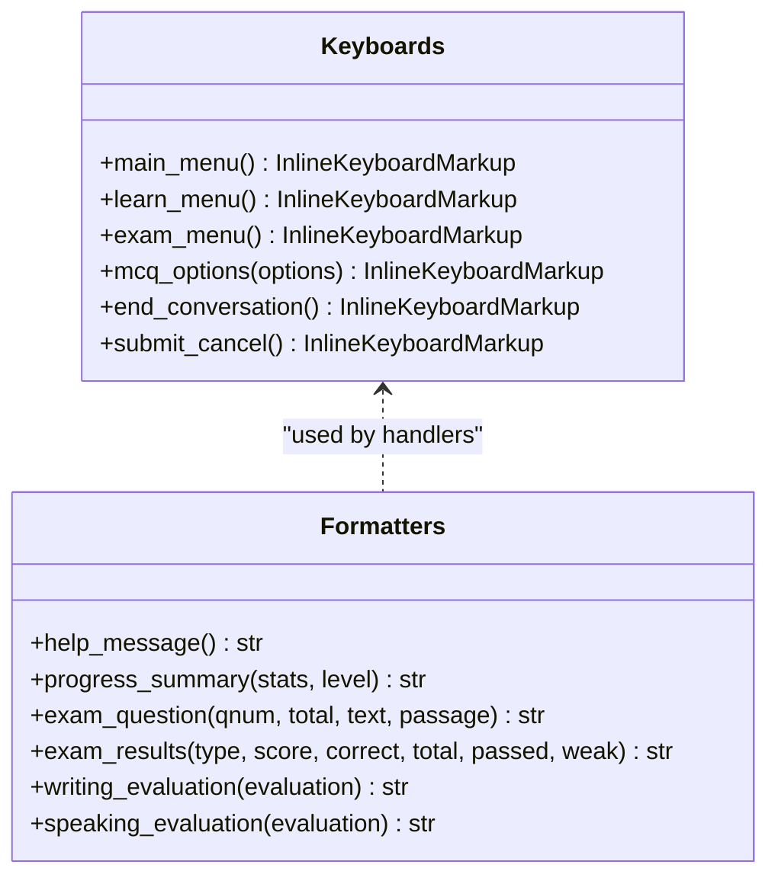
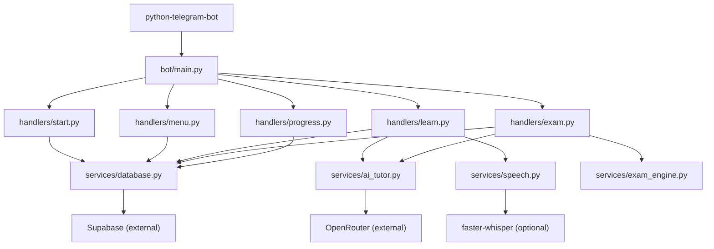

# Core Features

<cite>
**Referenced Files in This Document**
- [bot/main.py](file://bot/main.py)
- [bot/config.py](file://bot/config.py)
- [bot/services/database.py](file://bot/services/database.py)
- [bot/services/ai_tutor.py](file://bot/services/ai_tutor.py)
- [bot/services/exam_engine.py](file://bot/services/exam_engine.py)
- [bot/services/speech.py](file://bot/services/speech.py)
- [bot/handlers/start.py](file://bot/handlers/start.py)
- [bot/handlers/menu.py](file://bot/handlers/menu.py)
- [bot/handlers/learn.py](file://bot/handlers/learn.py)
- [bot/handlers/exam.py](file://bot/handlers/exam.py)
- [bot/handlers/progress.py](file://bot/handlers/progress.py)
- [bot/utils/keyboards.py](file://bot/utils/keyboards.py)
- [bot/utils/formatters.py](file://bot/utils/formatters.py)
- [bot/middleware/subscription.py](file://bot/middleware/subscription.py)
- [database_setup.sql](file://database_setup.sql)
- [setup_database.py](file://setup_database.py)
- [prompts/tutor_system.txt](file://prompts/tutor_system.txt)
- [requirements.txt](file://requirements.txt)
</cite>

## Table of Contents
1. [Introduction](#introduction)
2. [Project Structure](#project-structure)
3. [Core Components](#core-components)
4. [Architecture Overview](#architecture-overview)
5. [Detailed Component Analysis](#detailed-component-analysis)
6. [Dependency Analysis](#dependency-analysis)
7. [Performance Considerations](#performance-considerations)
8. [Troubleshooting Guide](#troubleshooting-guide)
9. [Conclusion](#conclusion)
10. [Appendices](#appendices)

## Introduction
FebEGLS-bot is a Telegram-based German language learning platform integrating AI tutoring, exam simulations aligned with CEFR A1–B1 levels, and a multi-modal learning experience. It supports text-based conversations, optional voice transcription for speaking practice, reading comprehension, writing exercises, and grammar drills. The system emphasizes personalized learning paths, progress tracking, and subscription-based access control, backed by a Supabase data layer and OpenRouter-powered AI.

## Project Structure
The project follows a modular Telegram bot architecture:
- Entry point initializes handlers and logging.
- Handlers manage user commands and inline menus.
- Services encapsulate AI tutoring, exam orchestration, speech transcription, and database operations.
- Utilities provide consistent UI keyboards and message formatting.
- Middleware enforces subscription checks.
- Database schema defines persistent entities and indexes.

**Diagram sources**
- [bot/main.py](file://bot/main.py#L60-L88)
- [bot/handlers/start.py](file://bot/handlers/start.py#L16-L74)
- [bot/handlers/menu.py](file://bot/handlers/menu.py#L17-L24)
- [bot/handlers/learn.py](file://bot/handlers/learn.py#L30-L50)
- [bot/handlers/exam.py](file://bot/handlers/exam.py#L31-L51)
- [bot/handlers/progress.py](file://bot/handlers/progress.py#L17-L36)
- [bot/services/database.py](file://bot/services/database.py#L16-L21)
- [bot/services/ai_tutor.py](file://bot/services/ai_tutor.py#L19-L31)
- [bot/services/speech.py](file://bot/services/speech.py#L21-L43)

**Section sources**
- [bot/main.py](file://bot/main.py#L60-L88)
- [bot/config.py](file://bot/config.py#L10-L59)

## Core Components
- Configuration: Centralized environment variables and constants for Telegram token, Supabase credentials, OpenRouter API, CEFR levels, skills, languages, timeouts, and conversation history limits.
- Database Service: CRUD operations for users, lessons, exam questions, progress, conversation history, and exam attempts; subscription checks; statistics aggregation.
- AI Tutor Service: Integrates OpenRouter API with Llama 3.3 70B to provide conversational tutoring, writing evaluations, speaking evaluations, and dynamic exam question generation.
- Exam Engine: Selects questions (database-backed with AI fallback), calculates scores, computes weighted full-mock scores, and provides level recommendations.
- Speech Service: Optional voice transcription using faster-whisper for speaking practice.
- Handlers: Implement command routing, conversation flows, inline menus, and callback logic for learning, exams, progress, and settings.
- Utilities: Keyboard builders and formatter helpers for consistent UI and message formatting.
- Middleware: Subscription enforcement for paid features.

**Section sources**
- [bot/config.py](file://bot/config.py#L10-L59)
- [bot/services/database.py](file://bot/services/database.py#L16-L415)
- [bot/services/ai_tutor.py](file://bot/services/ai_tutor.py#L19-L450)
- [bot/services/exam_engine.py](file://bot/services/exam_engine.py#L15-L210)
- [bot/services/speech.py](file://bot/services/speech.py#L21-L139)
- [bot/utils/keyboards.py](file://bot/utils/keyboards.py#L10-L182)
- [bot/utils/formatters.py](file://bot/utils/formatters.py#L8-L299)
- [bot/middleware/subscription.py](file://bot/middleware/subscription.py#L21-L155)

## Architecture Overview
The system is event-driven around Telegram updates. Handlers register stateful conversation flows for learning and exams, persisting data to Supabase and invoking AI services for tutoring and evaluations.

**Diagram sources**
- [bot/main.py](file://bot/main.py#L68-L81)
- [bot/handlers/learn.py](file://bot/handlers/learn.py#L159-L232)
- [bot/handlers/exam.py](file://bot/handlers/exam.py#L118-L122)
- [bot/services/database.py](file://bot/services/database.py#L296-L338)
- [bot/services/ai_tutor.py](file://bot/services/ai_tutor.py#L82-L153)
- [bot/services/exam_engine.py](file://bot/services/exam_engine.py#L29-L65)
- [bot/services/speech.py](file://bot/services/speech.py#L83-L128)

## Detailed Component Analysis

### Registration and User Management
- New users are guided through level and preferred language selection, persisted to the users table.
- Existing users receive subscription status checks and menu access.
- Settings allow changing level and preferred language.

**Diagram sources**
- [bot/handlers/start.py](file://bot/handlers/start.py#L16-L74)
- [bot/services/database.py](file://bot/services/database.py#L33-L58)
- [bot/utils/keyboards.py](file://bot/utils/keyboards.py#L65-L89)

**Section sources**
- [bot/handlers/start.py](file://bot/handlers/start.py#L16-L141)
- [bot/services/database.py](file://bot/services/database.py#L24-L103)
- [bot/utils/keyboards.py](file://bot/utils/keyboards.py#L65-L89)

### Conversation-Based AI Tutoring
- Users select a skill; the system stores session metadata and conversation history.
- AI responses incorporate level, preferred language, skill focus, and weak areas.
- Conversation history is saved to the database for continuity.

**Diagram sources**
- [bot/handlers/learn.py](file://bot/handlers/learn.py#L53-L156)
- [bot/handlers/learn.py](file://bot/handlers/learn.py#L159-L232)
- [bot/services/ai_tutor.py](file://bot/services/ai_tutor.py#L82-L153)
- [bot/services/database.py](file://bot/services/database.py#L296-L338)
- [bot/services/speech.py](file://bot/services/speech.py#L83-L128)

**Section sources**
- [bot/handlers/learn.py](file://bot/handlers/learn.py#L30-L288)
- [bot/services/ai_tutor.py](file://bot/services/ai_tutor.py#L19-L153)
- [bot/services/database.py](file://bot/services/database.py#L296-L338)
- [bot/services/speech.py](file://bot/services/speech.py#L21-L139)

### Interactive Exam Preparation
- Users select an exam type; the system fetches questions from the database or generates them dynamically.
- Objective exams use MCQs with immediate feedback; subjective exams (writing/speaking) are evaluated by the AI and stored with scores.
- Results are formatted and progress is recorded.

**Diagram sources**
- [bot/handlers/exam.py](file://bot/handlers/exam.py#L54-L122)
- [bot/services/exam_engine.py](file://bot/services/exam_engine.py#L29-L65)
- [bot/services/ai_tutor.py](file://bot/services/ai_tutor.py#L154-L325)
- [bot/services/database.py](file://bot/services/database.py#L342-L411)

**Section sources**
- [bot/handlers/exam.py](file://bot/handlers/exam.py#L31-L522)
- [bot/services/exam_engine.py](file://bot/services/exam_engine.py#L15-L210)
- [bot/services/ai_tutor.py](file://bot/services/ai_tutor.py#L154-L424)
- [bot/services/database.py](file://bot/services/database.py#L342-L411)

### Progress Tracking and Analytics
- Statistics include total activities, average score, per-skill scores, top weak areas, and strengths.
- Progress entries are saved for both tutoring and exam activities.
- Users can review recent exam attempts and targeted practice suggestions.

**Diagram sources**
- [bot/handlers/progress.py](file://bot/handlers/progress.py#L17-L93)
- [bot/services/database.py](file://bot/services/database.py#L233-L292)
- [bot/utils/formatters.py](file://bot/utils/formatters.py#L81-L128)

**Section sources**
- [bot/handlers/progress.py](file://bot/handlers/progress.py#L17-L93)
- [bot/services/database.py](file://bot/services/database.py#L212-L292)
- [bot/utils/formatters.py](file://bot/utils/formatters.py#L81-L128)

### User Interface Patterns, Keyboard Navigation, and Message Formatting
- Inline keyboards provide consistent navigation across menus and actions.
- Formatters ensure Markdown-compliant, localized messages with emojis and progress bars.
- Subscription middleware injects warnings for expiring subscriptions.

**Diagram sources**
- [bot/utils/keyboards.py](file://bot/utils/keyboards.py#L10-L182)
- [bot/utils/formatters.py](file://bot/utils/formatters.py#L8-L299)

**Section sources**
- [bot/utils/keyboards.py](file://bot/utils/keyboards.py#L10-L182)
- [bot/utils/formatters.py](file://bot/utils/formatters.py#L8-L299)
- [bot/middleware/subscription.py](file://bot/middleware/subscription.py#L140-L155)

### CEFR-Aligned Learning System and Goethe Simulation
- Supported levels: A1, A2, B1.
- Skills: lesen, horen, schreiben, sprechen, vokabular.
- Exam engine weights: lesen 25%, horen 25%, schreiben 20%, sprechen 20%, vokabular 10%.
- AI system prompt and rubrics guide evaluations and question generation.

**Section sources**
- [bot/config.py](file://bot/config.py#L25-L29)
- [bot/services/exam_engine.py](file://bot/services/exam_engine.py#L116-L148)
- [prompts/tutor_system.txt](file://prompts/tutor_system.txt#L1-L74)

### Multi-Modal Learning
- Text-based conversations with AI tutor.
- Optional voice transcription for speaking practice via faster-whisper.
- Reading comprehension and writing prompts with AI evaluation.

**Section sources**
- [bot/services/speech.py](file://bot/services/speech.py#L21-L139)
- [bot/handlers/learn.py](file://bot/handlers/learn.py#L165-L187)
- [bot/handlers/exam.py](file://bot/handlers/exam.py#L317-L355)

## Dependency Analysis
- Telegram bot framework routes updates to handlers.
- Handlers depend on services for AI, DB, and speech.
- Services depend on configuration and external APIs.
- Middleware decorates handlers to enforce subscription policies.

**Diagram sources**
- [bot/main.py](file://bot/main.py#L12-L19)
- [requirements.txt](file://requirements.txt#L1-L7)
- [bot/services/database.py](file://bot/services/database.py#L10-L21)
- [bot/services/ai_tutor.py](file://bot/services/ai_tutor.py#L22-L31)
- [bot/services/speech.py](file://bot/services/speech.py#L12-L18)

**Section sources**
- [bot/main.py](file://bot/main.py#L12-L19)
- [requirements.txt](file://requirements.txt#L1-L7)

## Performance Considerations
- Conversation history capped to reduce context size and latency.
- Async HTTP clients minimize blocking during AI API calls.
- Database queries use indexes on frequently filtered columns.
- Speech transcription runs asynchronously and cleans up temporary files.
- Logging configured to reduce noise from lower-priority libraries.

[No sources needed since this section provides general guidance]

## Troubleshooting Guide
- Subscription errors: Middleware returns actionable messages for missing/expired subscriptions.
- AI API failures: Fallback responses ensure continuity; logs capture error details.
- Speech transcription: Graceful degradation when faster-whisper is unavailable; logs indicate unavailability.
- Database connectivity: Errors are logged and surfaced to handlers; ensure Supabase URL/key are set.

**Section sources**
- [bot/middleware/subscription.py](file://bot/middleware/subscription.py#L68-L89)
- [bot/services/ai_tutor.py](file://bot/services/ai_tutor.py#L147-L152)
- [bot/services/speech.py](file://bot/services/speech.py#L17-L18)
- [bot/services/database.py](file://bot/services/database.py#L29-L31)

## Conclusion
FebEGLS-bot delivers a cohesive German learning experience through integrated AI tutoring, CEFR-aligned exam simulations, and robust progress tracking. Its modular design, subscription-aware flows, and multi-modal capabilities enable scalable, personalized education on Telegram.

[No sources needed since this section summarizes without analyzing specific files]

## Appendices

### Data Persistence Requirements
- Supabase tables and indexes are defined in the schema file; run the SQL in the Supabase SQL Editor to initialize the database.

**Section sources**
- [database_setup.sql](file://database_setup.sql#L1-L84)
- [setup_database.py](file://setup_database.py#L102-L152)

### Feature Interdependencies
- Learning depends on subscription status, user preferences, and conversation history.
- Exams depend on question availability (DB or AI-generated) and evaluation services.
- Progress relies on saved attempts and aggregated statistics.

**Section sources**
- [bot/middleware/subscription.py](file://bot/middleware/subscription.py#L21-L44)
- [bot/services/database.py](file://bot/services/database.py#L188-L292)
- [bot/services/exam_engine.py](file://bot/services/exam_engine.py#L29-L65)

### Integration with External Services
- Telegram Bot API for messaging and updates.
- Supabase for relational data storage and indexing.
- OpenRouter API for AI tutoring and evaluation.
- faster-whisper for optional voice transcription.

**Section sources**
- [bot/main.py](file://bot/main.py#L12-L19)
- [bot/services/database.py](file://bot/services/database.py#L10-L21)
- [bot/services/ai_tutor.py](file://bot/services/ai_tutor.py#L22-L31)
- [bot/services/speech.py](file://bot/services/speech.py#L12-L18)
- [requirements.txt](file://requirements.txt#L1-L7)