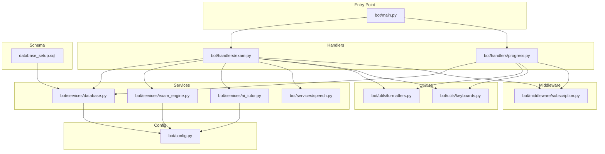
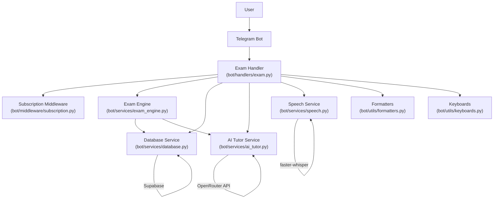
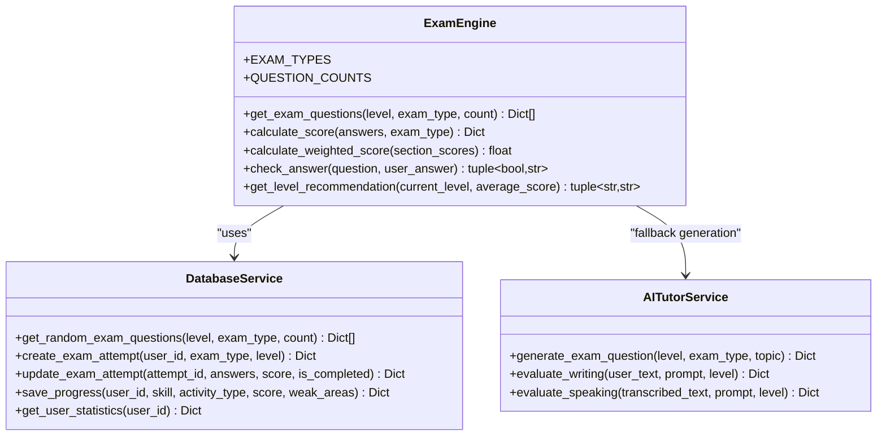
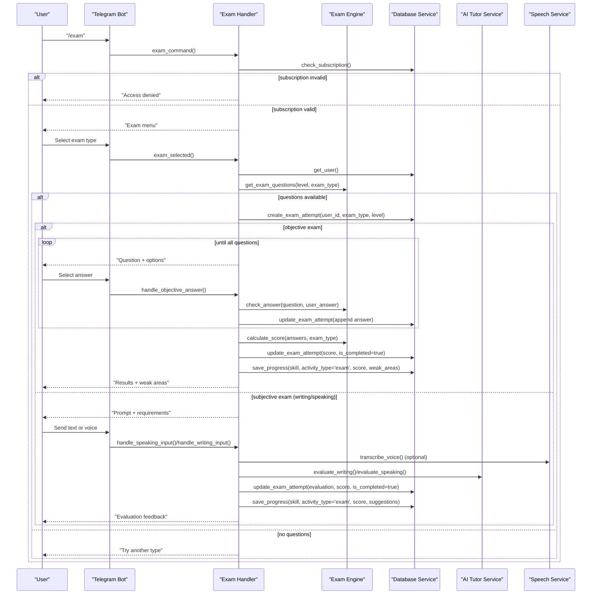
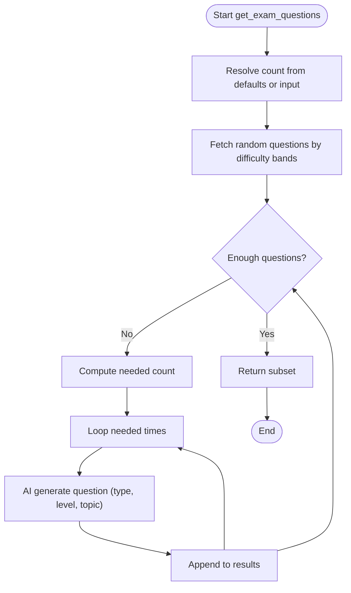
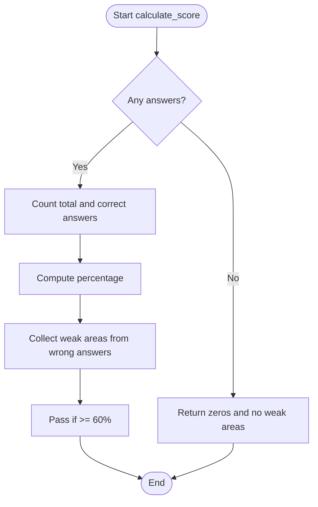
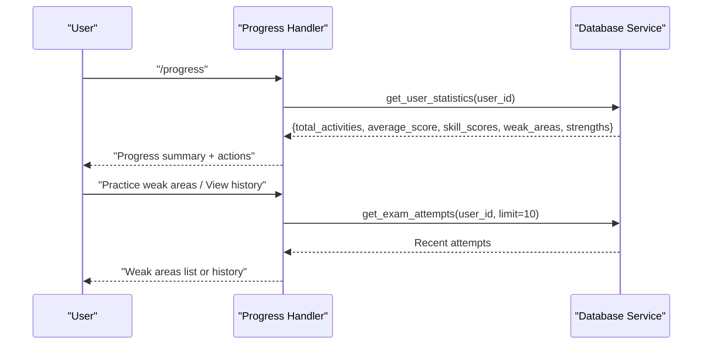
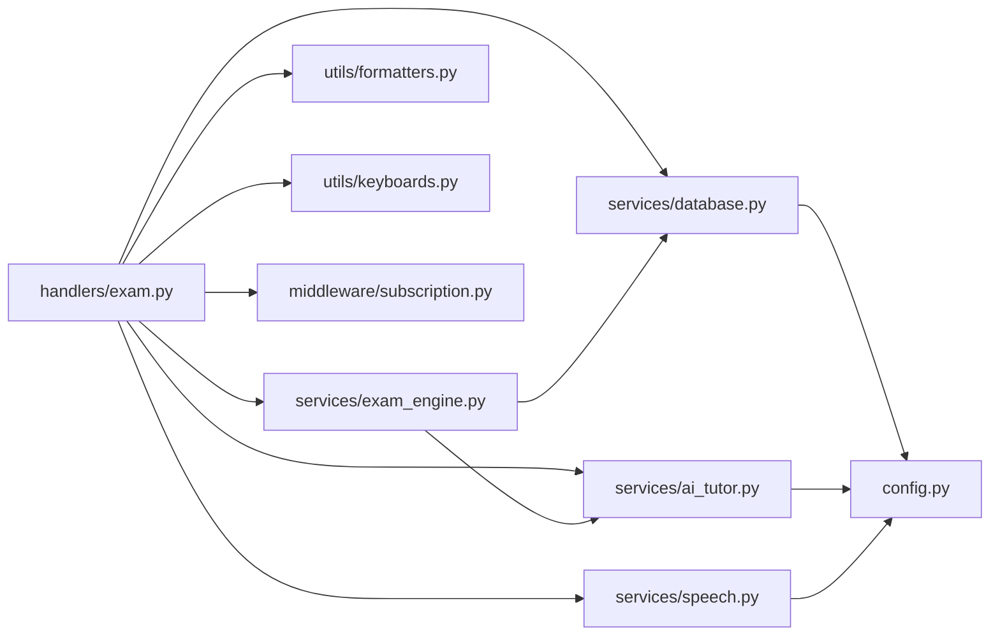
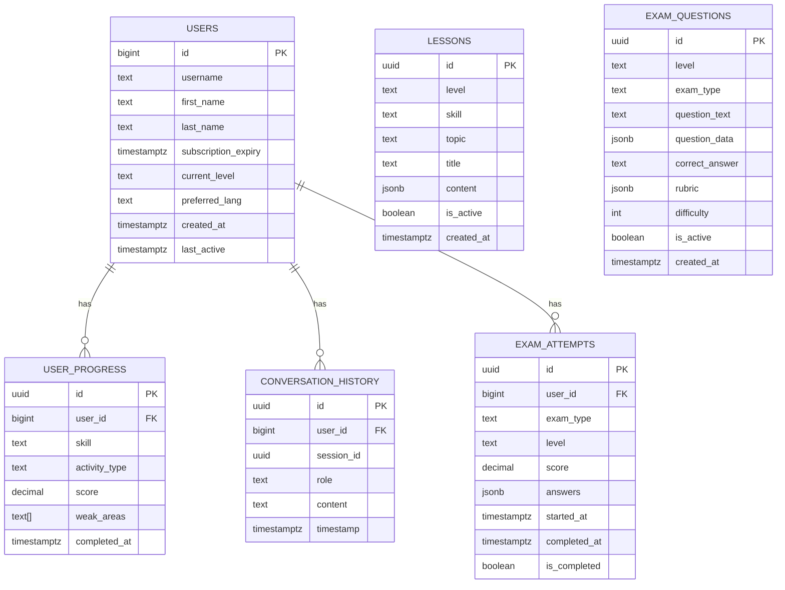

# Exam Preparation System

<cite>
**Referenced Files in This Document**
- [main.py](file://bot/main.py)
- [config.py](file://bot/config.py)
- [database_setup.sql](file://database_setup.sql)
- [setup_database.py](file://setup_database.py)
- [subscription.py](file://bot/middleware/subscription.py)
- [formatters.py](file://bot/utils/formatters.py)
- [keyboards.py](file://bot/utils/keyboards.py)
- [speech.py](file://bot/services/speech.py)
- [database.py](file://bot/services/database.py)
- [ai_tutor.py](file://bot/services/ai_tutor.py)
- [exam_engine.py](file://bot/services/exam_engine.py)
- [exam.py](file://bot/handlers/exam.py)
- [progress.py](file://bot/handlers/progress.py)
- [tutor_system.txt](file://prompts/tutor_system.txt)
</cite>

## Table of Contents
1. [Introduction](#introduction)
2. [Project Structure](#project-structure)
3. [Core Components](#core-components)
4. [Architecture Overview](#architecture-overview)
5. [Detailed Component Analysis](#detailed-component-analysis)
6. [Dependency Analysis](#dependency-analysis)
7. [Performance Considerations](#performance-considerations)
8. [Troubleshooting Guide](#troubleshooting-guide)
9. [Conclusion](#conclusion)
10. [Appendices](#appendices)

## Introduction
This document describes the Goethe exam preparation system built as a Telegram bot. It focuses on the exam simulation functionality, including question generation, answer evaluation, automated scoring, and reporting. It also covers the exam engine architecture, skill-based categorization (reading, writing, listening, speaking, vocabulary), difficulty adaptation, exam attempt tracking, performance analytics, weak area identification, and integration with AI-driven templates and rubrics. Certification preparation workflows and subscription gating are addressed.

## Project Structure
The system is organized around a Telegram bot entry point, handler modules for commands and conversations, service modules for AI, database, speech, and exam logic, and utility modules for formatting and keyboard layouts. Configuration and database schema are provided separately.

**Diagram sources**
- [main.py](file://bot/main.py#L60-L93)
- [exam.py](file://bot/handlers/exam.py#L488-L523)
- [progress.py](file://bot/handlers/progress.py#L17-L99)
- [database.py](file://bot/services/database.py#L16-L416)
- [exam_engine.py](file://bot/services/exam_engine.py#L15-L211)
- [ai_tutor.py](file://bot/services/ai_tutor.py#L19-L451)
- [speech.py](file://bot/services/speech.py#L21-L140)
- [formatters.py](file://bot/utils/formatters.py#L8-L300)
- [keyboards.py](file://bot/utils/keyboards.py#L10-L183)
- [subscription.py](file://bot/middleware/subscription.py#L21-L156)
- [config.py](file://bot/config.py#L10-L60)
- [database_setup.sql](file://database_setup.sql#L1-L84)

**Section sources**
- [main.py](file://bot/main.py#L60-L93)
- [config.py](file://bot/config.py#L10-L60)
- [database_setup.sql](file://database_setup.sql#L1-L84)

## Core Components
- Exam Engine: Selects questions, generates AI-backed questions when needed, evaluates answers, calculates scores, and provides level recommendations.
- Exam Handlers: Manage the Telegram conversation flow for exam selection, objective and subjective (writing/speaking) tasks, and result presentation.
- Database Service: Provides CRUD operations for users, lessons, exam questions, progress, conversation history, and exam attempts.
- AI Tutor Service: Generates exam questions and evaluates writing/speaking submissions using a large language model.
- Speech Service: Provides optional voice transcription for speaking tasks.
- Utilities: Formatting and keyboard builders for consistent UI and navigation.
- Middleware: Subscription checks for access control.
- Configuration: Centralized settings for Telegram, Supabase, OpenRouter, CEFR levels, and skills.

**Section sources**
- [exam_engine.py](file://bot/services/exam_engine.py#L15-L211)
- [exam.py](file://bot/handlers/exam.py#L31-L523)
- [database.py](file://bot/services/database.py#L16-L416)
- [ai_tutor.py](file://bot/services/ai_tutor.py#L19-L451)
- [speech.py](file://bot/services/speech.py#L21-L140)
- [formatters.py](file://bot/utils/formatters.py#L8-L300)
- [keyboards.py](file://bot/utils/keyboards.py#L10-L183)
- [subscription.py](file://bot/middleware/subscription.py#L21-L156)
- [config.py](file://bot/config.py#L10-L60)

## Architecture Overview
The exam preparation system follows a layered architecture:
- Presentation Layer: Telegram handlers orchestrate user interactions and conversation states.
- Business Logic Layer: Exam engine encapsulates scoring, weighting, and recommendation logic.
- AI Integration Layer: AI tutor service generates questions and evaluates subjective tasks.
- Data Access Layer: Database service abstracts Supabase operations.
- Infrastructure Layer: Configuration, utilities, and middleware.

**Diagram sources**
- [exam.py](file://bot/handlers/exam.py#L31-L523)
- [exam_engine.py](file://bot/services/exam_engine.py#L15-L211)
- [database.py](file://bot/services/database.py#L16-L416)
- [ai_tutor.py](file://bot/services/ai_tutor.py#L19-L451)
- [speech.py](file://bot/services/speech.py#L21-L140)
- [formatters.py](file://bot/utils/formatters.py#L8-L300)
- [keyboards.py](file://bot/utils/keyboards.py#L10-L183)
- [subscription.py](file://bot/middleware/subscription.py#L21-L156)

## Detailed Component Analysis

### Exam Engine
Responsibilities:
- Question selection by level and type with difficulty distribution.
- Fallback to AI-generated questions when the database lacks sufficient items.
- Answer evaluation for objective questions and explanation generation.
- Automated scoring with pass/fail thresholds and weak area identification.
- Weighted scoring across exam sections for full mock exams.
- Level recommendation based on performance trends.

Key behaviors:
- Objective answer checking supports flexible answer formats and provides explanations.
- Scoring aggregates correctness and topic metadata to surface weak areas.
- Weighted calculation applies Goethe-aligned weights to each skill.

**Diagram sources**
- [exam_engine.py](file://bot/services/exam_engine.py#L15-L211)
- [database.py](file://bot/services/database.py#L16-L416)
- [ai_tutor.py](file://bot/services/ai_tutor.py#L19-L451)

**Section sources**
- [exam_engine.py](file://bot/services/exam_engine.py#L15-L211)

### Exam Handler (Conversation Flow)
Responsibilities:
- Enforce subscription gating for exam access.
- Initialize exam sessions, persist attempt records, and route to appropriate handlers.
- Present objective questions with MCQ options and provide immediate feedback.
- Manage writing and speaking tasks with optional voice transcription.
- Aggregate answers, calculate scores, and present results with weak area insights.
- Persist progress and weak areas for analytics.

**Diagram sources**
- [exam.py](file://bot/handlers/exam.py#L31-L523)
- [exam_engine.py](file://bot/services/exam_engine.py#L15-L211)
- [database.py](file://bot/services/database.py#L16-L416)
- [ai_tutor.py](file://bot/services/ai_tutor.py#L19-L451)
- [speech.py](file://bot/services/speech.py#L21-L140)

**Section sources**
- [exam.py](file://bot/handlers/exam.py#L31-L523)

### Question Generation and Difficulty Adaptation
- Database-backed selection with difficulty distribution across easy, medium, and hard bands.
- AI fallback generation for vocabulary, reading, writing, and speaking tasks with structured JSON outputs.
- Question templates embed CEFR-aligned complexity and task-specific requirements.

**Diagram sources**
- [exam_engine.py](file://bot/services/exam_engine.py#L29-L65)
- [database.py](file://bot/services/database.py#L163-L184)
- [ai_tutor.py](file://bot/services/ai_tutor.py#L327-L424)

**Section sources**
- [database.py](file://bot/services/database.py#L163-L184)
- [ai_tutor.py](file://bot/services/ai_tutor.py#L327-L424)
- [exam_engine.py](file://bot/services/exam_engine.py#L29-L65)

### Answer Evaluation and Automated Scoring
- Objective scoring compares normalized user answers to correct answers and annotates explanations.
- Subjective scoring leverages AI rubrics to produce structured evaluations with scores, strengths, suggestions, and corrections.
- Weak areas are derived from incorrect answers and evaluation suggestions.

**Diagram sources**
- [exam_engine.py](file://bot/services/exam_engine.py#L67-L114)

**Section sources**
- [exam_engine.py](file://bot/services/exam_engine.py#L67-L114)
- [ai_tutor.py](file://bot/services/ai_tutor.py#L154-L326)

### Performance Analytics and Weak Area Identification
- Progress entries capture skill, activity type, score, and weak areas.
- Statistics aggregation computes averages per skill, identifies top weak areas, and highlights strengths.
- Progress handler surfaces summaries and recent exam history.

**Diagram sources**
- [progress.py](file://bot/handlers/progress.py#L17-L99)
- [database.py](file://bot/services/database.py#L233-L292)

**Section sources**
- [progress.py](file://bot/handlers/progress.py#L17-L99)
- [database.py](file://bot/services/database.py#L233-L292)

### Integration with Templates and Rubrics
- AI tutor generates structured question JSON aligned with CEFR levels and exam types.
- Writing and speaking evaluations adhere to rubrics with weighted criteria and detailed feedback.
- System prompt defines teaching style and correction format for consistency.

**Section sources**
- [ai_tutor.py](file://bot/services/ai_tutor.py#L327-L424)
- [ai_tutor.py](file://bot/services/ai_tutor.py#L154-L326)
- [tutor_system.txt](file://prompts/tutor_system.txt#L1-L74)

### Subscription Gating and Access Control
- Middleware validates subscription status and provides contextual warnings for expiring subscriptions.
- Handlers enforce subscription checks before allowing exam access.

**Section sources**
- [subscription.py](file://bot/middleware/subscription.py#L21-L156)
- [exam.py](file://bot/handlers/exam.py#L31-L523)

## Dependency Analysis
The system exhibits clear separation of concerns:
- Handlers depend on services for data and AI operations.
- Services depend on configuration and external APIs.
- Utilities support consistent UI and messaging.
- Middleware enforces policy at the handler boundary.

**Diagram sources**
- [exam.py](file://bot/handlers/exam.py#L17-L24)
- [exam_engine.py](file://bot/services/exam_engine.py#L9-L11)
- [database.py](file://bot/services/database.py#L10-L11)
- [ai_tutor.py](file://bot/services/ai_tutor.py#L11-L12)
- [speech.py](file://bot/services/speech.py#L12-L13)
- [formatters.py](file://bot/utils/formatters.py#L1-L10)
- [keyboards.py](file://bot/utils/keyboards.py#L1-L10)
- [subscription.py](file://bot/middleware/subscription.py#L13-L13)
- [config.py](file://bot/config.py#L10-L60)

**Section sources**
- [exam.py](file://bot/handlers/exam.py#L17-L24)
- [exam_engine.py](file://bot/services/exam_engine.py#L9-L11)
- [database.py](file://bot/services/database.py#L10-L11)
- [ai_tutor.py](file://bot/services/ai_tutor.py#L11-L12)
- [speech.py](file://bot/services/speech.py#L12-L13)
- [formatters.py](file://bot/utils/formatters.py#L1-L10)
- [keyboards.py](file://bot/utils/keyboards.py#L1-L10)
- [subscription.py](file://bot/middleware/subscription.py#L13-L13)
- [config.py](file://bot/config.py#L10-L60)

## Performance Considerations
- Asynchronous operations: AI requests and database calls are awaited to prevent blocking.
- Efficient question retrieval: Difficulty-based sampling reduces bias and improves coverage.
- Streaming voice transcription: Optional whisper model with CPU-friendly compute type.
- Logging: Structured logs minimize overhead and aid debugging.
- Recommendations: Weighted scoring and level recommendations reduce churn by aligning expectations.

[No sources needed since this section provides general guidance]

## Troubleshooting Guide
Common issues and resolutions:
- Subscription errors: Verify subscription status and renewal reminders; ensure middleware is applied to handlers.
- Missing questions: Confirm database tables and indexes exist; fallback to AI generation if database is empty.
- AI evaluation failures: Inspect API keys and timeouts; default evaluation ensures graceful degradation.
- Voice transcription unavailable: Install faster-whisper; fall back to typed responses.
- Database connectivity: Validate Supabase URL and keys; check network and firewall settings.

**Section sources**
- [subscription.py](file://bot/middleware/subscription.py#L21-L156)
- [database.py](file://bot/services/database.py#L16-L416)
- [ai_tutor.py](file://bot/services/ai_tutor.py#L147-L153)
- [speech.py](file://bot/services/speech.py#L12-L18)
- [config.py](file://bot/config.py#L40-L60)

## Conclusion
The exam preparation system integrates Telegram UX, AI-driven question generation and evaluation, and robust analytics to simulate Goethe-style assessments. It supports skill-based categorization, adaptive difficulty, and personalized weak area identification, enabling effective certification preparation workflows.

[No sources needed since this section summarizes without analyzing specific files]

## Appendices

### Data Model Overview
The database schema supports users, lessons, exam questions, progress tracking, conversation history, and exam attempts with appropriate indexing.

**Diagram sources**
- [database_setup.sql](file://database_setup.sql#L4-L84)

**Section sources**
- [database_setup.sql](file://database_setup.sql#L1-L84)

### Configuration Reference
- Telegram Bot Token: Required for bot operation.
- Supabase URL and Key: Required for database operations.
- OpenRouter API Key and URL: Required for AI evaluation and question generation.
- CEFR Levels and Skills: Define supported exam types and levels.
- Session Timeout and Conversation History Limits: Control memory and responsiveness.

**Section sources**
- [config.py](file://bot/config.py#L10-L60)