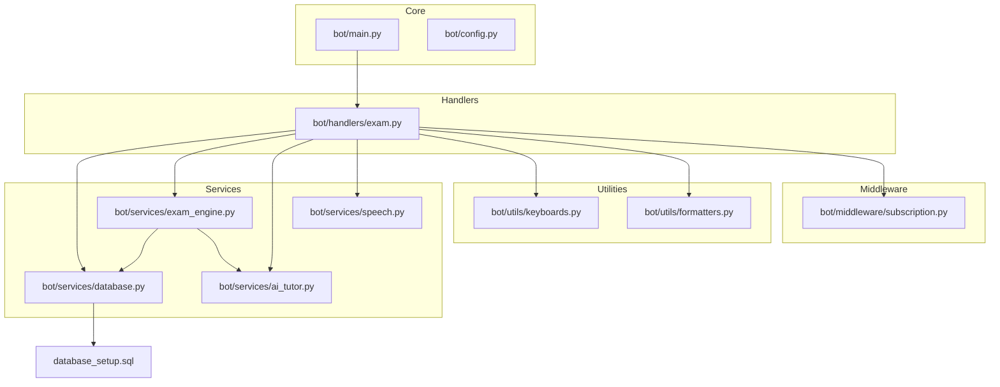
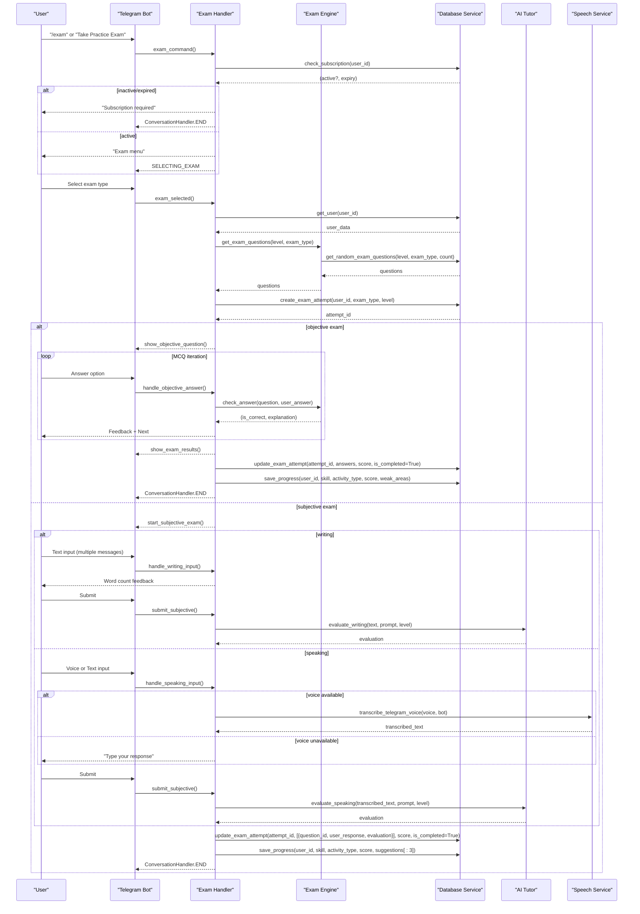
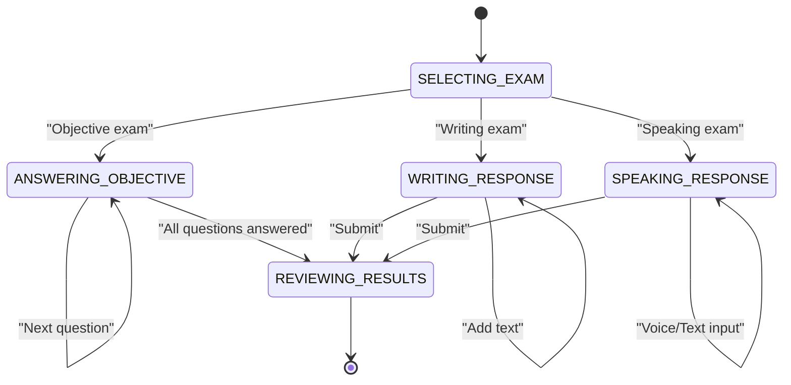
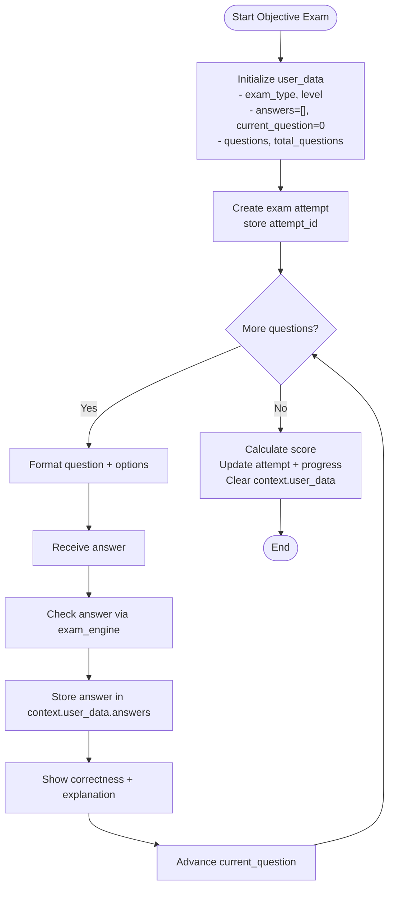
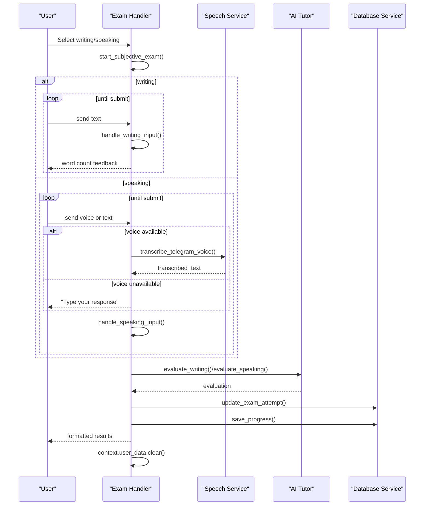
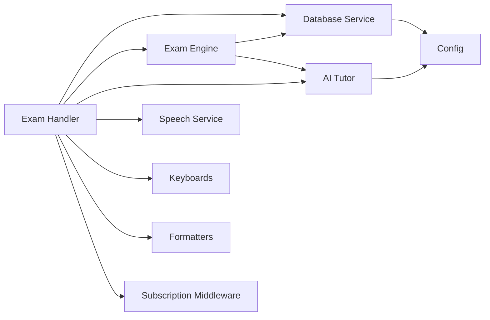

# Exam Simulation Mechanics

<cite>
**Referenced Files in This Document**
- [bot/handlers/exam.py](file://bot/handlers/exam.py)
- [bot/services/exam_engine.py](file://bot/services/exam_engine.py)
- [bot/services/database.py](file://bot/services/database.py)
- [bot/services/ai_tutor.py](file://bot/services/ai_tutor.py)
- [bot/services/speech.py](file://bot/services/speech.py)
- [bot/utils/keyboards.py](file://bot/utils/keyboards.py)
- [bot/utils/formatters.py](file://bot/utils/formatters.py)
- [bot/middleware/subscription.py](file://bot/middleware/subscription.py)
- [bot/main.py](file://bot/main.py)
- [bot/config.py](file://bot/config.py)
- [database_setup.sql](file://database_setup.sql)
</cite>

## Table of Contents
1. [Introduction](#introduction)
2. [Project Structure](#project-structure)
3. [Core Components](#core-components)
4. [Architecture Overview](#architecture-overview)
5. [Detailed Component Analysis](#detailed-component-analysis)
6. [Dependency Analysis](#dependency-analysis)
7. [Performance Considerations](#performance-considerations)
8. [Troubleshooting Guide](#troubleshooting-guide)
9. [Conclusion](#conclusion)

## Introduction
This document explains the exam simulation mechanics implemented in the EthioGerman Language School Telegram bot. It covers the conversation flow architecture, state management across five distinct states, the exam selection process, user data persistence via context.user_data, the ConversationHandler implementation, routing logic between objective and subjective exam types, exam attempt creation and tracking, and integration with the exam_engine for question retrieval. It also documents user interaction patterns, error handling scenarios, exam cancellation workflows, progress tracking, and session cleanup procedures.

## Project Structure
The exam simulation spans several modules:
- Handlers orchestrate user interactions and manage conversation states
- Services encapsulate business logic for database operations, AI evaluation, speech processing, and exam question generation/scoring
- Utilities provide consistent UI and messaging formatting
- Middleware enforces subscription-based access control
- Configuration centralizes environment variables and constants

**Diagram sources**
- [bot/handlers/exam.py](file://bot/handlers/exam.py#L1-L523)
- [bot/services/database.py](file://bot/services/database.py#L1-L416)
- [bot/services/exam_engine.py](file://bot/services/exam_engine.py#L1-L211)
- [bot/services/ai_tutor.py](file://bot/services/ai_tutor.py#L1-L451)
- [bot/services/speech.py](file://bot/services/speech.py#L1-L140)
- [bot/utils/keyboards.py](file://bot/utils/keyboards.py#L1-L183)
- [bot/utils/formatters.py](file://bot/utils/formatters.py#L1-L300)
- [bot/middleware/subscription.py](file://bot/middleware/subscription.py#L1-L156)
- [bot/main.py](file://bot/main.py#L1-L93)
- [bot/config.py](file://bot/config.py#L1-L60)
- [database_setup.sql](file://database_setup.sql#L1-L84)

**Section sources**
- [bot/handlers/exam.py](file://bot/handlers/exam.py#L1-L523)
- [bot/main.py](file://bot/main.py#L1-L93)

## Core Components
- ConversationHandler manages five states: SELECTING_EXAM, ANSWERING_OBJECTIVE, WRITING_RESPONSE, SPEAKING_RESPONSE, REVIEWING_RESULTS
- Exam selection routes to either objective (MCQ) or subjective (writing/speaking) flows
- User data persistence via context.user_data stores exam metadata, current question index, answers, and attempt identifiers
- Database integration tracks user progress, exam attempts, and question sourcing
- AI-driven evaluation for writing and speaking tasks
- Speech transcription for voice-based speaking tasks

**Section sources**
- [bot/handlers/exam.py](file://bot/handlers/exam.py#L27-L523)
- [bot/services/database.py](file://bot/services/database.py#L342-L412)
- [bot/services/ai_tutor.py](file://bot/services/ai_tutor.py#L154-L325)
- [bot/services/speech.py](file://bot/services/speech.py#L83-L129)

## Architecture Overview
The exam flow begins with the /exam command or exam menu selection. The handler validates subscription, initializes user data, retrieves questions from the exam engine (with AI fallback), creates an exam attempt, and routes to the appropriate state machine branch. Objective exams iterate through MCQ questions, while subjective exams collect text or voice responses and evaluate them via AI.

**Diagram sources**
- [bot/handlers/exam.py](file://bot/handlers/exam.py#L31-L523)
- [bot/services/exam_engine.py](file://bot/services/exam_engine.py#L29-L183)
- [bot/services/database.py](file://bot/services/database.py#L342-L412)
- [bot/services/ai_tutor.py](file://bot/services/ai_tutor.py#L154-L325)
- [bot/services/speech.py](file://bot/services/speech.py#L83-L129)

## Detailed Component Analysis

### ConversationHandler and States
The ConversationHandler coordinates the entire exam flow with five states:
- SELECTING_EXAM: Initial state for choosing exam type
- ANSWERING_OBJECTIVE: MCQ question display and answer handling
- WRITING_RESPONSE: Collecting written responses for writing tasks
- SPEAKING_RESPONSE: Collecting voice or typed responses for speaking tasks
- REVIEWING_RESULTS: Final score display and cleanup

Routing logic:
- Objective exams route to show_objective_question() and handle_objective_answer()
- Subjective exams route to start_subjective_exam(), then to either handle_writing_input() or handle_speaking_input(), followed by submit_subjective()

**Diagram sources**
- [bot/handlers/exam.py](file://bot/handlers/exam.py#L27-L523)

**Section sources**
- [bot/handlers/exam.py](file://bot/handlers/exam.py#L488-L523)

### Exam Selection and Routing Logic
- Subscription check occurs at the start of exam_command() and during exam_selected()
- Exam type extraction transforms callback data (e.g., "exam_lesen") into internal identifiers
- Routing branches:
  - Objective: lesen, horen, vokabular → ANSWERING_OBJECTIVE
  - Subjective: schreiben, sprechen → WRITING_RESPONSE/SPEAKING_RESPONSE
- Full mock exam is reserved for future implementation

**Section sources**
- [bot/handlers/exam.py](file://bot/handlers/exam.py#L31-L123)
- [bot/utils/keyboards.py](file://bot/utils/keyboards.py#L47-L62)

### Objective Exam Flow
- Question retrieval: exam_engine.get_exam_questions() pulls from database with AI fallback
- Question display: show_objective_question() formats text and passage, presents options
- Answer handling: handle_objective_answer() checks correctness, persists answer, advances to next question
- Results calculation: show_exam_results() computes score, updates attempt, saves progress, clears context

**Diagram sources**
- [bot/handlers/exam.py](file://bot/handlers/exam.py#L94-L123)
- [bot/handlers/exam.py](file://bot/handlers/exam.py#L125-L216)
- [bot/handlers/exam.py](file://bot/handlers/exam.py#L419-L467)
- [bot/services/exam_engine.py](file://bot/services/exam_engine.py#L29-L114)

**Section sources**
- [bot/handlers/exam.py](file://bot/handlers/exam.py#L125-L216)
- [bot/services/exam_engine.py](file://bot/services/exam_engine.py#L29-L114)

### Subjective Exam Flow (Writing and Speaking)
- Writing:
  - start_subjective_exam() prepares prompt, requirements, word count
  - handle_writing_input() accumulates text into a buffer and reports word count
  - submit_subjective() evaluates via AI tutor, updates attempt and progress, clears context
- Speaking:
  - start_subjective_exam() prepares prompt, hints, preparation time
  - handle_speaking_input() accepts voice or text; voice path uses speech_service.transcribe_telegram_voice()
  - submit_subjective() evaluates via AI tutor, updates attempt and progress, clears context

**Diagram sources**
- [bot/handlers/exam.py](file://bot/handlers/exam.py#L218-L417)
- [bot/services/speech.py](file://bot/services/speech.py#L83-L129)
- [bot/services/ai_tutor.py](file://bot/services/ai_tutor.py#L154-L325)
- [bot/services/database.py](file://bot/services/database.py#L364-L412)

**Section sources**
- [bot/handlers/exam.py](file://bot/handlers/exam.py#L218-L417)
- [bot/services/speech.py](file://bot/services/speech.py#L83-L129)
- [bot/services/ai_tutor.py](file://bot/services/ai_tutor.py#L154-L325)

### User Data Persistence and Session Management
- context.user_data keys used:
  - exam_type, level, answers, current_question, questions, total_questions, current_question_data
  - attempt_id for database linkage
  - writing_buffer for multi-message writing tasks
  - speaking_response for evaluated responses
- Session cleanup:
  - context.user_data.clear() executed upon completion or cancellation
  - ConversationHandler.END terminates the handler

**Section sources**
- [bot/handlers/exam.py](file://bot/handlers/exam.py#L94-L117)
- [bot/handlers/exam.py](file://bot/handlers/exam.py#L300-L303)
- [bot/handlers/exam.py](file://bot/handlers/exam.py#L414-L416)
- [bot/handlers/exam.py](file://bot/handlers/exam.py#L484-L485)

### Exam Attempt Creation and Tracking
- create_exam_attempt() initializes an attempt with user_id, exam_type, level, timestamps, and empty answers
- update_exam_attempt() appends answers, optional score, marks completion, and sets completion timestamp
- get_exam_attempts() retrieves completed attempts for reporting/history

**Section sources**
- [bot/services/database.py](file://bot/services/database.py#L342-L412)

### Integration with Exam Engine
- get_exam_questions():
  - Prefers database-backed questions via get_random_exam_questions()
  - Falls back to AI-generated questions when insufficient database content exists
  - Returns questions up to configured counts per exam type
- check_answer():
  - Normalizes answer formats (accepts "A" or "A)")
  - Provides localized explanations
- calculate_score():
  - Computes percentage, pass/fail threshold (60%), and identifies weak areas
- calculate_weighted_score():
  - Supports full mock exam weighting across skill categories

**Section sources**
- [bot/services/exam_engine.py](file://bot/services/exam_engine.py#L29-L183)

### AI Tutor Integration
- evaluate_writing():
  - Evaluates grammar, vocabulary, task completion, coherence
  - Returns structured feedback, mistakes, strengths, suggestions, corrected text
- evaluate_speaking():
  - Evaluates grammar, vocabulary, task completion, fluency
  - Returns pronunciation tips, strengths, suggestions
- generate_exam_question():
  - Produces JSON-formatted questions for different exam types and levels

**Section sources**
- [bot/services/ai_tutor.py](file://bot/services/ai_tutor.py#L154-L325)
- [bot/services/ai_tutor.py](file://bot/services/ai_tutor.py#L327-L424)

### Speech Service Integration
- transcribe_telegram_voice():
  - Downloads voice file, transcribes to German text using faster-whisper
  - Gracefully handles unavailability by falling back to text input
- Status reporting:
  - speech_service.is_available controls UI messaging

**Section sources**
- [bot/services/speech.py](file://bot/services/speech.py#L83-L129)

### Subscription Middleware
- require_subscription():
  - Decorator enforcing subscription for handlers
  - Stores subscription warnings in context.user_data for downstream use
- require_subscription_callback():
  - Decorator variant for callback handlers
- check_subscription():
  - Returns active/expired/no-subscription states with expiry dates

**Section sources**
- [bot/middleware/subscription.py](file://bot/middleware/subscription.py#L47-L137)

### Database Schema and Indexes
- Users, Lessons, Exam Questions, User Progress, Conversation History, Exam Attempts
- Indexes optimize lookups by level/type, user_id, timestamps

**Section sources**
- [database_setup.sql](file://database_setup.sql#L4-L84)

## Dependency Analysis
The exam system exhibits layered dependencies:
- Handlers depend on Services (database, exam_engine, ai_tutor, speech), Utilities (keyboards, formatters), and Middleware (subscription)
- Services depend on Configuration and external APIs (Supabase, OpenRouter)
- Database schema underpins all persistence operations

**Diagram sources**
- [bot/handlers/exam.py](file://bot/handlers/exam.py#L17-L23)
- [bot/services/exam_engine.py](file://bot/services/exam_engine.py#L9-L10)
- [bot/services/ai_tutor.py](file://bot/services/ai_tutor.py#L11)
- [bot/services/database.py](file://bot/services/database.py#L10-L11)
- [bot/config.py](file://bot/config.py#L1-L60)

**Section sources**
- [bot/handlers/exam.py](file://bot/handlers/exam.py#L17-L23)
- [bot/services/exam_engine.py](file://bot/services/exam_engine.py#L9-L10)
- [bot/services/ai_tutor.py](file://bot/services/ai_tutor.py#L11)
- [bot/services/database.py](file://bot/services/database.py#L10-L11)
- [bot/config.py](file://bot/config.py#L1-L60)

## Performance Considerations
- Question sourcing:
  - Database queries are limited by count and difficulty distribution to balance load
  - AI fallback ensures availability but adds latency; consider caching frequently used question templates
- Speech transcription:
  - faster-whisper requires CPU/GPU resources; availability impacts UX
  - Consider pre-downloading model or providing fallback text input
- AI evaluations:
  - OpenRouter requests have timeouts; implement retry logic and graceful degradation
- Database operations:
  - Indexes on user_id, level/type, and timestamps improve query performance
  - Batch updates for exam attempts reduce round-trips

## Troubleshooting Guide
Common issues and resolutions:
- Subscription required:
  - Handlers check subscription early; ensure users receive clear messages and menu navigation
- No questions available:
  - When database lacks sufficient questions, AI generation is attempted; if still empty, guide users to try another exam type
- Voice transcription failures:
  - If speech_service.is_available is False, inform users to type their response
- API errors:
  - AI tutor returns default evaluations on JSON parse or HTTP errors; log and notify users to retry
- Session cleanup:
  - Always clear context.user_data on completion or cancellation to prevent stale state

**Section sources**
- [bot/handlers/exam.py](file://bot/handlers/exam.py#L35-L43)
- [bot/handlers/exam.py](file://bot/handlers/exam.py#L102-L108)
- [bot/services/speech.py](file://bot/services/speech.py#L18-L18)
- [bot/services/ai_tutor.py](file://bot/services/ai_tutor.py#L232-L237)
- [bot/handlers/exam.py](file://bot/handlers/exam.py#L414-L416)
- [bot/handlers/exam.py](file://bot/handlers/exam.py#L470-L485)

## Conclusion
The exam simulation integrates a robust conversation flow with clear state management, subscription enforcement, and seamless AI-driven evaluation. Objective and subjective exams share a unified routing mechanism while leveraging specialized services for question sourcing, evaluation, and speech processing. User data persistence via context.user_data ensures continuity across steps, and database-backed attempt tracking enables progress analytics. The architecture balances reliability with extensibility, supporting future enhancements such as full mock exam weighting and expanded exam types.