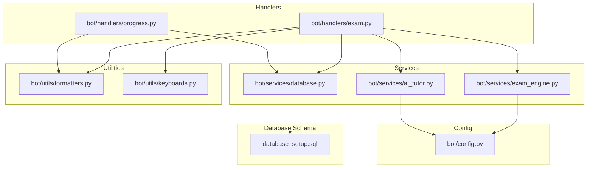
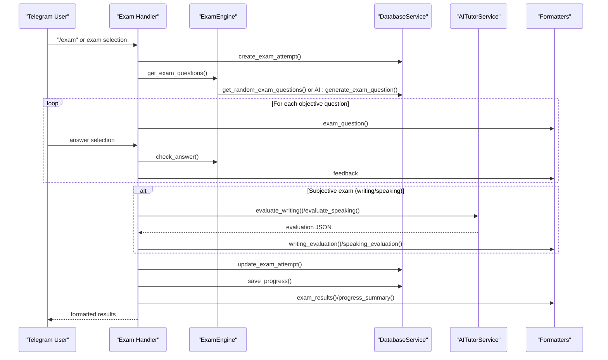
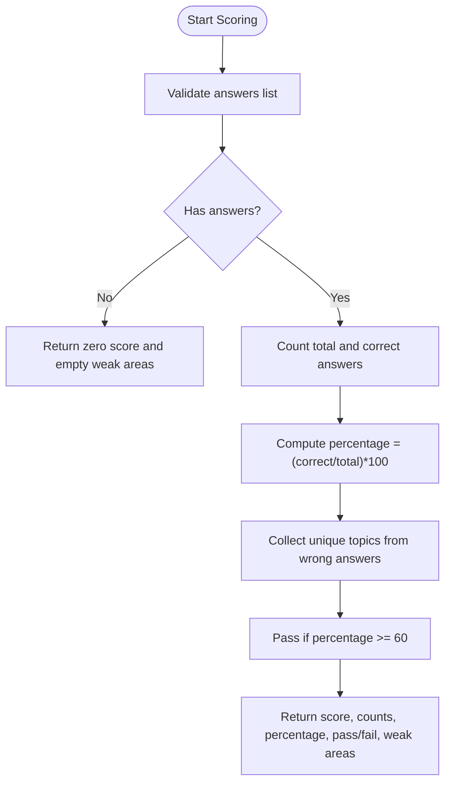
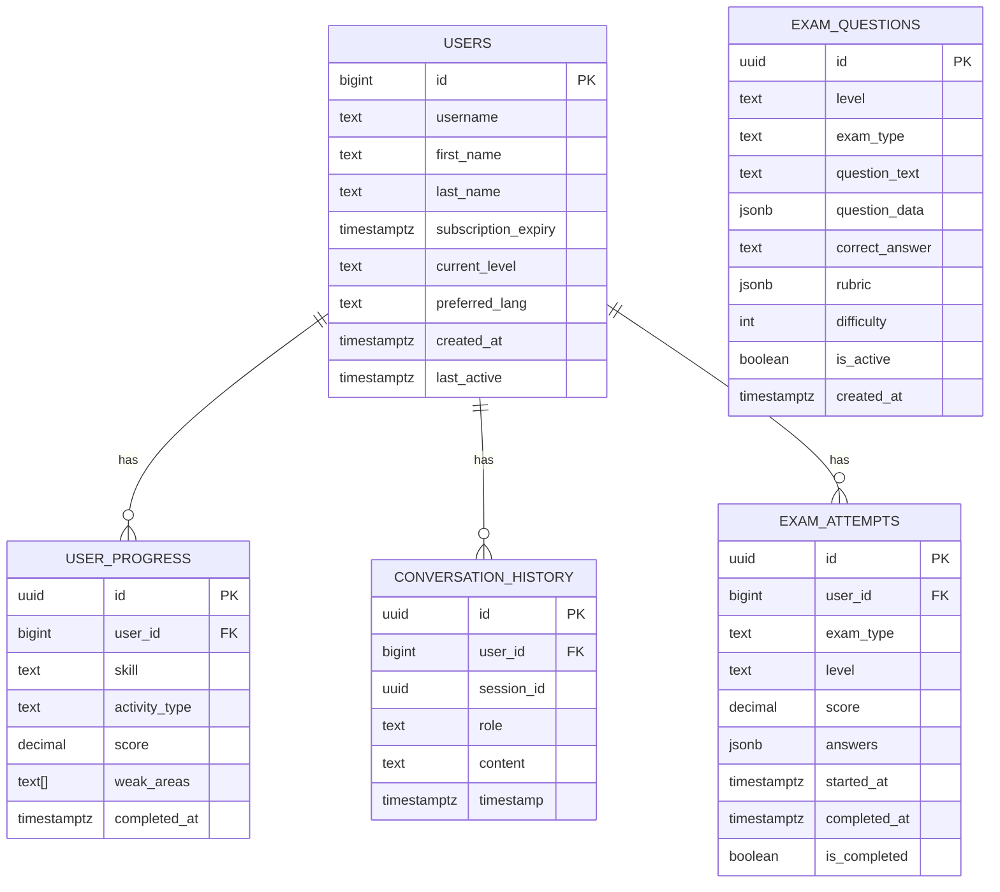
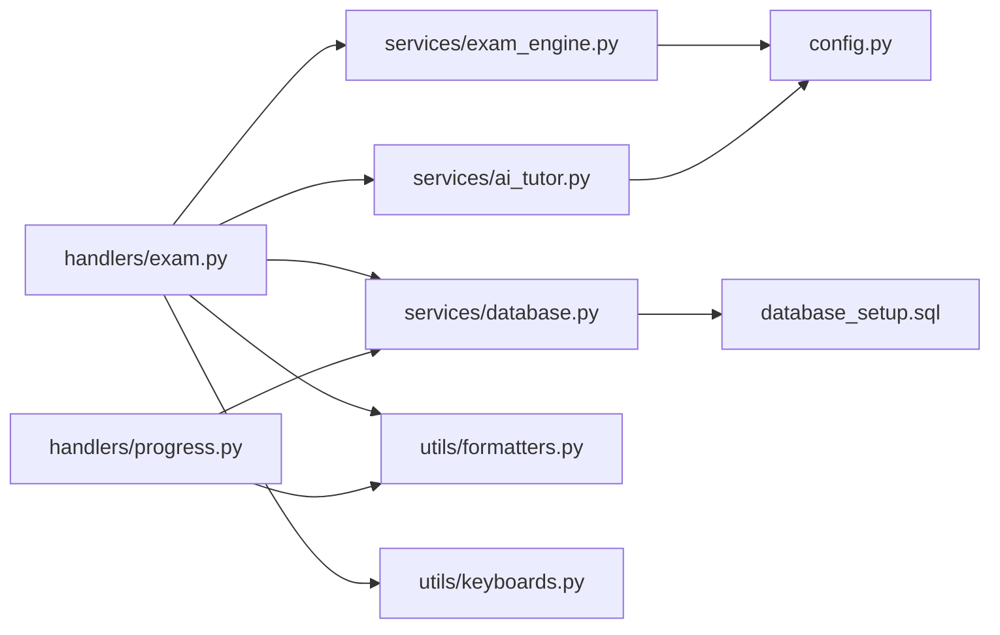

# Performance Analytics and Results

<cite>
**Referenced Files in This Document**
- [database_setup.sql](file://database_setup.sql)
- [setup_database.py](file://setup_database.py)
- [bot/config.py](file://bot/config.py)
- [bot/services/database.py](file://bot/services/database.py)
- [bot/services/exam_engine.py](file://bot/services/exam_engine.py)
- [bot/services/ai_tutor.py](file://bot/services/ai_tutor.py)
- [bot/utils/formatters.py](file://bot/utils/formatters.py)
- [bot/utils/keyboards.py](file://bot/utils/keyboards.py)
- [bot/handlers/exam.py](file://bot/handlers/exam.py)
- [bot/handlers/progress.py](file://bot/handlers/progress.py)
</cite>

## Table of Contents
1. [Introduction](#introduction)
2. [Project Structure](#project-structure)
3. [Core Components](#core-components)
4. [Architecture Overview](#architecture-overview)
5. [Detailed Component Analysis](#detailed-component-analysis)
6. [Dependency Analysis](#dependency-analysis)
7. [Performance Considerations](#performance-considerations)
8. [Troubleshooting Guide](#troubleshooting-guide)
9. [Conclusion](#conclusion)
10. [Appendices](#appendices)

## Introduction
This document explains the performance analytics and results system for the EthioGerman Language School Telegram bot. It covers:
- The exam scoring algorithm (percentage calculation, pass/fail determination, weak area identification)
- Results formatting using the Formatters class for multi-language presentation
- Progress tracking integration (skill-based score recording, weak area suggestions, historical performance analysis)
- The exam attempt database schema, result storage, and retrieval mechanisms
- Statistical analysis of exam performance, trend tracking, and recommendation generation based on weak areas
- Integration with progress tracking and certification preparation workflows

## Project Structure
The performance analytics system spans several modules:
- Handlers orchestrate user interactions for exams and progress views
- Services encapsulate business logic for scoring, AI evaluation, and database operations
- Utilities provide consistent message formatting and keyboard layouts
- Database schema defines storage for users, lessons, exam questions, user progress, conversation history, and exam attempts

**Diagram sources**
- [bot/handlers/exam.py](file://bot/handlers/exam.py#L1-L523)
- [bot/handlers/progress.py](file://bot/handlers/progress.py#L1-L99)
- [bot/services/exam_engine.py](file://bot/services/exam_engine.py#L1-L211)
- [bot/services/database.py](file://bot/services/database.py#L1-L416)
- [bot/services/ai_tutor.py](file://bot/services/ai_tutor.py#L1-L451)
- [bot/utils/formatters.py](file://bot/utils/formatters.py#L1-L300)
- [bot/utils/keyboards.py](file://bot/utils/keyboards.py#L1-L183)
- [bot/config.py](file://bot/config.py#L1-L60)
- [database_setup.sql](file://database_setup.sql#L1-L84)

**Section sources**
- [bot/handlers/exam.py](file://bot/handlers/exam.py#L1-L523)
- [bot/handlers/progress.py](file://bot/handlers/progress.py#L1-L99)
- [bot/services/exam_engine.py](file://bot/services/exam_engine.py#L1-L211)
- [bot/services/database.py](file://bot/services/database.py#L1-L416)
- [bot/services/ai_tutor.py](file://bot/services/ai_tutor.py#L1-L451)
- [bot/utils/formatters.py](file://bot/utils/formatters.py#L1-L300)
- [bot/utils/keyboards.py](file://bot/utils/keyboards.py#L1-L183)
- [bot/config.py](file://bot/config.py#L1-L60)
- [database_setup.sql](file://database_setup.sql#L1-L84)

## Core Components
- ExamEngine: Selects questions, checks answers, calculates scores, computes weighted totals, and provides level recommendations
- DatabaseService: Manages user, lesson, exam question, progress, conversation history, and exam attempt persistence
- AITutorService: Generates exam questions and evaluates writing/speaking submissions
- Formatters: Formats messages for results, progress summaries, and evaluations
- Handlers: Orchestrate exam flows and progress views

Key responsibilities:
- Scoring: Percentage, pass/fail thresholds, weak area extraction
- Weighted scoring: Full mock exam composition from individual skill scores
- Progress tracking: Skill averages, weak areas, strengths, and historical trends
- Results presentation: Multi-language, structured, and visual-friendly formats
- Storage and retrieval: Structured schema for exam attempts and progress entries

**Section sources**
- [bot/services/exam_engine.py](file://bot/services/exam_engine.py#L15-L211)
- [bot/services/database.py](file://bot/services/database.py#L16-L416)
- [bot/services/ai_tutor.py](file://bot/services/ai_tutor.py#L19-L451)
- [bot/utils/formatters.py](file://bot/utils/formatters.py#L8-L300)
- [bot/handlers/exam.py](file://bot/handlers/exam.py#L31-L523)
- [bot/handlers/progress.py](file://bot/handlers/progress.py#L17-L99)

## Architecture Overview
The system follows a layered architecture:
- Presentation layer: Handlers manage user interactions and state transitions
- Business logic layer: ExamEngine and AITutorService encapsulate scoring and evaluation
- Persistence layer: DatabaseService abstracts Supabase operations
- Formatting layer: Formatters centralizes message formatting

**Diagram sources**
- [bot/handlers/exam.py](file://bot/handlers/exam.py#L31-L523)
- [bot/services/exam_engine.py](file://bot/services/exam_engine.py#L29-L184)
- [bot/services/database.py](file://bot/services/database.py#L342-L412)
- [bot/services/ai_tutor.py](file://bot/services/ai_tutor.py#L154-L325)
- [bot/utils/formatters.py](file://bot/utils/formatters.py#L131-L300)

## Detailed Component Analysis

### Exam Scoring Algorithm
The scoring system computes:
- Percentage: correct answers divided by total questions, multiplied by 100
- Pass/Fail: threshold of 60%
- Weak areas: topics from incorrect answers (up to 5 distinct areas)
- Weighted overall score: combines individual skill scores with predefined weights

**Diagram sources**
- [bot/services/exam_engine.py](file://bot/services/exam_engine.py#L67-L114)

Weighted scoring for full mock exam:
- Weights: lesen 25%, horen 25%, schreiben 20%, sprechen 20%, vokabular 10%
- Formula: sum(section_score × weight) / sum(weights)

Recommendation logic:
- If average score ≥ 85 and not at highest level: recommend next level
- If average score < 40 and not at lowest level: recommend previous level
- Otherwise: continue at current level

**Section sources**
- [bot/services/exam_engine.py](file://bot/services/exam_engine.py#L67-L207)

### Results Formatting System
The Formatters class provides:
- Exam results: score, correct/total, pass/fail status, weak areas, and friendly messages
- Writing evaluation: overall score, breakdown, strengths, corrections, suggestions, corrected text
- Speaking evaluation: overall score, breakdown, strengths, pronunciation tips, corrections
- Progress summary: level, overall score, skill scores, weak areas, strengths, total activities
- Question formatting: question number, passage, and text

Formatting features:
- Multi-language support via configurable preferred language
- Markdown-safe escaping for Telegram
- Visual progress bars and star ratings

**Section sources**
- [bot/utils/formatters.py](file://bot/utils/formatters.py#L8-L300)

### Progress Tracking Integration
Progress tracking captures:
- Skill-based scores per activity (e.g., exam)
- Weak areas recorded during exam scoring and AI evaluations
- Historical performance via user_progress entries
- Aggregate statistics: average score, skill averages, top weak areas, strengths

Statistics computation:
- Skill averages: mean of scores per skill
- Top weak areas: most frequent topics across weak_areas arrays
- Strengths: skills with average score ≥ 75%

Recommendations:
- “Practice weak areas” action lists top weak areas
- “View exam history” shows recent attempts with dates and scores

**Section sources**
- [bot/services/database.py](file://bot/services/database.py#L188-L293)
- [bot/handlers/progress.py](file://bot/handlers/progress.py#L17-L99)

### Exam Attempt Database Schema
The schema supports:
- Users: profile, subscription, level, preferences
- Lessons: structured learning content
- Exam questions: dynamic generation and stored variants
- User progress: skill, activity type, score, weak areas, timestamps
- Conversation history: session context for AI
- Exam attempts: exam_type, level, score, answers, timestamps, completion flag

**Diagram sources**
- [database_setup.sql](file://database_setup.sql#L4-L84)
- [bot/services/database.py](file://bot/services/database.py#L16-L416)

Storage and retrieval mechanisms:
- Exam attempts: create, update with answers and score, retrieve recent attempts
- User progress: save per skill/activity, retrieve history ordered by completion time
- Statistics: compute aggregates from progress entries

**Section sources**
- [bot/services/database.py](file://bot/services/database.py#L342-L412)
- [bot/services/database.py](file://bot/services/database.py#L188-L293)

### Integration with Progress Tracking and Certification Workflows
- After each exam (objective or subjective), the system saves:
  - Exam attempt with answers and score
  - Progress entry with skill, score, and weak areas
- The progress view aggregates:
  - Average score and skill averages
  - Top weak areas and strengths
  - Recent exam history
- Recommendations:
  - Level progression based on weighted average
  - Practice suggestions for weak areas
  - Encouragement and actionable tips

**Section sources**
- [bot/handlers/exam.py](file://bot/handlers/exam.py#L419-L467)
- [bot/handlers/progress.py](file://bot/handlers/progress.py#L17-L99)
- [bot/services/exam_engine.py](file://bot/services/exam_engine.py#L185-L207)

## Dependency Analysis
The system exhibits clear separation of concerns:
- Handlers depend on services for business logic and persistence
- Services depend on configuration and external APIs
- Utilities provide shared formatting and UI helpers
- Database schema underpins all analytics and progress tracking

**Diagram sources**
- [bot/handlers/exam.py](file://bot/handlers/exam.py#L1-L523)
- [bot/handlers/progress.py](file://bot/handlers/progress.py#L1-L99)
- [bot/services/exam_engine.py](file://bot/services/exam_engine.py#L1-L211)
- [bot/services/database.py](file://bot/services/database.py#L1-L416)
- [bot/services/ai_tutor.py](file://bot/services/ai_tutor.py#L1-L451)
- [bot/utils/formatters.py](file://bot/utils/formatters.py#L1-L300)
- [bot/utils/keyboards.py](file://bot/utils/keyboards.py#L1-L183)
- [bot/config.py](file://bot/config.py#L1-L60)
- [database_setup.sql](file://database_setup.sql#L1-L84)

**Section sources**
- [bot/handlers/exam.py](file://bot/handlers/exam.py#L1-L523)
- [bot/handlers/progress.py](file://bot/handlers/progress.py#L1-L99)
- [bot/services/exam_engine.py](file://bot/services/exam_engine.py#L1-L211)
- [bot/services/database.py](file://bot/services/database.py#L1-L416)
- [bot/services/ai_tutor.py](file://bot/services/ai_tutor.py#L1-L451)
- [bot/utils/formatters.py](file://bot/utils/formatters.py#L1-L300)
- [bot/utils/keyboards.py](file://bot/utils/keyboards.py#L1-L183)
- [bot/config.py](file://bot/config.py#L1-L60)
- [database_setup.sql](file://database_setup.sql#L1-L84)

## Performance Considerations
- Database indexing: indexes on users, lessons, exam questions, user progress, conversation history, and exam attempts optimize lookups
- Random question selection: difficulty-balanced sampling reduces bias and improves coverage
- Asynchronous operations: AI evaluations and database updates leverage async I/O
- Token limits and timeouts: AI requests include timeouts and max tokens to prevent resource exhaustion
- Pagination: progress and exam history retrieval limit results to manageable sizes

[No sources needed since this section provides general guidance]

## Troubleshooting Guide
Common issues and resolutions:
- Subscription required for exams: Ensure subscription status is checked before starting an exam
- No questions available: Verify exam_questions table and AI generation fallback
- AI evaluation failures: Default evaluation ensures minimal feedback when API calls fail
- Database connectivity: Validate Supabase URL and keys; ensure tables exist and indexes are created
- JSON parsing errors: AI responses are sanitized and parsed safely; defaults are used on failure

**Section sources**
- [bot/handlers/exam.py](file://bot/handlers/exam.py#L31-L123)
- [bot/services/ai_tutor.py](file://bot/services/ai_tutor.py#L232-L325)
- [bot/services/database.py](file://bot/services/database.py#L10-L13)
- [bot/config.py](file://bot/config.py#L40-L56)

## Conclusion
The performance analytics and results system provides a robust pipeline from exam administration to actionable insights:
- Objective and subjective exams are scored consistently with clear pass/fail criteria
- Results are presented in a multi-language, visually engaging format
- Progress tracking maintains historical records and identifies improvement areas
- The database schema supports scalable analytics and trend analysis
- Integration with AI enables dynamic question generation and evaluation
- Recommendations guide learners toward targeted practice and level progression

[No sources needed since this section summarizes without analyzing specific files]

## Appendices

### Example: Score Calculation Formulas
- Percentage: (correct_answers / total_questions) × 100
- Pass/Fail: percentage ≥ 60
- Weak areas: unique topics from incorrect answers (top 5)
- Weighted overall score: sum(section_score × weight) / sum(weights)

**Section sources**
- [bot/services/exam_engine.py](file://bot/services/exam_engine.py#L67-L148)

### Example: Result Presentation Formats
- Exam results: score, correct/total, status, weak areas, encouragement
- Writing evaluation: overall score, breakdown, strengths, corrections, suggestions, corrected text
- Speaking evaluation: overall score, breakdown, strengths, pronunciation tips, corrections
- Progress summary: level, overall score, skill averages, weak areas, strengths, total activities

**Section sources**
- [bot/utils/formatters.py](file://bot/utils/formatters.py#L146-L268)
- [bot/utils/formatters.py](file://bot/utils/formatters.py#L81-L128)

### Example: Progress Visualization Elements
- Progress bar: visual representation of average score
- Star ratings: skill performance visualization
- Weak areas list: top 3 areas to focus on
- Strengths indicator: skills with average ≥ 75%

**Section sources**
- [bot/utils/formatters.py](file://bot/utils/formatters.py#L81-L128)

### Database Setup Notes
- Run the SQL script to create tables and indexes in Supabase
- Alternatively, use the setup script to print the SQL for manual execution
- Ensure environment variables for Supabase credentials are configured

**Section sources**
- [database_setup.sql](file://database_setup.sql#L1-L84)
- [setup_database.py](file://setup_database.py#L102-L157)
- [bot/config.py](file://bot/config.py#L10-L60)