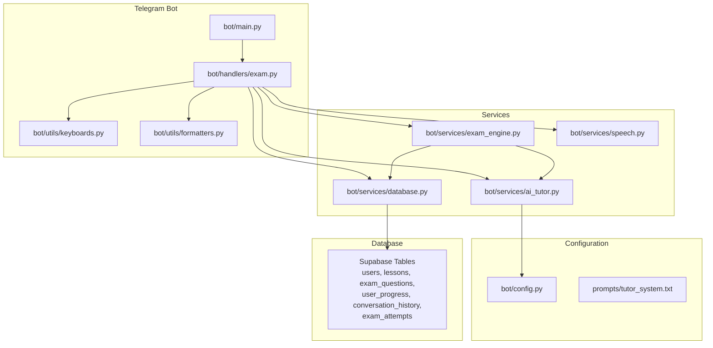
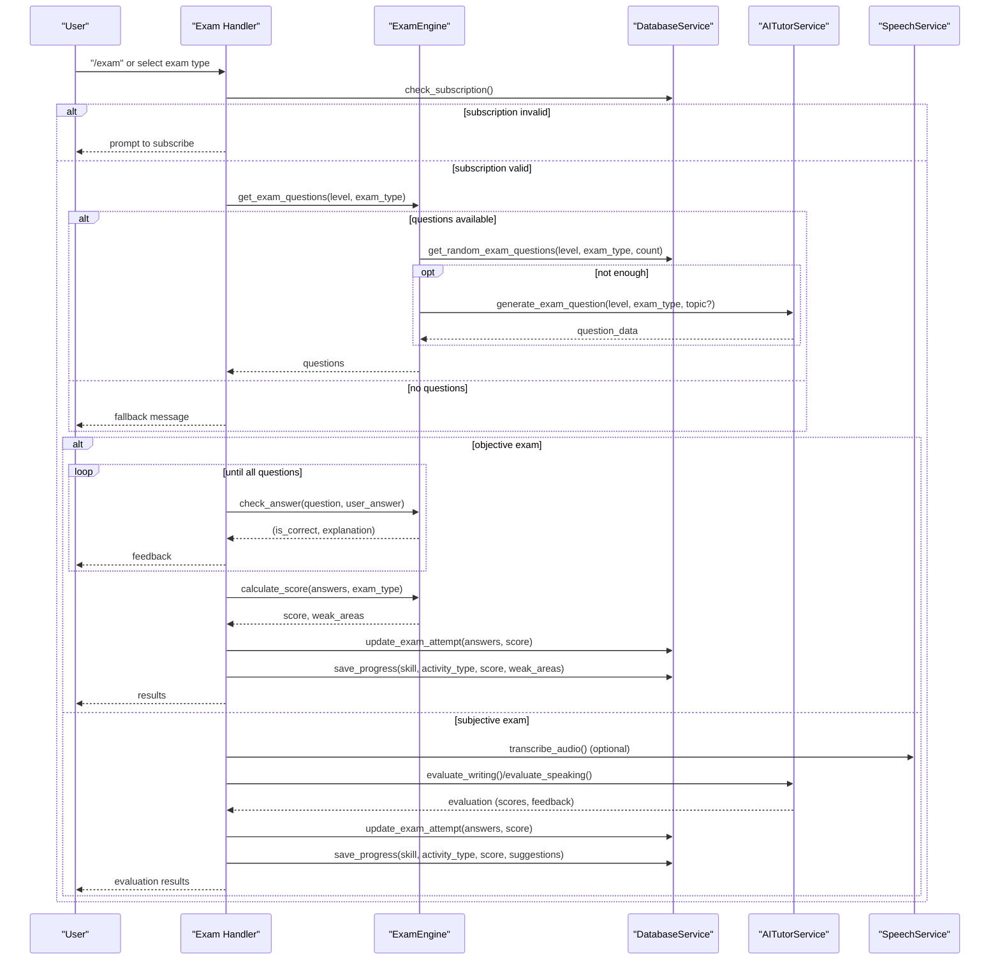
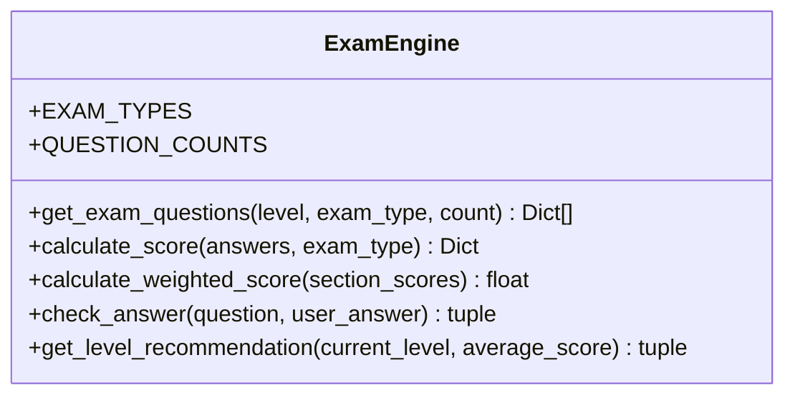
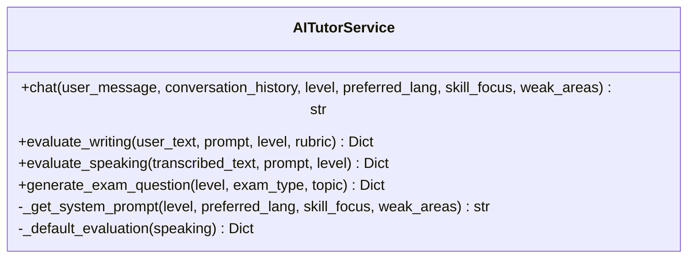
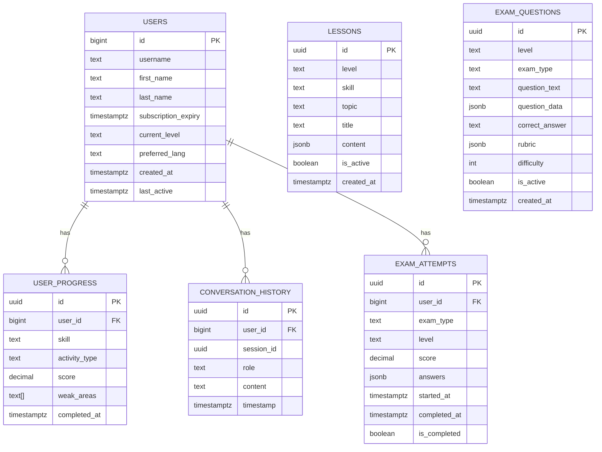
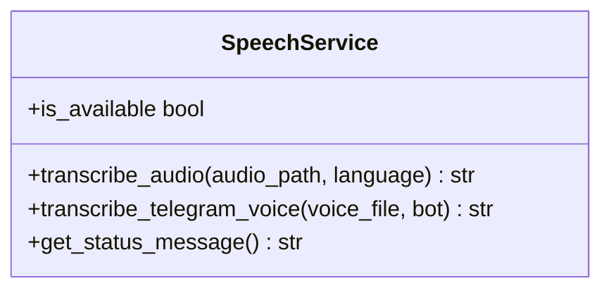
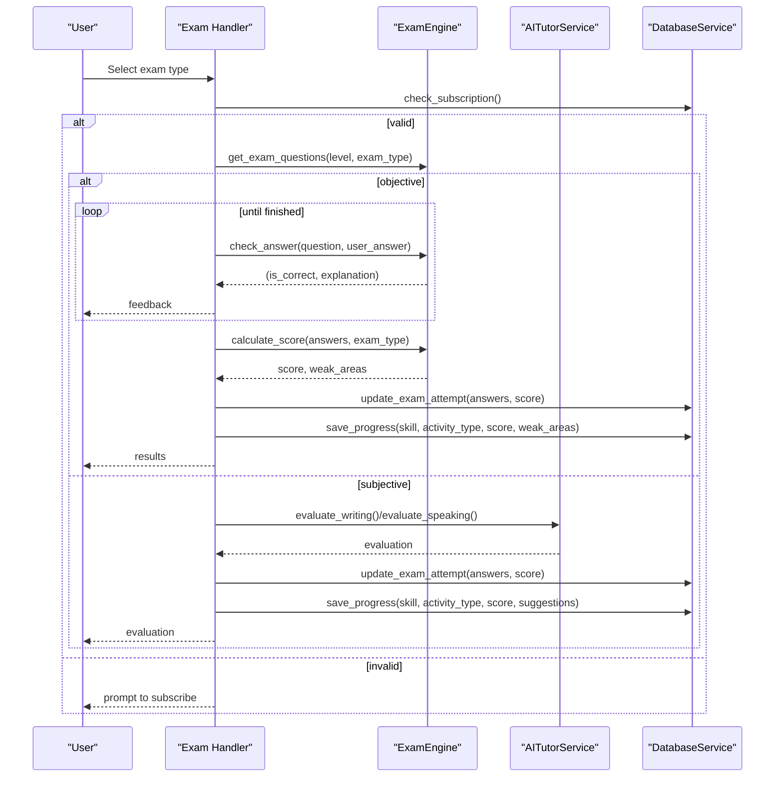
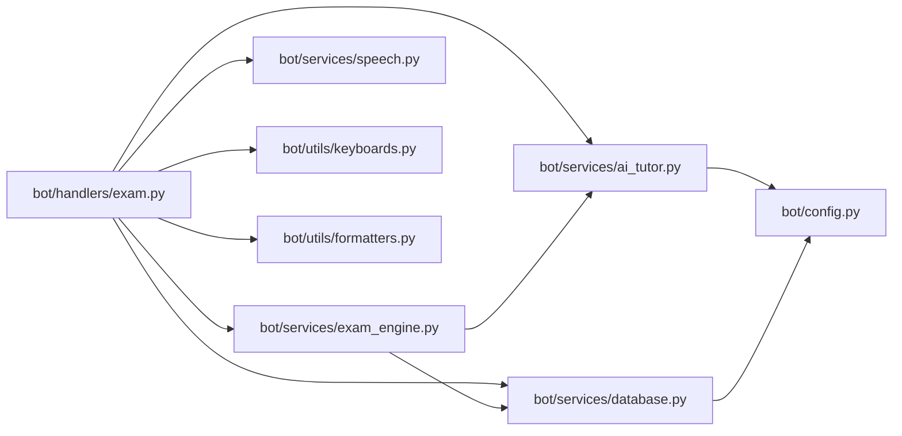

# Question Generation and Evaluation

<cite>
**Referenced Files in This Document**
- [bot/main.py](file://bot/main.py)
- [bot/config.py](file://bot/config.py)
- [bot/services/exam_engine.py](file://bot/services/exam_engine.py)
- [bot/services/ai_tutor.py](file://bot/services/ai_tutor.py)
- [bot/services/database.py](file://bot/services/database.py)
- [bot/services/speech.py](file://bot/services/speech.py)
- [bot/handlers/exam.py](file://bot/handlers/exam.py)
- [bot/utils/formatters.py](file://bot/utils/formatters.py)
- [bot/utils/keyboards.py](file://bot/utils/keyboards.py)
- [prompts/tutor_system.txt](file://prompts/tutor_system.txt)
- [database_setup.sql](file://database_setup.sql)
</cite>

## Table of Contents
1. [Introduction](#introduction)
2. [Project Structure](#project-structure)
3. [Core Components](#core-components)
4. [Architecture Overview](#architecture-overview)
5. [Detailed Component Analysis](#detailed-component-analysis)
6. [Dependency Analysis](#dependency-analysis)
7. [Performance Considerations](#performance-considerations)
8. [Troubleshooting Guide](#troubleshooting-guide)
9. [Conclusion](#conclusion)
10. [Appendices](#appendices)

## Introduction
This document explains the question generation and evaluation system powering the exam engine. It covers how questions are retrieved and generated, how difficulty adapts to user level, how exam types are filtered, and how answers are evaluated—both for objective multiple-choice questions and for subjective writing and speaking tasks. It also documents the question data structure, topic mapping, requirement validation, and dynamic generation powered by an AI tutor service.

## Project Structure
The system is organized around a Telegram bot with modular services:
- Handlers orchestrate user interactions and manage conversation states for exams.
- Services encapsulate business logic for exam question retrieval, AI generation, evaluation, and speech transcription.
- Utilities provide consistent formatting and keyboard layouts.
- Configuration centralizes environment variables and constants.
- Database schema defines the persistence model for users, lessons, exam questions, progress, and exam attempts.

**Diagram sources**
- [bot/main.py](file://bot/main.py#L60-L93)
- [bot/handlers/exam.py](file://bot/handlers/exam.py#L1-L523)
- [bot/services/exam_engine.py](file://bot/services/exam_engine.py#L15-L211)
- [bot/services/ai_tutor.py](file://bot/services/ai_tutor.py#L19-L451)
- [bot/services/database.py](file://bot/services/database.py#L16-L416)
- [bot/services/speech.py](file://bot/services/speech.py#L21-L140)
- [bot/config.py](file://bot/config.py#L10-L60)
- [prompts/tutor_system.txt](file://prompts/tutor_system.txt#L1-L74)
- [database_setup.sql](file://database_setup.sql#L4-L84)

**Section sources**
- [bot/main.py](file://bot/main.py#L60-L93)
- [bot/config.py](file://bot/config.py#L10-L60)
- [database_setup.sql](file://database_setup.sql#L4-L84)

## Core Components
- ExamEngine: Central orchestrator for question retrieval, dynamic generation, answer checking, scoring, and level recommendation.
- AITutorService: Generates exam questions and evaluates writing/speaking submissions using an external AI API.
- DatabaseService: Provides CRUD operations for users, lessons, exam questions, progress, and exam attempts.
- SpeechService: Handles voice message transcription for speaking tasks.
- Handlers: Manage conversation flows for exam selection, objective and subjective exams, and result presentation.
- Utilities: Keyboard builders and message formatters for consistent UI and feedback.

**Section sources**
- [bot/services/exam_engine.py](file://bot/services/exam_engine.py#L15-L211)
- [bot/services/ai_tutor.py](file://bot/services/ai_tutor.py#L19-L451)
- [bot/services/database.py](file://bot/services/database.py#L16-L416)
- [bot/services/speech.py](file://bot/services/speech.py#L21-L140)
- [bot/handlers/exam.py](file://bot/handlers/exam.py#L31-L523)
- [bot/utils/keyboards.py](file://bot/utils/keyboards.py#L10-L183)
- [bot/utils/formatters.py](file://bot/utils/formatters.py#L8-L300)

## Architecture Overview
The exam flow begins with user selection of an exam type. The handler initializes a session, retrieves or generates questions, and routes to either objective or subjective evaluation. Objective answers are checked immediately; subjective responses are evaluated asynchronously by the AI service and saved to the database.

**Diagram sources**
- [bot/handlers/exam.py](file://bot/handlers/exam.py#L31-L523)
- [bot/services/exam_engine.py](file://bot/services/exam_engine.py#L29-L114)
- [bot/services/ai_tutor.py](file://bot/services/ai_tutor.py#L154-L325)
- [bot/services/database.py](file://bot/services/database.py#L163-L184)
- [bot/services/speech.py](file://bot/services/speech.py#L45-L129)

## Detailed Component Analysis

### ExamEngine: Question Retrieval, Difficulty Adaptation, and Scoring
- Exam types and defaults: Supports reading, listening, writing, speaking, and vocabulary with default counts per type.
- Question retrieval: Attempts to fetch random questions filtered by level and type, distributing by difficulty ranges.
- Dynamic generation: If insufficient questions are available, generates new questions via the AI tutor service and marks them as generated.
- Answer checking: Normalizes answer formats and compares against stored correct answers; provides explanations from question data or defaults.
- Scoring: Computes percentage, pass/fail threshold, and identifies weak areas from incorrect answers.
- Weighted scoring: Aggregates section scores with predefined weights for full mock exams.
- Level recommendation: Suggests level progression based on average score thresholds.

**Diagram sources**
- [bot/services/exam_engine.py](file://bot/services/exam_engine.py#L15-L211)

**Section sources**
- [bot/services/exam_engine.py](file://bot/services/exam_engine.py#L18-L207)

### AITutorService: AI-Powered Question Generation and Subjective Evaluation
- Question generation: Prompts the AI to produce structured JSON for vocabulary, reading, writing, and speaking tasks, including requirements and constraints aligned with CEFR levels.
- Writing evaluation: Returns grammar, vocabulary, task completion, and coherence scores with mistakes, strengths, suggestions, and corrected text.
- Speaking evaluation: Returns grammar, vocabulary, task completion, and fluency scores with pronunciation tips and corrections.
- Chat: Provides conversational tutoring with system prompts tailored to level, preferred language, and weak areas.

**Diagram sources**
- [bot/services/ai_tutor.py](file://bot/services/ai_tutor.py#L19-L451)

**Section sources**
- [bot/services/ai_tutor.py](file://bot/services/ai_tutor.py#L327-L424)
- [bot/services/ai_tutor.py](file://bot/services/ai_tutor.py#L154-L325)
- [prompts/tutor_system.txt](file://prompts/tutor_system.txt#L1-L74)

### DatabaseService: Persistence Model and Operations
- Users: Stores subscription expiry, current level, and preferences.
- Lessons: Active lessons filtered by level and skill.
- Exam questions: Stored with level, exam type, question text, structured data, correct answer, rubric, difficulty, and activation flag.
- User progress: Tracks skill, activity type, score, and weak areas.
- Conversation history: Stores session context for tutoring.
- Exam attempts: Records started/completed attempts, answers, and scores.

**Diagram sources**
- [database_setup.sql](file://database_setup.sql#L4-L84)

**Section sources**
- [bot/services/database.py](file://bot/services/database.py#L16-L416)
- [database_setup.sql](file://database_setup.sql#L4-L84)

### SpeechService: Voice Transcription for Speaking Tasks
- Uses faster-whisper to transcribe audio files and Telegram voice messages.
- Provides availability checks and cleanup of temporary files.
- Integrates with the exam handler to process speaking submissions.

**Diagram sources**
- [bot/services/speech.py](file://bot/services/speech.py#L21-L140)

**Section sources**
- [bot/services/speech.py](file://bot/services/speech.py#L45-L129)

### Handlers: Exam Flow and UI
- Conversation states: Selection, answering objective, writing response, speaking response, reviewing results.
- Subscription gating: Ensures active subscription before allowing exams.
- Objective flow: Presents questions, collects answers, checks correctness, and displays explanations.
- Subjective flow: Collects writing or speaking responses, evaluates via AI, and saves results.
- Results formatting: Uses formatters to render scores, weak areas, strengths, and suggestions.

**Diagram sources**
- [bot/handlers/exam.py](file://bot/handlers/exam.py#L31-L523)
- [bot/services/exam_engine.py](file://bot/services/exam_engine.py#L29-L114)
- [bot/services/ai_tutor.py](file://bot/services/ai_tutor.py#L154-L325)
- [bot/services/database.py](file://bot/services/database.py#L342-L411)

**Section sources**
- [bot/handlers/exam.py](file://bot/handlers/exam.py#L31-L523)
- [bot/utils/formatters.py](file://bot/utils/formatters.py#L146-L268)
- [bot/utils/keyboards.py](file://bot/utils/keyboards.py#L47-L160)

## Dependency Analysis
- Handlers depend on ExamEngine, DatabaseService, AITutorService, and SpeechService.
- ExamEngine depends on DatabaseService and AITutorService.
- AITutorService depends on configuration for API endpoints and models.
- DatabaseService depends on Supabase client and environment configuration.
- Utilities depend on configuration for constants and keyboard layouts.

**Diagram sources**
- [bot/handlers/exam.py](file://bot/handlers/exam.py#L17-L23)
- [bot/services/exam_engine.py](file://bot/services/exam_engine.py#L9-L10)
- [bot/services/ai_tutor.py](file://bot/services/ai_tutor.py#L11-L11)
- [bot/services/database.py](file://bot/services/database.py#L10-L11)
- [bot/config.py](file://bot/config.py#L10-L24)

**Section sources**
- [bot/handlers/exam.py](file://bot/handlers/exam.py#L17-L23)
- [bot/services/exam_engine.py](file://bot/services/exam_engine.py#L9-L10)
- [bot/services/ai_tutor.py](file://bot/services/ai_tutor.py#L11-L11)
- [bot/services/database.py](file://bot/services/database.py#L10-L11)

## Performance Considerations
- Random question selection distributes difficulty to balance challenge and learning.
- AI generation is used as a fallback when database lacks sufficient items, reducing wait times.
- Speech transcription is optional and gracefully handled when unavailable.
- Database queries use indexes on level/type and user references for efficient retrieval.
- Conversation history is limited to reduce context size for AI calls.

[No sources needed since this section provides general guidance]

## Troubleshooting Guide
- Subscription gating: If a user cannot start an exam, verify subscription status via the database service.
- Missing questions: If no questions are returned, the system falls back to AI generation; check AI API connectivity and prompts.
- Speech transcription failures: Verify faster-whisper installation and model loading; the service logs warnings when unavailable.
- API errors: The AI tutor service handles timeouts and general exceptions, returning default evaluations when necessary.
- Database errors: Inspect query logs and ensure required environment variables are configured.

**Section sources**
- [bot/handlers/exam.py](file://bot/handlers/exam.py#L35-L43)
- [bot/services/ai_tutor.py](file://bot/services/ai_tutor.py#L147-L152)
- [bot/services/speech.py](file://bot/services/speech.py#L17-L18)
- [bot/services/database.py](file://bot/services/database.py#L79-L103)

## Conclusion
The exam engine integrates database-backed question retrieval with AI-driven generation and evaluation. It adapts difficulty to user level, validates requirements, and provides immediate feedback for objective exams and comprehensive evaluations for subjective tasks. The architecture cleanly separates concerns across handlers, services, and utilities, enabling extensibility and maintainability.

[No sources needed since this section summarizes without analyzing specific files]

## Appendices

### Question Data Structure and Topic Mapping
- Fields commonly present in questions:
  - id: Unique identifier
  - level: CEFR level (A1, A2, B1)
  - exam_type: Skill category (lesen, horen, schreiben, sprechen, vokabular)
  - question_text: Prompt or stem
  - question_data: Structured content (e.g., passage, options, requirements, hints)
  - correct_answer: Expected answer for objective items
  - difficulty: Integer scale for question difficulty
  - generated: Boolean indicating AI-generated content
  - rubric: Optional scoring rubric for subjective tasks
  - topic: Skill-specific topic for weak area tracking

**Section sources**
- [bot/services/exam_engine.py](file://bot/services/exam_engine.py#L54-L63)
- [bot/services/database.py](file://bot/services/database.py#L29-L41)
- [bot/services/ai_tutor.py](file://bot/services/ai_tutor.py#L327-L424)

### Requirement Validation
- Exam type filtering: The system validates exam types against supported categories and counts.
- Availability checks: Subscription status is verified before allowing exams.
- Question availability: If insufficient questions exist, the system generates new ones dynamically.

**Section sources**
- [bot/services/exam_engine.py](file://bot/services/exam_engine.py#L18-L27)
- [bot/handlers/exam.py](file://bot/handlers/exam.py#L35-L43)
- [bot/services/database.py](file://bot/services/database.py#L163-L184)

### Example Templates and Evaluation Criteria
- Vocabulary/Multiple Choice: JSON template includes question text, options, correct answer, and explanation.
- Reading Comprehension: JSON includes a short passage and associated MCQ.
- Writing Prompt: JSON includes task description, requirements, word count bounds, and example points.
- Speaking Prompt: JSON includes task description, preparation time, response time, and helpful phrases.
- Writing Rubric: Grammar, vocabulary, task completion, coherence; overall score and corrections.
- Speaking Rubric: Grammar, vocabulary, task completion, fluency; pronunciation tips and corrections.

**Section sources**
- [bot/services/ai_tutor.py](file://bot/services/ai_tutor.py#L344-L387)
- [bot/services/ai_tutor.py](file://bot/services/ai_tutor.py#L167-L199)
- [bot/services/ai_tutor.py](file://bot/services/ai_tutor.py#L257-L288)

### Scoring Algorithms
- Objective scoring: Percentage computed from correct answers; pass/fail threshold set at 60%; weak areas derived from incorrect answers.
- Weighted scoring: Aggregates section scores with weights: lesen 25%, horen 25%, schreiben 20%, sprechen 20%, vokabular 10%.
- Level recommendation: Based on average score thresholds to suggest progression or review.

**Section sources**
- [bot/services/exam_engine.py](file://bot/services/exam_engine.py#L67-L114)
- [bot/services/exam_engine.py](file://bot/services/exam_engine.py#L116-L148)
- [bot/services/exam_engine.py](file://bot/services/exam_engine.py#L185-L206)