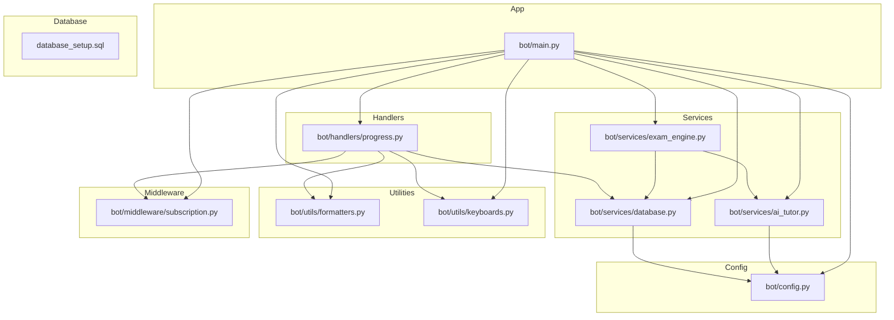
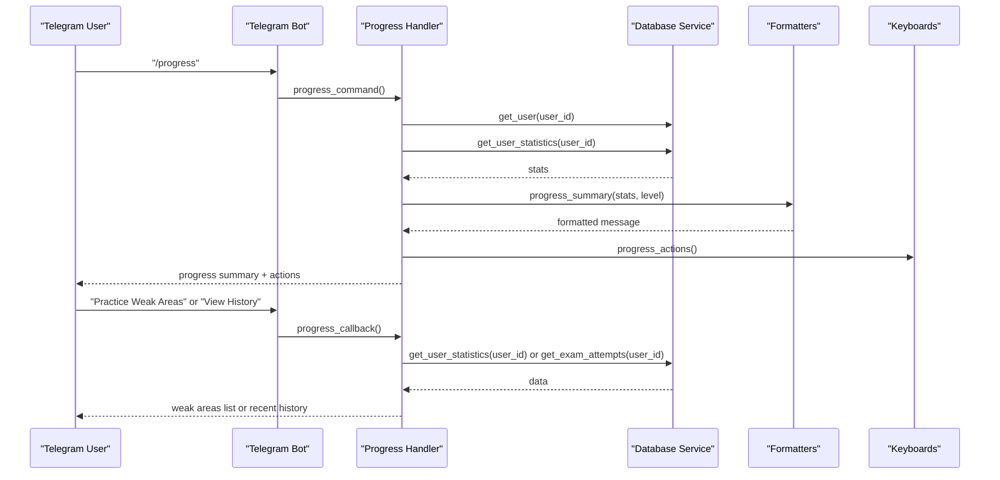
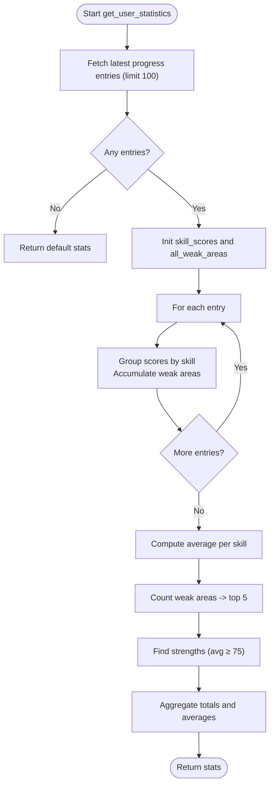
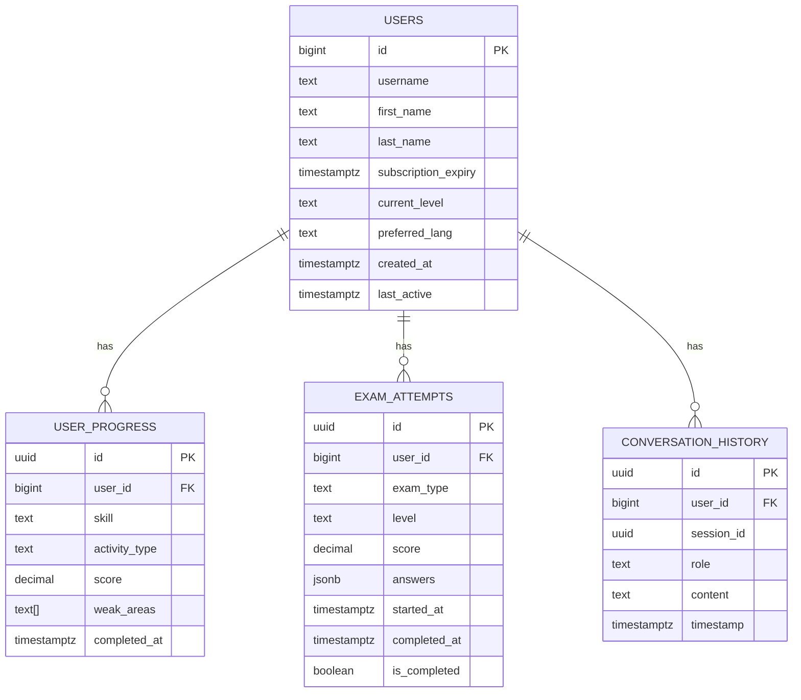
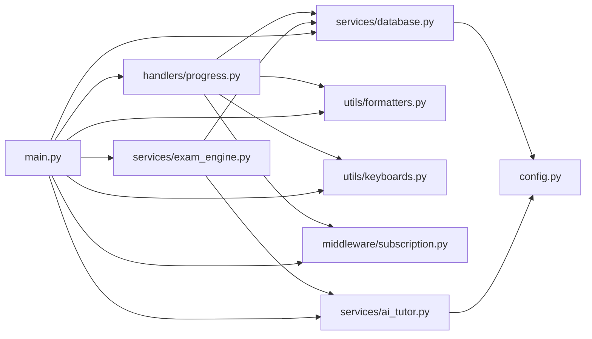

# Progress Tracking & Analytics

<cite>
**Referenced Files in This Document**
- [progress.py](file://bot/handlers/progress.py)
- [database.py](file://bot/services/database.py)
- [formatters.py](file://bot/utils/formatters.py)
- [keyboards.py](file://bot/utils/keyboards.py)
- [subscription.py](file://bot/middleware/subscription.py)
- [config.py](file://bot/config.py)
- [ai_tutor.py](file://bot/services/ai_tutor.py)
- [exam_engine.py](file://bot/services/exam_engine.py)
- [main.py](file://bot/main.py)
- [database_setup.sql](file://database_setup.sql)
- [setup_database.py](file://setup_database.py)
</cite>

## Table of Contents
1. [Introduction](#introduction)
2. [Project Structure](#project-structure)
3. [Core Components](#core-components)
4. [Architecture Overview](#architecture-overview)
5. [Detailed Component Analysis](#detailed-component-analysis)
6. [Dependency Analysis](#dependency-analysis)
7. [Performance Considerations](#performance-considerations)
8. [Troubleshooting Guide](#troubleshooting-guide)
9. [Conclusion](#conclusion)
10. [Appendices](#appendices)

## Introduction
This document explains the progress tracking and analytics system for the EthioGerman Language School Telegram bot. It covers how user statistics are calculated, how skill-based performance metrics are derived, how weak areas are identified, and how historical data is aggregated and presented. It also documents integration points with user activity logs, skill assessments, and performance benchmarks, along with dashboards, recommendations, and real-time analytics considerations. Privacy and data retention are addressed conceptually, and practical examples of analytics queries and dashboard generation are included.

## Project Structure
The progress tracking and analytics functionality spans several modules:
- Handlers: Telegram command and callback handlers for progress views and actions
- Services: Database service for data persistence and retrieval, AI tutor for dynamic content, and exam engine for scoring
- Utilities: Formatting utilities for consistent UI output and keyboard builders for navigation
- Middleware: Subscription checks to gate access to analytics features
- Configuration: Centralized configuration for CEFR levels, skills, and API endpoints
- Database: SQL schema and setup scripts for persistent storage

**Diagram sources**
- [progress.py](file://bot/handlers/progress.py#L1-L99)
- [database.py](file://bot/services/database.py#L1-L416)
- [formatters.py](file://bot/utils/formatters.py#L1-L300)
- [keyboards.py](file://bot/utils/keyboards.py#L1-L183)
- [subscription.py](file://bot/middleware/subscription.py#L1-L156)
- [config.py](file://bot/config.py#L1-L60)
- [ai_tutor.py](file://bot/services/ai_tutor.py#L1-L451)
- [exam_engine.py](file://bot/services/exam_engine.py#L1-L211)
- [main.py](file://bot/main.py#L1-L93)
- [database_setup.sql](file://database_setup.sql#L1-L84)

**Section sources**
- [progress.py](file://bot/handlers/progress.py#L1-L99)
- [database.py](file://bot/services/database.py#L1-L416)
- [formatters.py](file://bot/utils/formatters.py#L1-L300)
- [keyboards.py](file://bot/utils/keyboards.py#L1-L183)
- [subscription.py](file://bot/middleware/subscription.py#L1-L156)
- [config.py](file://bot/config.py#L1-L60)
- [ai_tutor.py](file://bot/services/ai_tutor.py#L1-L451)
- [exam_engine.py](file://bot/services/exam_engine.py#L1-L211)
- [main.py](file://bot/main.py#L1-L93)
- [database_setup.sql](file://database_setup.sql#L1-L84)

## Core Components
- Progress handler: Provides the /progress command and progress-related callbacks to view weak areas and recent exam history
- Database service: Persists and retrieves user progress, conversation history, exam attempts, and user metadata; calculates statistics and aggregates historical data
- Formatters: Formats progress summaries, exam results, and evaluations for Telegram UI
- Keyboard builder: Supplies inline keyboard layouts for progress actions and navigation
- Subscription middleware: Enforces access control for analytics features based on subscription status
- AI tutor: Generates dynamic exam questions and evaluates writing/speaking submissions
- Exam engine: Scores assessments, computes weighted full-mock exam scores, and identifies weak areas
- Configuration: Defines CEFR levels, skills, and API endpoints
- App entry point: Wires handlers, middleware, and services into the Telegram bot runtime

**Section sources**
- [progress.py](file://bot/handlers/progress.py#L17-L99)
- [database.py](file://bot/services/database.py#L16-L416)
- [formatters.py](file://bot/utils/formatters.py#L8-L300)
- [keyboards.py](file://bot/utils/keyboards.py#L10-L183)
- [subscription.py](file://bot/middleware/subscription.py#L21-L156)
- [ai_tutor.py](file://bot/services/ai_tutor.py#L19-L451)
- [exam_engine.py](file://bot/services/exam_engine.py#L15-L211)
- [config.py](file://bot/config.py#L10-L60)
- [main.py](file://bot/main.py#L60-L93)

## Architecture Overview
The analytics pipeline integrates user interactions, assessments, and AI-driven content to produce actionable insights and recommendations.

**Diagram sources**
- [progress.py](file://bot/handlers/progress.py#L18-L99)
- [database.py](file://bot/services/database.py#L233-L292)
- [formatters.py](file://bot/utils/formatters.py#L81-L128)
- [keyboards.py](file://bot/utils/keyboards.py#L163-L170)

## Detailed Component Analysis

### Statistics Calculation Algorithms
The system aggregates user progress entries to compute:
- Total activities
- Average score across all activities
- Per-skill averages
- Weak areas (top 5 topics most frequently missed)
- Strengths (skills with average score ≥ 75%)

**Diagram sources**
- [database.py](file://bot/services/database.py#L233-L292)

**Section sources**
- [database.py](file://bot/services/database.py#L233-L292)

### Skill-Based Performance Metrics
- Per-skill averages are computed from stored scores
- Strengths are flagged for skills exceeding a 75% threshold
- Weak areas are derived from incorrect answers’ topics, capped to top 5

**Section sources**
- [database.py](file://bot/services/database.py#L262-L273)
- [exam_engine.py](file://bot/services/exam_engine.py#L96-L114)

### Weak Area Identification
- Incorrect answers contribute topics to a weak areas list
- Topics are counted and the top 5 are returned for targeted practice suggestions

**Section sources**
- [exam_engine.py](file://bot/services/exam_engine.py#L96-L114)
- [progress.py](file://bot/handlers/progress.py#L47-L64)

### Historical Tracking Mechanisms
- User progress entries are persisted with timestamps and skill/activity metadata
- Historical retrieval supports filtering by skill and ordering by completion time
- Exam attempts are stored with answers, scores, and completion timestamps

**Diagram sources**
- [database_setup.sql](file://database_setup.sql#L4-L84)
- [database.py](file://bot/services/database.py#L188-L232)
- [database.py](file://bot/services/database.py#L342-L412)

**Section sources**
- [database.py](file://bot/services/database.py#L188-L232)
- [database.py](file://bot/services/database.py#L342-L412)
- [database_setup.sql](file://database_setup.sql#L4-L84)

### Achievement Recognition Systems
- Pass/fail thresholds are applied per exam type
- Full-mock exam scores are computed using weighted averages across skill domains
- Recommendations for level progression are provided based on average performance

**Section sources**
- [exam_engine.py](file://bot/services/exam_engine.py#L104-L114)
- [exam_engine.py](file://bot/services/exam_engine.py#L116-L148)
- [exam_engine.py](file://bot/services/exam_engine.py#L185-L207)

### Progress Visualization Components
- Progress summary displays overall score, per-skill scores, weak areas, and total activities
- Exam results include a visual score bar and weak area highlights
- Writing and speaking evaluations provide detailed breakdowns and corrective feedback

**Section sources**
- [formatters.py](file://bot/utils/formatters.py#L81-L128)
- [formatters.py](file://bot/utils/formatters.py#L146-L183)
- [formatters.py](file://bot/utils/formatters.py#L186-L227)
- [formatters.py](file://bot/utils/formatters.py#L230-L268)

### Activity Summaries and Learning Path Recommendations
- Activity summaries are generated from stored progress entries
- Recommendations leverage weak areas and strengths to guide targeted practice
- Level recommendations adjust based on average performance trends

**Section sources**
- [database.py](file://bot/services/database.py#L233-L292)
- [progress.py](file://bot/handlers/progress.py#L47-L64)
- [exam_engine.py](file://bot/services/exam_engine.py#L185-L207)

### Analytics Queries and Dashboard Generation
- Retrieve recent progress entries per user and skill
- Aggregate averages and weak areas for dashboard cards
- Pull recent exam attempts for history timelines
- Example query patterns:
  - Get user statistics: fetch last N progress entries, group by skill, compute averages, count weak areas
  - Get recent exam history: filter completed attempts, order by completion time, limit results
  - Generate weak area report: union weak areas across incorrect answers, rank by frequency

Note: These are conceptual query patterns aligned with the stored data model and service methods.

### Integration with User Activity Logs, Assessments, and Benchmarks
- User activity logs are stored in conversation history for context and trend analysis
- Assessments integrate with exam attempts and scoring logic
- Benchmarks are implicit via CEFR levels and skill thresholds

**Section sources**
- [database.py](file://bot/services/database.py#L296-L338)
- [database.py](file://bot/services/database.py#L342-L412)
- [config.py](file://bot/config.py#L25-L32)

### Real-Time Analytics Updates
- Progress updates are persisted immediately upon activity completion
- UI refreshes on demand via commands and callbacks
- Subscription middleware ensures access controls for analytics features

**Section sources**
- [database.py](file://bot/services/database.py#L188-L210)
- [progress.py](file://bot/handlers/progress.py#L18-L36)
- [subscription.py](file://bot/middleware/subscription.py#L21-L101)

## Dependency Analysis
The progress analytics module exhibits clear separation of concerns:
- Handlers depend on the database service and utilities for presentation
- Database service depends on configuration for Supabase credentials
- AI tutor and exam engine collaborate to enrich assessments with dynamic content and evaluations
- Middleware enforces access control across analytics features

**Diagram sources**
- [progress.py](file://bot/handlers/progress.py#L1-L99)
- [database.py](file://bot/services/database.py#L1-L416)
- [formatters.py](file://bot/utils/formatters.py#L1-L300)
- [keyboards.py](file://bot/utils/keyboards.py#L1-L183)
- [subscription.py](file://bot/middleware/subscription.py#L1-L156)
- [config.py](file://bot/config.py#L1-L60)
- [ai_tutor.py](file://bot/services/ai_tutor.py#L1-L451)
- [exam_engine.py](file://bot/services/exam_engine.py#L1-L211)
- [main.py](file://bot/main.py#L1-L93)

**Section sources**
- [progress.py](file://bot/handlers/progress.py#L1-L99)
- [database.py](file://bot/services/database.py#L1-L416)
- [ai_tutor.py](file://bot/services/ai_tutor.py#L1-L451)
- [exam_engine.py](file://bot/services/exam_engine.py#L1-L211)
- [formatters.py](file://bot/utils/formatters.py#L1-L300)
- [keyboards.py](file://bot/utils/keyboards.py#L1-L183)
- [subscription.py](file://bot/middleware/subscription.py#L1-L156)
- [config.py](file://bot/config.py#L1-L60)
- [main.py](file://bot/main.py#L1-L93)

## Performance Considerations
- Indexes on user progress, exam attempts, lessons, and exam questions support efficient filtering and sorting
- Limiting historical retrievals (e.g., last N entries) prevents heavy scans
- Asynchronous database operations minimize latency in Telegram interactions
- Recommendation thresholds and top-N selections cap computational overhead

[No sources needed since this section provides general guidance]

## Troubleshooting Guide
- Subscription gating: Handlers decorated with subscription middleware will block access if subscriptions are inactive or expired
- Database connectivity: Errors during reads/writes are logged; verify Supabase URL and keys
- Formatting issues: Ensure Telegram MarkdownV2 escaping is applied for special characters
- API timeouts: AI tutor and exam operations include timeouts; handle transient failures gracefully

**Section sources**
- [subscription.py](file://bot/middleware/subscription.py#L68-L98)
- [database.py](file://bot/services/database.py#L29-L31)
- [formatters.py](file://bot/utils/formatters.py#L294-L299)
- [ai_tutor.py](file://bot/services/ai_tutor.py#L147-L152)

## Conclusion
The progress tracking and analytics system combines user activity logs, assessment scoring, and AI-driven content to deliver personalized insights. It aggregates historical data to compute skill-based metrics, identifies weak areas, and supports recommendation workflows. The modular architecture enables maintainable enhancements, while middleware and configuration enforce access control and operational constraints.

[No sources needed since this section summarizes without analyzing specific files]

## Appendices

### Data Retention Policies
- Conceptual guidance: Retain user progress and exam attempts for configurable periods aligned with educational tracking needs; archive or anonymize older records per policy
- Operational note: The current schema stores timestamps for all events; implement periodic cleanup jobs outside the scope of this codebase

[No sources needed since this section provides general guidance]

### Privacy Considerations
- Data minimization: Persist only necessary fields for analytics and assessments
- Access control: Use subscription middleware to gate analytics features
- Logging: Avoid logging sensitive user content; sanitize logs appropriately

[No sources needed since this section provides general guidance]

### Trend Analysis Examples
- Weekly trend: Aggregate weekly averages of scores per skill over the last month
- Weak area drift: Track changes in top weak areas month-over-month
- Passing rate: Compute pass rates per exam type and skill over rolling windows

[No sources needed since this section provides general guidance]