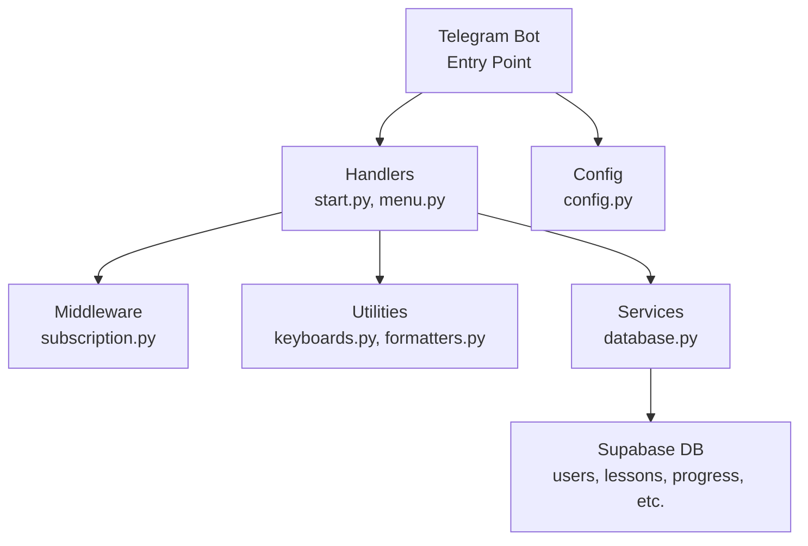
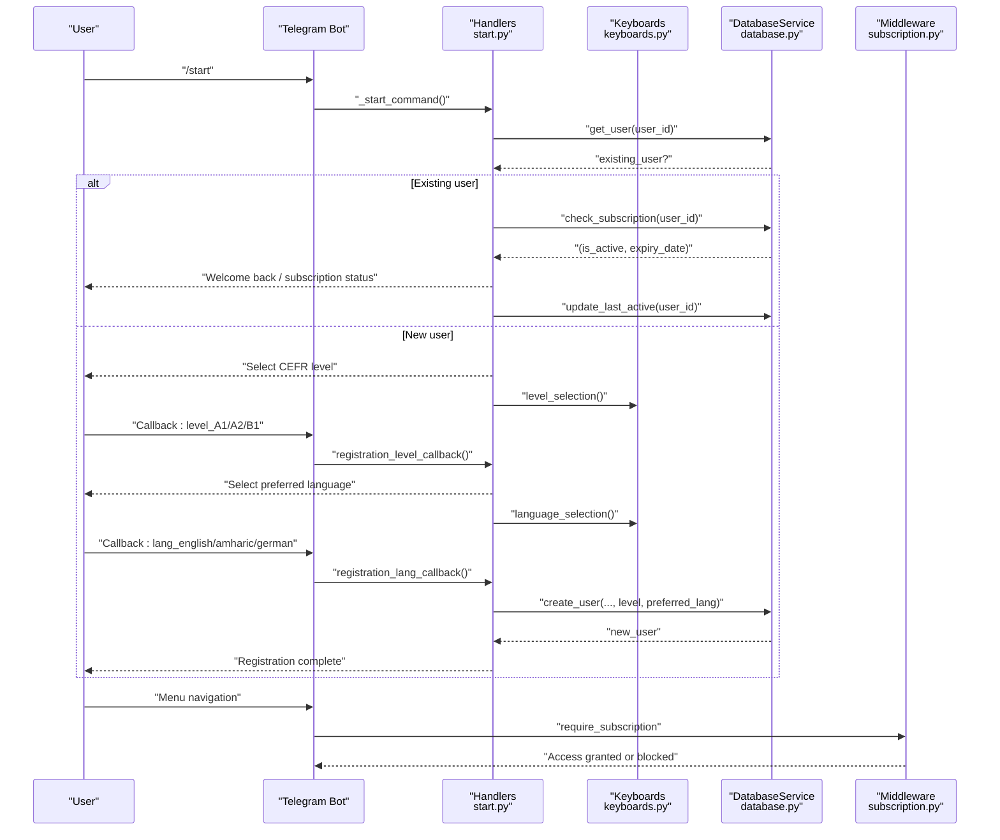
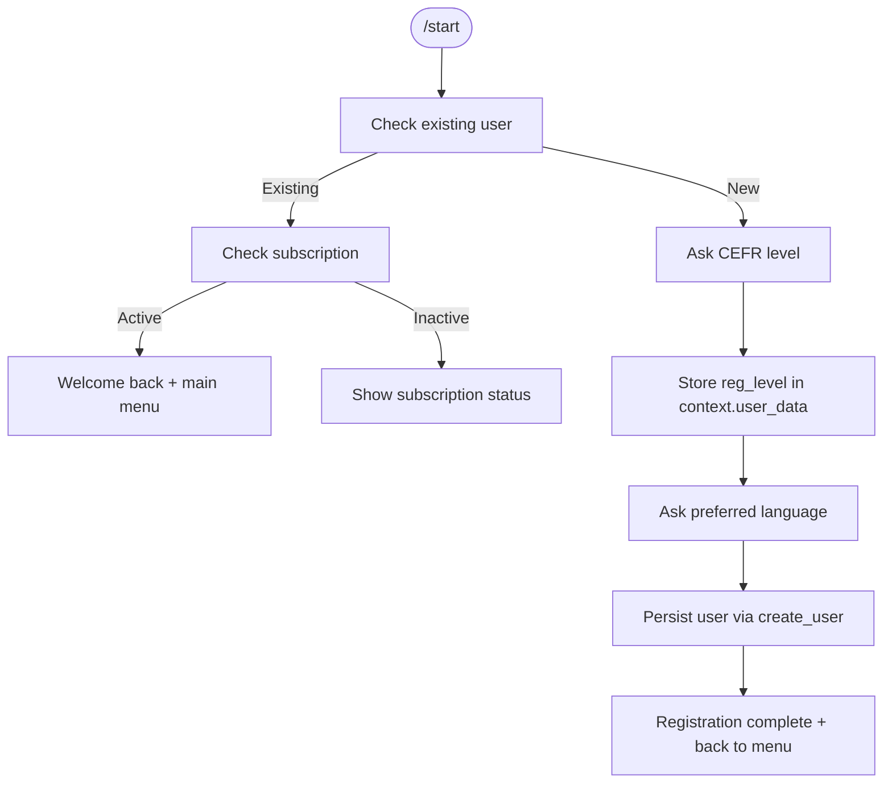
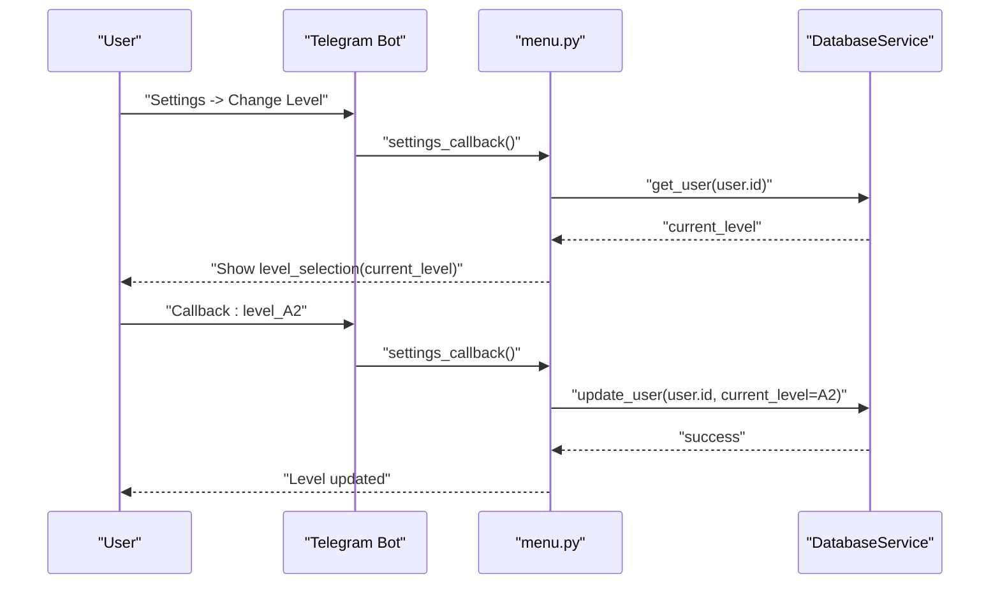
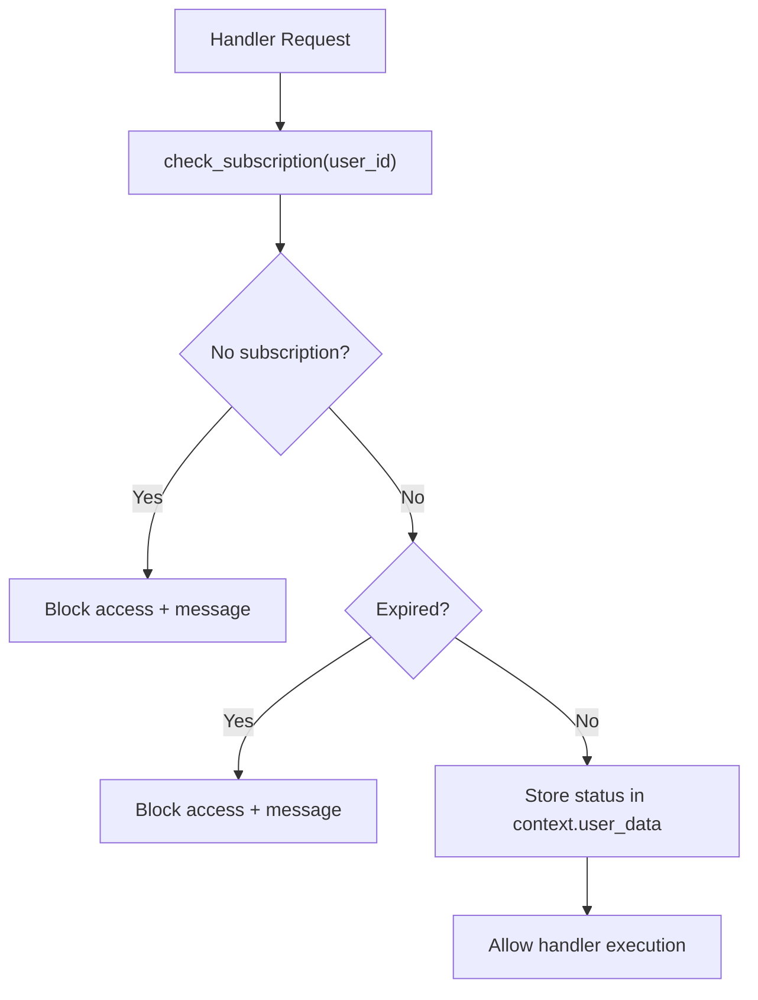
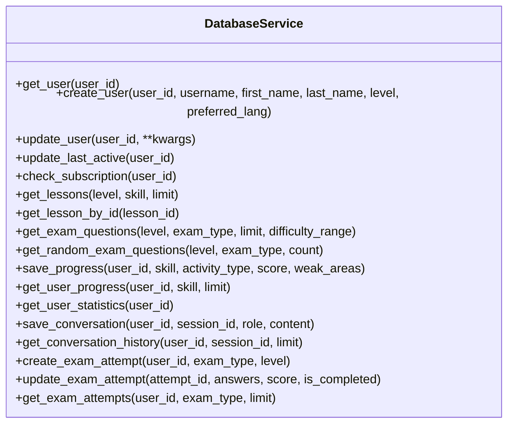
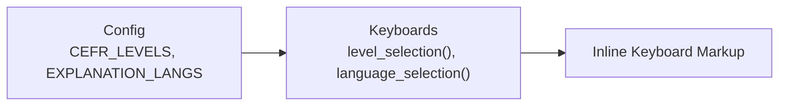
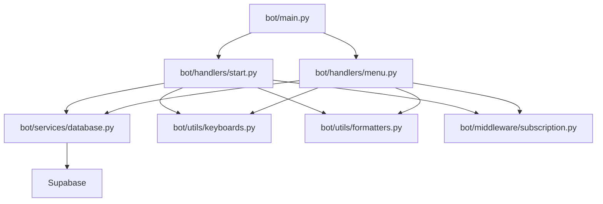

# User Registration & Management

<cite>
**Referenced Files in This Document**
- [main.py](file://bot/main.py)
- [start.py](file://bot/handlers/start.py)
- [menu.py](file://bot/handlers/menu.py)
- [database.py](file://bot/services/database.py)
- [subscription.py](file://bot/middleware/subscription.py)
- [keyboards.py](file://bot/utils/keyboards.py)
- [config.py](file://bot/config.py)
- [formatters.py](file://bot/utils/formatters.py)
- [database_setup.sql](file://database_setup.sql)
- [setup_database.py](file://setup_database.py)
</cite>

## Table of Contents
1. [Introduction](#introduction)
2. [Project Structure](#project-structure)
3. [Core Components](#core-components)
4. [Architecture Overview](#architecture-overview)
5. [Detailed Component Analysis](#detailed-component-analysis)
6. [Dependency Analysis](#dependency-analysis)
7. [Performance Considerations](#performance-considerations)
8. [Troubleshooting Guide](#troubleshooting-guide)
9. [Conclusion](#conclusion)

## Introduction
This document explains the user registration and management system for the EthioGerman Telegram AI Tutor Bot. It covers the complete onboarding flow from the /start command through profile completion, including CEFR level selection (A1, A2, B1), preferred language configuration, and subscription status handling. It documents state management using context.user_data, database integration for user persistence, and the multi-step registration process with callback queries. It also describes user profile management, subscription validation workflows, and user activity tracking, with code example paths and diagrams to guide implementation and troubleshooting.

## Project Structure
The registration and management system spans several modules:
- Entry point and routing: main.py registers handlers and middleware
- Registration flow: start.py handles /start, level selection, and language selection
- Navigation and settings: menu.py routes menu callbacks and settings updates
- Persistence: database.py encapsulates Supabase operations
- Access control: subscription.py validates subscriptions and enforces access
- UI: keyboards.py builds inline keyboards for selections
- Configuration: config.py defines CEFR levels, skills, and languages
- Formatting: formatters.py formats messages consistently

**Diagram sources**
- [main.py](file://bot/main.py#L60-L101)
- [start.py](file://bot/handlers/start.py#L16-L182)
- [menu.py](file://bot/handlers/menu.py#L17-L184)
- [database.py](file://bot/services/database.py#L16-L422)
- [subscription.py](file://bot/middleware/subscription.py#L21-L156)
- [keyboards.py](file://bot/utils/keyboards.py#L10-L183)
- [config.py](file://bot/config.py#L10-L60)
- [formatters.py](file://bot/utils/formatters.py#L8-L300)

**Section sources**
- [main.py](file://bot/main.py#L60-L101)
- [config.py](file://bot/config.py#L10-L60)

## Core Components
- Registration flow: /start command checks user existence, initiates multi-step registration, and persists user data
- State management: context.user_data stores registration flags and temporary selections
- Subscription middleware: validates subscription status and controls access to premium features
- Database service: provides CRUD operations for users, lessons, progress, and exam attempts
- Keyboard builders: provide CEFR level and language selection interfaces
- Formatter utilities: ensure consistent messaging across the bot

**Section sources**
- [start.py](file://bot/handlers/start.py#L16-L182)
- [menu.py](file://bot/handlers/menu.py#L118-L178)
- [database.py](file://bot/services/database.py#L16-L422)
- [subscription.py](file://bot/middleware/subscription.py#L21-L156)
- [keyboards.py](file://bot/utils/keyboards.py#L65-L89)
- [formatters.py](file://bot/utils/formatters.py#L11-L128)

## Architecture Overview
The registration and management architecture integrates Telegram handlers, middleware, utilities, and a Supabase backend. The flow begins with the /start command, transitions through CEFR level and language selection, persists user data, and then routes to the main menu. Subscription middleware ensures access to premium features is controlled.

**Diagram sources**
- [start.py](file://bot/handlers/start.py#L16-L154)
- [database.py](file://bot/services/database.py#L24-L58)
- [subscription.py](file://bot/middleware/subscription.py#L47-L101)
- [keyboards.py](file://bot/utils/keyboards.py#L65-L89)

## Detailed Component Analysis

### Registration Flow and State Management
The registration flow is initiated by the /start command and uses context.user_data to manage state across steps:
- Step 1: CEFR level selection (A1, A2, B1)
- Step 2: Preferred language selection (English, Amharic, German)
- Step 3: User persistence via database.create_user
- Step 4: Post-registration messaging and menu navigation

**Diagram sources**
- [start.py](file://bot/handlers/start.py#L16-L154)
- [database.py](file://bot/services/database.py#L33-L58)
- [keyboards.py](file://bot/utils/keyboards.py#L65-L89)

Implementation highlights:
- Registration state flags stored in context.user_data: registering, reg_username, reg_first_name, reg_last_name, reg_level
- Level and language selection handled by callback handlers that update context.user_data and edit the message
- User creation writes current_level and preferred_lang to the database

**Section sources**
- [start.py](file://bot/handlers/start.py#L16-L154)
- [database.py](file://bot/services/database.py#L33-L58)
- [keyboards.py](file://bot/utils/keyboards.py#L65-L89)

### Settings and Profile Management
Users can update their CEFR level and preferred language after registration:
- Settings menu exposes level and language change options
- Selections are validated against current values and persisted via update_user
- Subscription status view is available from settings

**Diagram sources**
- [menu.py](file://bot/handlers/menu.py#L118-L178)
- [database.py](file://bot/services/database.py#L60-L68)
- [keyboards.py](file://bot/utils/keyboards.py#L65-L89)

**Section sources**
- [menu.py](file://bot/handlers/menu.py#L118-L178)
- [database.py](file://bot/services/database.py#L60-L68)

### Subscription Validation and Access Control
Subscription middleware enforces access to premium features:
- Checks subscription status and returns active/expired/no-subscription states
- Stores subscription warnings in context.user_data for handlers
- Provides decorators for commands and callback handlers

**Diagram sources**
- [subscription.py](file://bot/middleware/subscription.py#L21-L101)

**Section sources**
- [subscription.py](file://bot/middleware/subscription.py#L21-L156)

### Database Integration and User Persistence
The database service encapsulates all Supabase operations for users and related entities:
- User operations: get_user, create_user, update_user, update_last_active, check_subscription
- Progress and exam operations: save_progress, get_user_progress, get_user_statistics, create_exam_attempt, update_exam_attempt, get_exam_attempts
- Conversation history operations: save_conversation, get_conversation_history

**Diagram sources**
- [database.py](file://bot/services/database.py#L16-L422)

**Section sources**
- [database.py](file://bot/services/database.py#L16-L422)

### Configuration and UI Building
Configuration defines supported CEFR levels, skills, and explanation languages. Keyboard builders construct inline keyboards for selections and navigation.

**Diagram sources**
- [config.py](file://bot/config.py#L25-L32)
- [keyboards.py](file://bot/utils/keyboards.py#L65-L89)

**Section sources**
- [config.py](file://bot/config.py#L25-L32)
- [keyboards.py](file://bot/utils/keyboards.py#L65-L89)

## Dependency Analysis
The registration and management system exhibits clear separation of concerns:
- Handlers depend on database service and keyboard/formatter utilities
- Middleware depends on database service for subscription checks
- Entry point wires handlers and middleware into the application

**Diagram sources**
- [main.py](file://bot/main.py#L60-L101)
- [start.py](file://bot/handlers/start.py#L16-L182)
- [menu.py](file://bot/handlers/menu.py#L17-L184)
- [database.py](file://bot/services/database.py#L16-L422)
- [subscription.py](file://bot/middleware/subscription.py#L21-L156)
- [keyboards.py](file://bot/utils/keyboards.py#L10-L183)
- [formatters.py](file://bot/utils/formatters.py#L8-L300)

**Section sources**
- [main.py](file://bot/main.py#L60-L101)
- [database.py](file://bot/services/database.py#L16-L422)

## Performance Considerations
- Database calls: All database operations are asynchronous; ensure minimal round-trips by batching updates where possible
- Subscription checks: Cache subscription status in context.user_data for the duration of a session to reduce repeated checks
- Keyboard construction: Reuse keyboard builders to avoid redundant allocations
- Logging: Keep logs at INFO level for production; switch to DEBUG only during development

## Troubleshooting Guide
Common registration issues and resolutions:
- User not found during /start: Verify database connectivity and that the users table exists
  - Check Supabase credentials and table schema
  - Reference: [database.py](file://bot/services/database.py#L24-L29), [database_setup.sql](file://database_setup.sql#L5-L15)
- Registration callbacks not recognized: Ensure context.user_data['registering'] is set during /start and that menu_callback routes registration callbacks before subscription checks
  - Reference: [start.py](file://bot/handlers/start.py#L75-L80), [menu.py](file://bot/handlers/menu.py#L35-L44)
- Subscription blocking premium features: Confirm subscription middleware decorators are applied to handlers and that subscription status is stored in context.user_data
  - Reference: [subscription.py](file://bot/middleware/subscription.py#L47-L101)
- Keyboard selections not updating user preferences: Ensure settings callbacks handle changing_level and changing_lang flags and call update_user
  - Reference: [menu.py](file://bot/handlers/menu.py#L157-L177), [database.py](file://bot/services/database.py#L60-L68)
- Timezone handling for subscription expiry: The database service normalizes expiry dates to UTC; ensure client-side display uses localized formatting
  - Reference: [database.py](file://bot/services/database.py#L79-L109)

**Section sources**
- [database.py](file://bot/services/database.py#L24-L29)
- [database_setup.sql](file://database_setup.sql#L5-L15)
- [start.py](file://bot/handlers/start.py#L75-L80)
- [menu.py](file://bot/handlers/menu.py#L35-L44)
- [subscription.py](file://bot/middleware/subscription.py#L47-L101)
- [menu.py](file://bot/handlers/menu.py#L157-L177)
- [database.py](file://bot/services/database.py#L79-L109)

## Conclusion
The EthioGerman bot’s user registration and management system provides a robust, modular foundation for onboarding learners, managing profiles, and enforcing subscription-based access. The design leverages Telegram’s callback-driven interface, persistent state via context.user_data, and a Supabase-backed service layer. By following the patterns documented here—particularly around state management, subscription middleware, and database operations—you can extend and maintain the system effectively while delivering a smooth user experience.