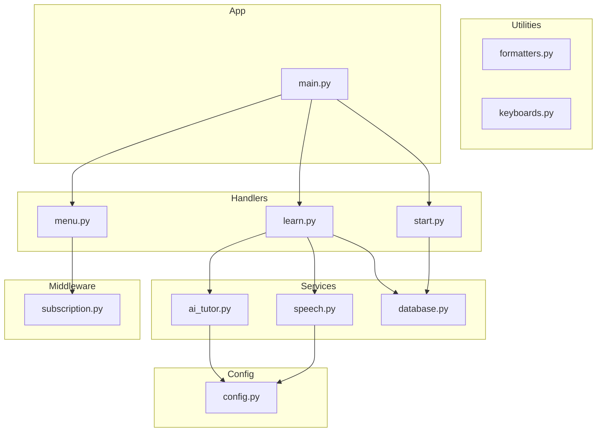
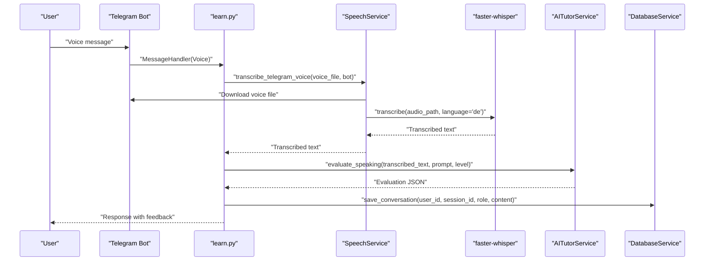
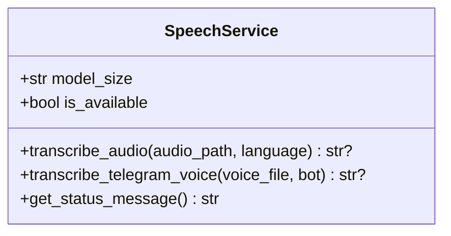
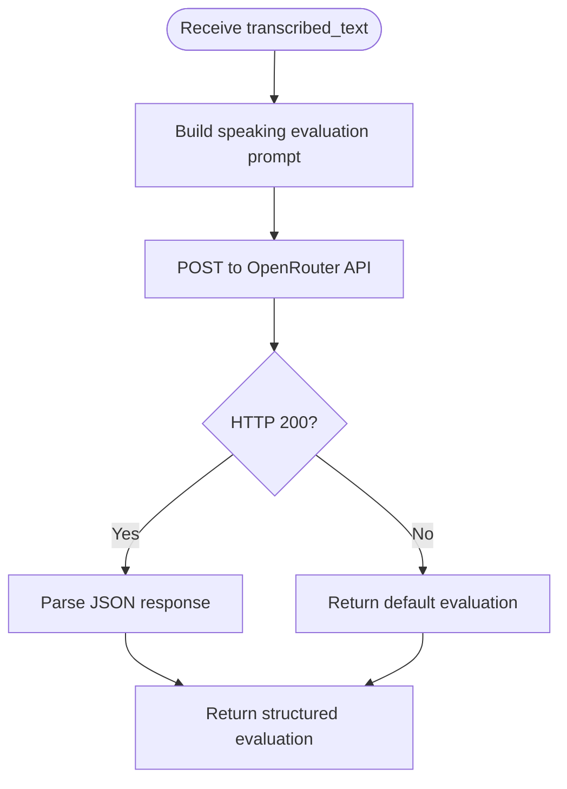
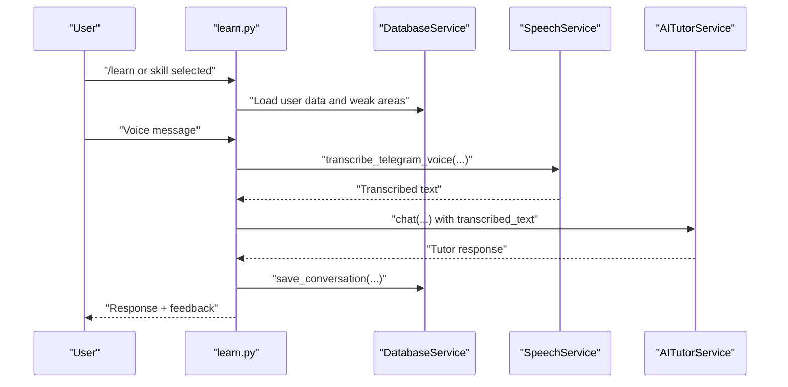
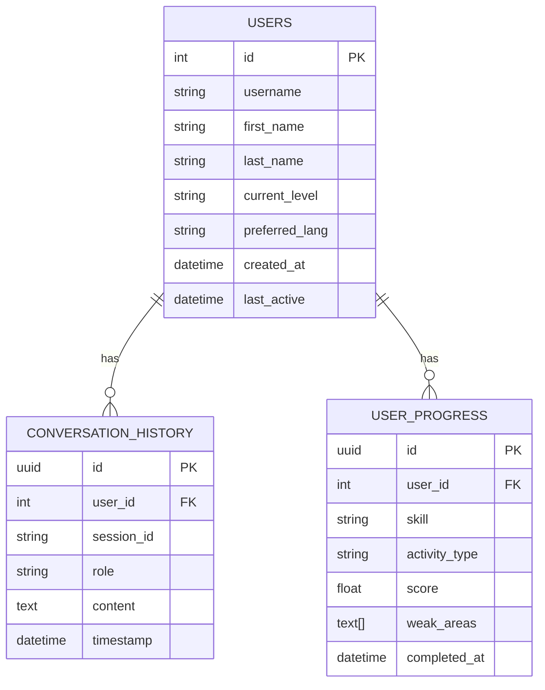
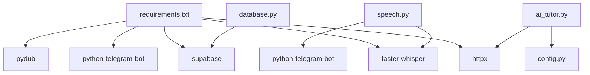

# Voice Practice System

<cite>
**Referenced Files in This Document**
- [speech.py](file://bot/services/speech.py)
- [ai_tutor.py](file://bot/services/ai_tutor.py)
- [learn.py](file://bot/handlers/learn.py)
- [config.py](file://bot/config.py)
- [database.py](file://bot/services/database.py)
- [formatters.py](file://bot/utils/formatters.py)
- [keyboards.py](file://bot/utils/keyboards.py)
- [main.py](file://bot/main.py)
- [subscription.py](file://bot/middleware/subscription.py)
- [start.py](file://bot/handlers/start.py)
- [menu.py](file://bot/handlers/menu.py)
- [requirements.txt](file://requirements.txt)
- [tutor_system.txt](file://prompts/tutor_system.txt)
</cite>

## Table of Contents
1. [Introduction](#introduction)
2. [Project Structure](#project-structure)
3. [Core Components](#core-components)
4. [Architecture Overview](#architecture-overview)
5. [Detailed Component Analysis](#detailed-component-analysis)
6. [Dependency Analysis](#dependency-analysis)
7. [Performance Considerations](#performance-considerations)
8. [Troubleshooting Guide](#troubleshooting-guide)
9. [Conclusion](#conclusion)
10. [Appendices](#appendices)

## Introduction
This document describes the voice practice and speech recognition system integrated into the EthioGerman Language School Telegram bot. It explains how voice messages are handled, transcribed using faster-whisper, evaluated by an AI tutor, and fed into conversation learning modules. It also covers storage, privacy considerations, audio format requirements, processing limitations, quality optimization techniques, and speech improvement tracking.

## Project Structure
The voice practice system spans several modules:
- Handlers orchestrate user interactions and manage conversation states.
- Services encapsulate speech transcription and AI evaluation.
- Utilities provide formatting and keyboard layouts.
- Middleware enforces subscription-based access.
- Configuration centralizes environment variables and constants.
- Database service persists user progress, conversations, and statistics.

**Diagram sources**
- [learn.py](file://bot/handlers/learn.py#L1-L315)
- [speech.py](file://bot/services/speech.py#L1-L140)
- [ai_tutor.py](file://bot/services/ai_tutor.py#L1-L451)
- [database.py](file://bot/services/database.py#L1-L416)
- [formatters.py](file://bot/utils/formatters.py#L1-L300)
- [keyboards.py](file://bot/utils/keyboards.py#L1-L183)
- [subscription.py](file://bot/middleware/subscription.py#L1-L156)
- [config.py](file://bot/config.py#L1-L60)
- [main.py](file://bot/main.py#L1-L93)

**Section sources**
- [main.py](file://bot/main.py#L60-L89)
- [config.py](file://bot/config.py#L10-L60)

## Core Components
- SpeechService: Provides asynchronous audio transcription using faster-whisper, supports Telegram voice downloads, and manages temporary files.
- AITutorService: Evaluates speaking submissions via OpenRouter API, returning structured feedback including pronunciation tips.
- Learn handler: Manages the speaking practice workflow, integrates voice transcription, and feeds results into AI tutoring.
- Database service: Stores conversation history, progress entries, and statistics for tracking improvement.
- Utilities and middleware: Provide consistent formatting, keyboard layouts, subscription checks, and access control.

**Section sources**
- [speech.py](file://bot/services/speech.py#L21-L140)
- [ai_tutor.py](file://bot/services/ai_tutor.py#L19-L451)
- [learn.py](file://bot/handlers/learn.py#L159-L232)
- [database.py](file://bot/services/database.py#L16-L416)
- [formatters.py](file://bot/utils/formatters.py#L230-L268)
- [subscription.py](file://bot/middleware/subscription.py#L21-L101)

## Architecture Overview
The voice practice pipeline integrates Telegram voice messages with local transcription and cloud-based evaluation.

**Diagram sources**
- [learn.py](file://bot/handlers/learn.py#L159-L232)
- [speech.py](file://bot/services/speech.py#L83-L129)
- [ai_tutor.py](file://bot/services/ai_tutor.py#L239-L325)
- [database.py](file://bot/services/database.py#L296-L316)

## Detailed Component Analysis

### SpeechService: Audio Transcription Pipeline
SpeechService encapsulates:
- Availability detection for faster-whisper.
- Model initialization with CPU and quantized compute type.
- Transcription of local audio files with German language hint and VAD filtering.
- Telegram voice download and temporary file cleanup.
- Status reporting for UI messaging.

Key behaviors:
- Audio formats accepted by faster-whisper include OGG, WAV, MP3.
- The service uses a beam size and VAD filter to improve accuracy for conversational audio.
- Temporary files are created and removed automatically.

**Diagram sources**
- [speech.py](file://bot/services/speech.py#L21-L140)

**Section sources**
- [speech.py](file://bot/services/speech.py#L24-L82)
- [speech.py](file://bot/services/speech.py#L83-L129)
- [requirements.txt](file://requirements.txt#L5-L7)

### AITutorService: Pronunciation and Speaking Evaluation
AITutorService evaluates speaking submissions with:
- Structured prompts tailored to CEFR levels.
- JSON-based evaluation outputs including grammar, vocabulary, task completion, fluency, strengths, suggestions, and pronunciation tips.
- Robust error handling with default evaluations when API calls fail.

**Diagram sources**
- [ai_tutor.py](file://bot/services/ai_tutor.py#L239-L325)

**Section sources**
- [ai_tutor.py](file://bot/services/ai_tutor.py#L239-L325)
- [tutor_system.txt](file://prompts/tutor_system.txt#L1-L74)

### Learn Handler: Speaking Practice Workflow
The learn handler coordinates:
- Subscription checks for paid features.
- Skill selection and session initialization.
- Voice message detection and transcription.
- AI tutoring response generation and conversation history persistence.
- Session termination and progress scoring.

**Diagram sources**
- [learn.py](file://bot/handlers/learn.py#L159-L232)
- [database.py](file://bot/services/database.py#L296-L316)
- [speech.py](file://bot/services/speech.py#L83-L129)
- [ai_tutor.py](file://bot/services/ai_tutor.py#L82-L153)

**Section sources**
- [learn.py](file://bot/handlers/learn.py#L159-L232)
- [subscription.py](file://bot/middleware/subscription.py#L21-L101)

### Database Integration: Storage and Tracking
The database service stores:
- Conversation history with timestamps for context.
- Progress entries with skill, activity type, and scores.
- Statistics derived from progress data for tracking improvement.

**Diagram sources**
- [database.py](file://bot/services/database.py#L24-L316)

**Section sources**
- [database.py](file://bot/services/database.py#L296-L316)
- [database.py](file://bot/services/database.py#L188-L211)
- [database.py](file://bot/services/database.py#L233-L292)

### Utilities and Middleware
- Formatters: Provide consistent Markdown-formatted messages for speaking evaluations and progress summaries.
- Keyboards: Offer inline keyboard layouts for menus and actions.
- Subscription middleware: Enforce access control and provide warnings for expiring subscriptions.

**Section sources**
- [formatters.py](file://bot/utils/formatters.py#L230-L268)
- [keyboards.py](file://bot/utils/keyboards.py#L179-L183)
- [subscription.py](file://bot/middleware/subscription.py#L21-L156)

## Dependency Analysis
External dependencies and integrations:
- faster-whisper: Local speech-to-text engine.
- OpenRouter API: Cloud-based language model for evaluation.
- Supabase: Backend database for user data, progress, and conversation history.
- python-telegram-bot: Telegram bot framework for message handling.

**Diagram sources**
- [requirements.txt](file://requirements.txt#L1-L7)
- [ai_tutor.py](file://bot/services/ai_tutor.py#L1-L14)
- [speech.py](file://bot/services/speech.py#L1-L10)
- [database.py](file://bot/services/database.py#L10-L11)
- [config.py](file://bot/config.py#L20-L23)

**Section sources**
- [requirements.txt](file://requirements.txt#L1-L7)
- [config.py](file://bot/config.py#L20-L23)

## Performance Considerations
- Model selection: The service initializes a base-sized whisper model and runs on CPU with int8 compute type to maximize compatibility and reduce resource usage.
- Transcription parameters: Beam size and VAD filtering improve accuracy for conversational audio.
- Async I/O: Transcription and API calls are asynchronous to avoid blocking the event loop.
- Temporary file management: Voice files are downloaded to temporary files and cleaned up after processing.
- API timeouts: AI evaluation requests include timeouts to prevent hanging operations.

[No sources needed since this section provides general guidance]

## Troubleshooting Guide
Common issues and resolutions:
- faster-whisper not installed: The service logs a warning and disables voice transcription. Install the dependency to enable voice features.
- Transcription failures: Errors during transcription are logged and return None; the handler prompts the user to retry or type their response.
- API errors: AI tutor evaluation handles HTTP errors and JSON parsing errors by returning default evaluations.
- Subscription gating: Paid features require an active subscription; middleware prevents access and displays appropriate messages.

**Section sources**
- [speech.py](file://bot/services/speech.py#L13-L18)
- [speech.py](file://bot/services/speech.py#L79-L81)
- [ai_tutor.py](file://bot/services/ai_tutor.py#L140-L152)
- [ai_tutor.py](file://bot/services/ai_tutor.py#L232-L237)
- [subscription.py](file://bot/middleware/subscription.py#L68-L90)

## Conclusion
The voice practice system combines local audio transcription with cloud-based evaluation to deliver a robust speaking practice experience. It integrates seamlessly with conversation learning modules, tracks progress, and respects subscription-based access. By leveraging configurable transcription parameters and structured evaluation outputs, the system supports continuous improvement in pronunciation and fluency.

[No sources needed since this section summarizes without analyzing specific files]

## Appendices

### Audio Format Requirements and Processing Limitations
- Supported formats: OGG, WAV, MP3 (as used by faster-whisper).
- Language hint: German is used for transcription.
- Processing limitations: Accuracy depends on audio quality, background noise, and speaker clarity. VAD filtering helps remove silence and non-speech segments.

**Section sources**
- [speech.py](file://bot/services/speech.py#L45-L82)

### Quality Optimization Techniques
- Use shorter voice messages for clearer transcription.
- Minimize background noise and speak clearly.
- Prefer WAV or OGG formats for best compatibility.
- Enable VAD filtering and adjust beam size for noisy environments.

**Section sources**
- [speech.py](file://bot/services/speech.py#L66-L71)

### Speech Improvement Tracking
- Conversation history is stored for context and review.
- Progress entries record scores per skill and activity type.
- Statistics derive weak areas and strengths to guide targeted practice.

**Section sources**
- [database.py](file://bot/services/database.py#L296-L316)
- [database.py](file://bot/services/database.py#L188-L211)
- [database.py](file://bot/services/database.py#L233-L292)

### Privacy Considerations
- Voice messages are temporarily downloaded and removed after processing.
- Conversation history and progress are stored in the backend database.
- Access to paid features requires active subscription verification.

**Section sources**
- [speech.py](file://bot/services/speech.py#L122-L128)
- [subscription.py](file://bot/middleware/subscription.py#L21-L44)