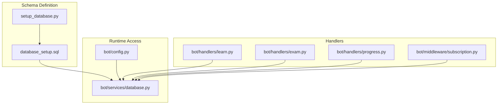
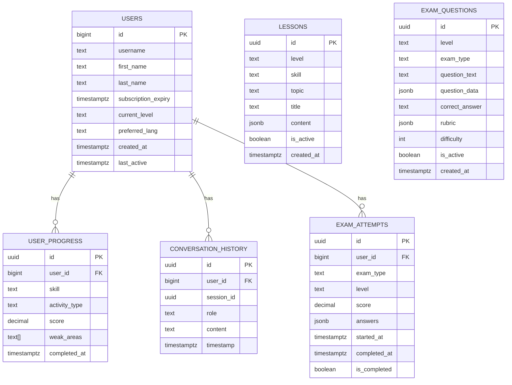
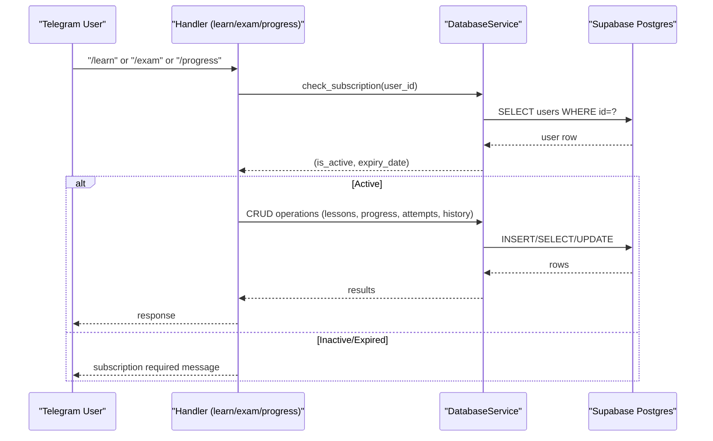
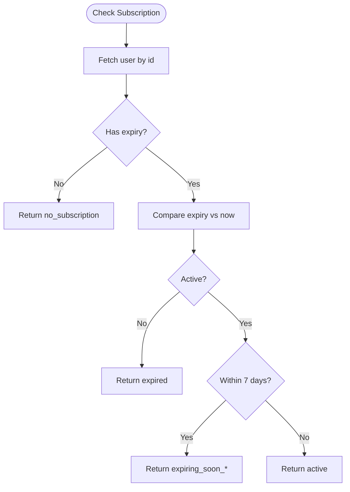
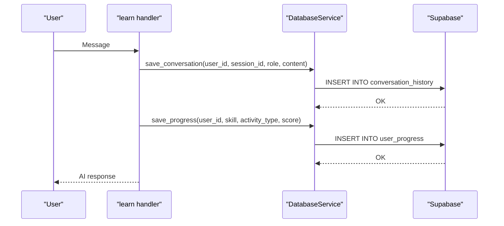
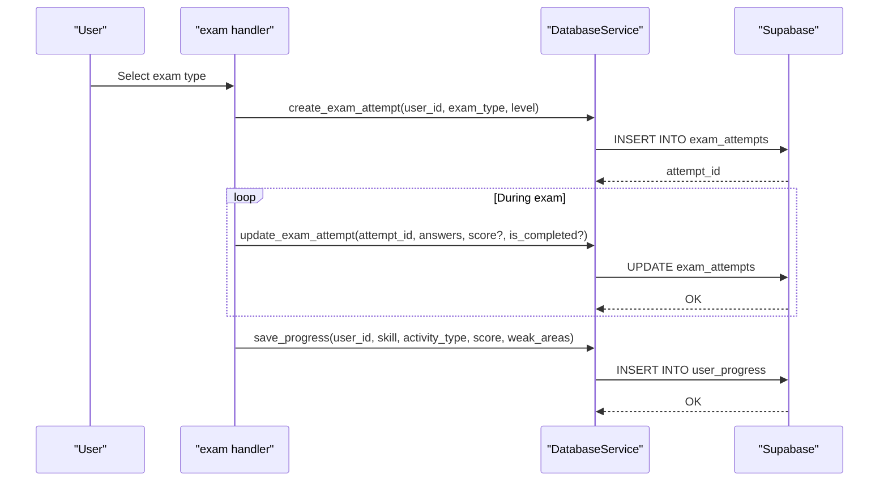
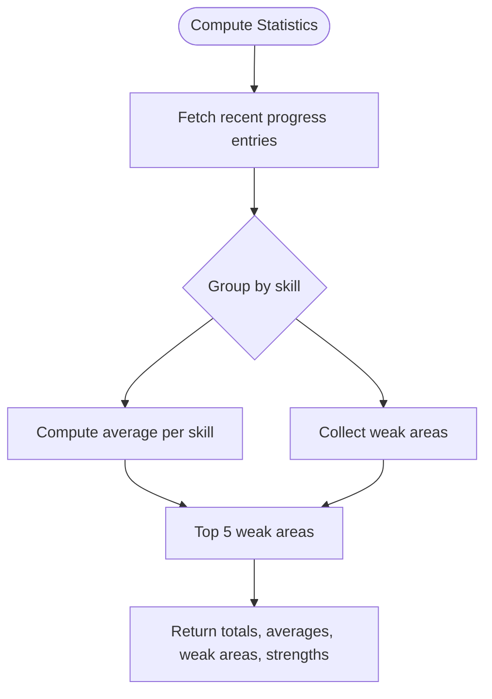
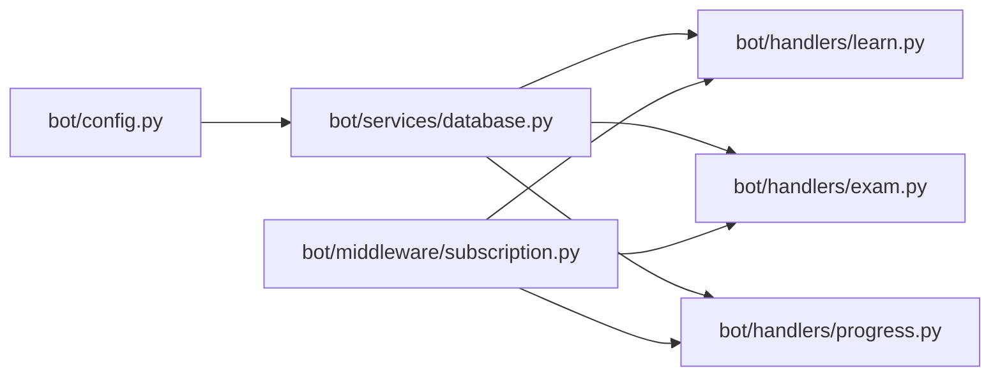

# Database Design

<cite>
**Referenced Files in This Document**
- [database_setup.sql](file://database_setup.sql)
- [setup_database.py](file://setup_database.py)
- [bot/services/database.py](file://bot/services/database.py)
- [bot/config.py](file://bot/config.py)
- [bot/middleware/subscription.py](file://bot/middleware/subscription.py)
- [bot/handlers/exam.py](file://bot/handlers/exam.py)
- [bot/handlers/learn.py](file://bot/handlers/learn.py)
- [bot/handlers/progress.py](file://bot/handlers/progress.py)
- [bot/main.py](file://bot/main.py)
</cite>

## Table of Contents
1. [Introduction](#introduction)
2. [Project Structure](#project-structure)
3. [Core Components](#core-components)
4. [Architecture Overview](#architecture-overview)
5. [Detailed Component Analysis](#detailed-component-analysis)
6. [Dependency Analysis](#dependency-analysis)
7. [Performance Considerations](#performance-considerations)
8. [Troubleshooting Guide](#troubleshooting-guide)
9. [Conclusion](#conclusion)
10. [Appendices](#appendices)

## Introduction
This document provides comprehensive database design documentation for FebEGLS-bot’s PostgreSQL-compatible schema hosted on Supabase. It covers entity definitions, relationships, indexes, constraints, and how the application uses the database to support CEFR proficiency tracking, learning activity logging, and performance analytics. It also documents access patterns, caching strategies, performance considerations, data lifecycle management, security measures, and operational procedures for initialization and migrations.

## Project Structure
The database schema is defined by two primary sources:
- A declarative SQL script that creates tables and indexes.
- A Python setup script that prints the SQL for manual execution and validates connectivity to Supabase.

The runtime database access is encapsulated in a service layer that exposes typed methods for CRUD operations and analytics.

**Diagram sources**
- [database_setup.sql](file://database_setup.sql#L1-L84)
- [setup_database.py](file://setup_database.py#L1-L157)
- [bot/services/database.py](file://bot/services/database.py#L1-L416)
- [bot/config.py](file://bot/config.py#L1-L60)
- [bot/handlers/learn.py](file://bot/handlers/learn.py#L1-L315)
- [bot/handlers/exam.py](file://bot/handlers/exam.py#L1-L523)
- [bot/handlers/progress.py](file://bot/handlers/progress.py#L1-L99)
- [bot/middleware/subscription.py](file://bot/middleware/subscription.py#L1-L156)

**Section sources**
- [database_setup.sql](file://database_setup.sql#L1-L84)
- [setup_database.py](file://setup_database.py#L1-L157)
- [bot/services/database.py](file://bot/services/database.py#L1-L416)
- [bot/config.py](file://bot/config.py#L1-L60)

## Core Components
This section defines the database schema and its relationships. All tables are designed for Supabase Postgres compatibility.

- Users
  - Purpose: Stores user profiles, subscription metadata, and preferences.
  - Primary key: id (BIGINT, Telegram user ID).
  - Notable fields: username, first_name, last_name, subscription_expiry (TIMESTAMPTZ), current_level (TEXT, default A1), preferred_lang (TEXT, default english), created_at (TIMESTAMPTZ), last_active (TIMESTAMPTZ).
  - Constraints: id is PK; defaults for current_level and preferred_lang; created_at default NOW().
  - Indexes: idx_users_subscription on subscription_expiry.

- Lessons
  - Purpose: Stores structured lessons by CEFR level and skill.
  - Primary key: id (UUID).
  - Fields: level (TEXT), skill (TEXT), topic (TEXT), title (TEXT), content (JSONB), is_active (BOOLEAN), created_at (TIMESTAMPTZ).
  - Constraints: level and skill not null; is_active default true; created_at default NOW().
  - Indexes: idx_lessons_level_skill on (level, skill).

- Exam Questions
  - Purpose: Stores exam items for Goethe-style assessments.
  - Primary key: id (UUID).
  - Fields: level (TEXT), exam_type (TEXT), question_text (TEXT), question_data (JSONB), correct_answer (TEXT), rubric (JSONB), difficulty (INT), is_active (BOOLEAN), created_at (TIMESTAMPTZ).
  - Constraints: level and exam_type not null; difficulty default 5; is_active default true; created_at default NOW().
  - Indexes: idx_exam_questions_level_type on (level, exam_type).

- User Progress
  - Purpose: Tracks learning activities and outcomes.
  - Primary key: id (UUID).
  - Foreign key: user_id references users(id) with ON DELETE CASCADE.
  - Fields: user_id (BIGINT), skill (TEXT), activity_type (TEXT), score (DECIMAL(5,2)), weak_areas (TEXT[]), completed_at (TIMESTAMPTZ).
  - Constraints: user_id FK; defaults for completed_at; weak_areas array.
  - Indexes: idx_user_progress_user on user_id.

- Conversation History
  - Purpose: Stores tutoring session messages for long-term memory and context.
  - Primary key: id (UUID).
  - Foreign key: user_id references users(id) with ON DELETE CASCADE.
  - Fields: user_id (BIGINT), session_id (UUID), role (TEXT), content (TEXT), timestamp (TIMESTAMPTZ).
  - Constraints: user_id FK; defaults for timestamp.
  - Indexes: idx_conversation_history_user on (user_id, session_id).

- Exam Attempts
  - Purpose: Records exam sessions with answers and outcomes.
  - Primary key: id (UUID).
  - Foreign key: user_id references users(id) with ON DELETE CASCADE.
  - Fields: user_id (BIGINT), exam_type (TEXT), level (TEXT), score (DECIMAL(5,2)), answers (JSONB), started_at (TIMESTAMPTZ), completed_at (TIMESTAMPTZ), is_completed (BOOLEAN).
  - Constraints: user_id FK; defaults for started_at and is_completed; completed_at nullable until completion.
  - Indexes: idx_exam_attempts_user on user_id.

**Diagram sources**
- [database_setup.sql](file://database_setup.sql#L4-L83)
- [bot/services/database.py](file://bot/services/database.py#L16-L416)

**Section sources**
- [database_setup.sql](file://database_setup.sql#L4-L83)
- [bot/services/database.py](file://bot/services/database.py#L16-L416)

## Architecture Overview
The application uses a thin service layer to abstract Supabase operations. Handlers orchestrate flows and delegate persistence to the database service. Middleware enforces subscription checks before accessing premium features.

**Diagram sources**
- [bot/middleware/subscription.py](file://bot/middleware/subscription.py#L21-L101)
- [bot/services/database.py](file://bot/services/database.py#L24-L103)
- [bot/handlers/learn.py](file://bot/handlers/learn.py#L30-L156)
- [bot/handlers/exam.py](file://bot/handlers/exam.py#L31-L122)
- [bot/handlers/progress.py](file://bot/handlers/progress.py#L17-L36)

## Detailed Component Analysis

### Users and Subscription Management
- Subscription checks are performed centrally and cached in user_data for the current session.
- The service updates last_active timestamps to track engagement.
- Exemptions apply to certain commands; subscription enforcement is handled by decorators.

**Diagram sources**
- [bot/middleware/subscription.py](file://bot/middleware/subscription.py#L21-L44)
- [bot/services/database.py](file://bot/services/database.py#L79-L103)

**Section sources**
- [bot/middleware/subscription.py](file://bot/middleware/subscription.py#L17-L101)
- [bot/services/database.py](file://bot/services/database.py#L79-L103)

### Learning Activity Logging and CEFR Tracking
- Conversation history is persisted per session to enable context reuse and analytics.
- Progress entries capture skill, activity type, score, and weak areas.
- CEFR levels and skills are configured centrally and used to tailor AI responses and evaluations.

**Diagram sources**
- [bot/handlers/learn.py](file://bot/handlers/learn.py#L159-L232)
- [bot/services/database.py](file://bot/services/database.py#L296-L316)
- [bot/services/database.py](file://bot/services/database.py#L188-L210)

**Section sources**
- [bot/handlers/learn.py](file://bot/handlers/learn.py#L159-L232)
- [bot/services/database.py](file://bot/services/database.py#L296-L316)
- [bot/services/database.py](file://bot/services/database.py#L188-L210)
- [bot/config.py](file://bot/config.py#L25-L29)

### Exam Attempts and Performance Analytics
- Exam attempts are created at the start of an exam and updated upon completion with answers and scores.
- Statistics are computed from recent progress entries to summarize performance and weaknesses.

**Diagram sources**
- [bot/handlers/exam.py](file://bot/handlers/exam.py#L113-L122)
- [bot/handlers/exam.py](file://bot/handlers/exam.py#L386-L405)
- [bot/services/database.py](file://bot/services/database.py#L342-L362)
- [bot/services/database.py](file://bot/services/database.py#L364-L389)
- [bot/services/database.py](file://bot/services/database.py#L188-L210)

**Section sources**
- [bot/handlers/exam.py](file://bot/handlers/exam.py#L113-L122)
- [bot/handlers/exam.py](file://bot/handlers/exam.py#L386-L405)
- [bot/services/database.py](file://bot/services/database.py#L342-L362)
- [bot/services/database.py](file://bot/services/database.py#L364-L389)
- [bot/services/database.py](file://bot/services/database.py#L188-L210)

### Progress Reporting
- The progress handler computes aggregated statistics from recent progress records, including average scores, skill-wise averages, and top weak areas.
- It surfaces recent exam attempts and allows targeted practice suggestions.

**Diagram sources**
- [bot/services/database.py](file://bot/services/database.py#L233-L292)
- [bot/handlers/progress.py](file://bot/handlers/progress.py#L17-L36)

**Section sources**
- [bot/services/database.py](file://bot/services/database.py#L233-L292)
- [bot/handlers/progress.py](file://bot/handlers/progress.py#L17-L36)

## Dependency Analysis
- Centralized configuration supplies Supabase credentials and CEFR/skill lists.
- Handlers depend on the database service for persistence and on middleware for access control.
- The database service depends on Supabase client configuration.

**Diagram sources**
- [bot/config.py](file://bot/config.py#L10-L59)
- [bot/services/database.py](file://bot/services/database.py#L16-L416)
- [bot/handlers/learn.py](file://bot/handlers/learn.py#L1-L315)
- [bot/handlers/exam.py](file://bot/handlers/exam.py#L1-L523)
- [bot/handlers/progress.py](file://bot/handlers/progress.py#L1-L99)
- [bot/middleware/subscription.py](file://bot/middleware/subscription.py#L1-L156)

**Section sources**
- [bot/config.py](file://bot/config.py#L10-L59)
- [bot/services/database.py](file://bot/services/database.py#L16-L416)
- [bot/handlers/learn.py](file://bot/handlers/learn.py#L1-L315)
- [bot/handlers/exam.py](file://bot/handlers/exam.py#L1-L523)
- [bot/handlers/progress.py](file://bot/handlers/progress.py#L1-L99)
- [bot/middleware/subscription.py](file://bot/middleware/subscription.py#L1-L156)

## Performance Considerations
- Indexes are defined to optimize frequent queries:
  - Users: idx_users_subscription on subscription_expiry.
  - Lessons: idx_lessons_level_skill on (level, skill).
  - Exam Questions: idx_exam_questions_level_type on (level, exam_type).
  - User Progress: idx_user_progress_user on user_id.
  - Conversation History: idx_conversation_history_user on (user_id, session_id).
  - Exam Attempts: idx_exam_attempts_user on user_id.
- The database service uses LIMIT clauses and ORDER BY to constrain result sets.
- JSONB fields are used for flexible content storage (lessons.content, exam_questions.question_data/rubric, exam_attempts.answers).
- Recommendations:
  - Monitor slow queries using Supabase logs and add composite indexes as needed.
  - Consider partitioning or materialized views for heavy analytics workloads.
  - Apply row-level security (RLS) policies for tenant isolation if multi-tenant usage increases.

[No sources needed since this section provides general guidance]

## Troubleshooting Guide
- Initialization failures:
  - Ensure SUPABASE_URL and SUPABASE_KEY are set in environment variables.
  - Run the printed SQL from the setup script in the Supabase SQL Editor.
  - Verify connectivity using the setup script’s connection check.
- Subscription checks failing:
  - Confirm subscription_expiry is populated and in UTC.
  - Check last_active updates on user actions.
- Slow queries:
  - Review index coverage for filters used in handlers (e.g., level/skill, user_id).
  - Limit result sizes with handler-side limits and pagination where applicable.
- Data anomalies:
  - Validate JSONB fields are well-formed when persisting dynamic content.
  - Audit cascade deletes on user removal affecting progress/history/attempts.

**Section sources**
- [setup_database.py](file://setup_database.py#L102-L152)
- [bot/services/database.py](file://bot/services/database.py#L79-L103)

## Conclusion
The database schema is designed around CEFR-aligned learning, with clear separation of concerns between users, lessons, exam questions, progress tracking, conversation history, and exam attempts. The service layer abstracts Supabase operations, while middleware enforces access control. Indexes and configuration-driven CEFR/skill lists support efficient querying and personalized experiences. The design supports analytics via progress aggregation and maintains extensibility for future enhancements.

[No sources needed since this section summarizes without analyzing specific files]

## Appendices

### Database Initialization and Setup Procedures
- Environment configuration:
  - Set SUPABASE_URL and SUPABASE_KEY in the environment.
  - The application validates required configuration on import.
- Manual setup:
  - Run the printed SQL in the Supabase SQL Editor to create tables and indexes.
- API-based setup:
  - The setup script attempts a connectivity check against the users table.

**Section sources**
- [bot/config.py](file://bot/config.py#L10-L59)
- [setup_database.py](file://setup_database.py#L102-L152)
- [database_setup.sql](file://database_setup.sql#L1-L84)

### Data Lifecycle Management and Retention Policies
- Retention policy recommendations:
  - Archive or delete old conversation_history older than N months.
  - Purge exam_attempts older than N years if compliance requires.
  - Periodically archive user_progress older than N years.
- Migration procedure:
  - Back up the database before schema changes.
  - Add new columns with defaults, populate where needed, then drop legacy columns if required.
  - Rebuild indexes after bulk changes.
- Monitoring:
  - Track table sizes and query performance in Supabase metrics.

[No sources needed since this section provides general guidance]

### Security Measures, Access Control, and Privacy Compliance
- Secrets management:
  - Store SUPABASE_URL and SUPABASE_KEY in environment variables.
- Access control:
  - Enforce subscription checks via middleware for premium features.
  - Consider Row-Level Security (RLS) policies to restrict access to user-owned data.
- Privacy:
  - Minimize stored personal data; anonymize or pseudonymize where feasible.
  - Comply with data subject rights (access, rectification, erasure) by providing deletion mechanisms.

[No sources needed since this section provides general guidance]

### Common Queries and Insertion Patterns
- Get lessons by level and skill:
  - Filter by is_active=true and limit results.
- Get exam questions by level and type with difficulty range:
  - Use gte/lte on difficulty and limit results.
- Save progress:
  - Insert user_progress with skill, activity_type, score, weak_areas, and completed_at.
- Save conversation:
  - Insert conversation_history with user_id, session_id, role, content, timestamp.
- Create/update exam attempt:
  - Insert exam_attempts with user_id, exam_type, level, started_at, is_completed=false.
  - Update with answers, score, completed_at, is_completed=true upon completion.
- Get user statistics:
  - Aggregate recent progress entries by skill and compute averages and weak areas.

**Section sources**
- [bot/services/database.py](file://bot/services/database.py#L107-L126)
- [bot/services/database.py](file://bot/services/database.py#L139-L161)
- [bot/services/database.py](file://bot/services/database.py#L188-L210)
- [bot/services/database.py](file://bot/services/database.py#L296-L316)
- [bot/services/database.py](file://bot/services/database.py#L342-L362)
- [bot/services/database.py](file://bot/services/database.py#L364-L389)
- [bot/services/database.py](file://bot/services/database.py#L233-L292)

### Reporting Capabilities
- Recent exam history:
  - Query completed exam_attempts ordered by completed_at desc.
- Progress summary:
  - Compute totals, averages, skill-wise scores, top weak areas, and strengths from user_progress.
- Subscription status reporting:
  - Use subscription middleware to surface warnings for expiring subscriptions.

**Section sources**
- [bot/services/database.py](file://bot/services/database.py#L391-L411)
- [bot/services/database.py](file://bot/services/database.py#L233-L292)
- [bot/middleware/subscription.py](file://bot/middleware/subscription.py#L140-L155)