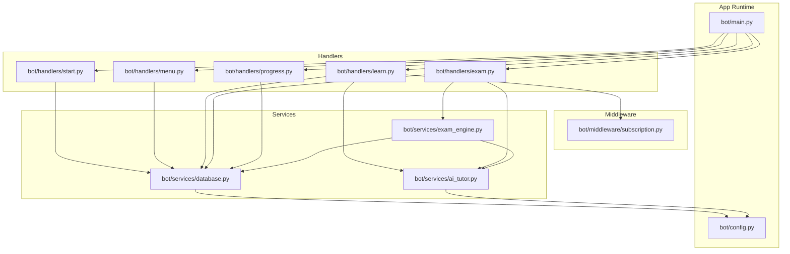
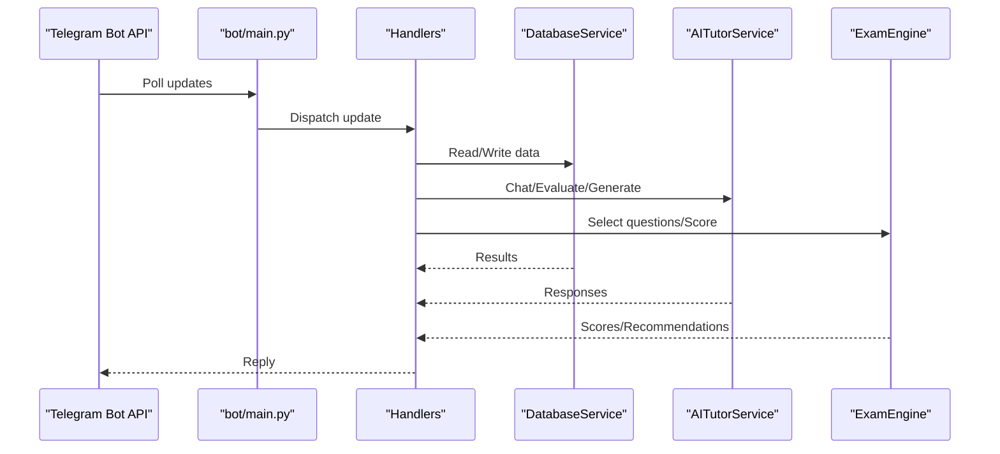
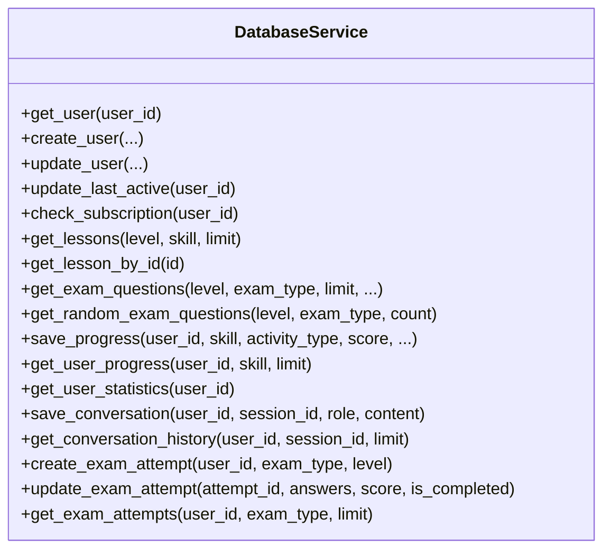
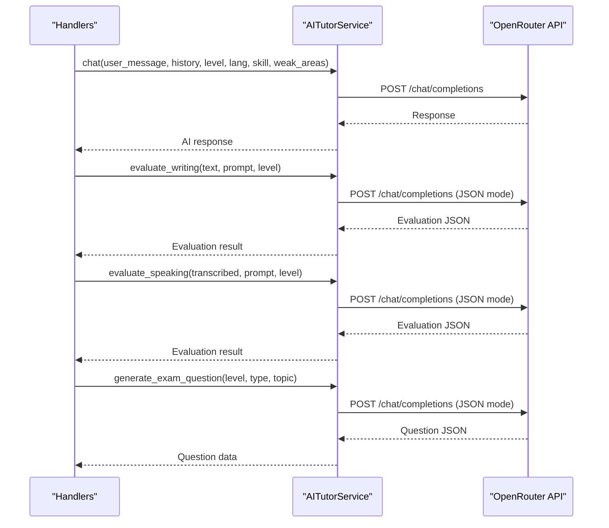
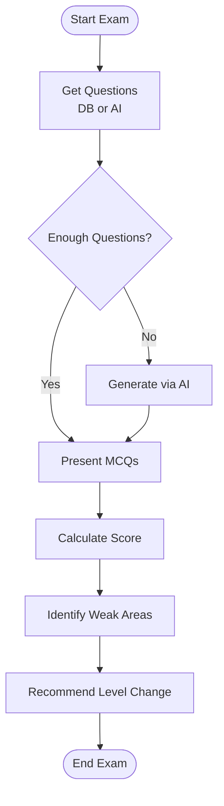
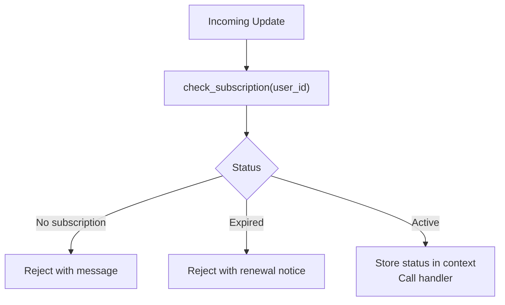
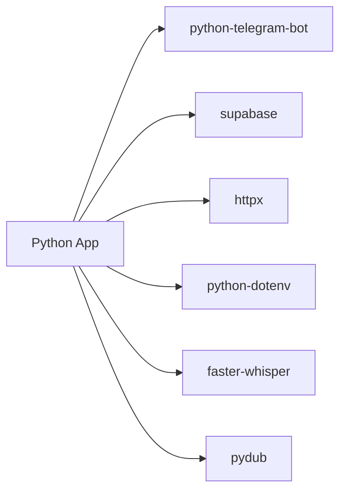

# Deployment & Operations

<cite>
**Referenced Files in This Document**
- [bot/main.py](file://bot/main.py)
- [bot/config.py](file://bot/config.py)
- [bot/services/database.py](file://bot/services/database.py)
- [bot/services/ai_tutor.py](file://bot/services/ai_tutor.py)
- [bot/services/exam_engine.py](file://bot/services/exam_engine.py)
- [bot/middleware/subscription.py](file://bot/middleware/subscription.py)
- [bot/handlers/start.py](file://bot/handlers/start.py)
- [bot/handlers/menu.py](file://bot/handlers/menu.py)
- [bot/handlers/learn.py](file://bot/handlers/learn.py)
- [bot/handlers/exam.py](file://bot/handlers/exam.py)
- [bot/handlers/progress.py](file://bot/handlers/progress.py)
- [prompts/tutor_system.txt](file://prompts/tutor_system.txt)
- [requirements.txt](file://requirements.txt)
- [database_setup.sql](file://database_setup.sql)
- [setup_database.py](file://setup_database.py)
</cite>

## Table of Contents
1. [Introduction](#introduction)
2. [Project Structure](#project-structure)
3. [Core Components](#core-components)
4. [Architecture Overview](#architecture-overview)
5. [Detailed Component Analysis](#detailed-component-analysis)
6. [Dependency Analysis](#dependency-analysis)
7. [Performance Considerations](#performance-considerations)
8. [Monitoring & Health Checks](#monitoring--health-checks)
9. [Operational Metrics](#operational-metrics)
10. [Backup Procedures](#backup-procedures)
11. [Database Maintenance](#database-maintenance)
12. [Log Management](#log-management)
13. [Scaling, Load Balancing, High Availability](#scaling-load-balancing-high-availability)
14. [Security Hardening & Access Control](#security-hardening--access-control)
15. [Rollback & Update Strategies](#rollback--update-strategies)
16. [Maintenance Windows](#maintenance-windows)
17. [Troubleshooting Guide](#troubleshooting-guide)
18. [Cost Management](#cost-management)
19. [Conclusion](#conclusion)

## Introduction
This document provides comprehensive deployment and operations guidance for FebEGLS-bot. It covers production deployment procedures, containerization with Docker, cloud platform deployment (AWS, Google Cloud, Heroku), server configuration requirements, monitoring and health checks, operational metrics, backup and database maintenance, log management, scaling and high availability, security hardening, rollback/update strategies, maintenance windows, troubleshooting, and cost management.

## Project Structure
The application is a Python Telegram bot built with python-telegram-bot. It integrates with Supabase for persistence and OpenRouter for AI capabilities. Handlers orchestrate user interactions, middleware enforces subscription access control, and services encapsulate database operations, AI tutoring, and exam logic.

**Diagram sources**
- [bot/main.py](file://bot/main.py#L60-L89)
- [bot/config.py](file://bot/config.py#L10-L59)
- [bot/services/database.py](file://bot/services/database.py#L16-L416)
- [bot/services/ai_tutor.py](file://bot/services/ai_tutor.py#L19-L451)
- [bot/services/exam_engine.py](file://bot/services/exam_engine.py#L15-L211)
- [bot/middleware/subscription.py](file://bot/middleware/subscription.py#L21-L156)
- [bot/handlers/start.py](file://bot/handlers/start.py#L16-L170)
- [bot/handlers/menu.py](file://bot/handlers/menu.py#L17-L184)
- [bot/handlers/learn.py](file://bot/handlers/learn.py#L30-L315)
- [bot/handlers/exam.py](file://bot/handlers/exam.py#L31-L523)
- [bot/handlers/progress.py](file://bot/handlers/progress.py#L17-L99)

**Section sources**
- [bot/main.py](file://bot/main.py#L1-L93)
- [bot/config.py](file://bot/config.py#L1-L60)
- [requirements.txt](file://requirements.txt#L1-L7)

## Core Components
- Configuration and Environment: Centralized configuration via environment variables with validation.
- Telegram Bot Runtime: Entry point initializes handlers and starts polling.
- Middleware: Subscription enforcement for paid features.
- Services:
  - DatabaseService: CRUD operations against Supabase tables.
  - AITutorService: OpenRouter API integration for tutoring and evaluations.
  - ExamEngine: Question selection, scoring, and recommendations.
- Handlers: Start, menu, learn, exam, progress, and associated keyboard/formatters.

**Section sources**
- [bot/config.py](file://bot/config.py#L10-L59)
- [bot/main.py](file://bot/main.py#L60-L89)
- [bot/middleware/subscription.py](file://bot/middleware/subscription.py#L21-L156)
- [bot/services/database.py](file://bot/services/database.py#L16-L416)
- [bot/services/ai_tutor.py](file://bot/services/ai_tutor.py#L19-L451)
- [bot/services/exam_engine.py](file://bot/services/exam_engine.py#L15-L211)
- [bot/handlers/start.py](file://bot/handlers/start.py#L16-L170)
- [bot/handlers/menu.py](file://bot/handlers/menu.py#L17-L184)
- [bot/handlers/learn.py](file://bot/handlers/learn.py#L30-L315)
- [bot/handlers/exam.py](file://bot/handlers/exam.py#L31-L523)
- [bot/handlers/progress.py](file://bot/handlers/progress.py#L17-L99)

## Architecture Overview
The bot runs continuously, polling Telegram updates and dispatching to handlers. Handlers call services for data and AI operations. Database operations are performed against Supabase, and AI requests are sent to OpenRouter. Subscription middleware ensures access control.

**Diagram sources**
- [bot/main.py](file://bot/main.py#L60-L89)
- [bot/services/database.py](file://bot/services/database.py#L16-L416)
- [bot/services/ai_tutor.py](file://bot/services/ai_tutor.py#L82-L153)
- [bot/services/exam_engine.py](file://bot/services/exam_engine.py#L29-L114)

## Detailed Component Analysis

### Configuration and Environment
- Loads environment variables from a .env file located at the project root.
- Provides keys for Telegram, Supabase, and OpenRouter.
- Validates presence of required keys at import time.
- Includes defaults for AI model and CEFR/skill/language lists.

**Section sources**
- [bot/config.py](file://bot/config.py#L1-L60)

### Database Layer
- Uses Supabase client initialized from configuration.
- Implements user, lesson, exam question, progress, conversation history, and exam attempt operations.
- Indexes optimized for common queries.
- Handles timeouts and errors with logging.

**Diagram sources**
- [bot/services/database.py](file://bot/services/database.py#L16-L416)

**Section sources**
- [bot/services/database.py](file://bot/services/database.py#L16-L416)
- [database_setup.sql](file://database_setup.sql#L1-L84)
- [setup_database.py](file://setup_database.py#L102-L153)

### AI Tutor Service
- Integrates with OpenRouter API for chat, writing, speaking, and dynamic question generation.
- Builds system prompts and manages conversation history length.
- Applies timeouts and returns graceful fallbacks on errors.

**Diagram sources**
- [bot/services/ai_tutor.py](file://bot/services/ai_tutor.py#L82-L153)
- [bot/services/ai_tutor.py](file://bot/services/ai_tutor.py#L154-L325)
- [bot/services/ai_tutor.py](file://bot/services/ai_tutor.py#L327-L424)
- [prompts/tutor_system.txt](file://prompts/tutor_system.txt#L1-L74)

**Section sources**
- [bot/services/ai_tutor.py](file://bot/services/ai_tutor.py#L19-L451)

### Exam Engine
- Selects questions from database or generates via AI.
- Calculates scores, identifies weak areas, and computes weighted scores.
- Provides level recommendation thresholds.

**Diagram sources**
- [bot/services/exam_engine.py](file://bot/services/exam_engine.py#L29-L114)
- [bot/services/exam_engine.py](file://bot/services/exam_engine.py#L116-L148)
- [bot/services/exam_engine.py](file://bot/services/exam_engine.py#L185-L207)

**Section sources**
- [bot/services/exam_engine.py](file://bot/services/exam_engine.py#L15-L211)

### Subscription Middleware
- Enforces subscription access for handlers.
- Stores subscription status in user context.
- Provides warning messages for expiring subscriptions.

**Diagram sources**
- [bot/middleware/subscription.py](file://bot/middleware/subscription.py#L21-L101)

**Section sources**
- [bot/middleware/subscription.py](file://bot/middleware/subscription.py#L21-L156)

### Handlers Overview
- Start: Registration flow and subscription status display.
- Menu: Navigation and settings with subscription gating.
- Learn: Conversation-based tutoring with optional voice transcription.
- Exam: Objective and subjective exam simulation with evaluation.
- Progress: Statistics and history display.

**Section sources**
- [bot/handlers/start.py](file://bot/handlers/start.py#L16-L170)
- [bot/handlers/menu.py](file://bot/handlers/menu.py#L17-L184)
- [bot/handlers/learn.py](file://bot/handlers/learn.py#L30-L315)
- [bot/handlers/exam.py](file://bot/handlers/exam.py#L31-L523)
- [bot/handlers/progress.py](file://bot/handlers/progress.py#L17-L99)

## Dependency Analysis
External dependencies include python-telegram-bot, supabase, httpx, python-dotenv, faster-whisper, pydub. These define runtime requirements and network/API integrations.

**Diagram sources**
- [requirements.txt](file://requirements.txt#L1-L7)

**Section sources**
- [requirements.txt](file://requirements.txt#L1-L7)

## Performance Considerations
- Conversation history length is capped by configuration to control AI context size and latency.
- Async HTTP clients are used for AI requests to avoid blocking.
- Database queries use indexes; consider adding composite indexes for frequently filtered columns.
- Logging levels are tuned to reduce overhead in production.

[No sources needed since this section provides general guidance]

## Monitoring & Health Checks
- Logging: Application logs to stdout and file. Configure external log aggregation (e.g., cloud logging) to capture logs.
- Health endpoint: Not implemented. Add a lightweight GET endpoint returning application status and dependency health (Supabase ping, OpenRouter connectivity).
- Uptime monitoring: Use platform-specific uptime services or external providers to monitor bot availability.

[No sources needed since this section provides general guidance]

## Operational Metrics
- Request volume and error rates per handler.
- AI API latency and error rates.
- Database query duration and failure rates.
- Subscription status and renewal trends.
- Conversation/session length and completion rates.

[No sources needed since this section provides general guidance]

## Backup Procedures
- Supabase backups: Rely on managed backups; validate restore procedures regularly.
- Local dumps: Periodically export critical tables (users, progress, attempts) for offsite storage.
- Secrets rotation: Rotate Supabase keys and OpenRouter API keys; update environment variables and redeploy.

[No sources needed since this section provides general guidance]

## Database Maintenance
- Indexes: Existing indexes are defined in the schema; monitor query plans and add missing indexes as needed.
- Vacuum/analyze: Schedule periodic maintenance on Supabase-managed tables.
- Schema changes: Apply via SQL migrations; avoid destructive changes without testing.

**Section sources**
- [database_setup.sql](file://database_setup.sql#L77-L84)

## Log Management
- Current setup writes logs to console and a local file. For production, forward logs to centralized systems (e.g., cloud logging, ELK stack).
- Rotate logs by size/time and retain for compliance periods.
- Redact sensitive data (tokens, personal info) from logs.

**Section sources**
- [bot/main.py](file://bot/main.py#L28-L42)

## Scaling, Load Balancing, High Availability
- Single-instance polling: The bot uses long-polling; it is not horizontally scalable in this design.
- Recommendations:
  - Use a process manager (e.g., systemd, PM2) to keep the process alive.
  - Deploy behind a reverse proxy/load balancer if exposing webhooks externally.
  - For horizontal scaling, switch to webhooks and run multiple replicas with shared state and leader election if needed.
  - Use managed platforms with auto-restart and health checks.

[No sources needed since this section provides general guidance]

## Security Hardening & Access Control
- Secrets: Store tokens and keys in environment variables; restrict filesystem permissions.
- Network: Limit outbound traffic to Telegram, Supabase, and OpenRouter domains.
- TLS: Ensure HTTPS for any webhook endpoints.
- Rate limits: Implement rate limiting at the platform level; monitor for abuse.
- Subscription enforcement: Middleware prevents unauthorized access to paid features.

**Section sources**
- [bot/config.py](file://bot/config.py#L10-L59)
- [bot/middleware/subscription.py](file://bot/middleware/subscription.py#L21-L101)

## Rollback & Update Strategies
- Blue-green deployments: Maintain two identical environments; switch traffic after validation.
- Canary releases: Gradually shift traffic to the new version.
- Rollback: Re-deploy previous image/tag; ensure configuration parity.
- Maintenance windows: Schedule updates during low-traffic periods; communicate with users.

[No sources needed since this section provides general guidance]

## Maintenance Windows
- Plan maintenance during off-peak hours.
- Communicate planned downtime.
- Automate pre/post maintenance tasks (e.g., DB migrations, cache invalidation).

[No sources needed since this section provides general guidance]

## Troubleshooting Guide
- Missing environment variables: The app validates configuration at import; ensure all required keys are present.
- Supabase connectivity: Verify URL and keys; confirm table existence and indexes.
- OpenRouter failures: Check API key validity, quotas, and network reachability.
- Long response times: Inspect AI latency, conversation history length, and database query performance.
- Subscription issues: Confirm user records and subscription expiry timestamps.

**Section sources**
- [bot/config.py](file://bot/config.py#L40-L59)
- [bot/services/database.py](file://bot/services/database.py#L16-L416)
- [bot/services/ai_tutor.py](file://bot/services/ai_tutor.py#L127-L153)

## Cost Management
- AI API costs: Monitor token usage and optimize context length; batch operations where possible.
- Database costs: Monitor rows and indexes; archive old data if supported.
- Hosting: Choose appropriate instance sizes; enable auto-scaling where applicable.

[No sources needed since this section provides general guidance]

## Conclusion
FebEGLS-bot is a modular Telegram bot integrating Telegram, Supabase, and OpenRouter. Production readiness requires robust configuration management, centralized logging, health monitoring, secure secrets handling, and operational procedures for backups, scaling, and updates. The provided architecture and component analyses offer a foundation for deploying and operating the bot reliably across AWS, Google Cloud, or Heroku.