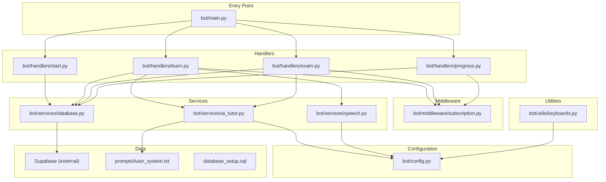
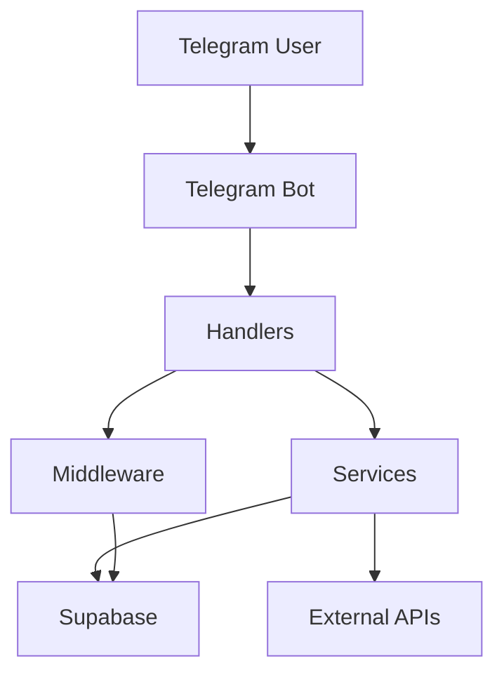
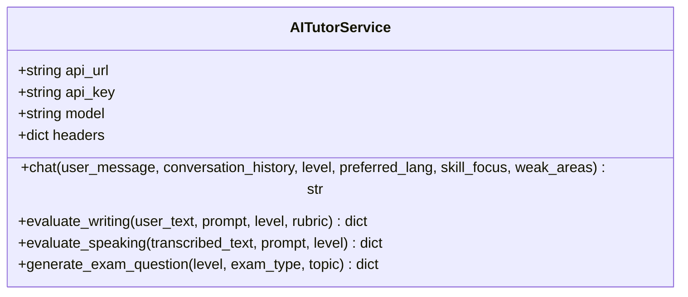
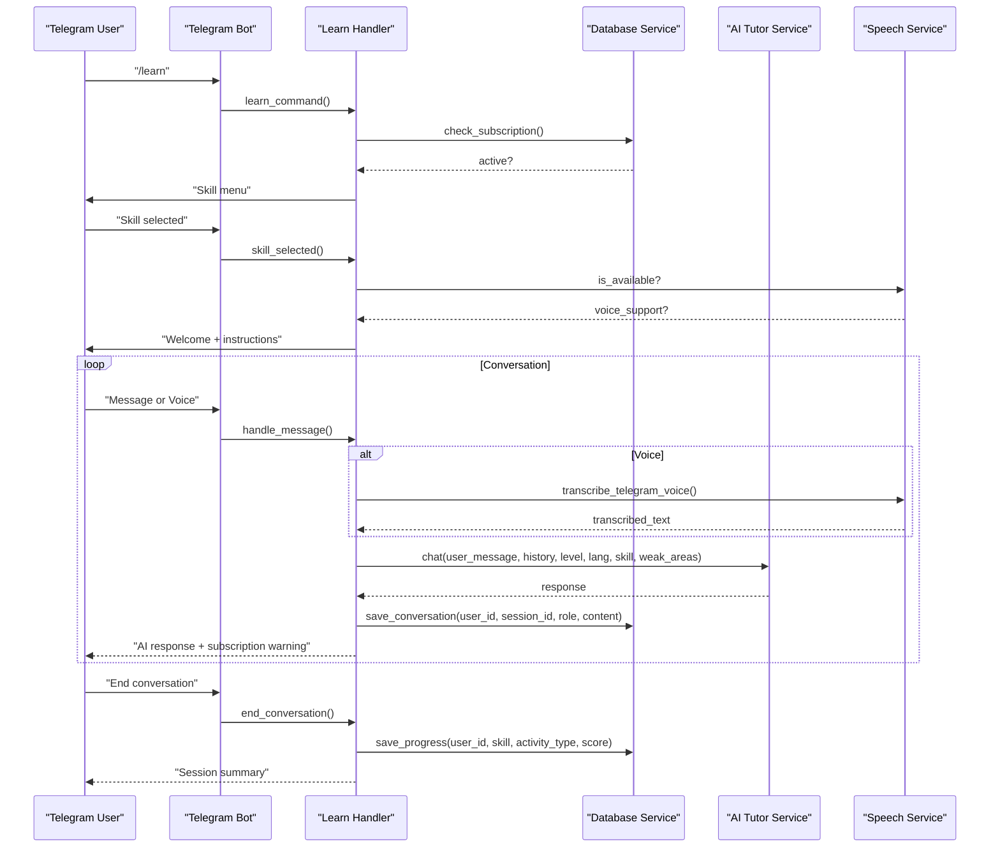
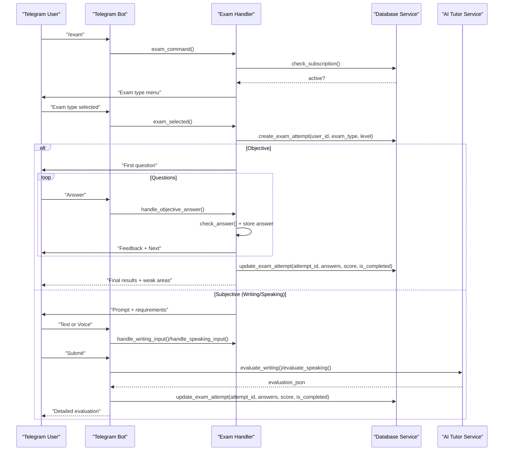
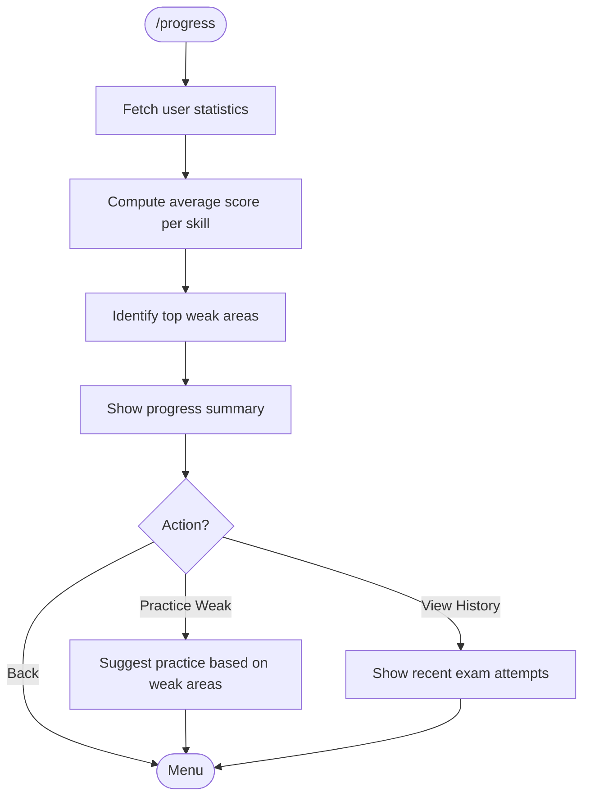
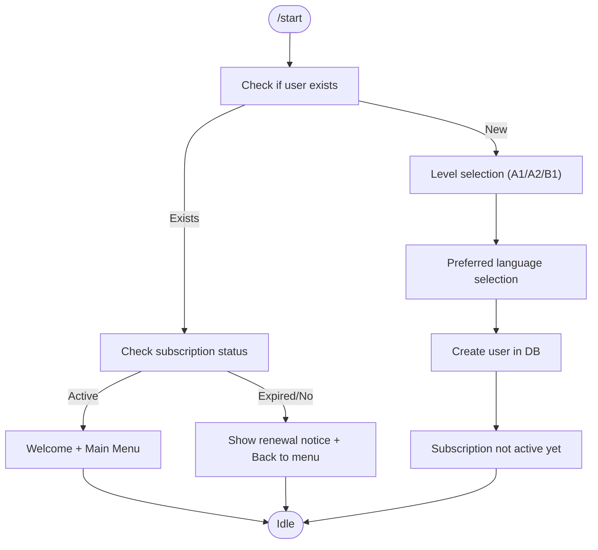
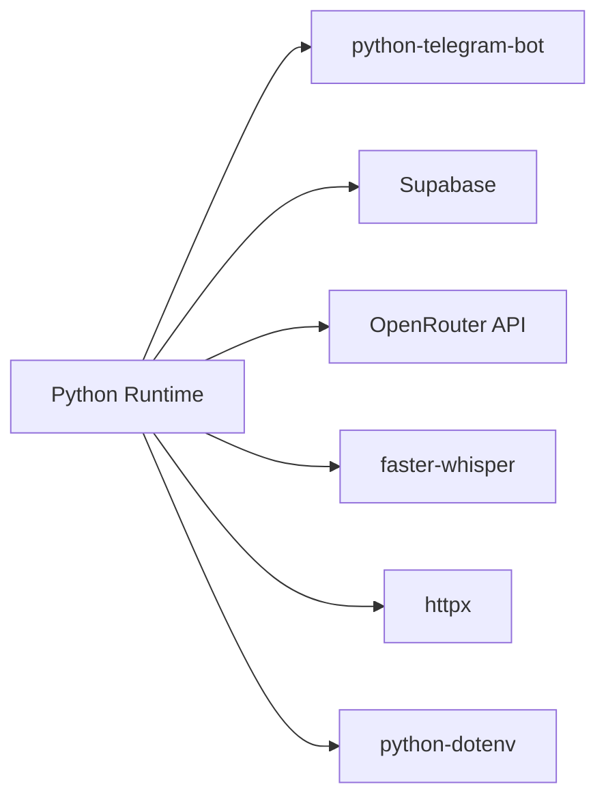

# Project Overview

<cite>
**Referenced Files in This Document**
- [bot/main.py](file://bot/main.py)
- [bot/config.py](file://bot/config.py)
- [bot/handlers/start.py](file://bot/handlers/start.py)
- [bot/handlers/learn.py](file://bot/handlers/learn.py)
- [bot/handlers/exam.py](file://bot/handlers/exam.py)
- [bot/handlers/progress.py](file://bot/handlers/progress.py)
- [bot/services/ai_tutor.py](file://bot/services/ai_tutor.py)
- [bot/services/database.py](file://bot/services/database.py)
- [bot/services/speech.py](file://bot/services/speech.py)
- [bot/middleware/subscription.py](file://bot/middleware/subscription.py)
- [bot/utils/keyboards.py](file://bot/utils/keyboards.py)
- [prompts/tutor_system.txt](file://prompts/tutor_system.txt)
- [database_setup.sql](file://database_setup.sql)
- [requirements.txt](file://requirements.txt)
</cite>

## Table of Contents
1. [Introduction](#introduction)
2. [Project Structure](#project-structure)
3. [Core Components](#core-components)
4. [Architecture Overview](#architecture-overview)
5. [Detailed Component Analysis](#detailed-component-analysis)
6. [Dependency Analysis](#dependency-analysis)
7. [Performance Considerations](#performance-considerations)
8. [Troubleshooting Guide](#troubleshooting-guide)
9. [Conclusion](#conclusion)

## Introduction
FebEGLS-bot is an AI-powered German language learning platform integrated with Telegram, designed specifically for students of the EthioGerman Language School. Its purpose is to deliver personalized, adaptive language instruction through conversational AI, structured exam preparation aligned with Goethe exam formats, progress tracking, and interactive voice practice. The platform targets CEFR A1, A2, and B1 learners and emphasizes practical communication skills, immediate feedback, and continuous improvement.

Core value proposition:
- Personalized AI tutoring that adapts to each learner’s CEFR level and weak areas
- Goethe-aligned exam simulations for reading, listening, writing, speaking, and vocabulary
- Real-time progress insights and actionable suggestions for improvement
- Integrated voice practice with optional speech-to-text transcription for speaking assessment
- Seamless Telegram UX with intuitive menus and guided workflows

## Project Structure
The project follows a modular, layered architecture:
- Entry point initializes the Telegram bot and registers all handlers
- Handlers manage user interactions and orchestrate workflows
- Services encapsulate business logic for AI tutoring, database operations, speech processing, and exam engine
- Middleware enforces access control and subscription checks
- Utilities provide reusable UI components and formatting helpers
- Configuration centralizes environment variables and constants
- Prompts define AI behavior and pedagogical guidelines
- Database schema defines persistent data model for users, lessons, exams, progress, and conversation history

**Diagram sources**
- [bot/main.py](file://bot/main.py#L60-L88)
- [bot/handlers/start.py](file://bot/handlers/start.py#L16-L74)
- [bot/handlers/learn.py](file://bot/handlers/learn.py#L30-L50)
- [bot/handlers/exam.py](file://bot/handlers/exam.py#L31-L51)
- [bot/handlers/progress.py](file://bot/handlers/progress.py#L17-L36)
- [bot/services/database.py](file://bot/services/database.py#L16-L21)
- [bot/services/ai_tutor.py](file://bot/services/ai_tutor.py#L19-L32)
- [bot/services/speech.py](file://bot/services/speech.py#L21-L44)
- [bot/middleware/subscription.py](file://bot/middleware/subscription.py#L47-L101)
- [bot/utils/keyboards.py](file://bot/utils/keyboards.py#L10-L23)
- [bot/config.py](file://bot/config.py#L10-L39)
- [prompts/tutor_system.txt](file://prompts/tutor_system.txt#L1-L74)
- [database_setup.sql](file://database_setup.sql#L4-L83)

**Section sources**
- [bot/main.py](file://bot/main.py#L60-L88)
- [bot/config.py](file://bot/config.py#L10-L39)
- [database_setup.sql](file://database_setup.sql#L4-L83)

## Core Components
- Telegram integration and routing:
  - Entry point creates the application, registers command, callback, and conversation handlers, and starts polling
  - Centralized error handling logs exceptions and notifies users
- Configuration:
  - Loads environment variables for Telegram token, Supabase credentials, OpenRouter API keys and URL, AI model, CEFR levels, skills, languages, timeouts, and conversation history limits
  - Validates required configuration at import time
- Handlers:
  - Start: Registration flow, level/language selection, subscription status messaging
  - Learn: Conversation-driven tutoring with skill-specific modes, voice transcription, progress scoring, and long-term memory persistence
  - Exam: Goethe-style exam simulation with objective and subjective tasks, dynamic question generation, evaluation, and scoring
  - Progress: Statistics aggregation, weak area identification, and exam history display
- Services:
  - Database: Supabase client wrapper for user, lesson, exam question, progress, conversation history, and exam attempt operations
  - AI Tutor: OpenRouter API integration with Llama 3.3 70B model, system prompts, conversation context, writing and speaking evaluation, and dynamic question generation
  - Speech: Optional voice transcription using faster-whisper with Telegram voice message support
- Middleware:
  - Subscription enforcement with status-aware warnings and exemptions for non-subscription commands
- Utilities:
  - Keyboard builders for menus and interactive UI
  - Formatting helpers for messages and results

**Section sources**
- [bot/main.py](file://bot/main.py#L45-L88)
- [bot/config.py](file://bot/config.py#L10-L59)
- [bot/handlers/start.py](file://bot/handlers/start.py#L16-L141)
- [bot/handlers/learn.py](file://bot/handlers/learn.py#L30-L275)
- [bot/handlers/exam.py](file://bot/handlers/exam.py#L31-L466)
- [bot/handlers/progress.py](file://bot/handlers/progress.py#L17-L93)
- [bot/services/database.py](file://bot/services/database.py#L16-L415)
- [bot/services/ai_tutor.py](file://bot/services/ai_tutor.py#L19-L451)
- [bot/services/speech.py](file://bot/services/speech.py#L21-L139)
- [bot/middleware/subscription.py](file://bot/middleware/subscription.py#L21-L155)
- [bot/utils/keyboards.py](file://bot/utils/keyboards.py#L10-L183)

## Architecture Overview
The system employs a layered architecture with clear separation of concerns:
- Presentation layer: Telegram handlers and keyboards
- Control layer: Conversation handlers and middleware
- Business logic layer: AI tutor, exam engine, and speech services
- Data access layer: Database service wrapping Supabase
- External integrations: OpenRouter API and faster-whisper

Design patterns:
- Handler pattern: Telegram handlers encapsulate user interactions and delegate to services
- Service layer: Encapsulates domain logic and external API integrations
- Middleware: Cross-cutting concerns like subscription validation
- Factory pattern: Keyboard builders for consistent UI
- Singleton pattern: Shared service instances (ai_tutor, db, speech_service)

**Diagram sources**
- [bot/main.py](file://bot/main.py#L60-L88)
- [bot/handlers/learn.py](file://bot/handlers/learn.py#L30-L50)
- [bot/handlers/exam.py](file://bot/handlers/exam.py#L31-L51)
- [bot/services/ai_tutor.py](file://bot/services/ai_tutor.py#L19-L32)
- [bot/services/database.py](file://bot/services/database.py#L16-L21)
- [bot/services/speech.py](file://bot/services/speech.py#L21-L44)
- [bot/middleware/subscription.py](file://bot/middleware/subscription.py#L47-L101)

## Detailed Component Analysis

### AI Tutor Service
The AI tutor integrates with OpenRouter’s Llama 3.3 70B model to provide:
- Adaptive conversation responses aligned with CEFR levels and preferred explanation languages
- Writing and speaking evaluations with detailed scoring rubrics and corrective feedback
- Dynamic question generation for exam simulations
- Conversation context management with configurable history depth

**Diagram sources**
- [bot/services/ai_tutor.py](file://bot/services/ai_tutor.py#L19-L451)
- [bot/config.py](file://bot/config.py#L20-L26)
- [prompts/tutor_system.txt](file://prompts/tutor_system.txt#L1-L74)

**Section sources**
- [bot/services/ai_tutor.py](file://bot/services/ai_tutor.py#L82-L153)
- [bot/services/ai_tutor.py](file://bot/services/ai_tutor.py#L154-L326)
- [bot/services/ai_tutor.py](file://bot/services/ai_tutor.py#L327-L424)
- [bot/config.py](file://bot/config.py#L20-L26)
- [prompts/tutor_system.txt](file://prompts/tutor_system.txt#L1-L74)

### Learning/Tutoring Workflow
The learning flow supports multiple skills and integrates voice practice:
- Skill selection with contextual intros
- Conversation mode with AI feedback and correction templates
- Voice message transcription when available
- Long-term memory persistence and progress scoring

**Diagram sources**
- [bot/handlers/learn.py](file://bot/handlers/learn.py#L30-L275)
- [bot/services/ai_tutor.py](file://bot/services/ai_tutor.py#L82-L153)
- [bot/services/speech.py](file://bot/services/speech.py#L83-L129)
- [bot/services/database.py](file://bot/services/database.py#L296-L316)
- [bot/middleware/subscription.py](file://bot/middleware/subscription.py#L21-L44)

**Section sources**
- [bot/handlers/learn.py](file://bot/handlers/learn.py#L30-L275)
- [bot/services/speech.py](file://bot/services/speech.py#L21-L139)
- [bot/services/database.py](file://bot/services/database.py#L188-L210)

### Exam Preparation Workflow
The exam module simulates Goethe-style assessments:
- Objective exams with MCQs, instant feedback, and score calculation
- Subjective exams (writing and speaking) with AI evaluation and rubrics
- Attempt tracking and detailed results with weak area suggestions

**Diagram sources**
- [bot/handlers/exam.py](file://bot/handlers/exam.py#L31-L466)
- [bot/services/ai_tutor.py](file://bot/services/ai_tutor.py#L154-L326)
- [bot/services/database.py](file://bot/services/database.py#L342-L390)

**Section sources**
- [bot/handlers/exam.py](file://bot/handlers/exam.py#L31-L466)
- [bot/services/ai_tutor.py](file://bot/services/ai_tutor.py#L154-L326)
- [bot/services/database.py](file://bot/services/database.py#L342-L390)

### Progress Tracking Workflow
Progress reporting aggregates recent activities and highlights weak areas:
- Statistics computation from saved progress entries
- Weak area suggestions and targeted practice prompts
- Recent exam history display

**Diagram sources**
- [bot/handlers/progress.py](file://bot/handlers/progress.py#L17-L93)
- [bot/services/database.py](file://bot/services/database.py#L233-L292)

**Section sources**
- [bot/handlers/progress.py](file://bot/handlers/progress.py#L17-L93)
- [bot/services/database.py](file://bot/services/database.py#L233-L292)

### Registration and Subscription Flow
New users register with level and preferred language, while existing users receive subscription status updates and menu navigation.

**Diagram sources**
- [bot/handlers/start.py](file://bot/handlers/start.py#L16-L141)
- [bot/services/database.py](file://bot/services/database.py#L33-L58)
- [bot/middleware/subscription.py](file://bot/middleware/subscription.py#L21-L44)

**Section sources**
- [bot/handlers/start.py](file://bot/handlers/start.py#L16-L141)
- [bot/services/database.py](file://bot/services/database.py#L33-L58)
- [bot/middleware/subscription.py](file://bot/middleware/subscription.py#L21-L44)

## Dependency Analysis
Technology stack and external dependencies:
- Python runtime and Telegram integration via python-telegram-bot
- Supabase for relational data storage and retrieval
- OpenRouter API for advanced language model capabilities
- faster-whisper for optional voice transcription
- httpx for asynchronous HTTP requests
- python-dotenv for environment variable loading

**Diagram sources**
- [requirements.txt](file://requirements.txt#L1-L7)
- [bot/config.py](file://bot/config.py#L10-L26)

**Section sources**
- [requirements.txt](file://requirements.txt#L1-L7)
- [bot/config.py](file://bot/config.py#L10-L26)

## Performance Considerations
- Asynchronous HTTP requests minimize latency when interacting with OpenRouter and Supabase
- Conversation history is capped to reduce payload sizes and improve response times
- Voice transcription is optional and gracefully handled when faster-whisper is unavailable
- Indexes on frequently queried columns (subscription expiry, level/skill combinations, user progress) optimize database queries
- Typing indicators and targeted responses keep user sessions efficient and responsive

[No sources needed since this section provides general guidance]

## Troubleshooting Guide
Common issues and resolutions:
- Missing configuration: Ensure all environment variables are set; the app validates required keys at startup
- Subscription access: Handlers decorated with subscription middleware will block non-active users and display renewal notices
- Voice transcription failures: Verify faster-whisper installation; the service falls back to text input when unavailable
- Database connectivity: Confirm Supabase URL and key; the database service uses these credentials to initialize the client
- API errors: OpenRouter API responses are logged; users receive graceful fallback messages when requests fail

**Section sources**
- [bot/config.py](file://bot/config.py#L40-L59)
- [bot/middleware/subscription.py](file://bot/middleware/subscription.py#L47-L101)
- [bot/services/speech.py](file://bot/services/speech.py#L12-L18)
- [bot/services/database.py](file://bot/services/database.py#L16-L21)
- [bot/services/ai_tutor.py](file://bot/services/ai_tutor.py#L140-L152)

## Conclusion
FebEGLS-bot delivers a comprehensive, scalable German language learning solution tailored to EthioGerman Language School students. By combining conversational AI, structured exam simulations, progress analytics, and optional voice practice, it addresses key language learning challenges: motivation, personalized instruction, authentic practice, and measurable growth. The modular architecture, robust middleware, and clear separation of concerns ensure maintainability and extensibility for future enhancements.