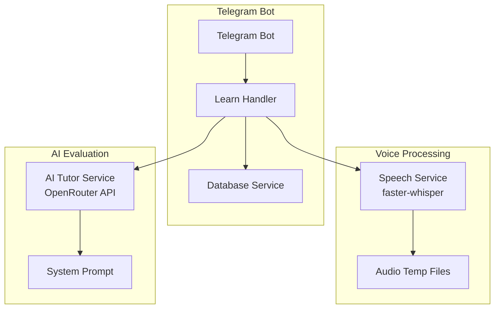
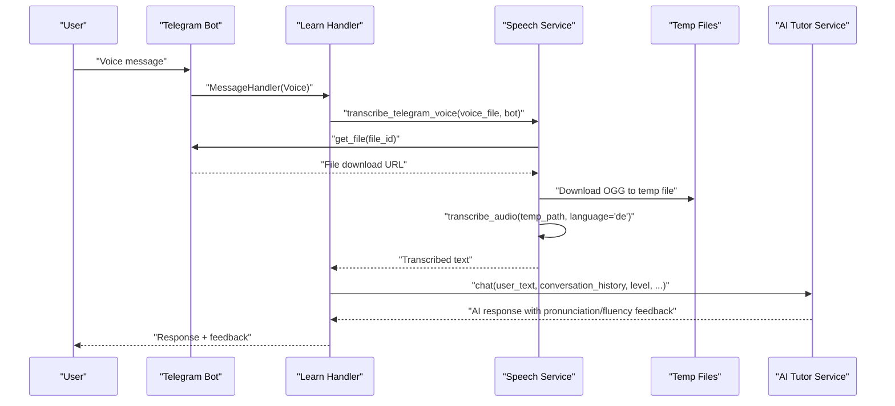
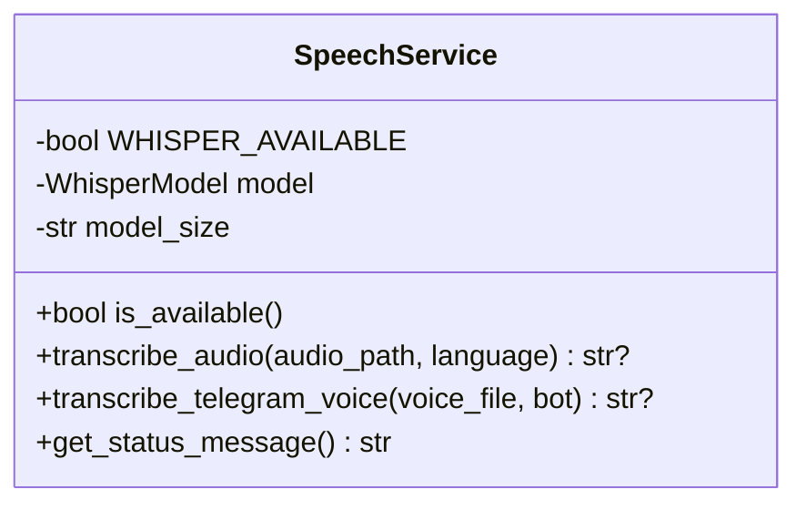
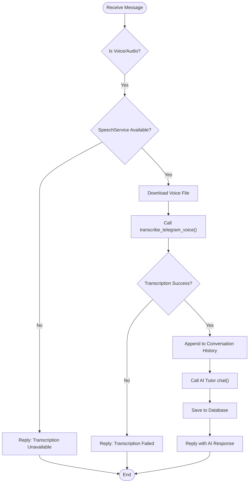
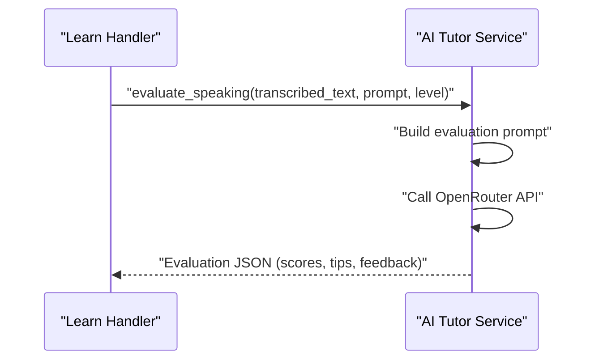
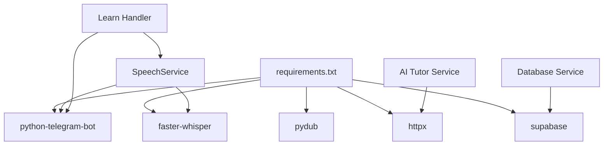

# Voice Processing

<cite>
**Referenced Files in This Document**
- [speech.py](file://bot/services/speech.py)
- [ai_tutor.py](file://bot/services/ai_tutor.py)
- [learn.py](file://bot/handlers/learn.py)
- [config.py](file://bot/config.py)
- [main.py](file://bot/main.py)
- [requirements.txt](file://requirements.txt)
- [database.py](file://bot/services/database.py)
- [formatters.py](file://bot/utils/formatters.py)
- [keyboards.py](file://bot/utils/keyboards.py)
</cite>

## Table of Contents
1. [Introduction](#introduction)
2. [Project Structure](#project-structure)
3. [Core Components](#core-components)
4. [Architecture Overview](#architecture-overview)
5. [Detailed Component Analysis](#detailed-component-analysis)
6. [Dependency Analysis](#dependency-analysis)
7. [Performance Considerations](#performance-considerations)
8. [Troubleshooting Guide](#troubleshooting-guide)
9. [Privacy and Compliance](#privacy-and-compliance)
10. [Conclusion](#conclusion)

## Introduction
This document explains the voice processing and speech-to-text functionality integrated into the EthioGerman Language School Telegram bot. It covers how voice messages are captured, processed, transcribed, and evaluated for pronunciation and fluency as part of the speaking practice feature. It also documents supported audio formats, quality requirements, processing limitations, configuration options, error handling, fallback mechanisms, and privacy considerations.

## Project Structure
The voice processing feature spans several modules:
- Speech service: Implements transcription using faster-whisper
- Learning handler: Orchestrates voice capture, transcription, and feedback delivery
- AI tutor service: Evaluates transcribed speech for grammar, vocabulary, task completion, and fluency
- Configuration: Provides environment-based configuration for API keys and model settings
- Database service: Stores conversation history and progress data
- Utilities: Formatting and keyboard builders for user interface

**Diagram sources**
- [speech.py](file://bot/services/speech.py#L21-L139)
- [learn.py](file://bot/handlers/learn.py#L159-L232)
- [ai_tutor.py](file://bot/services/ai_tutor.py#L19-L450)
- [database.py](file://bot/services/database.py#L16-L416)

**Section sources**
- [speech.py](file://bot/services/speech.py#L1-L140)
- [learn.py](file://bot/handlers/learn.py#L1-L315)
- [ai_tutor.py](file://bot/services/ai_tutor.py#L1-L451)
- [config.py](file://bot/config.py#L1-L60)
- [database.py](file://bot/services/database.py#L1-L416)
- [requirements.txt](file://requirements.txt#L1-L7)

## Core Components
- SpeechService: Loads the faster-whisper model, handles audio transcription, and manages temporary files for voice messages.
- Learn Handler: Detects voice messages, triggers transcription, and routes the transcribed text to the AI tutor for evaluation.
- AI Tutor Service: Evaluates speaking submissions and provides pronunciation and fluency feedback.
- Configuration: Centralized environment variables for API keys and model parameters.
- Database Service: Persists conversation history and progress for long-term memory and analytics.

**Section sources**
- [speech.py](file://bot/services/speech.py#L21-L139)
- [learn.py](file://bot/handlers/learn.py#L159-L232)
- [ai_tutor.py](file://bot/services/ai_tutor.py#L19-L450)
- [config.py](file://bot/config.py#L10-L59)
- [database.py](file://bot/services/database.py#L16-L416)

## Architecture Overview
The voice processing pipeline integrates Telegram voice messages with local transcription and cloud-based evaluation:

**Diagram sources**
- [learn.py](file://bot/handlers/learn.py#L159-L232)
- [speech.py](file://bot/services/speech.py#L83-L129)
- [ai_tutor.py](file://bot/services/ai_tutor.py#L82-L153)

## Detailed Component Analysis

### SpeechService: Transcription Engine
- Model loading: Attempts to import faster-whisper and initialize a WhisperModel on CPU with int8 compute type. Falls back gracefully if unavailable.
- Audio formats: Processes OGG files downloaded from Telegram voice messages; internal transcribe_audio accepts OGG/WAV/MP3 paths.
- Language support: Defaults to German ("de") with language hinting.
- VAD filtering: Uses voice activity detection to filter non-speech segments.
- Beam search: Uses a beam size for improved transcription quality.
- Temporary file management: Creates a temporary OGG file for voice messages and cleans it up after processing.

**Diagram sources**
- [speech.py](file://bot/services/speech.py#L21-L139)

**Section sources**
- [speech.py](file://bot/services/speech.py#L12-L139)

### Learn Handler: Voice Capture and Feedback
- Voice detection: Filters incoming messages for voice/audio types and invokes transcription when available.
- Status messaging: Informs users whether voice transcription is available or requires typing.
- Conversation continuity: Appends transcribed text to conversation history and sends typing indicators.
- Integration with AI tutor: Routes transcribed text to the AI tutor for contextual responses and evaluations.
- Persistence: Saves conversation entries to the database for long-term memory.

**Diagram sources**
- [learn.py](file://bot/handlers/learn.py#L159-L232)
- [speech.py](file://bot/services/speech.py#L83-L129)

**Section sources**
- [learn.py](file://bot/handlers/learn.py#L159-L232)
- [formatters.py](file://bot/utils/formatters.py#L294-L300)

### AI Tutor Service: Pronunciation and Fluency Evaluation
- Speaking evaluation: Accepts transcribed text and generates structured feedback including grammar, vocabulary, task completion, and fluency scores.
- Pronunciation tips: Provides targeted pronunciation coaching suggestions.
- JSON parsing: Robustly extracts JSON responses from model outputs, handling markdown-wrapped content.
- Fallback behavior: Returns default evaluation dictionaries when API calls fail.

**Diagram sources**
- [ai_tutor.py](file://bot/services/ai_tutor.py#L239-L325)

**Section sources**
- [ai_tutor.py](file://bot/services/ai_tutor.py#L239-L325)

### Configuration and Environment
- API keys: Telegram bot token, Supabase credentials, and OpenRouter API key are loaded from environment variables.
- Model parameters: Faster-Whisper model size and compute type are configured in the speech service.
- Conversation context: Maximum conversation history length influences AI context window.

**Section sources**
- [config.py](file://bot/config.py#L10-L59)
- [speech.py](file://bot/services/speech.py#L24-L35)

### Database Integration
- Conversation persistence: Stores user and assistant messages with timestamps for context recall.
- Progress tracking: Records speaking practice activities and scores for analytics.
- Subscription gating: Ensures only subscribed users can access learning features.

**Section sources**
- [database.py](file://bot/services/database.py#L296-L338)
- [learn.py](file://bot/handlers/learn.py#L30-L42)

## Dependency Analysis
External dependencies include:
- faster-whisper: Local speech-to-text engine
- pydub: Audio processing utilities (used for format conversion if needed)
- python-telegram-bot: Telegram API integration
- httpx: Async HTTP client for OpenRouter API
- supabase: Database operations

**Diagram sources**
- [requirements.txt](file://requirements.txt#L1-L7)
- [speech.py](file://bot/services/speech.py#L12-L18)
- [learn.py](file://bot/handlers/learn.py#L17-L22)
- [ai_tutor.py](file://bot/services/ai_tutor.py#L5-L11)
- [database.py](file://bot/services/database.py#L10-L11)

**Section sources**
- [requirements.txt](file://requirements.txt#L1-L7)

## Performance Considerations
- Model deployment: The service initializes a CPU-based model with int8 compute type for broad compatibility. GPU acceleration can be enabled by changing the device setting if available.
- Audio preprocessing: Voice messages are downloaded as OGG; the service expects compatible audio formats. Large files increase processing time.
- Concurrency: Voice processing occurs synchronously within message handlers; consider asynchronous processing for heavy loads.
- Network latency: OpenRouter API calls introduce latency; timeouts are configured in the AI tutor service.
- Memory cleanup: Temporary files are removed after transcription; ensure sufficient disk space for concurrent users.

[No sources needed since this section provides general guidance]

## Troubleshooting Guide
Common issues and resolutions:
- faster-whisper not installed: The service logs a warning and disables transcription. Install via requirements to enable voice features.
- Transcription failures: Errors during transcription return None; the handler prompts the user to retry or type their message.
- API errors: OpenRouter API errors are logged and surfaced as friendly messages; verify API keys and network connectivity.
- Subscription gating: Users without active subscriptions cannot access learning features; prompt them to contact support.
- Logging: Enable INFO-level logging to diagnose issues; error_handler notifies users on exceptions.

**Section sources**
- [speech.py](file://bot/services/speech.py#L12-L18)
- [learn.py](file://bot/handlers/learn.py#L178-L187)
- [ai_tutor.py](file://bot/services/ai_tutor.py#L140-L152)
- [main.py](file://bot/main.py#L45-L58)

## Privacy and Compliance
- Data collection: Voice messages are temporarily downloaded and transcribed locally; the service removes temporary files after processing.
- Data retention: Transcriptions and conversation history are stored in the database; ensure compliance with data protection regulations.
- API exposure: OpenRouter API requests include authorization headers; protect API keys and avoid logging sensitive data.
- User consent: Provide clear notices about voice data usage and retention policies.
- Security: Restrict access to environment variables and database credentials; rotate API keys periodically.

[No sources needed since this section provides general guidance]

## Conclusion
The voice processing feature integrates Telegram voice messages with local transcription and cloud-based evaluation to deliver a comprehensive speaking practice experience. The system is designed for resilience, with graceful fallbacks, robust error handling, and clear user feedback. By adhering to the configuration and privacy guidelines outlined above, the system can reliably support learners in improving their German pronunciation and fluency.